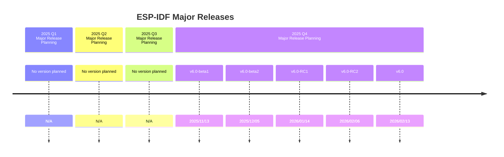
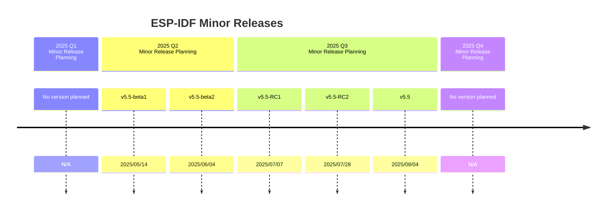
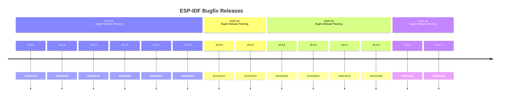

# ESP-IDF 项目路线图 2025

* [English Version](./ROADMAP.md)

本文档概述了 ESP-IDF 项目的年度计划，方便客户据此规划自己的项目周期。需要说明的是该文档并不是我们对客户的约束性承诺。相反，其主要目的是为客户提供 ESP-IDF 项目开发的路线图和方向。通过公开这些信息，我们希望增进客户对 ESP-IDF 项目的理解，提高透明度，并确保与 ESP-IDF 项目的总体目标保持一致。

## 项目总览

### 项目目标

在 ESP-IDF 的主要版本和次要版本中，我们一般会增加对新芯片的支持，以扩展我们的产品线。通过扩展芯片矩阵，拓宽我们的产品范围，并满足广泛受众的各种需求。这样便能保证我们的产品始终处于技术进步的前沿，不断满足客户的需求并超越客户的期望。

此外，ESP-IDF 各活跃分支的 Bugfix 版本发布也是我们项目的重中之重，着力提升已量产产品的稳定性和性能。通过及时解决问题，我们期待提升用户的整体体验，切实惠及使用乐鑫解决方案的客户。通过积极维护 ESP-IDF 的各活跃分支，我们践行了对宝贵的客户群提供可靠、高质量产品的承诺。

以下是 ESP-IDF 项目在 2025 年计划实现的主要目标。

* 新芯片支持

	* 增加对 ESP32-C5 芯片的支持
	* 增加对 ESP32-C61 芯片的支持

* 发布更多的次要和主要版本

	* 在 2025 年中发布 IDF v5.5 
	* 在 2025 年底发布 IDF v6.0

* 发布更多 bugfix 版本

	* 在 2025 年 5 月底 IDF v5.0 停止维护之前，发布 IDF v5.0.8 和 IDF v5.0.9
	* 在 2025 年 12 月底 IDF v5.1 停止维护之前，发布 IDF v5.1.6 和 IDF v5.1.7
	* 在 release/5.2 分支和 release/5.3 分支进入维护周期之前，发布更多 bugfix 版本
	* release/5.4 分支和 release/5.5 分支发布更多 bugfix 版本，使这两个分支更加稳定和产品化

* 重大变更

	* 我们计划在 IDF v6.0 中将 MbedTLS 版本升级到 v4.x。另外，我们还会在升级中迁移到更新版的 PSA 加密 API，但请注意，这可能会导致应用程序端在使用加密 API 时出现一些非兼容性更新。

请注意，获取之前芯片的支持状态，请参阅 [ESP-IDF 发布和 SoC 兼容性](https://github.com/espressif/esp-idf/blob/master/README_CN.md#esp-idf-与乐鑫芯片)。

### 路线图细节

ESP-IDF 项目重视持续维护和更新，确保我们的客户始终处于技术进步的前沿。我们承诺持续进行开发，并将该领域的最新创新成果呈现给客户。

此外，我们也在给客户赋能，客户通过迭代改进便能接触到新开发的功能和更高的性能。我们在突破技术界限方面的坚定承诺，使客户不仅能接触到最新的技术，还能从我们产品的尖端功能中获取最大价值。

以下是 ESP-IDF 路线图的主要信息。

* 新芯片支持

	* 在 ESP-IDF v5.4 中为 ESP32-C5 提供预览支持，并在 ESP-IDF v5.5 中为 ESP32-C5 提供完整支持，参考 [ESP32-C5 支持状态](https://github.com/espressif/esp-idf/issues/14021)
	* 在 ESP-IDF v5.4 中增加对 ESP32-C61 早期样品的预览支持，并在 IDF v5.5 中增加对 ESP32-C61 量产版本的完整支持，参考 [ESP32-C61 支持状态](https://developer.espressif.com/pages/chip-support-status/esp32c61/#esp-idf)

* Bugfix 版本发布

	* 发布 Bugfix 版本 IDF v5.0.8 和 IDF v5.0.9，并在 2025 年 5 月底停止维护 ESP-IDF v5.0
	* 发布 Bugfix 版本 IDF v5.1.6 和 IDF v5.1.7，并在 2025 年 12 月底停止维护 ESP-IDF v5.1
	* 发布 Bugfix 版本 IDF v5.2.4，IDF v5.2.5 和 IDF v5.2.6，release/5.2 分支自 2025 年 2 月进入维护周期
	* 发布 Bugfix 版本 IDF v5.3.3 和 IDF v5.3.4，release/5.3 分支自 2025 年 7 月进入维护周期
	* release/5.4 分支发布更多 bugfix 版本，包括 IDF v5.4.1、IDF v5.4.2、IDF v5.4.3；release/5.5 分支发布更多 bugfix 版本，包括 IDF v5.5.1、IDF v5.5.2。通过发布这些 Bugfix 版本，使 release/5.4 分支和 release/5.5 分支更加稳定和产品化。

## ESP-IDF 发布计划

获取 ESP-IDF 的完整发布列表，请访问 https://github.com/espressif/esp-idf/releases

此处提供的所有信息均可因业务原因及其他因素而在没有通知的情况下进行更改。

### ESP-IDF 主要版本发布

  
### ESP-IDF 次要版本发布

### ESP-IDF Bugfix 版本发布

