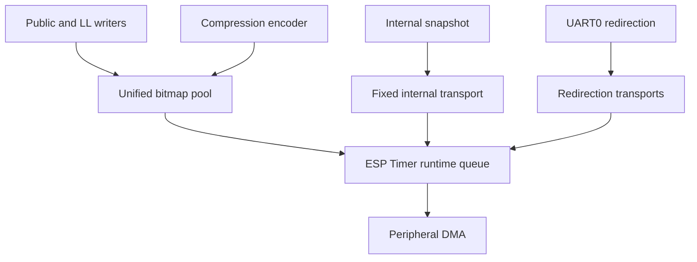

# BLE Log

BLE Log is an asynchronous binary logging transport for Bluetooth controller,
Host HCI, application, and compressed logs.

## Architecture



The shared pool contains `CONFIG_BLE_LOG_POOL_TRANS_CNT` transports. The last
`CONFIG_BLE_LOG_POOL_NON_YIELD_RESERVE_CNT` transports are reserved for ISR and
other contexts that cannot yield. Ordinary public writes are non-blocking.
Only the ordinary controller LL task path waits for a shared transport.

The Internal Snapshot and UART0 redirection transports are not members of the
bitmap pool.

## Runtime dispatch

Sealed transports enter one bounded queue. The first submission anchors a
one-shot ESP Timer deadline at 1 ms; later submissions do not move it. Each
callback drains the queue depth captured at entry and schedules another fixed
defer only for arrivals left behind, so it does not continuously monopolize
the shared ESP Timer task.

## Version 7 frame

All multi-byte fields use the target's little-endian representation.

```text
offset  size  field
0       2     payload length
2       4     frame_meta
6       N     payload
6 + N   4     checksum
```

`frame_meta` is:

```text
bits 0..6    base source
bit 7        NON_YIELD
bits 8..31   sequence number, low 24 bits
```

The checksum is `ble_log_fast_checksum()` over the six-byte header and exactly
`payload length` bytes. It excludes the checksum field and peripheral-only DMA
padding.

Core frames (all sources except REDIR) begin their payload with:

```text
[4-byte low32 esp_timer_get_time() microseconds][source payload]
```

The timestamp is captured at API entry before any pool mutex wait. It wraps
approximately every 71.6 minutes and must be unwrapped modulo 2^32 by the
receiver.

UART0 redirection payload is the raw console stream with no timestamp
prefix: the redirection stream keeps its own frame sequence, and its
receiver-side arrival time (aggregation delay bounded by the periodic
redirection flush) is the alignment reference against the core timeline.

### Sources

The public `ble_log_src_t` ABI is frozen and its values are the base on-wire
source IDs of protocol v7 frames. Receivers must mask the `NON_YIELD` bit
before decoding the base source:

```text
0  INTERNAL
1  CUSTOM
2  LL_TASK
3  LL_HCI
4  LL_ISR
5  HOST
6  HCI
7  ENCODE
8  REDIR extension
```

Log sources except INTERNAL and REDIR share one 24-bit Global SN: it is
consumed at API entry, so it totally orders log attempts — including
equal-timestamp records from different sources — and every lost or rejected
attempt leaves a gap in the sequence. Internal Snapshot frames carry their
own separate sequence (a gap counts skipped snapshots), and the REDIR
console stream keeps its own sequence as well (a gap counts a dropped
console batch). `ble_log_init()` resets all three sequences, and its required
`INIT` snapshot starts a new receiver epoch. They remain continuous through
`FLUSH` within that epoch. Callers must not write until `ble_log_init()`
returns, so the `INIT` snapshot is submitted first.
Actual ISR and critical-section records carry `NON_YIELD` in source bit 7.

Controller-side HCI records are not emitted by BLE Log, and the controller no
longer maintains its own internal LL HCI log. Host-side Bluedroid and NimBLE
HCI capture (`CONFIG_BLE_LOG_HCI_LOG_ENABLED`) is the single HCI logging
switch and the authoritative `HCI` stream for both Host and Controller
traffic. Its direction bit continues to use HCI payload byte 0 bit 7; this is
independent of the source metadata bit.

## Internal Snapshot

All BLE Log-owned Internal information is emitted as one fixed-layout frame
from one dedicated 148-byte transport. Its logical frame length is 148 bytes.

The snapshot contains:

- reason flags (`INIT`, `PERIODIC`, `FLUSH`, `TS_VALID`);
- the complete 58-byte build, library, chip, and protocol version block;
- the LC clock, ESP Timer, and FreeRTOS tick samples captured together with
  the GPIO sync level;
- pool count, reserve count, current inflight count, and inflight peak;
- compact statistics for `CUSTOM` through `ENCODE` (one slot per public
  source in that range, `HOST` included).

The periodic snapshot is an always-on system behavior from initialization
until deinitialization. It cannot be stopped by the TS sync IO control API.
A skipped periodic snapshot burns one snapshot SN instead: the gap in the
snapshot sequence is the loss signal, and it is visible directly in the
frame header without a dedicated payload field.

Each source statistic contains only:

```c
uint32_t written_frame_cnt;
uint32_t lost_frame_cnt;
```

Successful counts are incremented only after a complete frame is committed to
a transport; they do not imply confirmed physical TX. Core counts and the pool
peak restart after a completed FLUSH; the Global SN and the snapshot
sequence remain continuous. A busy periodic Internal
transport is never overwritten; that snapshot is skipped and counted. Required
INIT and FLUSH snapshots use a bounded task-context wait.

The snapshot is not an Anchor: it does not seal the shared pool and does not
define a Log Segment boundary.

## Public API

```c
bool ble_log_init(void);
void ble_log_deinit(void);
bool ble_log_enable(bool enable);
void ble_log_flush(void);
bool ble_log_write_hex(ble_log_src_t source, const uint8_t *data, size_t len);
uint8_t *ble_log_claim(ble_log_src_t source, size_t maximum, uint32_t *handle);
void ble_log_commit(uint32_t handle, size_t actual_len);
void ble_log_write_hex_ll(uint32_t len, const uint8_t *data,
                          uint32_t append_len, const uint8_t *append,
                          uint32_t flags);
bool ble_log_ts_sync_io_toggle_enable(bool enable);
bool ble_log_sync_enable(bool enable);  /* compatibility shim */
```

`ble_log_enable()` gates public producers only. Periodic system output remains
active while that gate is closed.

`ble_log_ts_sync_io_toggle_enable()` controls only the optional external
analyzer GPIO, which starts disabled and low. Disabling it leaves the IO low
after a final falling edge;
periodic clock sampling, OPEN transport flushing, and Internal Snapshots
continue. When the GPIO feature is not built, the call remains a
lifecycle-checked no-op. `ble_log_sync_enable()` is the backward-compatible
name for the same behavior.

`ble_log_flush()` is an ordinary FreeRTOS task API. Do not call it from an ISR,
critical section, or the shared ESP Timer task.

A public or LL record that cannot fit completely in one pool transport is
rejected and counted as lost; BLE Log never emits a truncated record.

## Compression direct write

Compression encoders write directly into shared-pool storage:

```c
uint32_t handle;
uint8_t *payload = ble_log_claim(BLE_LOG_SRC_ENCODE, maximum, &handle);
if (payload) {
    size_t encoded = encode(payload, maximum);
    ble_log_commit(handle, encoded);
}
```

`ble_log_claim()` reserves the hidden frame header, ESP Timer timestamp, and
checksum. Every successful claim must be committed exactly once before
`ble_log_deinit()`; `ble_log_commit(handle, 0)` cancels it. Handles include a
transport generation so a stale handle cannot commit a later claim in the same
lifecycle.

Mesh, ISO, Bluedroid, and NimBLE compression no longer allocate three static
payload buffers per channel. Each logical compression source uses a non-blocking
trylock so its task-switch state follows commit order; a contending record is
canceled and counted as lost.

## Configuration

| Option | Default | Meaning |
| --- | ---: | --- |
| `CONFIG_BLE_LOG_ENABLED` | n | Enable BLE Log |
| `CONFIG_BLE_LOG_POOL_TRANS_CNT` | 8 | Unified pool transport count, range 2..32 |
| `CONFIG_BLE_LOG_POOL_NON_YIELD_RESERVE_CNT` | 1 | ISR/critical reserve count |
| `CONFIG_BLE_LOG_POOL_TRANS_SIZE` | 640 | Bytes per shared transport; SPI builds require a multiple of four |
| `CONFIG_BLE_LOG_LL_ENABLED` | target dependent | Controller LL logging |
| `CONFIG_BLE_LOG_HCI_LOG_ENABLED` | target dependent | Host-side HCI capture |
| `CONFIG_BLE_LOG_TS_SYNC_TOGGLE_IO_ENABLED` | n | Build the optional analyzer GPIO toggle |
| `CONFIG_BLE_LOG_TS_ENABLED` | n | Deprecated compatibility entry selecting the GPIO toggle |

Old multi-LBM sizing options remain hidden only so existing sdkconfig files can
be parsed; they no longer control allocation.

## Validation apps

```bash
. ./export.sh
cd components/bt/common/ble_log/test_apps/ble_log_test
idf.py build

cd ../ble_log_rt_test
idf.py build

cd ../ble_log_perf_test
idf.py build
```

`ble_log_test` validates golden v7 bytes, the consolidated Internal Snapshot,
source/HCI metadata, pool exhaustion and reserve use, snapshot busy loss,
stale claims, and enable/disable/deinit races. `ble_log_rt_test` covers batched
dispatch, timer behavior, inflight statistics, and repeated deinit races.
