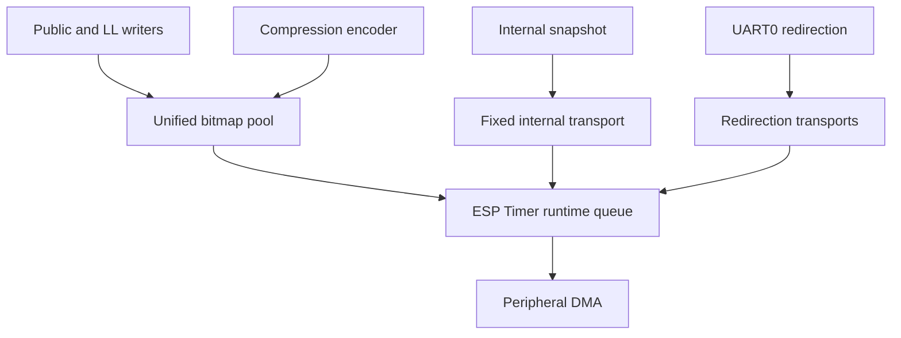

# BLE Log

BLE Log is an asynchronous binary logging transport for Bluetooth controller,
Host HCI, application, and compressed logs.

## Architecture



The shared pool contains `CONFIG_BLE_LOG_POOL_TRANS_CNT` transports. The last
`CONFIG_BLE_LOG_POOL_NON_YIELD_RESERVE_CNT` transports are reserved for ISR and
other contexts that cannot yield. Ordinary yieldable task writers, from the
public API and claims to the controller LL task, wait for a shared transport
unless a claim explicitly opts out. Writers on the shared ESP Timer task never
wait for a transport: its callbacks must return so dispatch can progress.
While yieldable, they use shared transports only; ISR and critical-section
writers retain reserve access and fail-fast behavior.

The Internal Snapshot and UART0 redirection transports are not members of the
bitmap pool.

Periodic flushing scans the whole bounded pool, not just OPEN bitmap hints:
writers temporarily remove their hints while writing or holding a claim. A
failed try-lock leaves `pending_seal`; the next claim seals the old buffer
before appending, or a later periodic scan seals it when unlocked. This is a
deferred request, not a snapshot barrier. Seal and recycle clear the flag,
but a delayed flusher can set it afterwards; an extra early partial seal is
allowed. Full flush/deinit retain OPEN-only scans after writers drain.

FREE acquisition requires the lock, FREE state, and atomically removing an
actually published FREE bit. A cached candidate alone cannot bypass the
recycler's state-to-bitmap publication window. UART0 periodic flushing is
independent of producer enable: disable stops new writes, not cached output.

## Runtime dispatch

Sealed transports enter one bounded queue. The first submission anchors a
one-shot ESP Timer deadline at 1 ms; later submissions do not move it. Each
callback drains the queue depth captured at entry and schedules another fixed
defer only for arrivals left behind, so it does not continuously monopolize
the shared ESP Timer task.

## Version 8 frame

All multi-byte fields use the target's little-endian representation.

```text
offset  size  field
0       2     payload length
2       4     frame_meta
6       N     payload
6 + N   4     checksum
```

`frame_meta` is:

```text
bits 0..7    source
bits 8..31   sequence number, low 24 bits
```

The checksum is `ble_log_fast_checksum()` over the six-byte header and exactly
`payload length` bytes. It excludes the checksum field and peripheral-only DMA
padding.

Core frame payloads follow the writer entry point, not a single rule:

- Public write / claim path (`write_hex`, compressed encoder): the API
  prepends a `[4-byte low32 esp_timer_get_time() microseconds]` before
  the source payload. The timestamp is captured at API entry before any
  pool mutex wait. It wraps approximately every 71.6 minutes and must be
  unwrapped modulo 2^32 by the receiver.
- LL callback path (`write_hex_ll`, covering the LL_TASK / LL_HCI /
  LL_ISR sources): controller payloads are forwarded raw, with no ESP
  timestamp prefix — the on-wire layout is exactly what the controller
  handed over.

UART0 redirection payload is likewise the raw console stream with no
timestamp prefix: the redirection stream keeps its own frame sequence, and
its receiver-side arrival time (aggregation delay bounded by the periodic
redirection flush) is the alignment reference against the core timeline.

### Sources

The public `ble_log_src_t` ABI is frozen and its values are the on-wire
source IDs of protocol v8 frames:

```text
0  INTERNAL
1  CUSTOM
2  LL_TASK
3  LL_HCI
4  LL_ISR
5  HOST
6  HCI
7  ENCODE
8  REDIR extension
```

Core log sources (`CUSTOM` through `ENCODE`) and Internal Snapshots share one
24-bit Global SN. Core logs consume it after entry validation and gate acceptance,
before buffer contention; lost log attempts leave gaps accounted for by
`lost_frame_cnt`. Snapshots consume it only after acquiring their dedicated
transport, when assembling the frame. Busy/skipped snapshots do not consume a
Global SN and are not included in `lost_frame_cnt`.
Snapshots also carry a separate 24-bit `anchor_count` in their payload:
only snapshot attempts advance this counter, including skipped snapshots.
The periodic task-binding broadcast and REDIR console stream retain their
own separate header sequences (gaps count skipped binding windows or dropped
console batches). `ble_log_init()` resets all sequences and the anchor counter,
and its required `INIT` snapshot starts a new
receiver epoch. They remain continuous through `FLUSH` within that epoch.
Callers must not write until `ble_log_init()` returns, so the `INIT`
snapshot is submitted first.

`CONFIG_BLE_LOG_HCI_LOG_ENABLED` controls HCI logging. Bluedroid and legacy
VHCI NimBLE retain Host-side capture and suppress duplicate Controller HCI
records. Other configurations, including non-legacy NimBLE, retain Controller
HCI records through the LL callback (requires `CONFIG_BLE_LOG_LL_ENABLED`).
Controller flags preserve their source mapping: `HCI` to `LL_HCI` and
`HCI_UPSTREAM` to `HCI`, with ISR precedence. Controller payloads are forwarded
unchanged. Host-side capture retains its direction bit in HCI payload byte 0
bit 7. Disabling HCI logging suppresses records from both capture paths.

## Internal Snapshot

All BLE Log-owned internal information is emitted as fixed-layout frames
from dedicated transports: the snapshot frame is 179 logical bytes on its
180-byte aligned transport, and the periodic task-binding broadcast has its own
transport sized to the registry (one full binding frame per window;
`CONFIG_BLE_LOG_TASK_ID_MAX` entries of 19 bytes plus a timestamp).

The snapshot contains:

- reason flags (`INIT`, `PERIODIC`, `FLUSH`, `TS_VALID`);
- a 24-bit little-endian `anchor_count` (three bytes), immediately after the reason flags;
- the complete 58-byte build, library, chip, and protocol version block;
- the LC clock, ESP Timer, and FreeRTOS tick samples captured together with
  the GPIO sync level;
- pool count, reserve count, current inflight count, and inflight peak;
- compact statistics for `CUSTOM` through `ENCODE` (one slot per public
  source in that range, `HOST` included).

The periodic snapshot is an always-on system behavior from initialization
until deinitialization. It cannot be stopped by the TS sync IO control API.
A skipped periodic snapshot advances only the anchor count, not the Global SN.
Anchor counts start at zero for INIT, also advance for FLUSH, and wrap modulo
2^24 on the wire (the atomic runtime counter remains uint32_t).
A gap between anchor counts identifies missed snapshot attempts without
mistaking intervening ordinary logs for missed snapshots.

Each source statistic contains only:

```c
uint32_t written_frame_cnt;
uint32_t lost_frame_cnt;
uint32_t written_bytes_cnt;
```

Successful counts are incremented only after a complete frame is committed to
a transport; they do not imply confirmed physical TX. `written_bytes_cnt`
counts the full logical frame (six-byte header, payload including any timestamp
prefix, and four-byte checksum), excluding peripheral DMA padding. Rejected or
aborted writes do not add bytes; there is no lost-byte counter. Internal and
REDIR frames are not included in these per-core-source byte counters. All three
counters are uint32 values and wrap modulo 2^32.
Core counts and the pool peak restart after a completed FLUSH; the Global SN
and anchor count remain continuous. A busy periodic Internal
transport is never overwritten; that snapshot is skipped and counted. Required
INIT and FLUSH snapshots use a bounded task-context wait.

The protocol version remains v8 despite the changed snapshot payload layout and
header sequence semantics. Receivers must be updated together with the producer;
the version byte alone cannot distinguish the old and new layouts.
The snapshot remains a sampling point,
not a confirmed TX boundary: periodic OPEN flushing is best-effort, statistics
are sampled individually while writers can run, and Global SN allocation order
is not submission order. Neither deferred sealing nor the anchor count makes
snapshot differences an exact SN-interval accounting boundary.

## Public API

```c
bool ble_log_init(void);
void ble_log_deinit(void);
bool ble_log_enable(bool enable);
void ble_log_flush(void);
bool ble_log_write_hex(ble_log_src_t source, const uint8_t *data, size_t len);
uint8_t *ble_log_claim(ble_log_src_t source, size_t maximum,
                       uint32_t *handle, bool wait_for_transport);
void ble_log_commit(uint32_t handle, size_t actual_len);
void ble_log_write_hex_ll(uint32_t len, const uint8_t *data,
                          uint32_t append_len, const uint8_t *append,
                          uint32_t flags);
bool ble_log_ts_sync_io_toggle_enable(bool enable);
bool ble_log_sync_enable(bool enable);  /* compatibility shim */
```

`ble_log_enable()` gates public producers only. Periodic system output remains
active while that gate is closed.

`ble_log_ts_sync_io_toggle_enable()` controls only the optional external
analyzer GPIO, which starts disabled and low. Disabling it leaves the IO low
after a final falling edge;
periodic clock sampling, OPEN transport flushing, and Internal Snapshots
continue. When the GPIO feature is not built, the call remains a
lifecycle-checked no-op. `ble_log_sync_enable()` is the backward-compatible
name for the same behavior.

`ble_log_flush()` is an ordinary FreeRTOS task API. Do not call it from an ISR,
critical section, or the shared ESP Timer task.

A public or LL record that cannot fit completely in one pool transport is
rejected and counted as lost; BLE Log never emits a truncated record.

## Compression direct write

Compression encoders write directly into shared-pool storage:

```c
uint32_t handle;
uint8_t *payload = ble_log_claim(BLE_LOG_SRC_ENCODE, maximum,
                                 &handle, true);
if (payload) {
    size_t encoded = encode(payload, maximum);
    ble_log_commit(handle, encoded);
}
```

`ble_log_claim()` reserves the hidden frame header, ESP Timer timestamp, and
checksum. It waits for a shared transport in ordinary yieldable tasks when
`wait_for_transport` is true (writer backpressure); pass false to opt out.
The shared ESP Timer task and non-yieldable contexts fail fast either way.
A busy-pool rejection leaves a Global SN gap and increments the source's loss
counter, just like other pool acquisition failures.
Every successful claim must be committed exactly once before
`ble_log_deinit()`; `ble_log_commit(handle, 0)` cancels it. Handles include a
transport generation so a stale handle cannot commit a later claim in the same
lifecycle.

Mesh, ISO, Bluedroid, and NimBLE compression no longer allocate three static
payload buffers per channel. Every ENCODE record names its writer: the byte
after the source is a task id from a name-keyed registry. The registry is a
self-contained module (`ble_log_task_registry.c/h`, structured like the
UART redirection writer: a small append-only table shared by every ENCODE
writer; RAM cost 16 bytes per entry, sized by `CONFIG_BLE_LOG_TASK_ID_MAX`).

The registry broadcast is module-owned system output: every periodic snapshot
window, one INTERNAL frame (`BLE_LOG_INT_SRC_TASK_BINDING`) packs one
fixed-layout record per registered entry, binding each id to its task name.
It rides the registry's own dedicated transport with a sequence of its own
(a window skipped despite a non-empty registry leaves a gap in the binding
sequence, never in the Global SN or snapshot anchor count), is never counted in the
per-source written/lost stats, and never contends with the snapshot
transport or with user records for pool transports. A receiver that joined
late or lost a frame converges on the next window; a record of a new task
keeps its id and is bound by name at the next window. Announcements are
idempotent on the wire and best effort (a busy binding transport — the
previous broadcast still in DMA — skips a window).
Attribution is a property of the record, so concurrent writers to one source
need no serialization and never drop a record on contention. When the registry
is full, a new task degrades to the unknown id (`0xFF`) and its records are
still emitted.

## Configuration

| Option | Default | Meaning |
| --- | ---: | --- |
| `CONFIG_BLE_LOG_ENABLED` | n | Enable BLE Log |
| `CONFIG_BLE_LOG_POOL_TRANS_CNT` | 8 | Unified pool transport count, range 2..32 |
| `CONFIG_BLE_LOG_POOL_NON_YIELD_RESERVE_CNT` | 1 | ISR/critical reserve count |
| `CONFIG_BLE_LOG_POOL_TRANS_SIZE` | 640 | Bytes per shared transport; SPI builds require a multiple of four |
| `CONFIG_BLE_LOG_LL_ENABLED` | target dependent | Controller LL logging |
| `CONFIG_BLE_LOG_HCI_LOG_ENABLED` | y | HCI capture from Host or Controller, selected by transport |
| `CONFIG_BLE_LOG_TASK_ID_MAX` | 16 | Task-id registry size, range 2..32; 16 bytes of RAM per entry |
| `CONFIG_BLE_LOG_TS_SYNC_TOGGLE_IO_ENABLED` | n | Build the optional analyzer GPIO toggle |
| `CONFIG_BLE_LOG_TS_ENABLED` | n | Deprecated compatibility entry selecting the GPIO toggle |

Old multi-LBM sizing options remain hidden only so existing sdkconfig files can
be parsed; they no longer control allocation.

## Validation apps

```bash
. ./export.sh
cd components/bt/common/ble_log/test_apps/ble_log_test
idf.py build

cd ../ble_log_rt_test
idf.py build

cd ../ble_log_perf_test
idf.py build
```

`ble_log_test` validates golden v8 bytes, the consolidated Internal Snapshot,
source/HCI metadata and capture selection, pool exhaustion and reserve use,
snapshot busy loss, stale claims, and enable/disable/deinit races.
`ble_log_rt_test` covers batched dispatch, timer behavior, inflight statistics,
and repeated deinit races.
