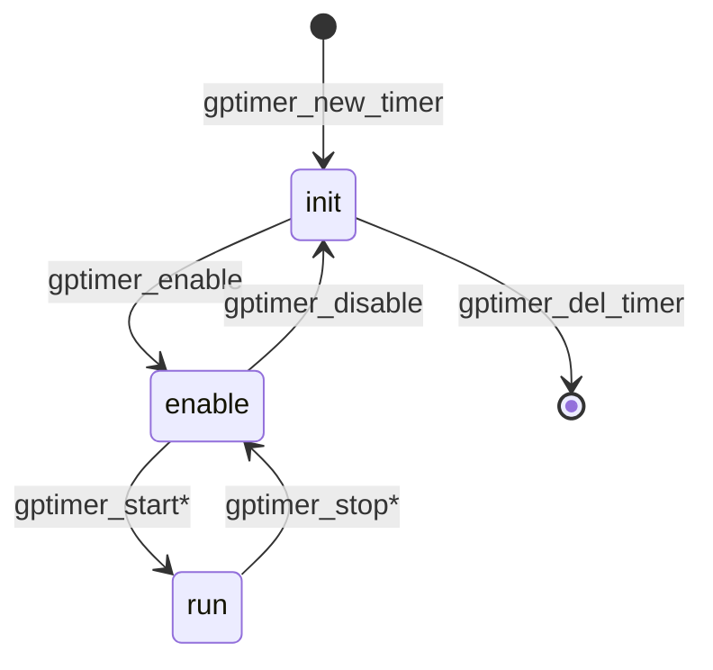
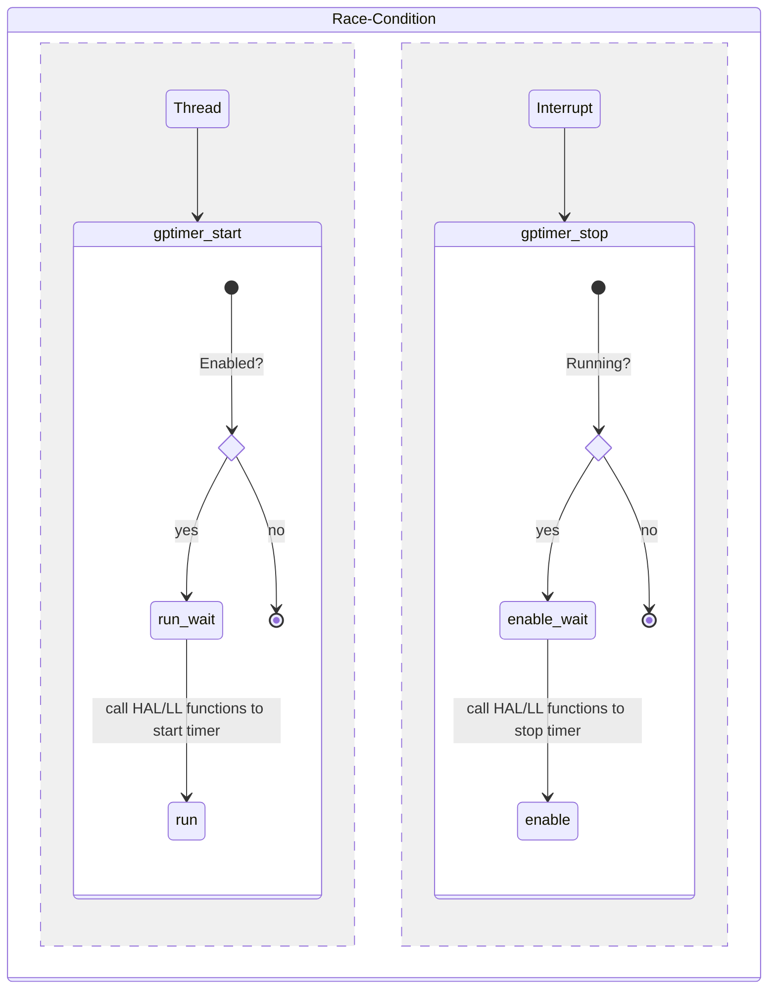

# GPTimer Driver Design

## State Transition

> State transition is achieved by using the primitives provided by `<stdatomic.h>`.

Other functions won't change the driver state. The functions above labeled with `*` are allowed to be used in the interrupt context.

## Concurrency

There might be race conditions when the user calls the APIs from a thread and interrupt at the same time. e.g. a Task is just running the `gptimer_start`, and suddenly an interrupt occurs, where the user calls `gptimer_stop` for the same timer handle. Which is possible to make a "stopped" timer continue to run if the interrupt is returned before the Task.

By introducing a "middle" state like `run_wait` and `enable_wait`, we make sure that the timer is in a safe state before we start/stop it. And if the state is invalid, it can return an error code to the user.
