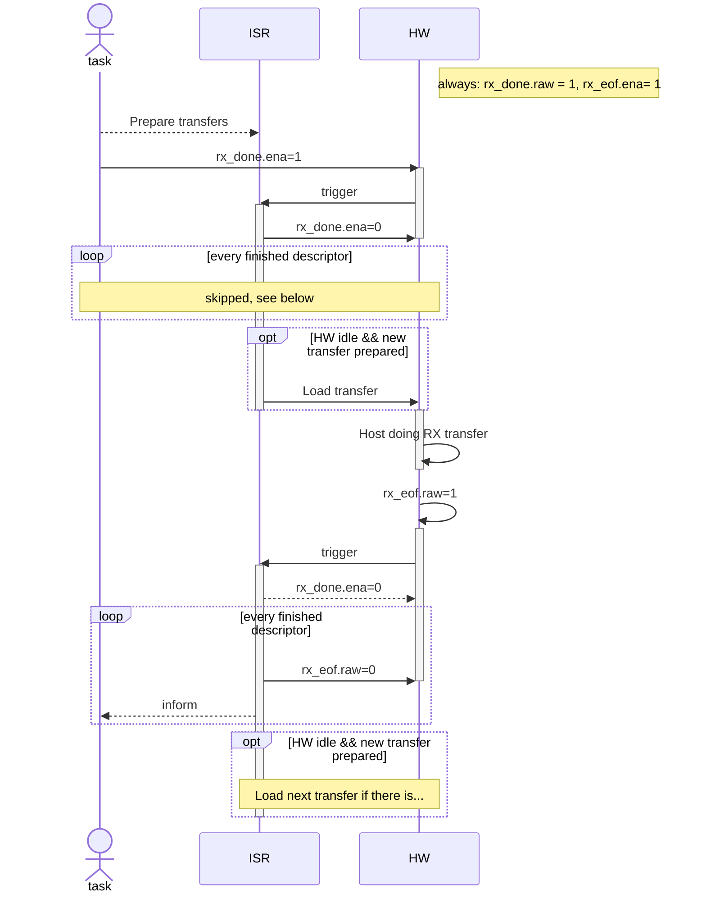

# SDIO workflow

This README is a supplement to the comments in the SDIO slave driver. For more details, see `sdio_slave.c`.

The diagram are described in mermaid format. You can view the diagrams on Github or with any mermaid renders.

## Sending direction

