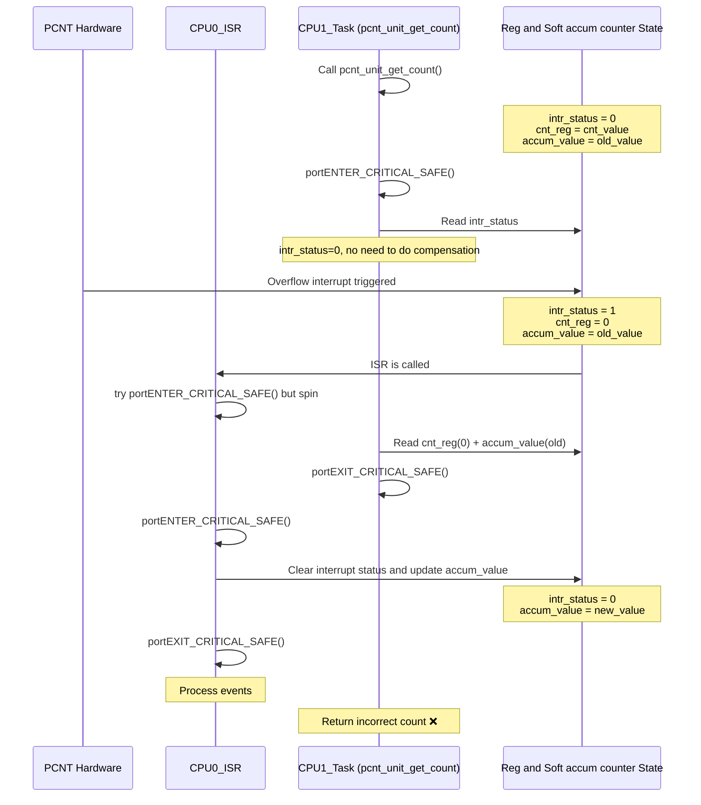

# PCNT Driver Design

## Concurrency

The count value and the overflow state of the count value are located in *different* registers, resulting in the software being unable to obtain information from both of them in the same read instruction.

The race condition case is as follow:

In the software, we determine whether to perform compensation by checking whether the count value exceeds half of the limit. This can prevent counting errors when the overflow frequency is not high.
