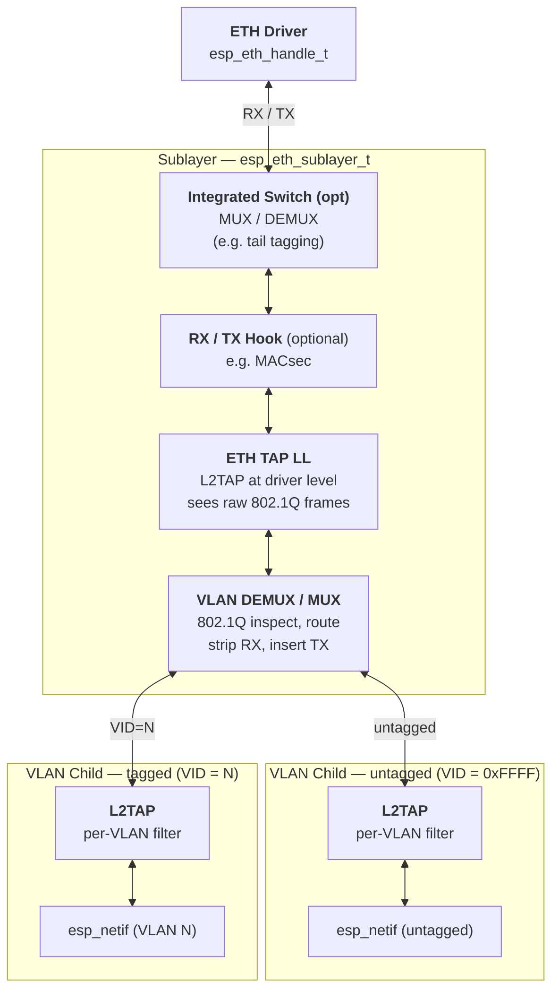

# ESP-ETH Netif Sublayer

> **Experimental feature** — enable `CONFIG_ETH_SUBLAYER_SUPPORT` in menuconfig
> (requires `CONFIG_IDF_EXPERIMENTAL_FEATURES`). The sublayer API is under active
> development and **may change** in future ESP-IDF releases without a deprecation
> period.
>
> Integrated Ethernet switch support is a separate, disabled-by-default feature.
> Enable `CONFIG_ETH_SUBLAYER_SWITCH_SUPPORT` to build its API and frame-processing paths.

The **sublayer** (`esp_eth_sublayer_t`) is the single coupling point between one physical Ethernet driver (`esp_eth_handle_t`) and one or more `esp_netif` instances.
It owns the RX/TX paths registered with the driver, distributes ETH events to every attached `esp_netif`, and exposes optional hooks for mid-path frame processing (e.g. MACsec).

---

## Architecture



### Structural rules

* The **sublayer must not be attached to a netif directly** — only VLAN children are attached via `esp_netif_attach()`.  The `post_attach` callback lives in the VLAN child, not in the sublayer.
* The sublayer is the **sole owner** of the driver input path (`esp_eth_update_input_path_info`) and the ETH event handlers; children derive their events from it.
* VLAN children are stored in a singly-linked list (`SLIST`) managed exclusively by the sublayer.

---

## RX Data Path

```
ETH Driver
  │  raw frame (may carry 802.1Q VLAN tag) + optional hardware timestamp
  ▼
eth_sublayer_input()                         [esp_eth_sublayer.c]
  │
  │  alloc_base = buffer (original malloc pointer, used for all frees)
  │  frame      = buffer (movable frame start, may advance as tags are stripped)
  │
  ├─ ⓪ Integrated switch demux (optional; CONFIG_ETH_SUBLAYER_SWITCH_SUPPORT)
  │     eth_switch_demux(sw, &frame, &length, &src_port)
  │     Strips switch-specific tagging before any further processing.
  │     • Trailing tag (e.g. KSZ8863 Tail Tag): decrement length.
  │     • Leading tag (e.g. DSA, 802.1Q port-VLAN): advance frame forward
  │       (typically memmove MAC header over the tag) and decrement length.
  │     eth_switch_resolve_ingress_port() then maps src_port to the per-port
  │     Ethernet handle (passed to the RX hook) and L2TAP iodriver handle.
  │
  ├─ ① RX Hook (optional)
  │     rx_info = { .l2_buffer = alloc_base, .driver_info = info }
  │     rx_hook(eth, &frame, &length, &rx_info, hook_ctx)
  │     eth is the host driver, or the ingress port handle when a switch is attached.
  │     Set via esp_eth_sublayer_config_t at creation (immutable thereafter).
  │     May advance frame or shrink length to strip a leading/trailing header
  │     (e.g. MACsec SecTAG). Must NOT realloc the buffer.
  │     Set length=0 to take ownership and stop sublayer RX processing;
  │     the hook must release/forward rx_info.l2_buffer itself.
  │     Example use-case: MACsec decryption, filtering.
  │
  ├─ ② ETH TAP LL  ← closest to driver
  │     esp_vfs_l2tap_eth_filter_frame(io_handle, frame, &length, &l2tap_info)
  │     l2tap_info.l2_buffer = alloc_base (original allocation for L2TAP free path).
  │     io_handle is the sublayer (sub) when no switch is attached, or the
  │     resolved ingress-port iodriver when a switch is attached.
  │     Frames captured here still carry the original 802.1Q tag.
  │     length=0 after the call means the frame was consumed by L2TAP.
  │
  ├─ ③ VLAN DEMUX
  │     eth_vlan_get_ether_type(frame) reads EtherType at bytes [12:13].
  │     • 0x8100 (802.1Q): extracts VID from TCI bytes [14:15].
  │     • anything else:  VID = ESP_ETH_SUBLAYER_UNTAGGED_VID (0xFFFF).
  │     eth_sublayer_find_vlan_by_vid() looks up the matching VLAN child.
  │     Frame is dropped (freed via alloc_base) when no child is registered.
  │
  └─ ④ Per-VLAN input  eth_vlan_input()    [esp_eth_sublayer_vlan_child.c]
        │
        ├─ L2TAP (per-VLAN)
        │     esp_vfs_l2tap_eth_filter_frame(vlan_netif_driver, ...)
        │     The vlan_netif_driver pointer is the iodriver handle here.
        │     For tagged frames: the VLAN tag is stripped first (memmove of
        │     the Ethernet header over the 4-byte TCI/TPID fields) so the
        │     netif and L2TAP at this level see an untagged frame.
        │     l2tap_info.l2_buffer = alloc_base so L2TAP can free correctly.
        │
        └─ esp_netif_receive(netif, data, len, alloc_base)
              Delivers the untagged payload to the network stack (lwIP).
              alloc_base is passed as the L2 buffer base for zero-copy pbuf free.
```

### RX frame pointer contract

Integrated switch demux and RX hook callbacks receive the frame start as an in/out
`uint8_t **` pointer. They may advance `*buffer` forward (leading tag strip) and/or
decrement `*length` (trailing tag strip), but must stay within the original allocation
and must not realloc. RX hook also receives `esp_eth_sublayer_rx_info_t`, which includes
`l2_buffer`. The sublayer uses `alloc_base` for every
`eth_sublayer_buf_free()` call and as the `eb` / `l2_buffer` argument to
`esp_netif_receive()` / L2TAP unless the hook takes ownership by setting length to 0.

---

## TX Data Path

```
esp_netif
  │  standard Ethernet frame (no VLAN tag)
  ▼
eth_vlan_transmit_wrap()                           [esp_eth_sublayer_vlan_child.c]
  │
  ├─ Tagged VLAN child (VID ≠ 0xFFFF):
  │     Allocates a new Ethernet header buffer (ETH_HEADER_LEN + 4 bytes).
  │     Copies DA/SA, inserts TPID=0x8100, TCI (pre-computed tci_be), and
  │     original EtherType.  Frame is split into two scatter-gather descriptors:
  │       bufs[0] = new tagged header   (14 + 4 = 18 bytes)
  │       bufs[1] = original payload    (frame − 14 bytes)
  │     No memcpy of payload.
  │
  └─ Untagged child (VID = 0xFFFF):
        Single descriptor, frame passed through as-is.

  ▼
eth_sublayer_transmit()                            [esp_eth_sublayer.c]
  │
  ├─ TX Hook (optional)
  │     tx_hook(eth_driver, tx_bufs, hook_ctx)
  │     May modify buf pointers / lengths in place, merge bufs, or set
  │     *tx_bufs->buf_count = 0 to skip driver transmit (descriptor set
  │     stays caller-owned).
  │     Example use-case: MACsec encryption.
  │
  ├─ Integrated switch mux (optional; CONFIG_ETH_SUBLAYER_SWITCH_SUPPORT)
  │     eth_switch_mux(sw, tx_bufs, port)
  │     Appends switch-specific tagging (e.g. Tail Tag) after the TX hook.
  │
  └─ esp_eth_transmit_ctrl_bufs()
        Passes the descriptor array to the MAC driver.
```

---

## L2TAP Integration

L2TAP provides POSIX-like file-descriptor access to raw Ethernet frames
(`/dev/net/tap`).  The sublayer integrates these L2TAP access points:

| Access point | Bind / iodriver handle | Frame content | Typical use |
|---|---|---|---|
| **ETH TAP LL** (no switch) | host `esp_eth_handle_t` / `esp_eth_sublayer_t *sub` | Raw, still 802.1Q-tagged | Capture/inject frames before VLAN demux; TSN / PTP tooling |
| **Switch port** | per-port `esp_eth_handle_t` | Switch tag already stripped; 802.1Q still present | Per-port capture/inject |
| **Per-VLAN L2TAP** | `esp_eth_sublayer_vlan_t *vlan_netif_driver` | VLAN tag already stripped | Per-VLAN capture; tagged-VLAN sockets |

The sublayer registers itself with L2TAP on creation (`esp_vfs_l2tap_iodriver_provider_register`) and unregisters on deletion.  The `get_io_fns` callback (`eth_sublayer_get_io_fns`) is called by L2TAP when an fd binds to a specific iodriver handle:

* if `io_handle` matches a registered VLAN child → returns VLAN child TX functions (includes VLAN tag insertion on transmit).
* if a switch is attached and `io_handle` matches a port Ethernet handle → returns that port's TX functions (switch mux tags the frame for the port). Direct bind to the host driver (`sub->eth_driver`) is not served in switch mode.
* if no switch is attached and `io_handle` matches the host driver (`sub->eth_driver`) → returns the ETH TAP LL TX functions that bypass VLAN tag insertion.

The IO driver function table (`esp_eth_iodriver_io_fns_t`) and the provider interface
(`esp_eth_iodriver_provider_base_t`) are a **generic esp_eth concept** defined in
`esp_private/esp_eth_sublayer_iodriver.h` (an internal, inter-component header — not stable application API),
independent of L2TAP.  L2TAP is just the first consumer; any upper layer can
obtain the transmit/free/get-ll-driver functions for a base, VLAN child, or switch port through the
same `get_io_fns` resolver.  The provider implementation is built when
`CONFIG_ETH_SUBLAYER_IODRIVER_PROVIDER` is enabled (selected automatically by `CONFIG_ESP_NETIF_L2_TAP`),
while the L2TAP-specific registration is additionally guarded by `CONFIG_ESP_NETIF_L2_TAP`.

---

## VLAN Support (802.1Q)

```
Registered child VIDs       Frame arriving at sublayer input
────────────────────────    ──────────────────────────────────────────────
ESP_ETH_SUBLAYER_UNTAGGED_VID  ← EtherType ≠ 0x8100   (untagged)
VID = 10                       ← EtherType == 0x8100, TCI & 0x0FFF == 10
VID = 20                       ← EtherType == 0x8100, TCI & 0x0FFF == 20
(no match)                     ← frame is freed / dropped
```

* **RX**: the 4-byte VLAN tag (TPID + TCI) is removed from tagged frames using `memmove` before delivery to `esp_netif_receive`.  The `l2_buffer` pointer in `l2tap_eth_filter_info_t` is set to the original allocation start so that the L2TAP layer can free it.
* **TX**: a new 18-byte Ethernet header is allocated and the payload is referenced via a second scatter-gather descriptor.  The original frame buffer is never copied.
* **ETH events**: `ETHERNET_EVENT_START/STOP/CONNECTED/DISCONNECTED` are applied to every VLAN child whose `base.netif` is non-NULL.  `IP_EVENT_ETH_GOT_IP` is matched against `ip_event->esp_netif` and forwarded to exactly one child.

  Optional `esp_eth_sublayer_config_t` events (leave event `base` NULL to disable):

  * `connect_confirm_event` — child netifs go up only after both `ETHERNET_EVENT_CONNECTED` and this event. Order does not matter. A later disconnect (`ETHERNET_EVENT_DISCONNECTED`, `ETHERNET_EVENT_STOP`, or `disconnect_trigger_event`) invalidates the confirmation.
  * `disconnect_trigger_event` — additional event that forces all child netifs down, besides `ETHERNET_EVENT_DISCONNECTED`.

`CONFIG_ETH_SUBLAYER_VLAN_SUPPORT` (disabled by default) gates 802.1Q tagging support. When disabled:

* `esp_eth_sublayer_vlan_add()` returns `ESP_ERR_NOT_SUPPORTED` for any `vlan_id` other than `ESP_ETH_SUBLAYER_UNTAGGED_VID` — only a single, untagged netif per sublayer is possible. Switch ports are L2TAP / iodriver endpoints, not extra untagged netifs.
* The TX tag-insertion and RX tag-removal code paths are compiled out.

---

## Optional TX / RX Hooks

```c
esp_eth_sublayer_config_t sub_cfg = ESP_ETH_SUBLAYER_CONFIG_DEFAULT();
sub_cfg.eth_handle = eth_handle;
sub_cfg.tx_hook = tx_hook;
sub_cfg.post_tx_hook = post_tx_hook;
sub_cfg.rx_hook = rx_hook;
sub_cfg.hook_ctx = ctx;
esp_eth_sublayer_handle_t sub = NULL;
ESP_ERROR_CHECK(esp_eth_sublayer_new(&sub_cfg, &sub));
```

Hooks are called on every frame passing through the sublayer before VLAN demux (RX) or after VLAN tag insertion (TX).  Pass `NULL` for a hook to leave that callback unhooked.  Hooks are fixed at sublayer creation and cannot be changed at runtime.

`post_tx_hook` is an optional companion to `tx_hook`: it is invoked after the TX hook returns `ESP_OK` with `*tx_bufs->buf_count > 0`, so the hook can free any buffers it allocated. It is not called when the TX hook sets `*tx_bufs->buf_count` to 0 or returns an error.

**RX hook signature**:
```c
esp_err_t rx_hook(esp_eth_handle_t eth, uint8_t **buf, uint32_t *len,
                  esp_eth_sublayer_rx_info_t *info, void *ctx);
// Set *len = 0 to stop sublayer processing for the frame.
// This takes ownership by the hook function; release/forward info->l2_buffer.
// Return non-ESP_OK to abort processing (buffer is freed).
```

**TX hook signature**:
```c
esp_err_t tx_hook(esp_eth_handle_t eth, esp_eth_sublayer_tx_bufs_t *tx_bufs, void *ctx);
// May reorder descriptors (e.g. move original frame from bufs[0] to bufs[1]
// and place prefix/header data into bufs[0]).
// May increase/decrease *tx_bufs->buf_count as needed, but never exceed tx_bufs->buf_capacity.
// Set *tx_bufs->buf_count = 0 to skip driver transmit (and post_tx_hook).
```

---

## Minimal Usage

```c
// 1. Create sublayer for an existing Ethernet driver handle
esp_eth_sublayer_config_t sub_cfg = { .eth_handle = eth_handle };
esp_eth_sublayer_handle_t sub = NULL;
ESP_ERROR_CHECK(esp_eth_sublayer_new(&sub_cfg, &sub));

// 2. Add VLAN children (VID or UNTAGGED sentinel)
esp_eth_sublayer_vlan_handle_t untagged = NULL;
ESP_ERROR_CHECK(esp_eth_sublayer_vlan_add(sub, ESP_ETH_SUBLAYER_UNTAGGED_VID, &untagged));
esp_eth_sublayer_vlan_handle_t vlan10 = NULL;
ESP_ERROR_CHECK(esp_eth_sublayer_vlan_add(sub, 10, &vlan10));

// 3. Create esp_netif instances and attach VLAN child handles
esp_netif_t *netif_plain = esp_netif_new(&ESP_NETIF_DEFAULT_ETH());
esp_netif_attach(netif_plain, untagged);

esp_netif_t *netif_vlan10 = esp_netif_new(&vlan_cfg);
esp_netif_attach(netif_vlan10, vlan10);

// 4. Start driver — sublayer handles ETH events from here
esp_eth_start(eth_handle);
```

See `examples/ethernet/sublayer` for a complete working example including static IP configuration.

---

## Integrated Switch

Requires `CONFIG_ETH_SUBLAYER_SWITCH_SUPPORT`. A sublayer holds at most one switch. The mux/demux/init/deinit callbacks are implemented by the switch driver (e.g. KSZ8863 Tail Tag); the sublayer only invokes them.

```c
esp_eth_sublayer_switch_config_t sw_cfg = {
    .tag_process_init = driver_tag_init,       // once, when the switch is added; returns ctx
    .tag_process_deinit = driver_tag_deinit,   // when the switch is deleted
    .demux = driver_demux,                     // RX: strip switch tag, report ingress port
    .mux = driver_mux,                         // TX: append switch tag (port < 0 = default lookup)
    .host_eth_handle = host_eth,
    .port_eth_handles = port_eths,
    .ports_count = port_count,
};
esp_eth_sublayer_switch_handle_t sw = NULL;
ESP_ERROR_CHECK(esp_eth_sublayer_switch_add(sub, &sw_cfg, &sw));
// ...
ESP_ERROR_CHECK(esp_eth_sublayer_switch_del(sw));
```

`esp_eth_sublayer_del()` also deletes an attached switch if one is still present.

---

## Implementation Notes

* The sublayer's `vlan_children` list is not protected by a mutex; configure it only from a single task context (during initialization), as documented in the header.
* The sublayer increases the driver's reference count on creation and decreases it on deletion to prevent the driver from being destroyed while still in use.
* `ESP_ETH_SUBLAYER_UNTAGGED_VID` is `UINT16_MAX` (0xFFFF); it is never a valid 802.1Q VID (VIDs are 12-bit, 0..4094, with 4095 reserved).

