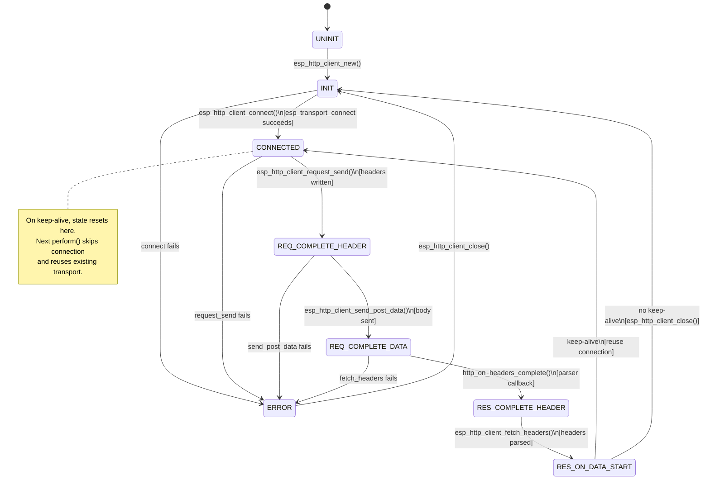
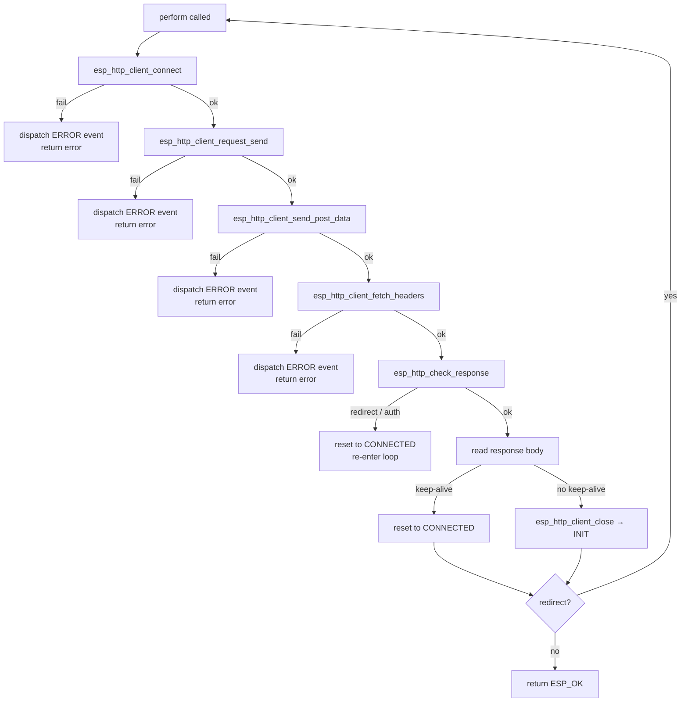
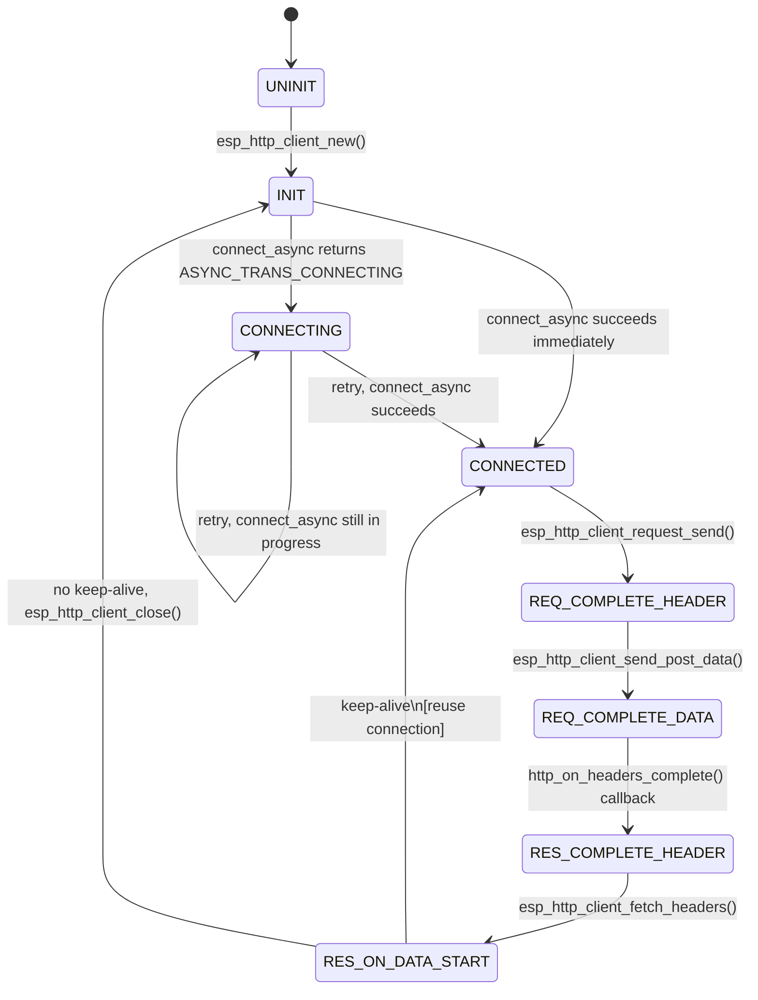
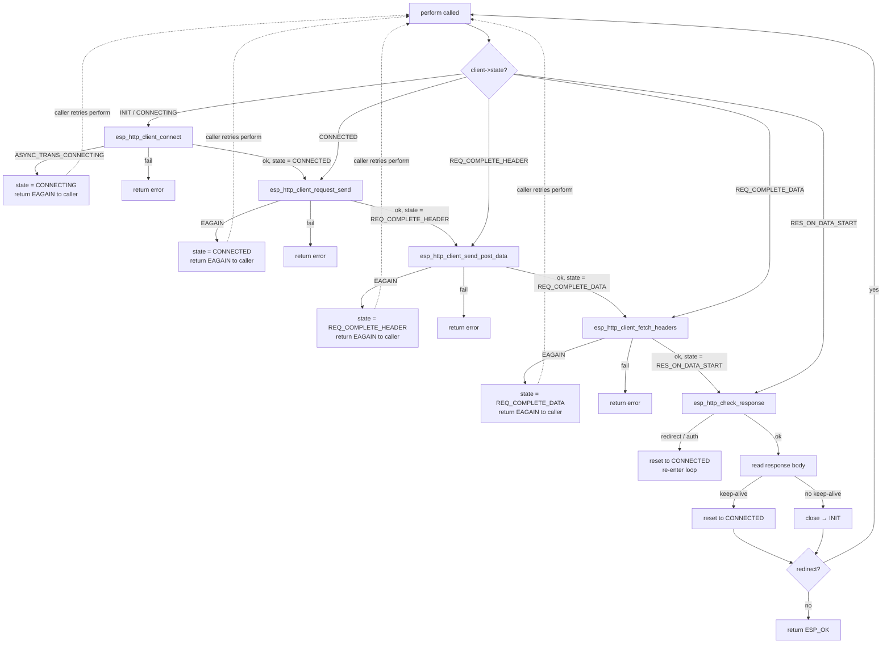
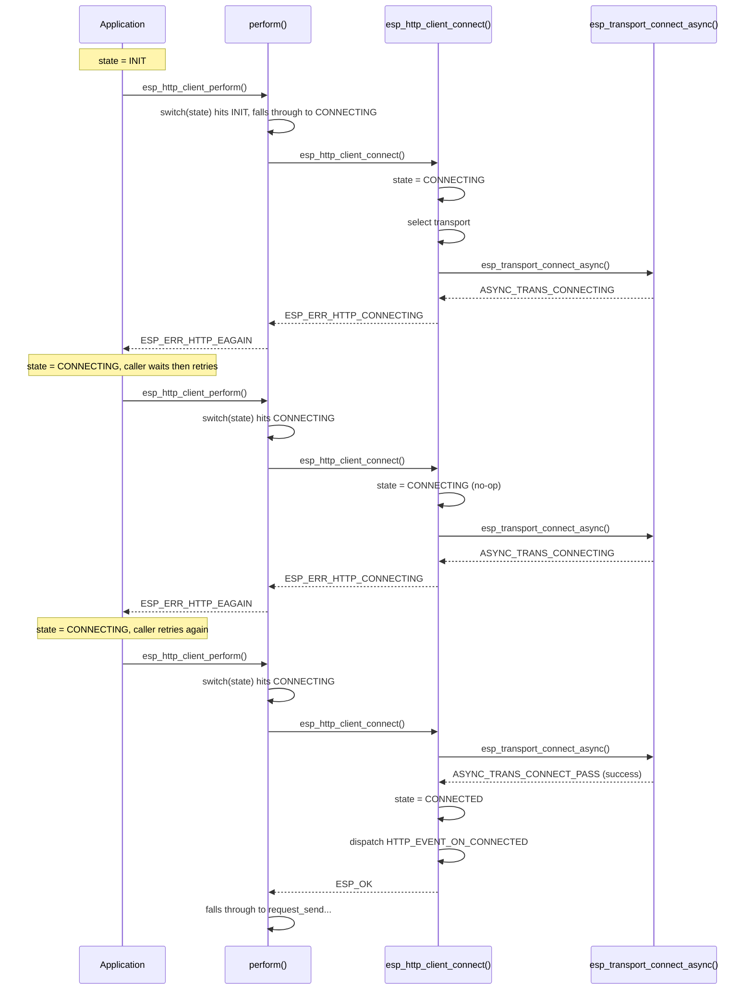
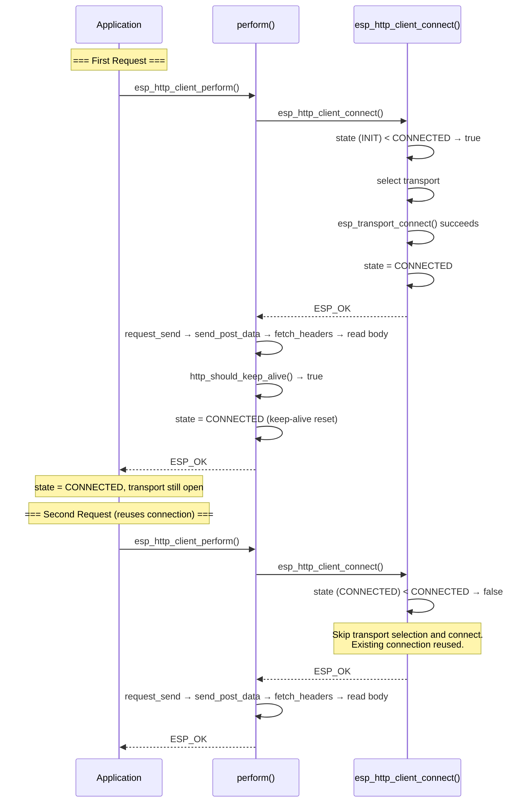
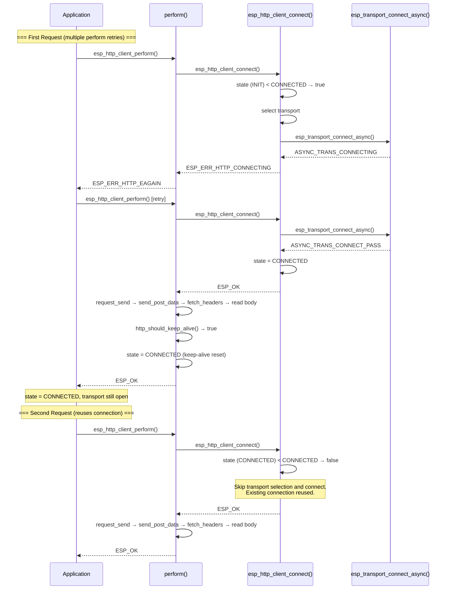

# ESP HTTP Client State Machine

## States

| State | Value | Description |
|-------|-------|-------------|
| `HTTP_STATE_UNINIT` | 0 | Client not yet created |
| `HTTP_STATE_INIT` | 1 | Client created or connection closed (ready to connect) |
| `HTTP_STATE_CONNECTING` | 2 | Async connect in progress (async only) |
| `HTTP_STATE_CONNECTED` | 3 | TCP/TLS connection established |
| `HTTP_STATE_REQ_COMPLETE_HEADER` | 4 | Request headers sent |
| `HTTP_STATE_REQ_COMPLETE_DATA` | 5 | Request body (POST data) sent |
| `HTTP_STATE_RES_COMPLETE_HEADER` | 6 | Response headers received and parsed |
| `HTTP_STATE_RES_ON_DATA_START` | 7 | Response body ready to be read |
| `HTTP_STATE_RES_COMPLETE_DATA` | 8 | Defined but unused |
| `HTTP_STATE_CLOSE` | 9 | Defined but unused |

## Sync Mode

In sync (blocking) mode, `esp_http_client_perform()` drives the entire request/response
cycle in a single call. Each phase completes fully before moving to the next.
The `HTTP_STATE_CONNECTING` state is never observed — connect either succeeds or fails.

### State Transitions

### `perform()` Flow

All switch-case stages fall through in a single invocation:

## Async Mode

In async (non-blocking) mode, each phase can return `ESP_ERR_HTTP_EAGAIN`
when the underlying operation would block. The caller must retry `esp_http_client_perform()`,
which resumes from the saved state via the switch-case.

### State Transitions

### `perform()` Flow

Each stage can yield back to the caller. Dashed arrows show the yield-and-retry path:

### Async Connection Retry Detail

Zooms into the CONNECTING retry loop, showing the interaction between the
caller, `perform()`, and `esp_http_client_connect()`:

## Connection Reuse (Keep-Alive)

When the server responds with `Connection: keep-alive`, the client reuses the
existing TCP/TLS connection for subsequent requests, avoiding the overhead of
a new handshake.

### Sync Connection Reuse

### Async Connection Reuse

## Transition Details

### `esp_http_client_new()` → INIT
Sets state to `INIT` after allocating and initializing all client structures.

### `esp_http_client_connect()` → CONNECTING / CONNECTED
- **Sync**: Calls `esp_transport_connect()`. On success → `CONNECTED`. On failure → returns error.
- **Async**: Calls `esp_transport_connect_async()`.
  - `ASYNC_TRANS_CONNECTING` → stays `CONNECTING`, returns `ESP_ERR_HTTP_CONNECTING`.
  - Success → `CONNECTED`.
  - Failure → returns error.
- Dispatches `HTTP_EVENT_ON_CONNECTED` on reaching `CONNECTED`.
- If already `CONNECTED` (keep-alive reuse), skips the entire connection block.

### `esp_http_client_request_send()` → REQ_COMPLETE_HEADER
Writes the request line and headers to the transport. Dispatches `HTTP_EVENT_HEADERS_SENT`.

### `esp_http_client_send_post_data()` → REQ_COMPLETE_DATA
Writes any remaining POST body data to the transport.

### `http_on_headers_complete()` → RES_COMPLETE_HEADER
HTTP parser callback invoked during `esp_http_client_fetch_headers()` when all
response headers are parsed. Dispatches `HTTP_EVENT_ON_HEADERS_COMPLETE`.

### `esp_http_client_fetch_headers()` → RES_ON_DATA_START
Set after the header-parsing loop completes. Client is now ready to read response body.

### Keep-alive reset → CONNECTED
In `esp_http_client_perform()`, after response is fully read, if
`http_should_keep_alive()` is true, state resets to `CONNECTED` for connection reuse.
The transport remains open — the next `perform()` call skips `esp_http_client_connect()`'s
connection block entirely.

### `esp_http_client_close()` → INIT
Closes the transport and resets state to `INIT`. Dispatches `HTTP_EVENT_DISCONNECTED`.

## Events

Events dispatched during the state machine lifecycle:

| Event | When | State After |
|-------|------|-------------|
| `HTTP_EVENT_ON_CONNECTED` | TCP/TLS connection established | `CONNECTED` |
| `HTTP_EVENT_HEADERS_SENT` | Request headers written | `REQ_COMPLETE_HEADER` |
| `HTTP_EVENT_ON_HEADERS_COMPLETE` | Response headers parsed | `RES_COMPLETE_HEADER` |
| `HTTP_EVENT_ON_DATA` | Response body chunk received | `RES_ON_DATA_START` |
| `HTTP_EVENT_ON_FINISH` | Response body fully received | `RES_ON_DATA_START` |
| `HTTP_EVENT_DISCONNECTED` | Connection closed | `INIT` |
| `HTTP_EVENT_ERROR` | Any error during perform | varies |
