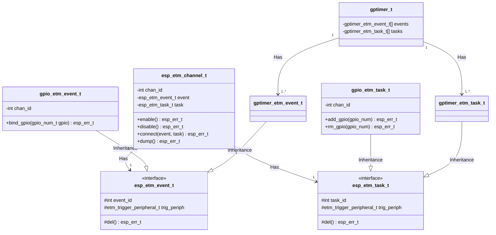

# `esp_hw_support` (G1 component)

This component contains hardware-related operations for supporting the system. These operations are one level above that of `hal` in that:

1. it uses system services such as memory allocation, logging, scheduling
2. it may be multi-step operations involving/affecting multiple parts of the SoC
3. it offers a service for other components vary from multiple layers (G1, G2 and G3) of ESP-IDF

Implementations that don't fit other components cleanly, but are not worth creating a new component for (yet) may also be placed here as long as they don't pull dependencies other than the core system components.

## Event-Task Service (esp_etm)

### esp_etm driver design

`esp_etm` driver is divided into two parts:

* The **core** driver, which focuses on ETM channel allocation and offers APIs to connect the channel with ETM tasks and ETM events that come from other peripherals.
* **Peripheral** side extensions, e.g. GPTimer support generating different kinds of ETM events, and accept multiple ETM tasks. These extensions are implemented in the peripheral driver, and can be located in different components. Usually, the task and event extensions will simply inherit the interface that defined in the core driver.

See the following class diagram, we take the GPIO and GPTimer as the example to illustrate the architecture of `esp_etm` driver.

## DMA Service

With the increasing demand, the hardware design of DMA is changing along the way. At first, each peripheral has a dedicated DMA controller. Later, a centralized DMA controller is introduced, which is called `GDMA` in the software.

There may be multiple GDMA instances on a chip, some is attached to the AHB bus and some is attached to the AXI bus. But their functionalities are almost the same.

Some high-performance peripherals, such as MIPI, require DMA to provide more functions, such as hardware handshake mechanism, address growth mode, out-of-order transmission and so on. Therefore, a new DMA controller, called `DW_GDMA` was born. The prefix *DW* is taken from *DesignWare*.

Please note that the specific DMA controller to be used for peripherals is determined by the specific chip. It is possible that, on chip A, SPI works with AHB GDMA, while on chip B, SPI works with AXI GDMA.
