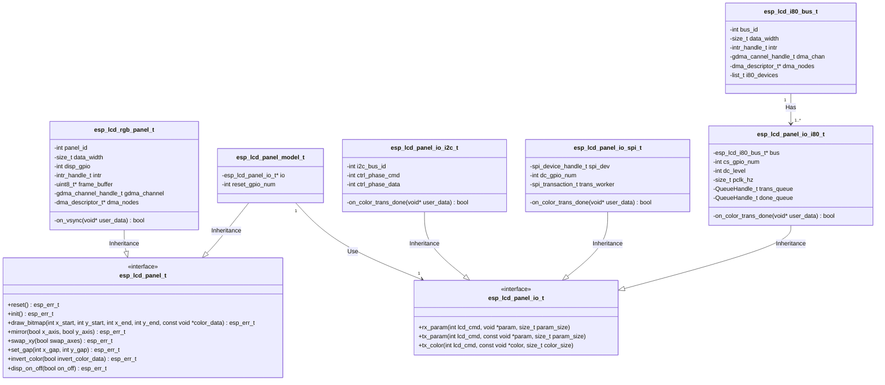

# esp_lcd Driver Design

## Class Diagram

`esp_lcd` driver focuses on two parts: panel driver and IO driver. The panel driver is a bunch of operations on the **frame-buffer**, no matter where the frame-buffer is located. The IO driver is mainly consumed by the controller-based LCD panel drivers (e.g. ST7789). Usually such LCD controller can support various IO interfaces (e.g. I80, SPI, I2C, etc). So we define an abstract interface for the IO driver.

