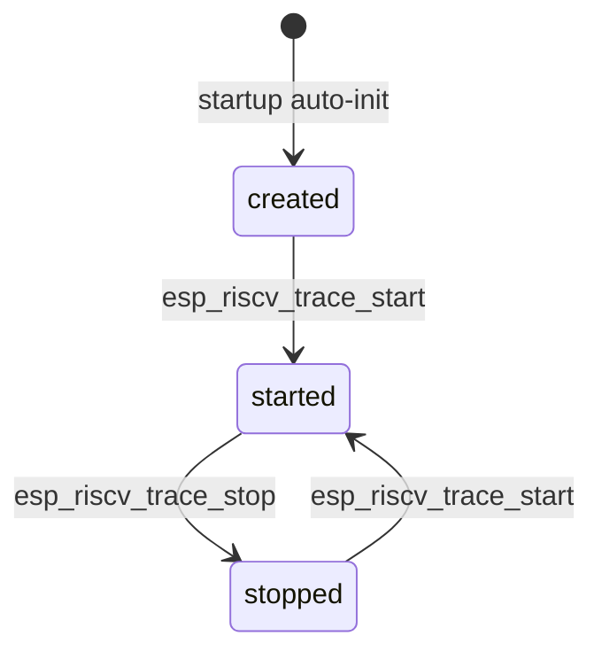

# RISC-V Trace Encoder Driver

## Overview

The `esp_riscv_trace` component provides the public driver API for the RISC-V
trace encoder peripheral. The driver is enabled by
`CONFIG_ESP_RISCV_TRACE_ENABLE` and creates one encoder handle per selected core
during startup auto-initialization.

Applications can override the weak `esp_riscv_trace_get_user_config(int core_id)`
function to customize the startup configuration per core (each encoder can be
configured independently), or use Kconfig defaults through
`ESP_RISCV_TRACE_DEFAULT_CONFIG()`.

## State Transition

`esp_riscv_trace_set_filter()` and `esp_riscv_trace_get_buffer()` are only valid
while the encoder is not started. `esp_riscv_trace_get_status()` can be used to
read a coherent status snapshot.

## Concurrency

Public driver APIs are serialized per trace core with a task-level lock. They
are task-context APIs and must not be called from ISR context.

The driver keeps the lifecycle state check and the corresponding HAL register
operation under the same per-core lock. This prevents concurrent callers from
double-starting an encoder, racing a stop against filter programming, or reading
the buffer before a stop has completed its cache synchronization.

## Buffer and Trace Stream Notes

The trace buffer must be reachable by the trace encoder AHB master. Driver
allocated buffers are cache-line aligned and placed in internal RAM or PSRAM
according to configuration. Caller-provided buffers are validated for reachable
memory and cache-line alignment.

In loop memory mode, wrapped buffers need periodic resynchronization packets to
remain decodable after the original start sync has been overwritten.

## Dependencies

This driver depends on the RISC-V trace HAL (part of the `hal` component) and
currently targets SoCs that support the RISC-V trace encoder peripheral.
