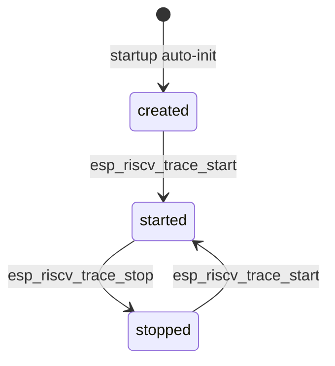

# RISC-V Trace Encoder Driver

## Overview

The `esp_riscv_trace` component provides the public driver API for the RISC-V
trace encoder peripheral. The driver is enabled by
`CONFIG_ESP_RISCV_TRACE_ENABLE` and creates one encoder handle per core during
startup.

Applications can override the weak `esp_riscv_trace_get_user_config(int core_id)`
function to customize configuration per core, or use Kconfig defaults via
`ESP_RISCV_TRACE_DEFAULT_CONFIG()`.

## State Transition


```mermaid
stateDiagram-v2
    [*] --> created: startup auto-init
    created --> started: esp_riscv_trace_start
    started --> stopped: esp_riscv_trace_stop
    stopped --> started: esp_riscv_trace_start
```

`esp_riscv_trace_set_filter()` and `esp_riscv_trace_get_buffer()` are valid only
while the encoder is stopped. `esp_riscv_trace_get_status()` reads the current
status.

With `CONFIG_ESP_RISCV_TRACE_AUTOSTART` the driver also starts each encoder
during startup, so the application does not need to call
`esp_riscv_trace_start()`. This option defaults to enabled when core dumps are
enabled, so a panic always carries the recent execution history.

## Concurrency

Public driver APIs use a per-core lock. They must only be called from FreeRTOS
tasks, not from interrupt service routines (ISRs).

The driver checks lifecycle state and executes HAL register operations under the
same per-core lock. This prevents race conditions between start, stop, filter
configuration, and buffer cache synchronization.

## Snapshot

The snapshot is an in-memory structure that describes a capture. Firmware
updates `g_esp_riscv_trace_snapshot` as encoders start, stop, or freeze on
panic.

The root descriptor contains the ABI version, chip ID, chip revision, capture
reason, and a `write_seq` counter. The `write_seq` counter is odd while the
snapshot is being updated and even when stable. `cores_addr` points to an array of
per-core records. Each record stores the trace buffer address, size, head offset,
encoder parameters, wire format, memory mode, and head offset.

```text
g_esp_riscv_trace_snapshot
  `-- cores_addr --> core_desc[core_count]
        |-- buffer_addr --> raw encoder packets
        `-- encoder_params_addr --> encoder params
```

## How Coredump Reads the Snapshot

On panic, the driver freezes the snapshot. The coredump writer copies a
core buffer when that core is stopped or frozen, `head_valid` is set, and
the encoder FIFO is empty.

The coredump writer adds those buffers as `PT_LOAD` segments and writes
metadata into an `ESP_RISCV_TRACE` ELF note (type 680). The `esp-riscv-trace` tool
reads the note and trace segments directly from the coredump ELF file.

## Buffer and Trace Stream Notes

The trace buffer must be reachable by the trace encoder AHB master.
Driver-allocated buffers are placed in internal RAM or PSRAM based on
configuration, and are cache-line aligned when placed in cached memory.
Caller-provided buffers are validated for memory reachability and cache-line
alignment. PSRAM placement is only available on targets where the encoder can
access external RAM (`SOC_RISCV_TRACE_MEM_SUPPORT_PSRAM`). On other targets,
the buffer is always in internal RAM.

In loop memory mode, wrapped buffers require periodic resynchronization packets
to remain decodable after the initial sync packet is overwritten.

## Dependencies

This driver depends on the RISC-V trace HAL (`hal` component) and supports
SoCs with RISC-V trace hardware.
