# ESP Trace Component

The `esp_trace` component provides a unified tracing infrastructure for ESP-IDF. It acts as a central hub that coordinates different trace libraries (like SEGGER SystemView) and trace transports (like apptrace over JTAG/UART).

## Overview

The `esp_trace` component enables:
- Integration of multiple trace libraries through a common interface
- Flexible transport layer selection (JTAG, UART, or custom)
- Centralized trace configuration and management
- Support for both built-in and external trace libraries

## Architecture

The `esp_trace` component uses a **Port & Adapter** design pattern (also known as Hexagonal Architecture) to provide flexibility and extensibility:

```mermaid
flowchart TB

%% =======================
%% Application Layer
%% =======================
subgraph APP["📱 APPLICATION"]
    app_main["app_main()"]
    sysview_tracing["sysview_tracing.c"]
    examples["tracing_heap_log.c"]
    freertos_events["FreeRTOS Events"]
end


%% =======================
%% Primary Port (Driver Port)
%% =======================
subgraph PRIMARY["🔌 PUBLIC INTERFACE"]
    api["- esp_trace.h 
    - esp_trace_init()
    - esp_trace_record()
    - esp_trace_write()
    - esp_trace_flush()
    - esp_trace_print()"]
end

%% wiring: App uses API (labels land on the short pre-edges to api_in)
app_main -->|esp_trace.h| api
sysview_tracing -->|esp_trace.h| api
examples -->|esp_trace.h| api
freertos_events -->|trace macros| api
%% =======================
%% Core Domain
%% =======================
subgraph CORE["⚙️ CORE DOMAIN"]
    corec["- esp_trace_core.c
    - Creates encoder + transport instances
    - Thread safe multi-core init
    - Adapter coordination"]
    regc["esp_trace_registry.c
    - Runtime adapter discovery
    - Maps names to vtables"]
end

api --> corec
corec --- regc

%% =======================
%% Ports (Outbound)
%% =======================
subgraph PORT_ENC["🔌 PORT Encoder"]
    enc_port["esp_trace_port_encoder.h
    Interface:
    - init()
    - print_event()
    - write()
    - flush()"]
end

subgraph PORT_TR["🔌 PORT Transport"]
    tr_port["esp_trace_port_transport.h
    Interface:
    - init()
    - write()
    - flush()
    - is_host_connected()"]
end

corec --> enc_port
corec --> tr_port

%% =======================
%% Adapters
%% =======================
subgraph ADAPTERS["🔶 ADAPTERS"]
    %% Encoders
    enc_sysview["encoder_sysview.c implements sysview vtable"]
    enc_ctf["encoder_ctf.c implements ctf vtable"]
    enc_percepio["encoder_percepio.c implements percepio vtable"]

    %% Transports
    tr_apptrace["transport_apptrace.c implements apptrace vtable"]
end

enc_port --> enc_sysview
enc_port --> enc_ctf
enc_port --> enc_percepio
tr_port --> tr_apptrace

%% =======================
%% Host tools
%% =======================
subgraph HOST_TOOLS["💻 TOOLS"]
    direction LR
    view_openocd["OpenOCD"]
    view_sysview["SEGGER SystemView"]
    view_ctf["Trace Compass"]
    view_perfetto["Perfetto"]
    view_babeltrace["Babeltrace2"]
    view_percepio["TraceAlyzer"]
end

%% invisible hub to center align
hub(("HOST"))

%% Adapters feed into the hub (not directly into subgraph)
enc_sysview --> hub
enc_ctf --> hub
tr_apptrace --> hub

%% hub connects downward to host tools
hub --> view_openocd & view_sysview & view_ctf & view_perfetto & view_babeltrace & view_percepio

%% Styling
classDef appStyle fill:#e3f2fd,stroke:#1976d2,stroke-width:2px,color:#000
classDef primaryStyle fill:#f3e5f5,stroke:#7b1fa2,stroke-width:2px,color:#000
classDef coreStyle fill:#fff3e0,stroke:#f57c00,stroke-width:2px,color:#000
classDef portStyle fill:#e1f5fe,stroke:#0277bd,stroke-width:3px,color:#000
classDef adapterStyle fill:#fff9c4,stroke:#f9a825,stroke-width:2px,color:#000
classDef hostStyle fill:#e8f5e9,stroke:#388e3c,stroke-width:2px,color:#000
classDef hubStyle fill:#ffebee,stroke:#c62828,stroke-width:3px,color:#000

class APP appStyle
class PRIMARY,api primaryStyle
class CORE,corec,regc coreStyle
class PORT_ENC,PORT_TR,enc_port,tr_port portStyle
class ADAPTERS,enc_sysview,enc_ctf,enc_percepio,tr_apptrace adapterStyle
class HOST_TOOLS,view_openocd,view_sysview,view_ctf,view_perfetto,view_babeltrace,view_percepio hostStyle
class hub hubStyle

```



The architecture follows a layered Port & Adapter pattern where the core manages trace sessions and coordinates adapters through well-defined interfaces (ports). Applications interact with a public API that forwards calls to the core, which then delegates work to encoder adapters (for trace formatting) and transport adapters (for data transmission). The registry enables runtime discovery of adapters that register themselves at link time using `ESP_TRACE_REGISTER_ENCODER()` and `ESP_TRACE_REGISTER_TRANSPORT()` macros. Encoders use transport ports to send formatted trace data, allowing any encoder to work with any transport. This separation means you can, for example, use SystemView with JTAG, other library with UART, or any other combination without modifying the core or adapters themselves.

## How to Enable

### Using Menuconfig

1. Go to `Component config` → `ESP Trace Configuration`
2. Select your desired trace transport under `Trace transport`:
   - **ESP-IDF apptrace** - Use built-in apptrace for custom tracing
   - **None** - Disable tracing transport
3. Select your trace library under `Trace library`:
   - **SEGGER SystemView** - Enable SystemView tracing
   - **None** - Use standalone apptrace without a library

### Using sdkconfig

For standalone apptrace (without a trace library):

```
CONFIG_ESP_TRACE_ENABLE=y
CONFIG_ESP_TRACE_LIB_NONE=y
CONFIG_ESP_TRACE_TRANSPORT_APPTRACE=y
```

For SystemView tracing over JTAG:

```
CONFIG_ESP_TRACE_ENABLE=y
CONFIG_ESP_TRACE_LIB_SYSVIEW=y
CONFIG_ESP_TRACE_TRANSPORT_APPTRACE=y
CONFIG_APPTRACE_DEST_JTAG=y
```

## Component Dependencies

To use tracing in your application, add `esp_trace` to your component's dependencies in `CMakeLists.txt`:

```cmake
idf_component_register(
    SRCS "main.c"
    INCLUDE_DIRS "."
    REQUIRES esp_trace
)
```

The `esp_trace` component will automatically include necessary sub-components (like `app_trace`) based on your configuration.

## Adding External Trace Libraries

The `esp_trace` component supports integration of external trace libraries through two types of adapters:

- **Transport Adapters**: Handle the physical transport layer (e.g., JTAG, UART)
- **Encoder Adapters**: Handle the trace encoding/formatting (e.g., SystemView, custom formats)

### Creating a Transport Adapter

Transport adapters provide the physical communication layer for trace data.

**Example: Creating a custom transport adapter**

```c
#include "esp_trace_registry.h"
#include "esp_trace_port_transport.h"

static esp_err_t my_transport_init(esp_trace_transport_t *tp, const void *cfg)
{
    // Initialize your transport
    return ESP_OK;
}

static esp_err_t my_transport_write(esp_trace_transport_t *tp, const void *data, size_t size, uint32_t tmo)
{
    // Write data to your transport
    return ESP_OK;
}

static esp_err_t my_transport_flush(esp_trace_transport_t *tp, uint32_t tmo)
{
    // Flush transport buffers
    return ESP_OK;
}

// Create the vtable with your functions
static const esp_trace_transport_vtable_t s_my_transport_vt = {
    .init = my_transport_init,
    .write = my_transport_write,
    .flush = my_transport_flush,
    // Add other required function pointers as needed
};

// Register the transport adapter
ESP_TRACE_REGISTER_TRANSPORT("my_transport", &s_my_transport_vt);
```

See `components/esp_trace/adapters/transport/adapter_transport_apptrace.c` for a complete reference implementation.

### Creating an Encoder Adapter

Encoder adapters handle trace data formatting and encoding for specific trace libraries.

**Example: Creating a custom encoder adapter**

```c
#include "esp_trace_registry.h"
#include "esp_trace_port_encoder.h"

static esp_err_t my_encoder_init(esp_trace_encoder_t *enc, const void *cfg)
{
    // Initialize your encoder
    // Configure transport if needed:
    // enc->tp->vt->set_config(enc->tp, ESP_TRACE_TRANSPORT_CFG_HEADER_SIZE, &value);
    return ESP_OK;
}

static esp_err_t my_encoder_print_event(esp_trace_encoder_t *enc, 
                                         const char *event_name, 
                                         const char *formatted_str)
{
    // Format and send trace event
    return ESP_OK;
}

static esp_err_t my_encoder_flush(esp_trace_encoder_t *enc, uint32_t tmo)
{
    // Flush encoder buffers
    return ESP_OK;
}

// Create the vtable with your functions
static const esp_trace_encoder_vtable_t s_my_encoder_vt = {
    .init = my_encoder_init,
    .print_event = my_encoder_print_event,
    .flush = my_encoder_flush,
    // Add other required function pointers as needed
};

// Register the encoder adapter
ESP_TRACE_REGISTER_ENCODER("my_encoder", &s_my_encoder_vt);
```

**Key Points:**
- Use `ESP_TRACE_REGISTER_ENCODER(name, vtable)` to register your encoder
- Use `ESP_TRACE_REGISTER_TRANSPORT(name, vtable)` if you're implementing a custom transport
- Registration happens automatically at link time (no manual initialization needed)

See `components/esp_trace/adapters/encoder/adapter_encoder_sysview.c` for a complete reference implementation.

### FreeRTOS Trace Integration

If your external trace library needs to capture FreeRTOS events, you must provide an `esp_trace_freertos_impl.h` header in your component's include directory. This header should define FreeRTOS trace macros (like `traceTASK_SWITCHED_IN()`, `traceISR_ENTER()`, etc.) that will be called by FreeRTOS.

The `esp_trace` component includes this header when `CONFIG_ESP_TRACE_LIB_EXTERNAL=y` is set:

```c
// In esp_trace_freertos.h
#if CONFIG_ESP_TRACE_LIB_EXTERNAL
#include "esp_trace_freertos_impl.h"
#endif
```

**Example esp_trace_freertos_impl.h:**
```c
#pragma once

#include "your_trace_library.h"

#define traceTASK_SWITCHED_IN() your_lib_task_switched_in(xTaskGetCurrentTaskHandle())
#define traceISR_ENTER(irq_num) your_lib_isr_enter(irq_num)
#define traceISR_EXIT() your_lib_isr_exit()
// ... define other FreeRTOS trace macros as needed
```

### Component CMakeLists.txt Setup

For external adapters to work properly, your component's CMakeLists.txt needs two important settings:

**Example CMakeLists.txt:**
```cmake
idf_component_register(
    SRCS "src/adapter_encoder_ctf.c"
    INCLUDE_DIRS "include"
    REQUIRES esp_trace
    WHOLE_ARCHIVE TRUE  # Important: ensures adapter registration is linked
)

# Auto-register this component with esp_trace
# This allows esp_trace to find your esp_trace_freertos_impl.h
idf_component_get_property(esp_trace_lib esp_trace COMPONENT_LIB)
target_link_libraries(${esp_trace_lib} INTERFACE $<TARGET_NAME_IF_EXISTS:${COMPONENT_LIB}>)
```

**Important:**
- `WHOLE_ARCHIVE TRUE` ensures your adapter registration code is linked
- The `target_link_libraries` trick makes your headers visible to esp_trace component

### Using an External Adapter

1. **Add the component to your project dependencies** in your main component's `CMakeLists.txt`:
   ```cmake
   idf_component_register(
       SRCS "main.c"
       INCLUDE_DIRS "."
       REQUIRES my_trace_component esp_trace
   )
   ```

2. **Configure trace settings** in your project's `sdkconfig.defaults`:
   ```ini
   # Enable esp_trace
   CONFIG_ESP_TRACE_ENABLE=y
   
   # Use external trace library
   CONFIG_ESP_TRACE_LIB_EXTERNAL=y
   
   # Select transport (e.g., apptrace over UART)
   CONFIG_ESP_TRACE_TRANSPORT_APPTRACE=y
   CONFIG_APPTRACE_DEST_UART=y
   CONFIG_APPTRACE_DEST_UART_NUM=0
   ```

3. **Build and run** - The adapter will be automatically registered and used when the component is linked.

**Note:** External trace libraries should use `CONFIG_ESP_TRACE_LIB_EXTERNAL=y` instead of defining their own Kconfig option in the esp_trace menu. This keeps the external component independent from the esp_trace component.

## Documentation

For detailed usage instructions, see:
- [Application Tracing Guide](../../docs/en/api-guides/app_trace.rst)
- [Migration Guide](../../docs/en/migration-guides/release-6.x/6.0/system.rst)

## Examples

Examples demonstrating trace usage can be found in:
- `examples/system/app_trace_basic/` - Basic application tracing
- `examples/system/sysview_tracing/` - SystemView tracing example
