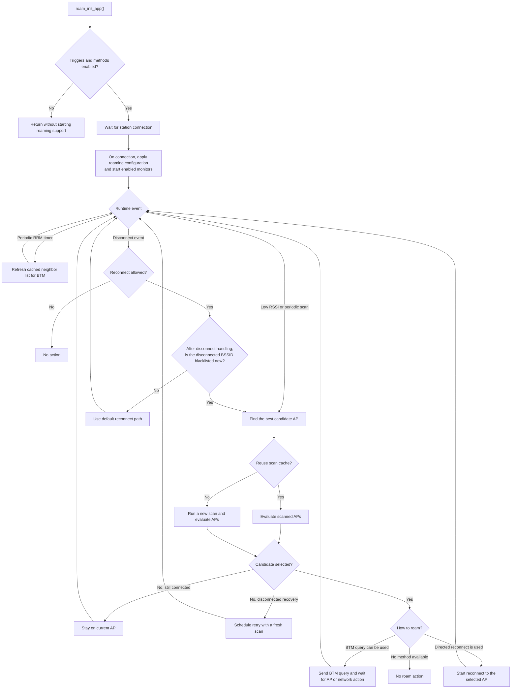
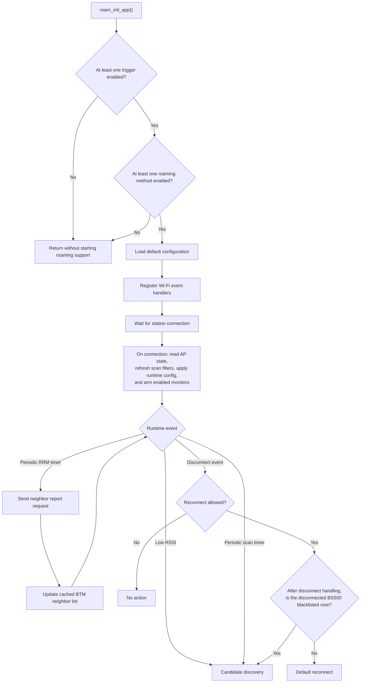
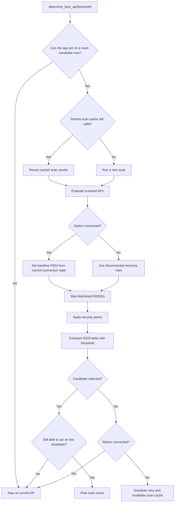
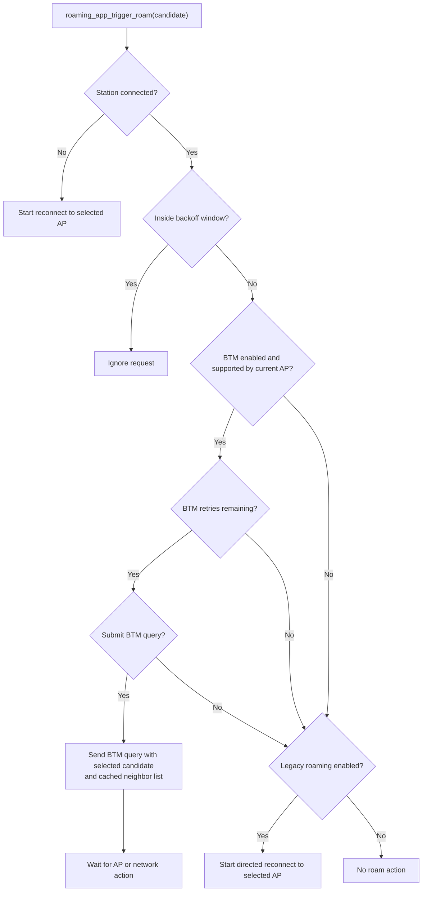

# Roaming App Flow

## Scope

This document describes the runtime control flow of the advanced Wi-Fi roaming app and identifies the configuration options that influence each stage. Each diagram focuses on one stage of the app, and the table below it lists the related configuration options.

## Terminology

- `AP`: Access Point.
- `BSSID`: MAC address of one AP radio.
- `Candidate AP`: A scanned AP that is still under consideration for roaming.
- `BTM`: Network-assisted roaming using IEEE 802.11v BSS Transition Management.
- `RRM / Neighbor Report`: Information about neighboring APs obtained using IEEE 802.11k.
- `Legacy roaming`: A directed reconnect initiated by the roaming app.
- `Blacklist`: A temporary deny-list of BSSIDs that the app should avoid.

## Initialization Preconditions

The roaming app starts only if both of the following are true:

- At least one roaming trigger is enabled.
- At least one roaming method is enabled.

If either condition is not satisfied, `roam_init_app()` returns without starting roaming support.

## 1. High-Level Flow

The following diagram summarizes the complete roaming flow before the later sections break it down by stage.

## 2. Initialization and Monitoring

### Configuration used in this stage

| Area | Configuration |
| --- | --- |
| Low RSSI trigger | `ESP_WIFI_ROAMING_LOW_RSSI_ROAMING`, `ESP_WIFI_ROAMING_LOW_RSSI_THRESHOLD`, `ESP_WIFI_ROAMING_LOW_RSSI_OFFSET` |
| Periodic scan trigger | `ESP_WIFI_ROAMING_PERIODIC_SCAN_MONITOR`, `ESP_WIFI_ROAMING_PERIODIC_SCAN_THRESHOLD`, `ESP_WIFI_ROAMING_SCAN_MONITOR_INTERVAL`, `ESP_WIFI_ROAMING_SCAN_ROAM_RSSI_DIFF` |
| Periodic RRM | `ESP_WIFI_ROAMING_PERIODIC_RRM_MONITORING`, `ESP_WIFI_ROAMING_RRM_MONITOR_TIME`, `ESP_WIFI_ROAMING_RRM_MONITOR_THRESHOLD` |
| Blacklist handling | `ESP_WIFI_ROAMING_BSSID_BLACKLIST`, `ESP_WIFI_ROAMING_AUTO_BLACKLISTING`, `ESP_WIFI_ROAMING_MAX_CONN_FAILURES`, `ESP_WIFI_ROAMING_BLACKLIST_TIMEOUT` |
| Runtime overrides | `roam_set_config_params()`, `scan_filter_ssid`, `scan_filter_bssid` |

## 3. Candidate Discovery and Selection

### Configuration used in this stage

| Area | Configuration |
| --- | --- |
| Scan timing | `ESP_WIFI_ROAMING_SCAN_MIN_SCAN_TIME`, `ESP_WIFI_ROAMING_SCAN_MAX_SCAN_TIME`, `ESP_WIFI_ROAMING_HOME_CHANNEL_DWELL_TIME` |
| Scan filter and scope | `ESP_WIFI_ROAMING_SCAN_CHAN_LIST`, `scan_filter_ssid`, `scan_filter_bssid` |
| Scan cache reuse | `ESP_WIFI_ROAMING_SCAN_EXPIRY_WINDOW` |
| Blacklist filter | `ESP_WIFI_ROAMING_BSSID_BLACKLIST`, `ESP_WIFI_ROAMING_BLACKLIST_TIMEOUT`, `ESP_WIFI_ROAMING_MAX_CANDIDATES` |
| Security policy | `wifi_config_t.sta.threshold.authmode`, `wifi_config_t.sta.owe_enabled`, `wifi_config_t.sta.pmf_cfg.required`, `wifi_config_t.sta.sae_pwe_h2e`, `wifi_config_t.sta.sae_pk_mode` |
| Periodic scan threshold input | `ESP_WIFI_ROAMING_SCAN_ROAM_RSSI_DIFF` |

## 4. Roam Execution

### Configuration used in this stage

| Area | Configuration |
| --- | --- |
| Backoff | `ESP_WIFI_ROAMING_BACKOFF_TIME` |
| BTM path | `ESP_WIFI_ROAMING_NETWORK_ASSISTED_ROAM`, `ESP_WIFI_NETWORK_ASSISTED_ROAMING_RETRY_COUNT` |
| Legacy path | `ESP_WIFI_ROAMING_LEGACY_ROAMING` |
| Post-roam IP behavior | `ESP_WIFI_ROAMING_IP_RENEW_SKIP` |

## 5. Configuration Summary by Functional Area

| Functional area | Configuration |
| --- | --- |
| Low RSSI roaming | `ESP_WIFI_ROAMING_LOW_RSSI_ROAMING`, `ESP_WIFI_ROAMING_LOW_RSSI_THRESHOLD`, `ESP_WIFI_ROAMING_LOW_RSSI_OFFSET` |
| Periodic scan roaming | `ESP_WIFI_ROAMING_PERIODIC_SCAN_MONITOR`, `ESP_WIFI_ROAMING_PERIODIC_SCAN_THRESHOLD`, `ESP_WIFI_ROAMING_SCAN_MONITOR_INTERVAL`, `ESP_WIFI_ROAMING_SCAN_ROAM_RSSI_DIFF` |
| Network-assisted roaming | `ESP_WIFI_ROAMING_NETWORK_ASSISTED_ROAM`, `ESP_WIFI_NETWORK_ASSISTED_ROAMING_RETRY_COUNT` |
| Post-roam IP behavior | `ESP_WIFI_ROAMING_IP_RENEW_SKIP` |
| Legacy roaming | `ESP_WIFI_ROAMING_LEGACY_ROAMING` |
| Periodic RRM / neighbor reports | `ESP_WIFI_ROAMING_PERIODIC_RRM_MONITORING`, `ESP_WIFI_ROAMING_RRM_MONITOR_TIME`, `ESP_WIFI_ROAMING_RRM_MONITOR_THRESHOLD` |
| Scan behavior | `ESP_WIFI_ROAMING_SCAN_MIN_SCAN_TIME`, `ESP_WIFI_ROAMING_SCAN_MAX_SCAN_TIME`, `ESP_WIFI_ROAMING_HOME_CHANNEL_DWELL_TIME`, `ESP_WIFI_ROAMING_SCAN_CHAN_LIST`, `ESP_WIFI_ROAMING_SCAN_EXPIRY_WINDOW` |
| Blacklist behavior | `ESP_WIFI_ROAMING_BSSID_BLACKLIST`, `ESP_WIFI_ROAMING_AUTO_BLACKLISTING`, `ESP_WIFI_ROAMING_MAX_CONN_FAILURES`, `ESP_WIFI_ROAMING_BLACKLIST_TIMEOUT`, `ESP_WIFI_ROAMING_MAX_CANDIDATES` |
| Runtime scan filters | `roam_set_config_params()`, `scan_filter_ssid`, `scan_filter_bssid` |
| Candidate security policy | `wifi_config_t.sta.threshold.authmode`, `wifi_config_t.sta.owe_enabled`, `wifi_config_t.sta.pmf_cfg.required`, `wifi_config_t.sta.sae_pwe_h2e`, `wifi_config_t.sta.sae_pk_mode` |

## 6. Behavioral Notes

- A periodic RRM event does not directly trigger roaming. Its purpose is to refresh the cached neighbor list used by the BTM path.
- While connected, candidate ranking uses the stronger of two values: the RSSI from the current connection and the RSSI for the same BSSID in the latest scan results.
- After a disconnect, the app checks whether the disconnected BSSID is blacklisted. This covers both BSSIDs that were already blacklisted and BSSIDs that become blacklisted because the latest failure reached the configured threshold.
- After a disconnect, the app does not compare other APs against the failed AP's scan RSSI. This lets it choose any valid AP that is not blacklisted.
- Candidate security checks allow roaming only within supported compatibility groups: Open/OWE, Personal, and Enterprise. Transition-disable policy and station security requirements are still enforced.
- A BTM query is asynchronous. After the query is sent, the app waits for AP or network action. It does not immediately force legacy roaming in the same step.
- The reconnect paths start a connection attempt. Final success or failure is reported later through the normal Wi-Fi connection and disconnection events.
- If the station is already disconnected, the app can still reconnect to a selected AP even when legacy roaming is disabled.
