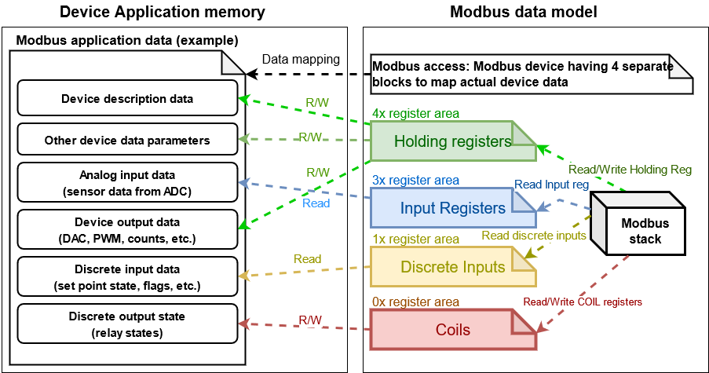

ESP-Modbus
==========

Overview
--------

The Modbus serial communication protocol is de facto standard protocol widely used to connect industrial electronic devices. Modbus allows communication among many devices connected to the same network, for example, a system that measures temperature and humidity and communicates the results to a computer. The Modbus protocol uses several types of data: Holding Registers, Input Registers, Coils (single bit output), Discrete Inputs. Versions of the Modbus protocol exist for serial port and for Ethernet and other protocols that support the Internet protocol suite. There are many variants of Modbus protocols, some of them are:

    * ``Modbus RTU`` — This is used in serial communication and makes use of a compact, binary representation of the data for protocol communication. The RTU format follows the commands/data with a cyclic redundancy check checksum as an error check mechanism to ensure the reliability of data. Modbus RTU is the most common implementation available for Modbus. A Modbus RTU message must be transmitted continuously without inter-character hesitations. Modbus messages are framed (separated) by idle (silent) periods. The RS-485 interface communication is usually used for this type.
    * ``Modbus ASCII`` — This is used in serial communication and makes use of ASCII characters for protocol communication. The ASCII format uses a longitudinal redundancy check checksum. Modbus ASCII messages are framed by leading colon (":") and trailing newline (CR/LF).
    * ``Modbus TCP/IP or Modbus TCP`` — This is a Modbus variant used for communications over TCP/IP networks, connecting over port 502. It does not require a checksum calculation, as lower layers already provide checksum protection.

.. note:: This documentation (and included code snippets) requires some familiarity with the Modbus protocol. Refer to the Modbus Organization's with protocol specifications for specifics :ref:`modbus_organization`.

Messaging Model And Data Mapping
--------------------------------

Modbus is an application protocol that defines rules for messaging structure and data organization that are independent of the data transmission medium. Traditional serial Modbus is a register-based protocol that defines message transactions that occur between master(s) and slave devices (multiple masters are allowed on using Modbus TCP/IP). The slave devices listen for communication from the master and simply respond as instructed. The master(s) always controls communication and may communicate directly to one slave, or all connected slaves, but the slaves cannot communicate directly with each other.

.. figure:: ../_static/modbus-segment.png
    :align: center
    :scale: 80%
    :alt: Modbus segment diagram
    :figclass: align-center

    Modbus segment diagram

.. note:: It is assumed that the number of slaves and their register maps are known by the Modbus master before the start of stack.

The register map of each slave device is usually part of its device manual. A Slave device usually permits configuration of its short slave address and communication options that are used within the device's network segment.

The Modbus protocol allows devices to map data to four types of registers (Holding, Input, Discrete, Coil). The figure below illustrates an example mapping of a device's data to the four types of registers.

    Modbus data mapping

The following sections give an overview of how to use the ESP_Modbus component found under `components/freemodbus`. The sections cover initialization of a Modbus port, and the setup a master or slave device accordingly:

- :ref:`modbus_api_port_initialization`
- :ref:`modbus_api_slave_overview`
- :ref:`modbus_api_master_overview`

