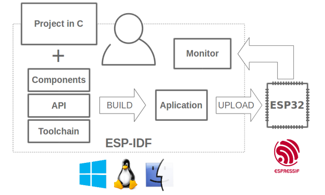

About
=====

This is documentation of `ESP-IDF <https://github.com/espressif/esp-idf>`_, the framework to develop applications for `ESP32 <https://espressif.com/en/products/hardware/esp32/overview>`_ chip by `Espressif <https://espressif.com>`_.

The ESP32 is 2.4 GHz Wi-Fi and Bluetooth combo, 32 bit dual core chip with 600 DMIPS processing power.

    Espressif IoT Integrated Development Framework

The ESP-IDF, Espressif IoT Integrated Development Framework, provides toolchain, API, components and workflows to develop applications for ESP32 using Windows, Linux and Mac OS operating systems.

