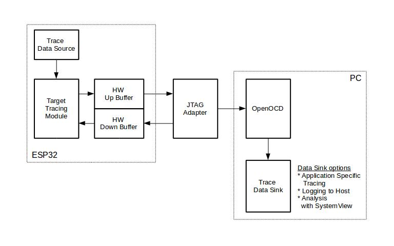

Application Level Tracing library
=================================

Overview
--------

IDF provides useful feature for program behaviour analysis: application level tracing. It is implemented in the corresponding library and can be enabled in menuconfig. This feature allows to transfer arbitrary data between host and ESP32 via JTAG interface with small overhead on program execution.

Developers can use this library to send application specific state of execution to the host and receive commands or other type of info in the opposite direction at runtime. The main use cases of this library are:

1. Collecting application specific data. See `Application Specific Tracing`_.
2. Lightweight logging to the host. See `Logging to Host`_.
3. System behaviour analysis. See `System Behaviour Analysis with SEGGER SystemView`_.

Tracing components when working over JTAG interface are shown in the figure below.

    Tracing Components when Working Over JTAG

Modes of Operation
------------------

The library supports two modes of operation:

**Post-mortem mode**. This is the default mode. The mode does not need interaction from the host side. In this mode tracing module does not check whether host has read all the data from *HW UP BUFFER* buffer and overwrites old data with the new ones. This mode is useful when only the latest trace data are interesting to the user, e.g. for analyzing program's behaviour just before the crash. Host can read the data later on upon user request, e.g. via special OpenOCD command in case of working via JTAG interface.

**Streaming mode.** Tracing module enters this mode when host connects to ESP32. In this mode before writing new data to *HW UP BUFFER* tracing module checks that there is enough space in it and if necessary waits for the host to read data and free enough memory. Maximum waiting time is controled via timeout values passed by users to corresponding API routines. So when application tries to write data to trace buffer using finite value of the maximum waiting time it is possible situation that this data will be dropped. Especially this is true for tracing from time critical code (ISRs, OS scheduler code etc.) when infinite timeouts can lead to system malfunction. In order to avoid loss of such critical data developers can enable additional data buffering via menuconfig option :ref:`CONFIG_ESP32_APPTRACE_PENDING_DATA_SIZE_MAX`. This macro specifies the size of data which can be buffered in above conditions. The option can also help to overcome situation when data transfer to the host is temporarily slowed down, e.g due to USB bus congestions etc. But it will not help when average bitrate of trace data stream exceeds HW interface capabilities.

Configuration Options and Dependencies
--------------------------------------

Using of this feature depends on two components:

1. **Host side:** Application tracing is done over JTAG, so it needs OpenOCD to be set up and running on host machine. For instructions how to set it up, please, see :doc:`JTAG Debugging <../api-guides/jtag-debugging/index>` for details.
2. **Target side:** Application tracing functionality can be enabled in menuconfig. *Component config > Application Level Tracing* menu allows selecting destination for the trace data (HW interface for transport). Choosing any of the destinations automatically enables ``CONFIG_ESP32_APPTRACE_ENABLE`` option.

.. note::

    In order to achieve higher data rates and minimize number of dropped packets it is recommended to optimize setting of JTAG clock frequency, so it is at maximum and still provides stable operation of JTAG, see :ref:`jtag-debugging-tip-optimize-jtag-speed`.

There are two additional menuconfig options not mentioned above:

1.	*Threshold for flushing last trace data to host on panic* (:ref:`CONFIG_ESP32_APPTRACE_POSTMORTEM_FLUSH_TRAX_THRESH`). This option is necessary due to the nature of working over JTAG. In that mode trace data are exposed to the host in 16KB blocks. In post-mortem mode when one block is filled it is exposed to the host and the previous one becomes unavailable. In other words trace data are overwritten in 16KB granularity. On panic the latest data from the current input block are exposed to host and host can read them for post-analysis. It can happen that system panic occurs when there are very small amount of data which are not exposed to the host yet. In this case the previous 16KB of collected data will be lost and host will see the latest, but very small piece of the trace. It can be insufficient to diagnose the problem. This menuconfig option allows avoiding such situations. It controls the threshold for flushing data in case of panic. For example user can decide that it needs not less then 512 bytes of the recent trace data, so if there is less then 512 bytes of pending data at the moment of panic they will not be flushed and will not overwrite previous 16KB. The option is only meaningful in post-mortem mode and when working over JTAG.
2.	*Timeout for flushing last trace data to host on panic* (:ref:`CONFIG_ESP32_APPTRACE_ONPANIC_HOST_FLUSH_TMO`). The option is only meaningful in streaming mode and controls the maximum time tracing module will wait for the host to read the last data in case of panic.

How to use this library
-----------------------

This library provides API for transferring arbitrary data between host and ESP32. When enabled in menuconfig target application tracing module is initialized automatically at the system startup, so all what the user needs to do is to call corresponding API to send, receive or flush the data.

Application Specific Tracing
^^^^^^^^^^^^^^^^^^^^^^^^^^^^

In general user should decide what type of data should be transferred in every direction and how these data must be interpreted (processed). The following steps must be performed to transfer data between target and host:

1.	On target side user should implement algorithms for writing trace data to the host. Piece of code below shows an example how to do this.

	.. code-block:: c

	    #include "esp_app_trace.h"
	    ...
	    char buf[] = "Hello World!";
	    esp_err_t res = esp_apptrace_write(ESP_APPTRACE_DEST_TRAX, buf, strlen(buf), ESP_APPTRACE_TMO_INFINITE);
	    if (res != ESP_OK) {
	        ESP_LOGE(TAG, "Failed to write data to host!");
	        return res;
	    }

	``esp_apptrace_write()`` function uses memcpy to copy user data to the internal buffer. In some cases it can be more optimal to use ``esp_apptrace_buffer_get()`` and ``esp_apptrace_buffer_put()`` functions. They allow developers to allocate buffer and fill it themselves. The following piece of code shows how to do this.

	.. code-block:: c

	    #include "esp_app_trace.h"
	    ...
	    int number = 10;
	    char *ptr = (char *)esp_apptrace_buffer_get(ESP_APPTRACE_DEST_TRAX, 32, 100/*tmo in us*/);
	    if (ptr == NULL) {
	        ESP_LOGE("Failed to get buffer!");
	        return ESP_FAIL;
	    }
	    sprintf(ptr, "Here is the number %d", number);
	    esp_err_t res = esp_apptrace_buffer_put(ESP_APPTRACE_DEST_TRAX, ptr, 100/*tmo in us*/);
	    if (res != ESP_OK) {
	        /* in case of error host tracing tool (e.g. OpenOCD) will report incomplete user buffer */
	        ESP_LOGE("Failed to put buffer!");
	        return res;
	    }

	Also according to his needs user may want to receive data from the host. Piece of code below shows an example how to do this.

	.. code-block:: c

	    #include "esp_app_trace.h"
	    ...
	    char buf[32];
	    char down_buf[32];
	    size_t sz = sizeof(buf);

	    /* config down buffer */
	    esp_apptrace_down_buffer_config(down_buf, sizeof(down_buf));
	    /* check for incoming data and read them if any */
	    esp_err_t res = esp_apptrace_read(ESP_APPTRACE_DEST_TRAX, buf, &sz, 0/*do not wait*/);
	    if (res != ESP_OK) {
	        ESP_LOGE(TAG, "Failed to read data from host!");
	        return res;
	    }
	    if (sz > 0) {
	        /* we have data, process them */
	        ...
	    }

	``esp_apptrace_read()`` function uses memcpy to copy host data to user buffer. In some cases it can be more optimal to use ``esp_apptrace_down_buffer_get()`` and ``esp_apptrace_down_buffer_put()`` functions. They allow developers to occupy chunk of read buffer and process it in-place. The following piece of code shows how to do this.

	.. code-block:: c

	    #include "esp_app_trace.h"
	    ...
	    char down_buf[32];
	    uint32_t *number;
	    size_t sz = 32;

	    /* config down buffer */
	    esp_apptrace_down_buffer_config(down_buf, sizeof(down_buf));
	    char *ptr = (char *)esp_apptrace_down_buffer_get(ESP_APPTRACE_DEST_TRAX, &sz, 100/*tmo in us*/);
	    if (ptr == NULL) {
	        ESP_LOGE("Failed to get buffer!");
	        return ESP_FAIL;
	    }
	    if (sz > 4) {
	        number = (uint32_t *)ptr;
	        printf("Here is the number %d", *number);
	    } else {
	        printf("No data");
	    }
	    esp_err_t res = esp_apptrace_down_buffer_put(ESP_APPTRACE_DEST_TRAX, ptr, 100/*tmo in us*/);
	    if (res != ESP_OK) {
	        /* in case of error host tracing tool (e.g. OpenOCD) will report incomplete user buffer */
	        ESP_LOGE("Failed to put buffer!");
	        return res;
	    }

2.	The next step is to build the program image and download it to the target as described in :doc:`Build and Flash <../get-started/make-project>`.
3.	Run OpenOCD (see :doc:`JTAG Debugging <../api-guides/jtag-debugging/index>`).
4.	Connect to OpenOCD telnet server. It can be done using the following command in terminal ``telnet <oocd_host> 4444``. If telnet session is opened on the same machine which runs OpenOCD you can use ``localhost`` as ``<oocd_host>`` in the command above.
5.	Start trace data collection using special OpenOCD command. This command will transfer tracing data and redirect them to specified file or socket (currently only files are supported as trace data destination). For description of the corresponding commands see `OpenOCD Application Level Tracing Commands`_.
6.	The final step is to process received data. Since format of data is defined by user the processing stage is out of the scope of this document. Good starting points for data processor are python scripts in ``$IDF_PATH/tools/esp_app_trace``: ``apptrace_proc.py`` (used for feature tests) and ``logtrace_proc.py`` (see more details in section `Logging to Host`_).

OpenOCD Application Level Tracing Commands
""""""""""""""""""""""""""""""""""""""""""

*HW UP BUFFER* is shared between user data blocks and filling of the allocated memory is performed on behalf of the API caller (in task or ISR context). In multithreading environment it can happen that task/ISR which fills the buffer is preempted by another high priority task/ISR. So it is possible situation that user data preparation process is not completed at the moment when that chunk is read by the host. To handle such conditions tracing module prepends all user data chunks with header which contains allocated user buffer size (2 bytes) and length of actually written data (2 bytes). So total length of the header is 4 bytes. OpenOCD command which reads trace data reports error when it reads incomplete user data chunk, but in any case it puts contents of the whole user chunk (including unfilled area) to output file.

Below is the description of available OpenOCD application tracing commands.

.. note::

    Currently OpenOCD does not provide commands to send arbitrary user data to the target.

Command usage:

``esp32 apptrace [start <options>] | [stop] | [status] | [dump <cores_num> <outfile>]``

Sub-commands:

``start``
	Start tracing (continuous streaming).
``stop``
	Stop tracing.
``status``
	Get tracing status.
``dump``
	Dump all data from  (post-mortem dump).

Start command syntax:

  ``start <outfile> [poll_period [trace_size [stop_tmo [wait4halt [skip_size]]]]``

``outfile``
    Path to file to save data from both CPUs. This argument should have the following format: ``file://path/to/file``.
``poll_period``
    Data polling period (in ms) for available trace data. If greater then 0 then command runs in non-blocking mode. By default 1 ms.  
``trace_size``
    Maximum size of data to collect (in bytes). Tracing is stopped after specified amount of data is received. By default -1 (trace size stop trigger is disabled).
``stop_tmo``
    Idle timeout (in sec). Tracing is stopped if there is no data for specified period of time. By default -1 (disable this stop trigger). Optionally set it to value longer than longest pause between tracing commands from target.
``wait4halt``
    If 0 start tracing immediately, otherwise command waits for the target to be halted (after reset, by breakpoint etc.) and then automatically resumes it and starts tracing. By default 0.
``skip_size``
    Number of bytes to skip at the start. By default 0.

.. note::

    If ``poll_period`` is 0, OpenOCD telnet command line will not be available until tracing is stopped. You must stop it manually by resetting the board or pressing Ctrl+C in OpenOCD window (not one with the telnet session). Another option is to set ``trace_size`` and wait until this size of data is collected. At this point tracing stops automatically.

Command usage examples:

.. highlight:: none

1.	Collect 2048 bytes of tracing data to a file "trace.log". The file will be saved in "openocd-esp32" directory.

	::

		esp32 apptrace start file://trace.log 1 2048 5 0 0

	The tracing data will be retrieved and saved in non-blocking mode. This process will stop automatically after 2048 bytes are collected, or if no data are available for more than 5 seconds. 

	.. note::

		Tracing data is buffered before it is made available to OpenOCD. If you see "Data timeout!" message, then the target is likely sending not enough data to empty the buffer to OpenOCD before expiration of timeout. Either increase the timeout or use a function ``esp_apptrace_flush()`` to flush the data on specific intervals.

2.	Retrieve tracing data indefinitely in non-blocking mode.

	::

		esp32 apptrace start file://trace.log 1 -1 -1 0 0

	There is no limitation on the size of collected data and there is no any data timeout set. This process may be stopped by issuing ``esp32 apptrace stop`` command on OpenOCD telnet prompt, or by pressing Ctrl+C in OpenOCD window.

3.	Retrieve tracing data and save them indefinitely.

	::

		esp32 apptrace start file://trace.log 0 -1 -1 0 0

	OpenOCD telnet command line prompt will not be available until tracing is stopped. To stop tracing press Ctrl+C in OpenOCD window.

4.	Wait for target to be halted. Then resume target's operation and start data retrieval. Stop after collecting 2048 bytes of data:

	::

		esp32 apptrace start file://trace.log 0 2048 -1 1 0

	There is an option to configure target to halt after reset on start of scheduler. To do so, go to menuconfig and enable option *Stop program on scheduler start when JTAG/OCD is detected* under *Component config > FreeRTOS*. 

.. _app_trace-logging-to-host:

Logging to Host
^^^^^^^^^^^^^^^

IDF implements useful feature: logging to host via application level tracing library. This is a kind of semihosting when all ESP_LOGx calls sends strings to be printed to the host instead of UART. This can be useful because "printing to host" eliminates some steps performed when logging to UART. The most part of work is done on the host.

By default IDF's logging library uses vprintf-like function to write formatted output to dedicated UART. In general it involves the following steps:

1. Format string is parsed to obtain type of each argument.
2. According to its type every argument is converted to string representation.
3. Format string combined with converted arguments is sent to UART.

Though implementation of vprintf-like function can be optimised to a certain level, all steps above have to be performed in any case and every step takes some time (especially item 3). So it is frequent situation when addition of extra logging to the program to diagnose some problem changes its behaviour and problem disappears or in the worst cases program can not work normally at all and ends up with an error or even hangs.

Possible ways to overcome this problem are to use higher UART bitrates (or another faster interface) and/or move string formatting procedure to the host.

Application level tracing feature can be used to transfer log information to host using ``esp_apptrace_vprintf`` function. This function does not perform full parsing of the format string and arguments, instead it just calculates number of arguments passed and sends them along with the format string address to the host. On the host log data are processed and printed out by a special Python script.

Limitations
"""""""""""

Current implementation of logging over JTAG has some limitations:

1. Tracing from ``ESP_EARLY_LOGx`` macros is not supported.
2. No support for printf arguments which size exceeds 4 bytes (e.g. ``double`` and ``uint64_t``).
3. Only strings from .rodata section are supported as format strings and arguments.
4. Maximum number of printf arguments is 256.

How To Use It
"""""""""""""

In order to use logging via trace module user needs to perform the following steps:

1. On target side special vprintf-like function needs to be installed. As it was mentioned earlier this function is ``esp_apptrace_vprintf``. It sends log data to the host. Example code is provided in :example:`system/app_trace_to_host`.
2. Follow instructions in items 2-5 in `Application Specific Tracing`_.
3. To print out collected log records, run the following command in terminal: ``$IDF_PATH/tools/esp_app_trace/logtrace_proc.py /path/to/trace/file /path/to/program/elf/file``.

Log Trace Processor Command Options
~~~~~~~~~~~~~~~~~~~~~~~~~~~~~~~~~~~

Command usage:

``logtrace_proc.py [-h] [--no-errors] <trace_file> <elf_file>``

Positional arguments:

``trace_file``
    Path to log trace file
``elf_file``
    Path to program ELF file

Optional arguments:

``-h``, ``--help``
    show this help message and exit
``--no-errors``, ``-n``
    Do not print errors

System Behaviour Analysis with SEGGER SystemView
^^^^^^^^^^^^^^^^^^^^^^^^^^^^^^^^^^^^^^^^^^^^^^^^

Another useful IDF feature built on top of application tracing library is the system level tracing which produces traces compatible with SEGGER SystemView tool (see `SystemView <https://www.segger.com/products/development-tools/systemview/>`_). SEGGER SystemView is a real-time recording and visualization tool that allows to analyze runtime behavior of an application.

.. note::

    Currently IDF-based application is able to generate SystemView compatible traces in form of files to be opened in SystemView application. The tracing process can not yet be controlled using that tool.

How To Use It
"""""""""""""

Support for this feature is enabled by *Component config > Application Level Tracing > FreeRTOS SystemView Tracing* (:ref:`CONFIG_SYSVIEW_ENABLE`) menuconfig option. There are several other options enabled under the same menu:

1. *ESP32 timer to use as SystemView timestamp source* (:ref:`CONFIG_SYSVIEW_TS_SOURCE`) selects the source of timestamps for SystemView events. In single core mode timestamps are generated using ESP32 internal cycle counter running at maximum 240 Mhz (~4 ns granularity). In dual-core mode external timer working at 40Mhz is used, so timestamp granularity is 25 ns.
2. Individually enabled or disabled collection of SystemView events (``CONFIG_SYSVIEW_EVT_XXX``):

    - Trace Buffer Overflow Event
    - ISR Enter Event
    - ISR Exit Event
    - ISR Exit to Scheduler Event
    - Task Start Execution Event
    - Task Stop Execution Event
    - Task Start Ready State Event
    - Task Stop Ready State Event
    - Task Create Event
    - Task Terminate Event
    - System Idle Event
    - Timer Enter Event 
    - Timer Exit Event

IDF has all the code required to produce SystemView compatible traces, so user can just configure necessary project options (see above), build, download the image to target and use OpenOCD to collect data as described in the previous sections.

OpenOCD SystemView Tracing Command Options
""""""""""""""""""""""""""""""""""""""""""

Command usage:

``esp32 sysview [start <options>] | [stop] | [status]``

Sub-commands:

``start``
    Start tracing (continuous streaming).
``stop``
    Stop tracing.
``status``
    Get tracing status.

Start command syntax:

  ``start <outfile1> [outfile2] [poll_period [trace_size [stop_tmo]]]``

``outfile1``
    Path to file to save data from PRO CPU. This argument should have the following format: ``file://path/to/file``.
``outfile2``
    Path to file to save data from APP CPU. This argument should have the following format: ``file://path/to/file``.
``poll_period``
    Data polling period (in ms) for available trace data. If greater then 0 then command runs in non-blocking mode. By default 1 ms.  
``trace_size``
    Maximum size of data to collect (in bytes). Tracing is stopped after specified amount of data is received. By default -1 (trace size stop trigger is disabled).
``stop_tmo``
    Idle timeout (in sec). Tracing is stopped if there is no data for specified period of time. By default -1 (disable this stop trigger).

.. note::

    If ``poll_period`` is 0 OpenOCD telnet command line will not be available until tracing is stopped. You must stop it manually by resetting the board or pressing Ctrl+C in OpenOCD window (not one with the telnet session). Another option is to set ``trace_size`` and wait until this size of data is collected. At this point tracing stops automatically.

Command usage examples:

.. highlight:: none

1.	Collect SystemView tracing data to files "pro-cpu.SVDat" and "pro-cpu.SVDat". The files will be saved in "openocd-esp32" directory.

	::

		esp32 sysview start file://pro-cpu.SVDat file://app-cpu.SVDat

	The tracing data will be retrieved and saved in non-blocking mode. To stop data this process enter ``esp32 apptrace stop`` command on OpenOCD telnet prompt, Optionally pressing Ctrl+C in OpenOCD window.

2.	Retrieve tracing data and save them indefinitely.

	::

		esp32 sysview start file://pro-cpu.SVDat file://app-cpu.SVDat 0 -1 -1

	OpenOCD telnet command line prompt will not be available until tracing is stopped. To stop tracing, press Ctrl+C in OpenOCD window.

Data Visualization
""""""""""""""""""

After trace data are collected user can use special tool to visualize the results and inspect behaviour of the program. Unfortunately SystemView does not support tracing from multiple cores. So when tracing from ESP32 working in dual-core mode two files are generated: one for PRO CPU and another one for APP CPU. User can load every file into separate instance of the tool. 

It is uneasy and awkward to analyze data for every core in separate instance of the tool. Fortunately there is Eclipse plugin called *Impulse* which can load several trace files and makes its possible to inspect events from both cores in one view. Also this plugin has no limitation of 1000000 events as compared to free version of SystemView.

Good instruction on how to install, configure and visualize data in Impulse from one core can be found `here <https://mcuoneclipse.com/2016/07/31/impulse-segger-systemview-in-eclipse/>`_.

.. note::

    IDF uses its own mapping for SystemView FreeRTOS events IDs, so user needs to replace original file with mapping ``$SYSVIEW_INSTALL_DIR/Description/SYSVIEW_FreeRTOS.txt`` with ``$IDF_PATH/docs/api-guides/SYSVIEW_FreeRTOS.txt``.
    Also contents of that IDF specific file should be used when configuring SystemView serializer using above link.

Configure Impulse for Dual Core Traces
~~~~~~~~~~~~~~~~~~~~~~~~~~~~~~~~~~~~~~

After installing Impulse and ensuring that it can successfully load trace files for each core in separate tabs user can add special Multi Adapter port and load both files into one view. To do this user needs to do the following in Eclipse:

1. Open 'Signal Ports' view. Go to Windows->Show View->Other menu. Find 'Signal Ports' view in Impulse folder and double-click on it.
2. In 'Signal Ports' view right-click on 'Ports' and select 'Add ...'->New Multi Adapter Port
3. In open dialog Press 'Add' button and select 'New Pipe/File'.
4. In open dialog select 'SystemView Serializer' as Serializer and set path to PRO CPU trace file. Press OK.
5. Repeat steps 3-4 for APP CPU trace file.
6. Double-click on created port. View for this port should open.
7. Click Start/Stop Streaming button. Data should be loaded.
8. Use 'Zoom Out', 'Zoom In' and 'Zoom Fit' button to inspect data.
9. For settings measurement cursors and other features please see `Impulse documentation <http://toem.de/index.php/projects/impulse>`_).

.. note::

    If you have problems with visualization (no data are shown or strange behaviour of zoom action is observed) you can try to delete current signal hierarchy and double click on necessary file or port. Eclipse will ask you to create new signal hierarchy.
