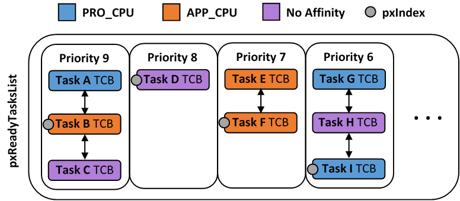
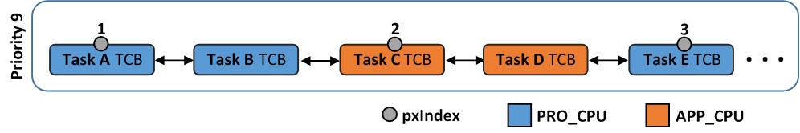

ESP-IDF FreeRTOS SMP Changes
============================

Overview
--------

The vanilla FreeRTOS is designed to run on a single core. However the ESP32 is 
dual core containing a Protocol CPU (known as **CPU 0** or **PRO_CPU**) and an 
Application CPU (known as **CPU 1** or **APP_CPU**). The two cores are 
identical in practice and share the same memory. This allows the two cores to 
run tasks interchangeably between them.

The ESP-IDF FreeRTOS is a modified version of vanilla FreeRTOS which supports 
symmetric multiprocessing (SMP). ESP-IDF FreeRTOS is based on the Xtensa port 
of FreeRTOS v8.2.0. This guide outlines the major differences between vanilla 
FreeRTOS and ESP-IDF FreeRTOS. The API reference for vanilla FreeRTOS can be 
found via http://www.freertos.org/a00106.html

:ref:`backported-features`: Although ESP-IDF FreeRTOS is based on the Xtensa 
port of FreeRTOS v8.2.0, a number of FreeRTOS v9.0.0 features have been backported
to ESP-IDF.

:ref:`tasks-and-task-creation`: Use :cpp:func:`xTaskCreatePinnedToCore` or 
:cpp:func:`xTaskCreateStaticPinnedToCore` to create tasks in ESP-IDF FreeRTOS. The 
last parameter of the two functions is ``xCoreID``. This parameter specifies 
which core the task is pinned to. Acceptable values are ``0`` for **PRO_CPU**, 
``1`` for **APP_CPU**, or ``tskNO_AFFINITY`` which allows the task to run on
both.

:ref:`round-robin-scheduling`: The ESP-IDF FreeRTOS scheduler will skip tasks when 
implementing Round-Robin scheduling between multiple tasks in the Ready state 
that are of the same priority. To avoid this behavior, ensure that those tasks either 
enter a blocked state, or are distributed across a wider range of priorities.

:ref:`scheduler-suspension`: Suspending the scheduler in ESP-IDF FreeRTOS will only 
affect the scheduler on the the calling core. In other words, calling 
:cpp:func:`vTaskSuspendAll` on **PRO_CPU** will not prevent **APP_CPU** from scheduling, and
vice versa. Use critical sections or semaphores instead for simultaneous
access protection.

:ref:`tick-interrupt-synchronicity`: Tick interrupts of **PRO_CPU** and **APP_CPU** 
are not synchronized. Do not expect to use :cpp:func:`vTaskDelay` or 
:cpp:func:`vTaskDelayUntil` as an accurate method of synchronizing task execution 
between the two cores. Use a counting semaphore instead as their context 
switches are not tied to tick interrupts due to preemption.

:ref:`critical-sections`: In ESP-IDF FreeRTOS, critical sections are implemented using
mutexes. Entering critical sections involve taking a mutex, then disabling the 
scheduler and interrupts of the calling core. However the other core is left 
unaffected. If the other core attemps to take same mutex, it will spin until
the calling core has released the mutex by exiting the critical section.

:ref:`floating-points`: The ESP32 supports hardware acceleration of single
precision floating point arithmetic (``float``). However the use of hardware
acceleration leads to some behavioral restrictions in ESP-IDF FreeRTOS.
Therefore, tasks that utilize ``float`` will automatically be pinned to a core if 
not done so already. Furthermore, ``float`` cannot be used in interrupt service 
routines.

:ref:`task-deletion`: Task deletion behavior has been backported from FreeRTOS 
v9.0.0 and modified to be SMP compatible. Task memory will be freed immediately 
when :cpp:func:`vTaskDelete` is called to delete a task that is not currently running 
and not pinned to the other core. Otherwise, freeing of task memory will still 
be delegated to the Idle Task.

:ref:`deletion-callbacks`: ESP-IDF FreeRTOS has backported the Thread Local 
Storage Pointers (TLSP) feature. However the extra feature of Deletion Callbacks has been
added. Deletion callbacks are called automatically during task deletion and are
used to free memory pointed to by TLSP. Call 
:cpp:func:`vTaskSetThreadLocalStoragePointerAndDelCallback()` to set TLSP and Deletion
Callbacks.

:ref:`FreeRTOS Hooks<hooks_api_reference>`: Vanilla FreeRTOS Hooks were not designed for SMP.
ESP-IDF provides its own Idle and Tick Hooks in addition to the Vanilla FreeRTOS
hooks. For full details, see the ESP-IDF Hooks API Reference.

:ref:`esp-idf-freertos-configuration`: Several aspects of ESP-IDF FreeRTOS can be 
configured using ``make meunconfig`` such as running ESP-IDF in Unicore Mode,
or configuring the number of Thread Local Storage Pointers each task will have.

.. _backported-features:

Backported Features
-------------------

The following features have been backported from FreeRTOS v9.0.0 to ESP-IDF.

Static Alocation
^^^^^^^^^^^^^^^^^

This feature has been backported from FreeRTOS v9.0.0 to ESP-IDF. The 
:ref:`CONFIG_SUPPORT_STATIC_ALLOCATION` option must be enabled in `menuconfig`
in order for static allocation functions to be available. Once enabled, the 
following functions can be called...

 - :cpp:func:`xTaskCreateStatic` (see :ref:`backporting-notes` below)
 - :c:macro:`xQueueCreateStatic`
 - :c:macro:`xSemaphoreCreateBinaryStatic`
 - :c:macro:`xSemaphoreCreateCountingStatic`
 - :c:macro:`xSemaphoreCreateMutexStatic`
 - :c:macro:`xSemaphoreCreateRecursiveMutexStatic`
 - :cpp:func:`xTimerCreateStatic`  (see :ref:`backporting-notes` below)
 - :cpp:func:`xEventGroupCreateStatic`

Other Features
^^^^^^^^^^^^^^

 - :cpp:func:`vTaskSetThreadLocalStoragePointer` (see :ref:`backporting-notes` below)
 - :cpp:func:`pvTaskGetThreadLocalStoragePointer` (see :ref:`backporting-notes` below)
 - :cpp:func:`vTimerSetTimerID`
 - :cpp:func:`xTimerGetPeriod`
 - :cpp:func:`xTimerGetExpiryTime`
 - :cpp:func:`pcQueueGetName`
 - :c:macro:`uxSemaphoreGetCount`

.. _backporting-notes:

Backporting Notes
^^^^^^^^^^^^^^^^^

**1)** :cpp:func:`xTaskCreateStatic` has been made SMP compatible in a similar 
fashion to :cpp:func:`xTaskCreate` (see :ref:`tasks-and-task-creation`). Therefore 
:cpp:func:`xTaskCreateStaticPinnedToCore` can also be called.

**2)** Although vanilla FreeRTOS allows the Timer feature's daemon task to 
be statically allocated, the daemon task is always dynamically allocated in 
ESP-IDF. Therefore ``vApplicationGetTimerTaskMemory`` **does not** need to be 
defined when using statically allocated timers in ESP-IDF FreeRTOS.

**3)** The Thread Local Storage Pointer feature has been modified in ESP-IDF
FreeRTOS to include Deletion Callbacks (see :ref:`deletion-callbacks`). Therefore
the function :cpp:func:`vTaskSetThreadLocalStoragePointerAndDelCallback` can also be 
called.

.. _tasks-and-task-creation:

Tasks and Task Creation
-----------------------

Tasks in ESP-IDF FreeRTOS are designed to run on a particular core, therefore 
two new task creation functions have been added to ESP-IDF FreeRTOS by 
appending ``PinnedToCore`` to the names of the task creation functions in 
vanilla FreeRTOS. The vanilla FreeRTOS functions of :cpp:func:`xTaskCreate`
and :cpp:func:`xTaskCreateStatic` have led to the addition of 
:cpp:func:`xTaskCreatePinnedToCore` and :cpp:func:`xTaskCreateStaticPinnedToCore` in 
ESP-IDF FreeRTOS (see :ref:`backported-features`).

For more details see :component_file:`freertos/task.c`

The ESP-IDF FreeRTOS task creation functions are nearly identical to their 
vanilla counterparts with the exception of the extra parameter known as 
``xCoreID``. This parameter specifies the core on which the task should run on 
and can be one of the following values.

    -	``0`` pins the task to **PRO_CPU**
    -	``1`` pins the task to **APP_CPU**
    -	``tskNO_AFFINITY`` allows the task to be run on both CPUs

For example ``xTaskCreatePinnedToCore(tsk_callback, “APP_CPU Task”, 1000, NULL, 10, NULL, 1)`` 
creates a task of priority 10 that is pinned to **APP_CPU** with a stack size 
of 1000 bytes. It should be noted that the ``uxStackDepth`` parameter in 
vanilla FreeRTOS specifies a task’s stack depth in terms of the number of 
words, whereas ESP-IDF FreeRTOS specifies the stack depth in terms of bytes.

Note that the vanilla FreeRTOS functions :cpp:func:`xTaskCreate` and 
:cpp:func:`xTaskCreateStatic` have been defined in ESP-IDF FreeRTOS as inline functions which call 
:cpp:func:`xTaskCreatePinnedToCore` and :cpp:func:`xTaskCreateStaticPinnedToCore`
respectively with ``tskNO_AFFINITY`` as the ``xCoreID`` value. 

Each Task Control Block (TCB) in ESP-IDF stores the ``xCoreID`` as a member. 
Hence when each core calls the scheduler to select a task to run, the 
``xCoreID`` member will allow the scheduler to determine if a given task is  
permitted to run on the core that called it.

Scheduling
----------

The vanilla FreeRTOS implements scheduling in the ``vTaskSwitchContext()`` 
function. This function is responsible for selecting the highest priority task
to run from a list of tasks in the Ready state known as the Ready Tasks List 
(described in the next section). In ESP-IDF FreeRTOS, each core will call 
``vTaskSwitchContext()`` independently to select a task to run from the 
Ready Tasks List which is shared between both cores. There are several 
differences in scheduling behavior between vanilla and ESP-IDF FreeRTOS such as 
differences in Round Robin scheduling, scheduler suspension, and tick interrupt 
synchronicity. 

.. _round-robin-scheduling:

Round Robin Scheduling
^^^^^^^^^^^^^^^^^^^^^^

Given multiple tasks in the Ready state and of the same priority, vanilla 
FreeRTOS implements Round Robin scheduling between each task. This will result
in running those tasks in turn each time the scheduler is called 
(e.g. every tick interrupt). On the other hand, the ESP-IDF FreeRTOS scheduler 
may skip tasks when Round Robin scheduling multiple Ready state tasks of the 
same priority.

The issue of skipping tasks during Round Robin scheduling arises from the way 
the Ready Tasks List is implemented in FreeRTOS. In vanilla FreeRTOS, 
``pxReadyTasksList`` is used to store a list of tasks that are in the Ready 
state. The list is implemented as an array of length ``configMAX_PRIORITIES`` 
where each element of the array is a linked list. Each linked list is of type 
``List_t`` and contains TCBs of tasks of the same priority that are in the 
Ready state. The following diagram illustrates the ``pxReadyTasksList`` 
structure.

    
    Illustration of FreeRTOS Ready Task List Data Structure 

Each linked list also contains a ``pxIndex`` which points to the last TCB 
returned when the list was queried. This index allows the ``vTaskSwitchContext()`` 
to start traversing the list at the TCB immediately after ``pxIndex`` hence 
implementing Round Robin Scheduling between tasks of the same priority.

In ESP-IDF FreeRTOS, the Ready Tasks List is shared between cores hence 
``pxReadyTasksList`` will contain tasks pinned to different cores. When a core 
calls the scheduler, it is able to look at the ``xCoreID`` member of each TCB 
in the list to determine if a task is allowed to run on calling the core. The 
ESP-IDF FreeRTOS ``pxReadyTasksList`` is illustrated below.

    
    Illustration of FreeRTOS Ready Task List Data Structure in ESP-IDF
    
Therefore when **PRO_CPU** calls the scheduler, it will only consider the tasks 
in blue or purple. Whereas when **APP_CPU** calls the scheduler, it will only 
consider the tasks in orange or purple.

Although each TCB has an ``xCoreID`` in ESP-IDF FreeRTOS, the linked list of 
each priority only has a single ``pxIndex``. Therefore when the scheduler is 
called from a particular core and traverses the linked list, it will skip all 
TCBs pinned to the other core and point the pxIndex at the selected task. If 
the other core then calls the scheduler, it will traverse the linked list 
starting at the TCB immediately after ``pxIndex``. Therefore, TCBs skipped on
the previous scheduler call from the other core would not be considered on the 
current scheduler call. This issue is demonstrated in the following 
illustration.

    
    Illustration of pxIndex behavior in ESP-IDF FreeRTOS

Referring to the illustration above, assume that priority 9 is the highest 
priority, and none of the tasks in priority 9 will block hence will always be 
either in the running or Ready state.

1)	**PRO_CPU** calls the scheduler and selects Task A to run, hence moves 
``pxIndex`` to point to Task A

2)	**APP_CPU** calls the scheduler and starts traversing from the task after 
``pxIndex`` which is Task B. However Task B is not selected to run as it is not 
pinned to **APP_CPU** hence it is skipped and Task C is selected instead. 
``pxIndex`` now points to Task C

3)	**PRO_CPU** calls the scheduler and starts traversing from Task D. It skips 
Task D and selects Task E to run and points ``pxIndex`` to Task E. Notice that 
Task B isn’t traversed because it was skipped the last time **APP_CPU** called 
the scheduler to traverse the list.

4)	The same situation with Task D will occur if **APP_CPU** calls the 
scheduler again as ``pxIndex`` now points to Task E

One solution to the issue of task skipping is to ensure that every task will
enter a blocked state so that they are removed from the Ready Task List.
Another solution is to distribute tasks across multiple priorities such that 
a given priority will not be assigned multiple tasks that are pinned to 
different cores.

.. _scheduler-suspension:

Scheduler Suspension
^^^^^^^^^^^^^^^^^^^^

In vanilla FreeRTOS, suspending the scheduler via :cpp:func:`vTaskSuspendAll` will 
prevent calls of ``vTaskSwitchContext`` from context switching until the 
scheduler has been resumed with :cpp:func:`xTaskResumeAll`. However servicing ISRs 
are still permitted. Therefore any changes in task states as a result from the
current running task or ISRSs will not be executed until the scheduler is 
resumed. Scheduler suspension in vanilla FreeRTOS is a common protection method 
against simultaneous access of data shared between tasks, whilst still allowing 
ISRs to be serviced.

In ESP-IDF FreeRTOS, :cpp:func:`xTaskResumeAll` will only prevent calls of 
``vTaskSwitchContext()`` from switching contexts on the core that called for the
suspension. Hence if **PRO_CPU** calls :cpp:func:`vTaskSuspendAll`, **APP_CPU** will 
still be able to switch contexts. If data is shared between tasks that are 
pinned to different cores, scheduler suspension is **NOT** a valid method of 
protection against simultaneous access. Consider using critical sections 
(disables interrupts) or semaphores (does not disable interrupts) instead when 
protecting shared resources in ESP-IDF FreeRTOS.

In general, it's better to use other RTOS primitives like mutex semaphores to protect
against data shared between tasks, rather than :cpp:func:`vTaskSuspendAll`.

.. _tick-interrupt-synchronicity:

Tick Interrupt Synchronicity 
^^^^^^^^^^^^^^^^^^^^^^^^^^^^

In ESP-IDF FreeRTOS, tasks on different cores that unblock on the same tick 
count might not run at exactly the same time due to the scheduler calls from 
each core being independent, and the tick interrupts to each core being 
unsynchronized.

In vanilla FreeRTOS the tick interrupt triggers a call to 
:cpp:func:`xTaskIncrementTick` which is responsible for incrementing the tick 
counter, checking if tasks which have called :cpp:func:`vTaskDelay` have fulfilled 
their delay period, and moving those tasks from the Delayed Task List to the 
Ready Task List. The tick interrupt will then call the scheduler if a context 
switch is necessary.

In ESP-IDF FreeRTOS, delayed tasks are unblocked with reference to the tick 
interrupt on PRO_CPU as PRO_CPU is responsible for incrementing the shared tick 
count. However tick interrupts to each core might not be synchronized (same 
frequency but out of phase) hence when PRO_CPU receives a tick interrupt, 
APP_CPU might not have received it yet. Therefore if multiple tasks of the same 
priority are unblocked on the same tick count, the task pinned to PRO_CPU will 
run immediately whereas the task pinned to APP_CPU must wait until APP_CPU 
receives its out of sync tick interrupt. Upon receiving the tick interrupt, 
APP_CPU will then call for a context switch and finally switches contexts to
the newly unblocked task.

Therefore, task delays should **NOT** be used as a method of synchronization 
between tasks in ESP-IDF FreeRTOS. Instead, consider using a counting semaphore 
to unblock multiple tasks at the same time.

.. _critical-sections:

Critical Sections & Disabling Interrupts
----------------------------------------

Vanilla FreeRTOS implements critical sections in ``vTaskEnterCritical`` which 
disables the scheduler and calls ``portDISABLE_INTERRUPTS``. This prevents 
context switches and servicing of ISRs during a critical section. Therefore, 
critical sections are used as a valid protection method against simultaneous 
access in vanilla FreeRTOS.

On the other hand, the ESP32 has no hardware method for cores to disable each 
other’s interrupts. Calling ``portDISABLE_INTERRUPTS()`` will have no effect on 
the interrupts of the other core. Therefore, disabling interrupts is **NOT** 
a valid protection method against simultaneous access to shared data as it 
leaves the other core free to access the data even if the current core has 
disabled its own interrupts. 

For this reason, ESP-IDF FreeRTOS implements critical sections using mutexes, 
and calls to enter or exit a critical must provide a mutex that is associated 
with a shared resource requiring access protection. When entering a critical 
section in ESP-IDF FreeRTOS, the calling core will disable its scheduler and 
interrupts similar to the vanilla FreeRTOS implementation. However, the calling 
core will also take the mutex whilst the other core is left unaffected during 
the critical section. If the other core attempts to take the same mutex, it 
will spin until the mutex is released. Therefore, the ESP-IDF FreeRTOS 
implementation of critical sections allows a core to have protected access to a
shared resource without disabling the other core. The other core will only be 
affected if it tries to concurrently access the same resource.

The ESP-IDF FreeRTOS critical section functions have been modified as follows…

 - ``taskENTER_CRITICAL(mux)``, ``taskENTER_CRITICAL_ISR(mux)``, 
   ``portENTER_CRITICAL(mux)``, ``portENTER_CRITICAL_ISR(mux)`` are all macro 
   defined to call :cpp:func:`vTaskEnterCritical` 

 - ``taskEXIT_CRITICAL(mux)``, ``taskEXIT_CRITICAL_ISR(mux)``, 
   ``portEXIT_CRITICAL(mux)``, ``portEXIT_CRITICAL_ISR(mux)`` are all macro 
   defined to call :cpp:func:`vTaskExitCritical`

For more details see :component_file:`freertos/include/freertos/portmacro.h` 
and :component_file:`freertos/task.c`

It should be noted that when modifying vanilla FreeRTOS code to be ESP-IDF 
FreeRTOS compatible, it is trivial to modify the type of critical section 
called as they are all defined to call the same function. As long as the same 
mutex is provided upon entering and exiting, the type of call should not 
matter.

.. _floating-points:

Floating Point Aritmetic
------------------------

The ESP32 supports hardware acceleration of single precision floating point
arithmetic (``float``) via Floating Point Units (FPU, also known as coprocessors) 
attached to each core. The use of the FPUs imposes some behavioral restrictions 
on ESP-IDF FreeRTOS.

ESP-IDF FreeRTOS implements Lazy Context Switching for FPUs. In other words,
the state of a core's FPU registers are not immediately saved when a context 
switch occurs. Therefore, tasks that utilize ``float`` must be pinned to a
particular core upon creation. If not, ESP-IDF FreeRTOS will automatically pin
the task in question to whichever core the task was running on upon the task's 
first use of ``float``. Likewise due to Lazy Context Switching, interrupt service 
routines must also not use ``float``.

ESP32 does not support hardware acceleration for double precision floating point
arithmetic (``double``). Instead ``double`` is implemented via software hence the 
behavioral restrictions with regards to ``float`` do not apply to ``double``. Note
that due to the lack of hardware acceleration, ``double`` operations may consume
significantly larger amount of CPU time in comparison to ``float``.

.. _task-deletion:

Task Deletion
-------------

FreeRTOS task deletion prior to v9.0.0 delegated the freeing of task memory 
entirely to the Idle Task. Currently, the freeing of task memory will occur
immediately (within :cpp:func:`vTaskDelete`) if the task being deleted is not currently 
running or is not pinned to the other core (with respect to the core 
:cpp:func:`vTaskDelete` is called on). TLSP deletion callbacks will also run immediately
if the same conditions are met.

However, calling :cpp:func:`vTaskDelete` to delete a task that is either currently 
running or pinned to the other core will still result in the freeing of memory 
being delegated to the Idle Task.

.. _deletion-callbacks:

Thread Local Storage Pointers & Deletion Callbacks
--------------------------------------------------

Thread Local Storage Pointers (TLSP) are pointers stored directly in the TCB. 
TLSP allow each task to have its own unique set of pointers to data structures. 
However task deletion behavior in vanilla FreeRTOS does not automatically 
free the memory pointed to by TLSP. Therefore if the memory pointed to by
TLSP is not explicitly freed by the user before task deletion, memory leak will 
occur.

ESP-IDF FreeRTOS provides the added feature of Deletion Callbacks. Deletion 
Callbacks are called automatically during task deletion to free memory pointed
to by TLSP. Each TLSP can have its own Deletion Callback. Note that due to the
to :ref:`task-deletion` behavior, there can be instances where Deletion 
Callbacks are called in the context of the Idle Tasks. Therefore Deletion
Callbacks **should never attempt to block** and critical sections should be kept
as short as possible to minimize priority inversion.

Deletion callbacks are of type
``void (*TlsDeleteCallbackFunction_t)( int, void * )`` where the first parameter
is the index number of the associated TLSP, and the second parameter is the 
TLSP itself.

Deletion callbacks are set alongside TLSP by calling 
:cpp:func:`vTaskSetThreadLocalStoragePointerAndDelCallback`. Calling the vanilla 
FreeRTOS function :cpp:func:`vTaskSetThreadLocalStoragePointer` will simply set the
TLSP's associated Deletion Callback to `NULL` meaning that no callback will be
called for that TLSP during task deletion. If a deletion callback is `NULL`,
users should manually free the memory pointed to by the associated TLSP before 
task deletion in order to avoid memory leak.

:ref:`CONFIG_FREERTOS_THREAD_LOCAL_STORAGE_POINTERS` in menuconfig can be used
to configure the number TLSP and Deletion Callbacks a TCB will have.

For more details see :doc:`FreeRTOS API reference<../api-reference/system/freertos>`.

.. _esp-idf-freertos-configuration:

Configuring ESP-IDF FreeRTOS
----------------------------

The ESP-IDF FreeRTOS can be configured using ``make menuconfig`` under 
``Component_Config/FreeRTOS``. The following section highlights some of the
ESP-IDF FreeRTOS configuration options. For a full list of ESP-IDF
FreeRTOS configurations, see :doc:`FreeRTOS <../api-reference/kconfig>`

:ref:`CONFIG_FREERTOS_UNICORE` will run ESP-IDF FreeRTOS only
on **PRO_CPU**. Note that this is **not equivalent to running vanilla 
FreeRTOS**. Behaviors of multiple components in ESP-IDF will be modified such 
as :component_file:`esp32/cpu_start.c`. For more details regarding the 
effects of running ESP-IDF FreeRTOS on a single core, search for 
occurences of ``CONFIG_FREERTOS_UNICORE`` in the ESP-IDF components.
    
:ref:`CONFIG_FREERTOS_THREAD_LOCAL_STORAGE_POINTERS` will define the 
number of Thread Local Storage Pointers each task will have in ESP-IDF 
FreeRTOS.

:ref:`CONFIG_SUPPORT_STATIC_ALLOCATION` will enable the backported
functionality of :cpp:func:`xTaskCreateStaticPinnedToCore` in ESP-IDF FreeRTOS
    
:ref:`CONFIG_FREERTOS_ASSERT_ON_UNTESTED_FUNCTION` will trigger a halt in
particular functions in ESP-IDF FreeRTOS which have not been fully tested
in an SMP context.

