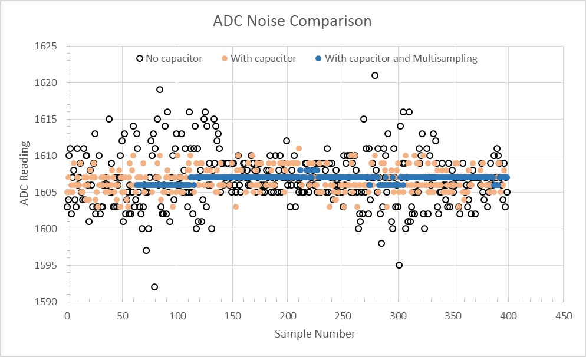
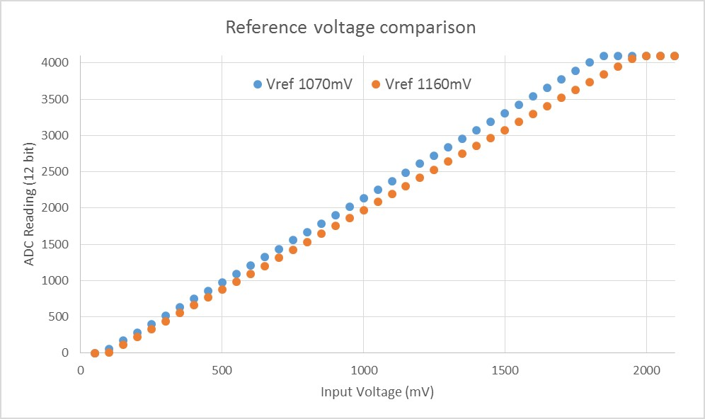

Analog to Digital Converter
===========================

Overview
--------

ESP32 integrates two 12-bit SAR (`Successive Approximation Register <https://en.wikipedia.org/wiki/Successive_approximation_ADC>`_) ADCs (Analog to Digital Converters) and supports measurements on 18 channels (analog enabled pins). Some of these pins can be used to build a programmable gain amplifier which is used for the measurement of small analog signals.

The ADC driver API supports ADC1 (9 channels, attached to GPIOs 32 - 39), and ADC2 (10 channels, attached to GPIOs 0, 2, 4, 12 - 15 and 25 - 27).
However, there're some restrictions for the application to use ADC2:

1. The application can use ADC2 only when Wi-Fi driver is not started, since the ADC is also used by the Wi-Fi driver, which has higher priority.
2. Some of the ADC2 pins are used as strapping pins (GPIO 0, 2, 15), so they cannot be used freely. For examples, for official Develop Kits:

  - `ESP32 Core Board V2 / ESP32 DevKitC <http://esp-idf.readthedocs.io/en/latest/hw-reference/modules-and-boards.html#esp32-core-board-v2-esp32-devkitc>`_: GPIO 0 cannot be used due to external auto program circuits.
  - `ESP-WROVER-KIT V3 <http://esp-idf.readthedocs.io/en/latest/hw-reference/modules-and-boards.html#esp-wrover-kit-v3>`_: GPIO 0, 2, 4 and 15 cannot be used due to external connections for different purposes.

Configuration and Reading ADC
-----------------------------

The ADC should be configured before reading is taken.

 - For ADC1, configure desired precision and attenuation by calling functions :cpp:func:`adc1_config_width` and :cpp:func:`adc1_config_channel_atten`. 
 - For ADC2, configure the attenuation by :cpp:func:`adc2_config_channel_atten`. The reading width of ADC2 is configured every time you take the reading.
 
Attenuation configuration is done per channel, see :cpp:type:`adc1_channel_t` and :cpp:type:`adc2_channel_t`, set as a parameter of above functions.

Then it is possible to read ADC conversion result with :cpp:func:`adc1_get_raw` and :cpp:func:`adc2_get_raw`. Reading width of ADC2 should be set as a parameter of :cpp:func:`adc2_get_raw` instead of in the configuration functions.

.. note:: Since the ADC2 is shared with the WIFI module, which has higher priority, reading operation of :cpp:func:`adc2_get_raw` will fail between :cpp:func:`esp_wifi_start()` and :cpp:func:`esp_wifi_stop()`. Use the return code to see whether the reading is successful.

It is also possible to read the internal hall effect sensor via ADC1 by calling dedicated function :cpp:func:`hall_sensor_read`. Note that even the hall sensor is internal to ESP32, reading from it uses channels 0 and 3 of ADC1 (GPIO 36 and 39). Do not connect anything else to these pins and do not change their configuration. Otherwise it may affect the measurement of low value signal from the sesnor.

This API provides convenient way to configure ADC1 for reading from :doc:`ULP <../../api-guides/ulp>`. To do so, call function :cpp:func:`adc1_ulp_enable` and then set precision and attenuation as discussed above.

There is another specific function :cpp:func:`adc2_vref_to_gpio` used to route internal reference voltage to a GPIO pin. It comes handy to calibrate ADC reading and this is discussed in section :ref:`adc-api-adc-calibration`.

Application Examples
--------------------

Reading voltage on ADC1 channel 0 (GPIO 36)::

    #include <driver/adc.h>

    ...

        adc1_config_width(ADC_WIDTH_BIT_12);
        adc1_config_channel_atten(ADC1_CHANNEL_0,ADC_ATTEN_DB_0);
        int val = adc1_get_raw(ADC1_CHANNEL_0);

The input voltage in above example is from 0 to 1.1V (0 dB attenuation). The input range can be extended by setting higher attenuation, see :cpp:type:`adc_atten_t`.
An example using the ADC driver including calibration (discussed below) is available in esp-idf: :example:`peripherals/adc`

Reading voltage on ADC2 channel 7 (GPIO 27)::

    #include <driver/adc.h>

    ...
        
        int read_raw;
        adc2_config_channel_atten( ADC2_CHANNEL_7, ADC_ATTEN_0db );

        esp_err_t r = adc2_get_raw( ADC2_CHANNEL_7, ADC_WIDTH_12Bit, &read_raw);
        if ( r == ESP_OK ) {
            printf("%d\n", read_raw );
        } else if ( r == ESP_ERR_TIMEOUT ) {
            printf("ADC2 used by Wi-Fi.\n");
        }

The reading may fail due to collision with Wi-Fi, should check it.
An example using the ADC2 driver to read the output of DAC is available in esp-idf: :example:`peripherals/adc2`

Reading the internal hall effect sensor::

    #include <driver/adc.h>

    ...

        adc1_config_width(ADC_WIDTH_BIT_12);
        int val = hall_sensor_read();

The value read in both these examples is 12 bits wide (range 0-4095).

.. _adc-api-adc-calibration:

Minimizing Noise
----------------

The ESP32 ADC can be sensitive to noise leading to large discrepancies in ADC readings. To minimize noise, users may connect a 0.1uF capacitor to the ADC input pad in use. Multisampling may also be used to further mitigate the effects of noise.

    
    Graph illustrating noise mitigation using capacitor and multisampling of 64 samples.

ADC Calibration
---------------

The :component_file:`esp_adc_cal/include/esp_adc_cal.h` API provides functions to correct for differences in measured voltages caused by variation of ADC reference voltages (Vref) between chips. Per design the ADC reference voltage is 1100mV, however the true reference voltage can range from 1000mV to 1200mV amongst different ESP32s.

    
    Graph illustrating effect of differing reference voltages on the ADC voltage curve.

Correcting ADC readings using this API involves characterizing one of the ADCs at a given attenuation to obtain a characteristics curve (ADC-Voltage curve) that takes into account the difference in ADC reference voltage. The characteristics curve is in the form of ``y = coeff_a * x + coeff_b`` and is used to convert ADC readings to voltages in mV. Calculation of the characteristics curve is based on calibration values which can be stored in eFuse or provided by the user.

Calibration Values
^^^^^^^^^^^^^^^^^^

Calibration values are used to generate characteristic curves that account for the unique ADC reference voltage of a particular ESP32. There are currently three sources of calibration values. The availability of these calibration values will depend on the type and production date of the ESP32 chip/module.

**Two Point** values represent each of the ADCs’ readings at 150mV and 850mV. These values are measured and burned into eFuse ``BLOCK3`` during factory calibration.

**eFuse Vref** represents the true ADC reference voltage. This value is measured and burned into eFuse ``BLOCK0`` during factory calibration. 

**Default Vref** is an estimate of the ADC reference voltage provided by the user as a parameter during characterization. If Two Point or eFuse Vref values are unavailable, **Default Vref** will be used.

Application Example
^^^^^^^^^^^^^^^^^^^

For a full example see esp-idf: :example:`peripherals/adc`

Characterizing an ADC at a particular attenuation::

    #include "driver/adc.h"
    #include "esp_adc_cal.h"
    
    ...
    
        //Characterize ADC at particular atten
        esp_adc_cal_characteristics_t *adc_chars = calloc(1, sizeof(esp_adc_cal_characteristics_t));
        esp_adc_cal_value_t val_type = esp_adc_cal_characterize(unit, atten, ADC_WIDTH_BIT_12, DEFAULT_VREF, adc_chars);
        //Check type of calibration value used to characterize ADC
        if (val_type == ESP_ADC_CAL_VAL_EFUSE_VREF) {
            printf("eFuse Vref");
        } else if (val_type == ESP_ADC_CAL_VAL_EFUSE_TP) {
            printf("Two Point");
        } else {
            printf("Default");
        }

Reading an ADC then converting the reading to a voltage::

    #include "driver/adc.h"
    #include "esp_adc_cal.h"
    
    ...
        uint32_t reading =  adc1_get_raw(ADC1_CHANNEL_5);
        uint32_t voltage = esp_adc_cal_raw_to_voltage(reading, adc_chars);
        
Routing ADC reference voltage to GPIO, so it can be manually measured (for **Default Vref**)::

    #include "driver/adc.h"
    
    ...

        esp_err_t status = adc2_vref_to_gpio(GPIO_NUM_25);
        if (status == ESP_OK) {
            printf("v_ref routed to GPIO\n");
        } else {
            printf("failed to route v_ref\n");
        }

GPIO Lookup Macros
------------------

There are macros available to specify the GPIO number of a ADC channel, or vice versa.
e.g.

1. ``ADC1_CHANNEL_0_GPIO_NUM`` is the GPIO number of ADC1 channel 0 (36);
2. ``ADC1_GPIO32_CHANNEL`` is the ADC1 channel number of GPIO 32 (ADC1 channel 4).

API Reference
-------------

This reference covers three components:

* :ref:`adc-api-reference-adc-driver`
* :ref:`adc-api-reference-adc-calibration`
* :ref:`adc-api-reference-gpio-lookup-macros`

.. _adc-api-reference-adc-driver:

ADC driver
^^^^^^^^^^

.. include:: /_build/inc/adc.inc

.. _adc-api-reference-adc-calibration:

ADC Calibration
^^^^^^^^^^^^^^^

.. include:: /_build/inc/esp_adc_cal.inc

.. _adc-api-reference-gpio-lookup-macros:

GPIO Lookup Macros
^^^^^^^^^^^^^^^^^^

.. include:: /_build/inc/adc_channel.inc
