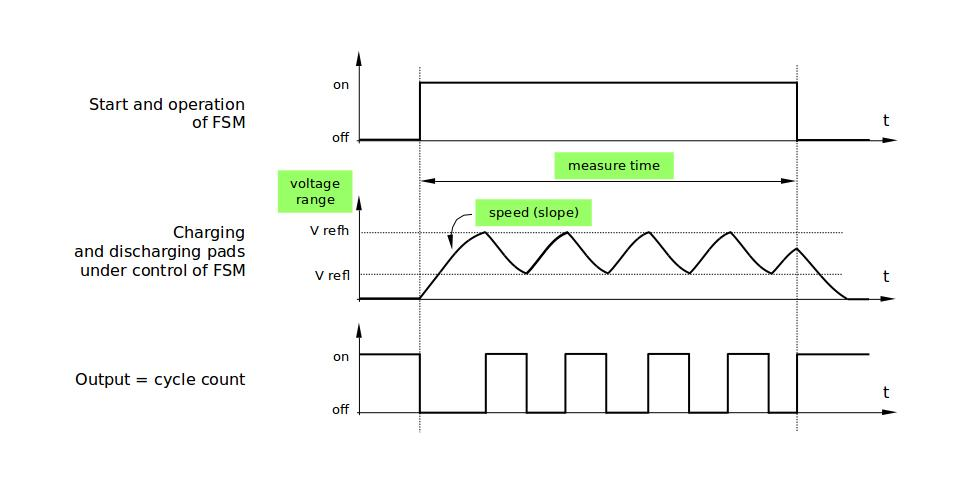

Touch Sensor
============

Introduction
------------

A touch-sensor system is built on a substrate which carries electrodes and relevant connections under a protective flat surface. When a user touches the surface, the capacitance variation is triggered and a binary signal is generated to indicate whether the touch is valid.

ESP32 can provide up to 10 capacitive touch pads / GPIOs. The sensing pads can be arranged in different combinations (e.g. matrix, slider), so that a larger area or more points can be detected. The touch pad sensing process is under the control of a hardware-implemented finite-state machine (FSM) which is initiated by software or a dedicated hardware timer.

Design, operation and control registers of touch sensor are discussed in `ESP32 Technical Reference Manual <https://espressif.com/sites/default/files/documentation/esp32_technical_reference_manual_en.pdf>`_ (PDF). Please refer to it for additional details how this subsystem works.

Functionality Overview
----------------------

Description of API is broken down into groups of functions to provide quick overview of features like:

- Initialization of touch pad driver
- Configuration of touch pad GPIO pins
- Taking measurements
- Adjusting parameters of measurements
- Filtering measurements
- Touch detection methods
- Setting up interrupts to report touch detection
- Waking up from sleep mode on interrupt

For detailed description of particular function please go to section :ref:`touch_pad-api-reference`. Practical implementation of this API is covered in section :ref:`touch_pad-api-examples`.

Initialization
^^^^^^^^^^^^^^

Touch pad driver should be initialized before use by calling function :cpp:func:`touch_pad_init`. This function sets several ``.._DEFAULT`` driver parameters listed in :ref:`touch_pad-api-reference` under "Macros". It also clears information what pads have been touched before (if any) and disables interrupts. 

If not required anymore, driver can be disabled by calling :cpp:func:`touch_pad_deinit`.

Configuration
^^^^^^^^^^^^^

Enabling of touch sensor functionality for particular GPIO is done with :cpp:func:`touch_pad_config`. 

The function :cpp:func:`touch_pad_set_fsm_mode` is used to select whether touch pad measurement (operated by FSM) is started automatically by hardware timer, or by software. If software mode is selected, then use :cpp:func:`touch_pad_sw_start` to start of the FSM.

Touch State Measurements
^^^^^^^^^^^^^^^^^^^^^^^^

The following two functions come handy to read raw or filtered measurements from the sensor:

* :cpp:func:`touch_pad_read`
* :cpp:func:`touch_pad_read_filtered`

They may be used to characterize particular touch pad design by checking the range of sensor readings when a pad is touched or released. This information can be then used to establish the touch threshold. 

.. note::

    Start and configure filter before using :cpp:func:`touch_pad_read_filtered` by calling specific filter functions described down below.

To see how to use both read functions check :example:`peripherals/touch_pad_read` application example.

Optimization of Measurements
^^^^^^^^^^^^^^^^^^^^^^^^^^^^

Touch sensor has several configurable parameters to match characteristics of particular touch pad design. For instance, to sense smaller capacity changes, it is possible to narrow the reference voltage range within which the touch pads are charged / discharged. The high and low reference voltages are set using function :cpp:func:`touch_pad_set_voltage`. A positive side effect, besides ability to discern smaller capacity changes, will be reduction of power consumption for low power applications. A likely negative effect will be increase of measurement noise. If dynamic rage of obtained readings is still satisfactory, then further reduction of power consumption may be done by lowering the measurement time with :cpp:func:`touch_pad_set_meas_time`.

The following summarizes available measurement parameters and corresponding 'set' functions:

* Touch pad charge / discharge parameters:

    * voltage range: :cpp:func:`touch_pad_set_voltage`
    * speed (slope): :cpp:func:`touch_pad_set_cnt_mode`

* Measure time: :cpp:func:`touch_pad_set_meas_time`

Relationship between voltage range (high / low reference voltages), speed (slope) and measure time is shown on figure below. 

    Touch Pad - relationship between measurement parameters 

The last chart "Output" represents the touch sensor reading, i.e. the count of pulses collected within measure time.

All functions are provided in pairs to 'set' specific parameter and to 'get' the current parameter's value, e.g. :cpp:func:`touch_pad_set_voltage` and :cpp:func:`touch_pad_get_voltage`.

.. _touch_pad-api-filtering-of-measurements:

Filtering of Measurements
^^^^^^^^^^^^^^^^^^^^^^^^^

If measurements are noisy, you may filter them with provided API. The filter should be started before first use by calling :cpp:func:`touch_pad_filter_start`.

The filter type is IIR (Infinite Impulse Response) and it has configurable period that can be set with function :cpp:func:`touch_pad_set_filter_period`.

You can stop the filter with :cpp:func:`touch_pad_filter_stop`. If not required anymore, the filter may be deleted by invoking :cpp:func:`touch_pad_filter_delete`.

Touch Detection
^^^^^^^^^^^^^^^

Touch detection is implemented in ESP32's hardware basing on user configured threshold and raw measurements executed by FSM. Use function :cpp:func:`touch_pad_get_status` to check what pads have been touched and :cpp:func:`touch_pad_clear_status` to clear the touch status information. 

Hardware touch detection may be also wired to interrupts and this is described in next section. 

If measurements are noisy and capacity changes small, then hardware touch detection may be not reliable. To resolve this issue, instead of using hardware detection / provided interrupts, implement measurement filtering and perform touch detection in your own application. See :example:`peripherals/touch_pad_interrupt` for sample implementation of both methods of touch detection.

Touch Triggered Interrupts
^^^^^^^^^^^^^^^^^^^^^^^^^^

Before enabling an interrupt on touch detection, user should establish touch detection threshold. Use functions described above to read and display sensor measurements when pad is touched and released. Apply a filter when measurements are noisy and relative changes are small. Depending on your application and environmental conditions, test the influence of temperature and power supply voltage changes on measured values.

Once detection threshold is established, it may be set on initialization with :cpp:func:`touch_pad_config` or at the runtime with :cpp:func:`touch_pad_set_thresh`.

In next step configure how interrupts are triggered. They may be triggered below or above threshold and this is set with function :cpp:func:`touch_pad_set_trigger_mode`.

Finally configure and manage interrupt calls using the following functions:

* :cpp:func:`touch_pad_isr_register` / :cpp:func:`touch_pad_isr_deregister`
* :cpp:func:`touch_pad_intr_enable` / :cpp:func:`touch_pad_intr_disable`

When interrupts are operational, you can obtain information what particular pad triggered interrupt by invoking :cpp:func:`touch_pad_get_status` and clear pad status with :cpp:func:`touch_pad_clear_status`.

.. note::

    Interrupts on touch detection operate on raw / unfiltered measurements checked against user established threshold and are implemented in hardware. Enabling software filtering API (see :ref:`touch_pad-api-filtering-of-measurements`) does not affect this process.

Wakeup from Sleep Mode
^^^^^^^^^^^^^^^^^^^^^^

If touch pad interrupts are used to wakeup the chip from a sleep mode, then user can select certain configuration of pads (SET1 or both SET1 and SET2), that should be touched to trigger the interrupt and cause subsequent wakeup. To do so, use function :cpp:func:`touch_pad_set_trigger_source`.

Configuration of required bit patterns of pads may be managed for each 'SET' with:

* :cpp:func:`touch_pad_set_group_mask` / :cpp:func:`touch_pad_get_group_mask`
* :cpp:func:`touch_pad_clear_group_mask`

.. _touch_pad-api-examples:

Application Examples
--------------------

- Touch sensor read example: :example:`peripherals/touch_pad_read`.
- Touch sensor interrupt example: :example:`peripherals/touch_pad_interrupt`.

.. _touch_pad-api-reference:

API Reference
-------------

.. include:: /_build/inc/touch_pad.inc

