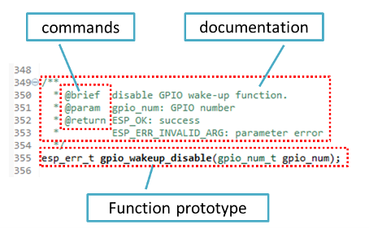
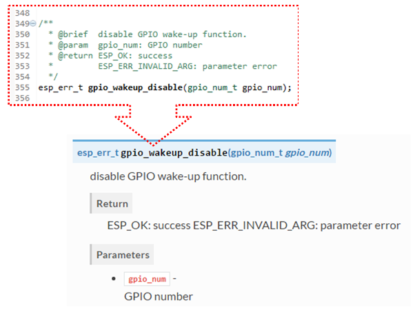

Documenting Code
================

The purpose of this description is to provide quick summary on documentation style used in `espressif/esp-idf`_ repository and how to add new documentation. 


Introduction
------------

When documenting code for this repository, please follow `Doxygen style <http://www.stack.nl/~dimitri/doxygen/manual/docblocks.html#specialblock>`_. You are doing it by inserting special commands, for instance ``@param``, into standard comments blocks, for example: ::

    /**
     * @param ratio this is oxygen to air ratio
     */

Doxygen is phrasing the code, extracting the commands together with subsequent text, and building documentation out of it.

Typical comment block, that contains documentation of a function, looks like below.


 
Doxygen supports couple of formatting styles. It also gives you great flexibility on level of details to include in documentation. To get familiar with available features, please check data reach and very well organized `Doxygen Manual <http://www.stack.nl/~dimitri/doxygen/manual/index.html>`_.


Why we need it?
---------------

The ultimate goal is to ensure that all the code is consistently documented, so we can use tools like `Sphinx <http://www.sphinx-doc.org/>`_ and `Breathe <https://breathe.readthedocs.io/>`_ to aid preparation and automatic updates of API documentation when the code changes. 

With these tools the above piece of code renders like below:




Go for it!
----------

When writing code for this repository, please follow guidelines below.

1. Document all building blocks of code: functions, structs, typedefs, enums, macros, etc. Provide enough information on purpose, functionality and limitations of documented items, as you would like to see them documented when reading the code by others.

2. Documentation of function should describe what this function does. If it accepts input parameters and returns some value, all of them should be explained.

3. Do not add a data type before parameter or any other characters besides spaces. All spaces and line breaks are compressed into a single space. If you like to break a line, then break it twice.

    .. image:: ../_static/doc-code-function.png
        :align: center
        :alt: Sample function documented inline and after rendering

4. If function has void input or does not return any value, then skip ``@param`` or ``@return``

    .. image:: ../_static/doc-code-void-function.png
        :align: center
        :alt: Sample void function documented inline and after rendering
 
5. When documenting a ``define`` as well as members of a ``struct`` or ``enum``, place specific comment like below after each member.

    .. image:: ../_static/doc-code-member.png
        :align: center
        :alt: Sample of member documentation inline and after rendering

6. To provide well formatted lists, break the line after command (like ``@return`` in example below). ::

    *
    * @return
    *    - ESP_OK if erase operation was successful
    *    - ESP_ERR_NVS_INVALID_HANDLE if handle has been closed or is NULL
    *    - ESP_ERR_NVS_READ_ONLY if handle was opened as read only
    *    - ESP_ERR_NVS_NOT_FOUND if the requested key doesn't exist
    *    - other error codes from the underlying storage driver
    *
 
7. Overview of functionality of documented header file, or group of files that make a library, should be placed in the same directory in a separate ``README.rst`` file. If directory contains header files for different APIs, then the file name should be ``apiname-readme.rst``.


Go one extra mile
-----------------

There is couple of tips, how you can make your documentation even better and more useful to the reader.

1. Add code snippets to illustrate implementation. To do so, enclose snippet using ``@code{c}`` and ``@endcode`` commands. ::

    *
    * @code{c}
    * // Example of using nvs_get_i32:
    * int32_t max_buffer_size = 4096; // default value
    * esp_err_t err = nvs_get_i32(my_handle, "max_buffer_size", &max_buffer_size);
    * assert(err == ESP_OK || err == ESP_ERR_NVS_NOT_FOUND);
    * // if ESP_ERR_NVS_NOT_FOUND was returned, max_buffer_size will still
    * // have its default value.
    * @endcode
    *

    The code snippet should be enclosed in a comment block of the function that it illustrates.

2. To highlight some important information use command ``@attention`` or ``@note``. ::

    *
    * @attention
    *     1. This API only impact WIFI_MODE_STA or WIFI_MODE_APSTA mode
    *     2. If the ESP32 is connected to an AP, call esp_wifi_disconnect to disconnect.
    *

  Above example also shows how to use a numbered list.

3. Use markdown to make your documentation even more readable. You will add headers, links, tables and more. ::

    *
    * [ESP32 Technical Reference](http://espressif.com/sites/default/files/documentation/esp32_technical_reference_manual_en.pdf)
    *

.. note::

    Code snippets, notes, links, etc. will not make it to the documentation, if not enclosed in a comment block associated with one of documented objects.

4. Prepare one or more complete code examples together with description. Place description in a separate file ``README.md`` in specific folder of :idf:`examples` directory. 


Linking Examples
----------------

When linking to examples on GitHub do not use absolute / hadcoded URLs. Instead, use docutils custom roles that will generate links for you. These auto-generated links point to the tree or blob for the git commit ID (or tag) of the repository. This is needed to ensure that links do not get broken when files in master branch are moved around or deleted.

The following roles are provided:

- ``:idf:`path``` - points to directory inside ESP-IDF
- ``:idf_blob:`path``` - points to file inside ESP-IDF
- ``:idf_raw:`path``` - points to raw view of the file inside ESP-IDF
- ``:component:`path``` - points to directory inside ESP-IDF components dir
- ``:component_blob:`path``` - points to file inside ESP-IDF components dir
- ``:component_raw:`path``` - points to raw view of the file inside ESP-IDF components dir
- ``:example:`path``` - points to directory inside ESP-IDF examples dir
- ``:example_blob:`path``` - points to file inside ESP-IDF examples dir
- ``:example_raw:`path``` - points to raw view of the file inside ESP-IDF examples dir

A check is added to the CI build script, which searches RST files for presence of hard-coded links (identified by tree/master, blob/master, or raw/master part of the URL). This check can be run manually: ``cd docs`` and then ``make gh-linkcheck``.


Put it all together
-------------------

Once documentation is ready, follow instruction in :doc:`../api-reference/template` and create a single file, that will merge all individual pieces of prepared documentation. Finally add a link to this file to respective ``.. toctree::`` in ``index.rst`` file located in ``/docs`` folder or subfolders.


OK, but I am new to Sphinx!
---------------------------

1. No worries. All the software you need is well documented. It is also open source and free. Start by checking `Sphinx <http://www.sphinx-doc.org/>`_ documentation. If you are not clear how to write using rst markup language, see `reStructuredText Primer <http://www.sphinx-doc.org/en/stable/rest.html>`_.

2. Check the source files of this documentation to understand what is behind of what you see now on the screen. Sources are maintained on GitHub in `espressif/esp-idf`_ repository in :idf:`docs` folder. You can go directly to the source file of this page by scrolling up and clicking the link in the top right corner. When on GitHub, see what's really inside, open source files by clicking ``Raw`` button.

3. You will likely want to see how documentation builds and looks like before posting it on the GitHub. There are two options to do so:

    * Install `Sphinx <http://www.sphinx-doc.org/>`_, `Breathe <https://breathe.readthedocs.io/>`_ and `Doxygen <http://www.stack.nl/~dimitri/doxygen/>`_ to build it locally. You would need a Linux machine for that.
   
    * Set up an account on `Read the Docs <https://readthedocs.org/>`_ and build documentation in the cloud. Read the Docs provides document building and hosting for free and their service works really quick and great.

4. To preview documentation before building use `Sublime Text <https://www.sublimetext.com/>`_ editor together with `OmniMarkupPreviewer <https://github.com/timonwong/OmniMarkupPreviewer>`_ plugin. 


Wrap up
-------

We love good code that is doing cool things. 
We love it even better, if it is well documented, so we can quickly make it run and also do the cool things.

Go ahead, contribute your code and documentation!

.. _espressif/esp-idf: https://github.com/espressif/esp-idf/
