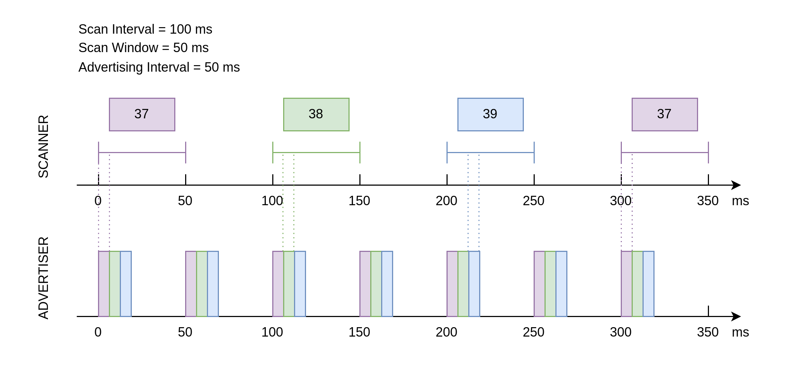
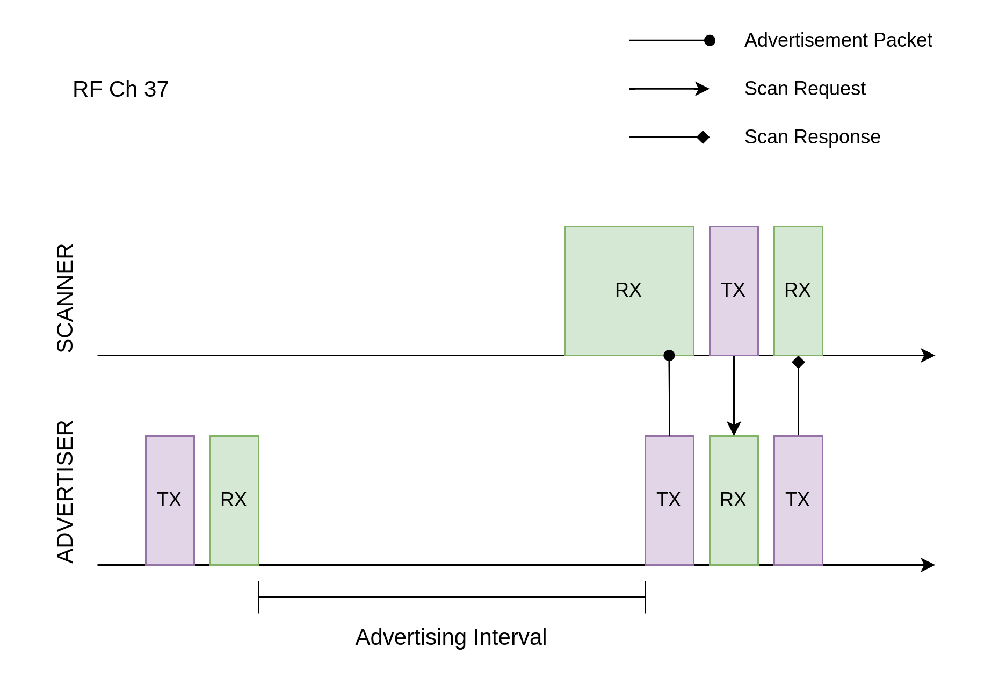
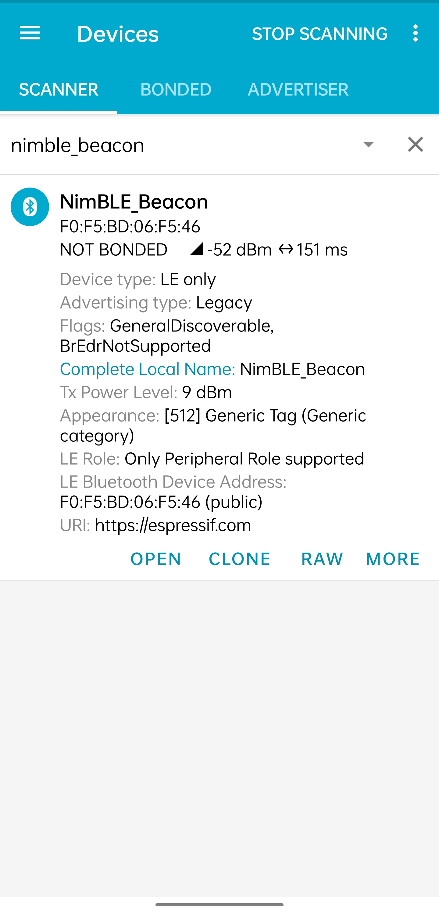
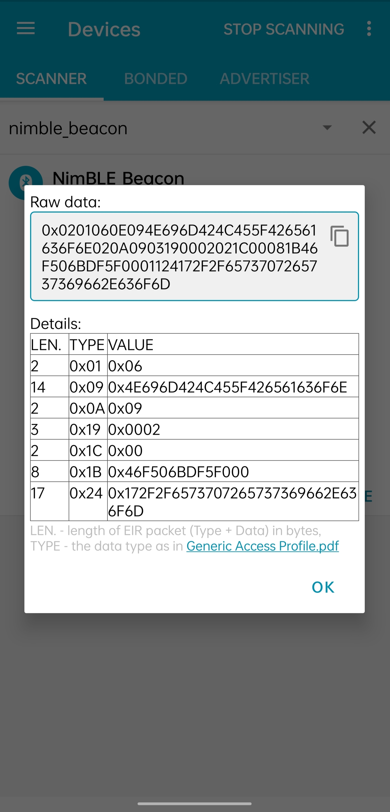

Device Discovery
=======================

:link_to_translation:`zh_CN:[中文]`

This document is the second tutorial in the Getting Started series on Bluetooth Low Energy (Bluetooth LE), aiming to provide a brief overview of the Bluetooth LE device discovery process, including basic concepts related to advertising and scanning. Following this, the tutorial introduces the code implementation of Bluetooth LE advertising, using the :example:`NimBLE_Beacon <bluetooth/ble_get_started/nimble/NimBLE_Beacon>` example based on the NimBLE host layer stack.

Learning Objectives
-----------------------

- Understand the basic concepts of Advertising
- Understand the basic concepts of Scanning
- Learn about the code structure of the :example:`NimBLE_Beacon <bluetooth/ble_get_started/nimble/NimBLE_Beacon>` example

Advertising and Scanning are the states of Bluetooth LE devices during the device discovery phase before establishing a connection. First, let’s understand the basic concepts related to advertising.

Basic Concepts of Advertising
---------------------------------

Advertising is the process where a device sends out advertising packets via its Bluetooth antenna. Since the advertiser does not know whether there is a receiver in the environment or when the receiver will activate its antenna, it needs to send advertising packets periodically until a device responds. During this process, there are several questions for the advertiser to consider:

1. Where should the advertising packets be sent? (Where?)
2. How long should the interval between advertising packets be? (When?)
3. What information should be included in the advertising packets? (What?)

Where to Send Advertising Packets?
^^^^^^^^^^^^^^^^^^^^^^^^^^^^^^^^^^^^^^

Bluetooth Radio Frequency Band
########################################

The first question pertains to which radio frequency band the advertising packets should be sent on. The answer is provided by the Bluetooth Core Specification: the 2.4 GHz ISM band. This band is a globally available, license-free radio frequency band that is not controlled by any country for military or other purposes, and does not require payment to any organization. Thus, it has high availability and no usage costs. However, this also means the 2.4 GHz ISM band is very crowded and may interfere with other wireless communication protocols such as 2.4 GHz WiFi.

Bluetooth Channels
############################

Similar to Bluetooth Classic, the Bluetooth SIG has adopted Adaptive Frequency Hopping (AFH) in Bluetooth LE to address data collision issues. This technology can assess the congestion of RF channels and avoid crowded channels through frequency hopping to improve communication quality. However, unlike Bluetooth Classic, Bluetooth LE uses the 2.4 GHz ISM band divided into 40 RF channels, each with a 2 MHz bandwidth, ranging from 2402 MHz to 2480 MHz, while Bluetooth Classic uses 79 RF channels, each with a 1 MHz bandwidth.

In Bluetooth Core Specification 4.2, RF channels are categorized into two types, as follows:

.. list-table::
    :align: center
    :widths: 30 20 20 30
    :header-rows: 1

    *   -   Type
        -   Quantity
        -   Index
        -   Purpose
    *   -   Advertising Channel
        -   3
        -   37-39
        -   Used for sending advertising packets and scan response packets
    *   -   Data Channel
        -   37
        -   0-36
        -   Used for sending data channel packets

During advertising, the advertiser will send advertising packets on the three advertising channels (37-39). Once the advertising packets have been sent on all three channels, the advertising process is considered complete, and the advertiser will repeat the process at the next advertising interval.

Extended Advertising Features
##################################

In Bluetooth Core Specification 4.2, advertising packets are limited to a maximum of 31 bytes, which restricts the functionality of advertising. To enhance the capability of advertising, Bluetooth 5.0 introduced the Extended Advertising feature. This feature divides advertising packets into:

.. list-table::
    :align: center
    :widths: 40 20 20 20
    :header-rows: 1

    *   -   Type
        -   Abbreviation
        -   Max Payload Size per Packet (Bytes）
        -   Max Total Payload Size (Bytes)
    *   -   Primary Advertising Packet
        -   Legacy ADV
        -   31
        -   31
    *   -   Extended Advertising Packet
        -   Extended ADV
        -   254
        -   1650

Extended advertising packets are composed of `ADV_EXT_IND` and `AUX_ADV_IND`, transmitted on the primary and secondary advertising channels, respectively. The primary advertising channels correspond to channels 37-39, while the secondary advertising channels correspond to channels 0-36. Since the receiver always receives advertising data on the primary advertising channels, the advertiser must send `ADV_EXT_IND` on the primary advertising channels and `AUX_ADV_IND` on the secondary advertising channels. `ADV_EXT_IND` will indicate the secondary advertising channels where `AUX_ADV_IND` is transmitted. This mechanism allows the receiver to obtain the complete extended advertising packet by first receiving `ADV_EXT_IND` on the primary advertising channels and then going to the specified secondary advertising channels to receive `AUX_ADV_IND`.

.. list-table::
    :align: center
    :widths: 30 40 30
    :header-rows: 1

    *   -   Type
        -   Channels
        -   Purpose
    *   -   Primary Advertising Channel
        -   37-39
        -   Used to transmit `ADV_EXT_IND` of the extended advertising packet
    *   -   Secondary Advertising Channel
        -   0-36
        -   Used to transmit `AUX_ADV_IND` of the extended advertising packet

How long should the advertising interval be?
^^^^^^^^^^^^^^^^^^^^^^^^^^^^^^^^^^^^^^^^^^^^^^^^

Advertising Interval
#########################

For the second question, regarding the period for sending advertising packets, the Bluetooth standard provides a clear parameter definition: Advertising Interval. The advertising interval can range from 20 ms to 10.24 s, with a step size of 0.625 ms.

The choice of advertising interval affects both the discoverability of the advertiser and the device’s power consumption. If the advertising interval is too long, the probability of the advertising packets being received by a receiver becomes very low, which decreases the advertiser’s discoverability. Conversely, if the advertising interval is too short, frequent advertising consumes more power. Therefore, the advertiser needs to balance between discoverability and power consumption and choose the most appropriate advertising interval based on the application's needs.

It is worth noting that if there are two advertisers with the same advertising interval in the same space, packet collision may occur, meaning both advertisers are sending advertising data to the same channel at the same time. Since advertising is a one-way process with no reception, the advertiser cannot know if a packet collision has occurred. To reduce the likelihood of such collisions, advertisers should add a random delay of 0-10 ms after each advertising event.

What information is included in the advertising packet?
^^^^^^^^^^^^^^^^^^^^^^^^^^^^^^^^^^^^^^^^^^^^^^^^^^^^^^^^^^^^

Advertising Packet Structure
^^^^^^^^^^^^^^^^^^^^^^^^^^^^^^^^^^

For the third question, regarding the information contained in the advertising packet, Bluetooth Core Specification 4.2 defines the format of the advertising packet, as shown in the diagram below:

.. _adv_packet_structure:

.. figure:: ../../../../_static/ble/ble-4.2-adv-packet-structure.png
    :align: center
    :scale: 35%
    :alt: Advertising Packet Structure

    Advertising Packet Structure in Bluetooth Core Specification 4.2

Let’s break it down step by step. The outer layer of an advertising packet contains four parts, which are:

.. list-table::
    :align: center
    :widths: 10 40 10 40
    :header-rows: 1

    *   -   No.
        -   Name
        -   Byte Size
        -   Function
    *   -   1
        -   Preamble
        -   1
        -   A special bit sequence used for device clock synchronization
    *   -   2
        -   Access Address
        -   4
        -   Marks the address of the advertising packet
    *   -   3
        -   Protocol Data Unit, PDU
        -   2-39
        -   The area where the actual data is stored
    *   -   4
        -   Cyclic Redundancy Check, CRC
        -   3
        -   Used for cyclic redundancy checking

The advertising packet is a type of Bluetooth packet, and its nature is determined by the type of PDU. Now, let's take a detailed look at the PDU.

PDU
##########################

The PDU segment is where the actual data is stored. Its structure is as follows:

.. list-table::
    :align: center
    :widths: 10 50 40
    :header-rows: 1

    *   -   No.
        -   Name
        -   Byte Size
    *   -   1
        -   Header
        -   2
    *   -   2
        -   Payload
        -   0-37

PDU Header
##############

The PDU header contains various pieces of information, which can be broken down into six parts:

.. list-table::
    :align: center
    :widths: 10 40 10 40
    :header-rows: 1

    *   -   No.
        -   Name
        -   Bit Size
        -   Notes
    *   -   1
        -   PDU Type
        -   4
        -
    *   -   2
        -   Reserved for Future Use, **RFU**
        -   1
        -
    *   -   3
        -   Channel Selection Bit, **ChSel**
        -   1
        -   Indicates whether the advertiser supports the *LE Channel Selection Algorithm #2*
    *   -   4
        -   TX Address, **TxAdd**
        -   1
        -   0/1 indicates Public Address/Random Address
    *   -   5
        -   Rx Address, **RxAdd**
        -   1
        -   0/1 indicates Public Address/Random Address
    *   -   6
        -   Payload Length
        -   8
        -

The PDU Type bit reflects the advertising behavior of the device. In the Bluetooth protocol, there are three pairs of advertising behaviors:

- *Connectable* vs. *Non-connectable*:
    - Whether the device accepts connection requests from others.
- *Scannable* vs. *Non-scannable*:
    - Whether the device accepts scan requests from others.
- *Undirected* vs. *Directed*:
    - Whether the advertising packet is sent to a specific device.

These advertising behaviors can be combined into four common types of advertising, corresponding to four different PDU types:

.. list-table::
    :align: center
    :widths: 10 10 10 30 40
    :header-rows: 1

    *   -   Connectable？
        -   Scannable？
        -   Undirected？
        -   PDU Type
        -   Purpose
    *   -   Y
        -   Y
        -   Y
        -   `ADV_IND`
        -   The most common advertising type
    *   -   Y
        -   N
        -   N
        -   `ADV_DIRECT_IND`
        -   Commonly used for reconnecting with known devices
    *   -   N
        -   N
        -   Y
        -   `ADV_NONCONN_IND`
        -   Used by beacon devices to advertising data without connection
    *   -   N
        -   Y
        -   Y
        -   `ADV_SCAN_IND`
        -   Used by beacons to advertise additional data via a scan response when packet length is insufficient

PDU Payload
#####################

The PDU Payload is divided into two parts:

.. list-table::
    :align: center
    :widths: 10 50 10 30
    :header-rows: 1

    *   -   No.
        -   Name
        -   Byte Size
        -   Notes
    *   -   1
        -   Advertisement Address, **AdvA**
        -   6
        -   The 48-bit Bluetooth address of the advertiser
    *   -   2
        -   Advertisement Data, **AdvData**
        -   0-31
        -   Consists of multiple Advertisement Data Structures

The Advertisement Address can be either a:

.. list-table::
    :align: center
    :widths: 40 60
    :header-rows: 1

    *   -   Type
        -   Description
    *   -   Public Address
        -   A globally unique fixed device address that manufacturers must register and pay fees to IEEE for
    *   -   Random Address
        -   A randomly generated address

Random addresses are further divided into two categories:

.. list-table::
    :align: center
    :widths: 40 60
    :header-rows: 1

    *   -   Type
        -   Description
    *   -   Random Static Address
        -   Can be either fixed in firmware or randomly generated at startup but must not change during operation. Often used as an alternative to a Public Address.
    *   -   Random Private Address
        -   Periodically changes to prevent device tracking.

For devices using random private addresses to communicate with trusted devices, an Identity Resolving Key (IRK) should be used to generate the random address. Devices with the same IRK can resolve and obtain the true address. There are two types of random private addresses:

.. list-table::
    :align: center
    :widths: 40 60
    :header-rows: 1

    *   -   Type
        -   Description
    *   -   Resolvable Random Private Address
        -   Can be resolved with an IRK to obtain the device’s true address
    *   -   Non-resolvable Random Private Address
        -   Completely random and rarely used, as it cannot be resolved and is only meant to prevent tracking

Let's look at the advertising data. The format of an advertising data structure is defined as follows:

.. list-table::
    :align: center
    :widths: 10 40 20 30
    :header-rows: 1

    *   -   No.
        -   Name
        -   Byte Size
        -   Notes
    *   -   1
        -   AD Length
        -   1
        -
    *   -   2
        -   AD Type
        -   n
        -   Most types take 1 byte
    *   -   3
        -   AD Data
        -   (AD Length - n)
        -

Advertising Process
^^^^^^^^^^^^^^^^^^^^^

Advertising With a Public Address
####################################

When using a public address for advertising, set the ``own_addr_type`` of ``esp_ble_adv_params_t`` to ``BLE_ADDR_TYPE_PUBLIC``. The advertising process flowchart is as follows (*click to enlarge*):

.. seqdiag::
    :caption: Advertising With a Public Address
    :align: center
    :scale: 200%

    seqdiag adv-public-addr {
        activation = none;
        edge_length = 160;
        span_height = 20;
        default_shape = roundedbox;
        default_fontsize = 14;

        "Input\n[Advertiser]";
        "API\n[Advertiser]";
        "LLM\n[Advertiser]";
        "LLM\n[Scanner]";
        "API\n[Scanner]";
        "Output\n[Scanner]";

        "Input\n[Advertiser]" -> "API\n[Advertiser]" [label="calls\n esp_ble_gap_set_device_name"];
        "Input\n[Advertiser]" -> "API\n[Advertiser]" [label="calls\n esp_ble_gap_config_adv_data"];
        "API\n[Advertiser]" -> "LLM\n[Advertiser]" [label="sends config adv data HCI command to LL layer"];
        "API\n[Advertiser]" <- "LLM\n[Advertiser]" [label="returns set adv data event"];
        "Input\n[Advertiser]" <- "API\n[Advertiser]" [label="returns\n esp_gap_ble_adv_data_set_complete_evt"];
        "Input\n[Advertiser]" -> "API\n[Advertiser]" [label="calls\n esp_ble_gap_start_advertising to start advertising; sets the own_addr_type parameter to ble_addr_type_public"];
        "API\n[Advertiser]" -> "LLM\n[Advertiser]" [label="sends start adv HCI command to LL layer"];
        "API\n[Advertiser]" <- "LLM\n[Advertiser]" [label="returns start adv event"];
        "LLM\n[Advertiser]" -> "LLM\n[Scanner]" [label="advertising event"];
        "LLM\n[Advertiser]" -> "LLM\n[Scanner]" [label="advertising event"];
        "Input\n[Advertiser]" <- "API\n[Advertiser]" [label="returns\n esp_gap_ble_adv_start_complete_evt"];
        "LLM\n[Scanner]" -> "API\n[Scanner]";
        "API\n[Scanner]" -> "Output\n[Scanner]" [label="esp_gap_ble_scan_result_evt"];
    }

Advertising With a Resolvable Random Private Address
##########################################################

When using a resolvable random private address for advertising, the underlying protocol stack updates the advertising address when the resolvable random private address times out. The default timeout is set to 15 minutes. The timeout duration for the resolvable random private address can be configured using the ``BT_BLE_RPA_TIMEOUT`` option in menuconfig. Set the ``own_addr_type`` of ``esp_ble_adv_params_t`` to ``BLE_ADDR_TYPE_RPA_PUBLIC`` or ``BLE_ADDR_TYPE_RPA_RANDOM``. The advertising process flowchart is as follows (*click to enlarge*):

.. seqdiag::
    :caption: Advertising With a Resolvable Random Private Address
    :align: center
    :scale: 200%

    seqdiag adv-resolvable-addr {
        activation = none;
        edge_length = 160;
        span_height = 20;
        default_shape = roundedbox;
        default_fontsize = 14;

        "Input\n[Advertiser]";
        "API\n[Advertiser]";
        "LLM\n[Advertiser]";
        "LLM\n[Scanner]";
        "API\n[Scanner]";
        "Output\n[Scanner]";

        "Input\n[Advertiser]" -> "API\n[Advertiser]" [label="calls\n esp_ble_gap_set_device_name"];
        "Input\n[Advertiser]" -> "API\n[Advertiser]" [label="calls\n esp_ble_gap_config_local_privacy"];
        "Input\n[Advertiser]" -> "API\n[Advertiser]" [label="calls\n esp_ble_gap_config_adv_data"];
        "API\n[Advertiser]" -> "LLM\n[Advertiser]" [label="sends config adv data HCI command to LL layer"];
        "API\n[Advertiser]" <- "LLM\n[Advertiser]" [label="returns set adv data event"];
        "Input\n[Advertiser]" <- "API\n[Advertiser]" [label="returns\n esp_gap_ble_adv_data_set_complete_evt"];
        "Input\n[Advertiser]" -> "API\n[Advertiser]" [label="calls\n esp_ble_gap_start_advertising to start advertising; sets the own_addr_type parameter to ble_addr_type_rpa_public or ble_addr_type_rpa_random"];
        "API\n[Advertiser]" -> "LLM\n[Advertiser]" [label="sends start adv HCI command to LL layer"];
        "API\n[Advertiser]" <- "LLM\n[Advertiser]" [label="returns start adv event"];
        "LLM\n[Advertiser]" -> "LLM\n[Scanner]" [label="advertising event"];
        "LLM\n[Advertiser]" -> "LLM\n[Scanner]" [label="advertising event"];
        "Input\n[Advertiser]" <- "API\n[Advertiser]" [label="returns\n esp_gap_ble_adv_start_complete_evt"];
        "LLM\n[Scanner]" -> "API\n[Scanner]";
        "API\n[Scanner]" -> "Output\n[Scanner]" [label="esp_gap_ble_scan_result_evt"];
    }

.. note::

   When advertising with a resolvable random private address, advertising should start only after the ``esp_ble_gap_config_local_privacy`` event returns. Set ``own_addr_type`` to ``BLE_ADDR_TYPE_RPA_PUBLIC`` or ``BLE_ADDR_TYPE_RPA_RANDOM``.

   To use ``BLE_ADDR_TYPE_RPA_RANDOM``, a random static address must be set through the ``esp_ble_gap_set_rand_addr`` API. This step is not required for ``BLE_ADDR_TYPE_RPA_PUBLIC``.

   ``BLE_ADDR_TYPE_RPA_PUBLIC`` operates as follows: The controller generates a Resolvable Random Private Address (RPA) based on the local Identity Resolving Key (IRK) from the resolving list. If no matching entry is found in the resolving list, the public address is used.

   For ``BLE_ADDR_TYPE_RPA_RANDOM``, If no matching entry is found in the resolving list, a random static address is used.

Advertising with a Random Static Address
###########################################

Similar to advertising with a resolvable random private address, advertising with a random static address requires setting the ``own_addr_type`` of ``esp_ble_adv_params_t`` to ``BLE_ADDR_TYPE_RANDOM``. The advertising process flowchart is as follows (*click to enlarge*):

.. seqdiag::
    :caption: Advertising With a Random Static Address
    :align: center
    :scale: 200%

    seqdiag adv-random-addr {
        activation = none;
        edge_length = 160;
        span_height = 20;
        default_shape = roundedbox;
        default_fontsize = 14;

        "Input\n[Advertiser]";
        "API\n[Advertiser]";
        "LLM\n[Advertiser]";
        "LLM\n[Scanner]";
        "API\n[Scanner]";
        "Output\n[Scanner]";

        "Input\n[Advertiser]" -> "API\n[Advertiser]" [label="calls\n esp_ble_gap_set_device_name"];
        "Input\n[Advertiser]" -> "API\n[Advertiser]" [label="calls\n esp_ble_gap_set_rand_addr"];
        "API\n[Advertiser]" -> "LLM\n[Advertiser]" [label="sends set rand address HCI command to LL layer"];
        "API\n[Advertiser]" <- "LLM\n[Advertiser]" [label="returns set rand address event"];
        "Input\n[Advertiser]" <- "API\n[Advertiser]" [label="returns\n esp_gap_ble_set_static_rand_addr_evt"];
        "API\n[Advertiser]" -> "LLM\n[Advertiser]" [label="sends config adv data HCI command to LL layer"];
        "Input\n[Advertiser]" -> "API\n[Advertiser]" [label="calls\n esp_ble_gap_config_adv_data"];
        "API\n[Advertiser]" <- "LLM\n[Advertiser]" [label="return set adv data event"];
        "Input\n[Advertiser]" <- "API\n[Advertiser]" [label="calls\n esp_gap_ble_adv_data_set_complete_evt"];
        "Input\n[Advertiser]" -> "API\n[Advertiser]" [label="calls\n esp_ble_gap_start_advertising to start advertising; sets the own_addr_type parameter to ble_addr_type_random"];
        "API\n[Advertiser]" -> "LLM\n[Advertiser]" [label="sends start adv HCI command to LL layer"];
        "LLM\n[Advertiser]" -> "LLM\n[Scanner]" [label="advertising event"];
        "LLM\n[Advertiser]" -> "LLM\n[Scanner]" [label="advertising event"];
        "API\n[Advertiser]" <- "LLM\n[Advertiser]" [label="returns start adv event"];
        "Input\n[Advertiser]" <- "API\n[Advertiser]" [label="returns\n esp_gap_ble_adv_start_complete_evt"];
        "LLM\n[Scanner]" -> "API\n[Scanner]";
        "API\n[Scanner]" -> "Output\n[Scanner]" [label="esp_gap_ble_scan_result_evt"];
    }

Basic Concepts of Scanning
^^^^^^^^^^^^^^^^^^^^^^^^^^

Similar to the advertising process, scanning also raises three questions:

1. Where to scan? (Where?)
2. When to scan and for how long? (When?)
3. What to do during scanning? (What?)

For Bluetooth LE 4.2 devices, the advertiser only sends data on the advertising channels, which are channels 37-39. For Bluetooth LE 5.0 devices, if the advertiser has enabled extended advertising, it sends `ADV_EXT_IND` on the primary advertising channels and `AUX_ADV_IND` on the secondary advertising channels. Thus, for Bluetooth LE 4.2 devices, scanners only need to receive advertising data on advertising channels. For Bluetooth LE 5.0 devices, scanners must first receive the `ADV_EXT_IND` on the primary advertising channels and, if it indicates a secondary channel, move to the corresponding secondary channel to receive the `AUX_ADV_IND`.

Scan Window and Scan Interval
#####################################

The second question refers to the concepts of the Scan Window and the Scan Interval.

- **Scan Window**: the duration for which the scanner continuously receives packets on a single RF channel. For example, if the scan window is set to 50 ms, the scanner continuously scans for 50 ms on each RF channel.

- **Scan Interval**: the time between the start of two consecutive scan windows, which means the scan interval is always greater than or equal to the scan window.

The diagram below illustrates the process of a scanner receiving advertising packets on a timeline. The scanner's scan interval is 100 ms, and the scan window is 50 ms; the advertiser's advertising interval is 50 ms, and the duration of the advertising packet transmission is for illustrative purposes only. As shown, the first scan window corresponds to channel 37, where the scanner successfully receives the advertiser's first broadcasting packet sent on channel 37, and this pattern continues.

    Advertising and Scanning Timing Diagram

.. _scan_request_and_scan_response:

Scan Request and Scan Response
#####################################

From the current introduction, it might seem that the advertiser only transmits and the scanner only receives during the advertising process. However, scanning behavior is divided into two types:

- **Passive Scanning**:
    - The scanner only receives advertising packets.
- **Active Scanning**:
    - After receiving an advertising packet, the scanner sends a scan request to a scannable advertiser.

When a scannable advertiser receives a scan request, it sends a scan response packet, providing more advertising information to the interested scanner. The structure of the scan response packet is identical to the advertising packet, with the difference being the PDU type in the PDU header.

In scenarios where the advertiser operates in scannable advertising mode and the scanner in active scanning mode, the data transmission timing between the advertiser and the scanner becomes more complex. For the scanner, after a scan window ends, it briefly switches to TX mode to send a scan request, then quickly switches back to RX mode to receive a possible scan response. For the advertiser, after each advertising, it briefly switches to RX mode to receive any scan requests, and upon receiving one, it switches to TX mode to send the scan response.

    Scan Request Reception and Scan Response Transmission

Hands-On Practice
--------------------------

After learning the relevant concepts of advertising and scanning, let's apply this knowledge in practice using the :example:`NimBLE_Beacon <bluetooth/ble_get_started/nimble/NimBLE_Beacon>` example to create a simple beacon device.

Prerequisites
^^^^^^^^^^^^^^^^^^^^^^^

1. An {IDF_TARGET_NAME} development board
2. ESP-IDF development environment
3. The **nRF Connect for Mobile** app installed on your phone

If you haven't set up the ESP-IDF development environment yet, please refer to :doc:`IDF Get Started <../../../get-started/index>`.

Try It Out
^^^^^^^^^^^^^^^^^^^^^^

Building and Flashing
##########################

The reference example for this tutorial is :example:`NimBLE_Beacon <bluetooth/ble_get_started/nimble/NimBLE_Beacon>`.

You can navigate to the example directory using the following command:

.. code-block:: shell

    $ cd <ESP-IDF Path>/examples/bluetooth/ble_get_started/nimble/NimBLE_Beacon

Please replace `<ESP-IDF Path>` with your local ESP-IDF folder path. Then, you can open the NimBLE_Beacon project using VSCode or another IDE you prefer. For example, after navigating to the example directory via the command line, you can open the project in VSCode using the following command:

.. code-block:: shell

    $ code .

Next, enter the ESP-IDF environment in the command line and set the target chip:

.. code-block:: shell

    $ idf.py set-target <chip-name>

You should see messages like:

.. code-block:: shell

    ...
    -- Configuring done
    -- Generating done
    -- Build files have been written to ...

These messages indicate that the chip has been successfully configured. Then, connect the development board to your computer and run the following command to build the firmware, flash it to the board, and monitor the serial output from the {IDF_TARGET_NAME} development board:

.. code-block:: shell

    $ idf.py flash monitor

You should see messages like:

.. code-block:: shell

    ...
    main_task: Returned from app_main()

Wait until the notification ends.

Viewing Beacon Device Information
#########################################

.. _nimble_beacon_details:

Open the **nRF Connect for Mobile** app on your phone, go to the **SCANNER** tab, and pull down to refresh. Locate the NimBLE_Beacon device, as shown in the figure below.

    Locate NimBLE Beacon Device

If the device list is long, it is recommended to filter by the keyword NimBLE in the device name to quickly find the NimBLE_Beacon device.

You will notice that the NimBLE Beacon device contains rich information, including the Espressif website (this demonstrates the beacon advertising feature). Click the **RAW** button in the lower-right corner to view the raw advertising packet data, as shown below.

    Advertising Packet Raw Data

**Details** table summarizes all advertising data structures in the advertising data packet and the scan response data packet:

.. list-table::
    :align: center
    :widths: 30 10 10 30 20
    :header-rows: 1

    *   -   Name
        -   Length
        -   Type
        -   Raw Data
        -   Resolved Information
    *   -   Flags
        -   2 Bytes
        -   `0x01`
        -   `0x06`
        -   General Discoverable, BR/EDR Not Supported
    *   -   Complete Local Device Name
        -   14 Bytes
        -   `0x09`
        -   `0x4E696D424C455F426561636F6E`
        -   NimBLE_Beacon
    *   -   TX Power Level
        -   2 Bytes
        -   `0x0A`
        -   `0x09`
        -   9 dBm
    *   -   Appearance
        -   3 Bytes
        -   `0x19`
        -   `0x0002`
        -   Generic Tag (Generic category)
    *   -   LE Role
        -   2 Bytes
        -   `0x1C`
        -   `0x00`
        -   Only Peripheral Role supported
    *   -   LE Bluetooth Device Address
        -   8 Bytes
        -   `0x1B`
        -   `0x46F506BDF5F000`
        -   `F0:F5:BD:06:F5:46`
    *   -   URI
        -   17 Bytes
        -   `0x24`
        -   `0x172F2F6573707265737369662E636F6D`
        -   `https://espressif.com`

It is worth mentioning that the total length of the first five advertising data structures is 28 bytes, leaving only 3 bytes of space in the advertising data packet, which is not enough to accommodate the last two data structures. Therefore, the last two advertising data structures must be placed in the scan response data packet.

You may also notice that the Raw Data for the Device Appearance is `0x0002`, while in the code, the definition for Generic Tag is `0x0200`. Additionally, the Raw Data for the Device Address appears to be completely reversed, except for the last byte (`0x00`). This is because Bluetooth LE air packets follow a little-endian transmission order, meaning the lower bytes are placed at the front.

Also, note that the **nRF Connect for Mobile** app does not provide a **CONNECT** button to connect to this device, which aligns with our expectations since a Beacon device is inherently non-connectable. Now, let's dive into the code details to see how such a Beacon device is implemented.

Code Explanation
---------------------------

Project Structure Overview
^^^^^^^^^^^^^^^^^^^^^^^^^^^^^^^^^^^^^^

.. _nimble_beacon_project_structure:

The root directory of :example:`NimBLE_Beacon <bluetooth/ble_get_started/nimble/NimBLE_Beacon>` is roughly divided into the following parts:

- `README*.md`
    - Documentation for the project
- `sdkconfig.defaults*`
    - Default configurations for different chip development boards
- `CMakeLists.txt`
    - Used to include the ESP-IDF build environment
- `main`
    - The main project folder containing the source code, header files, and build configurations

Program Behavior Overview
^^^^^^^^^^^^^^^^^^^^^^^^^^^^^^^^^^^^

.. _nimble_beacon_program_behavior:

Before diving into the code details, let's first get a macro understanding of the program behavior.

First, we initialize the various modules used in the program, mainly including NVS Flash, the NimBLE Host Stack, and the GAP service.

After the NimBLE Host Stack synchronizes with the Bluetooth controller, we confirm the Bluetooth address is available, then initiate an undirected, non-connectable, and scannable advertisement.

The device remains in advertising mode continuously until a reboot occurs.

Entry Function
^^^^^^^^^^^^^^^^^^^^^^^

.. _nimble_beacon_entry_point:

As with other projects, the entry function of the application is the `app_main` function in the `main/main.c` file, where we typically initialize the modules. In this example, we mainly do the following:

1. Initialize NVS Flash and the NimBLE Host Stack
2. Initialize the GAP service
3. Start the FreeRTOS task for the NimBLE Host Stack

The {IDF_TARGET_NAME} Bluetooth stack uses NVS Flash to store related configurations, so before initializing the Bluetooth stack, we must call the `nvs_flash_init` API to initialize NVS Flash. In some cases, we may need to call the `nvs_flash_erase` API to erase NVS Flash before initialization.

.. code-block:: C

    void app_main(void) {
        ...

        /* NVS flash initialization */
        ret = nvs_flash_init();
        if (ret == ESP_ERR_NVS_NO_FREE_PAGES ||
            ret == ESP_ERR_NVS_NEW_VERSION_FOUND) {
            ESP_ERROR_CHECK(nvs_flash_erase());
            ret = nvs_flash_init();
        }
        if (ret != ESP_OK) {
            ESP_LOGE(TAG, "failed to initialize nvs flash, error code: %d ", ret);
            return;
        }

        ...
    }

Next, you can call `nimble_port_init` API to initialize NimBLE host stack.

.. code-block:: C

    void app_main(void) {
        ...

        /* NimBLE host stack initialization */
        ret = nimble_port_init();
        if (ret != ESP_OK) {
            ESP_LOGE(TAG, "failed to initialize nimble stack, error code: %d ",
                    ret);
            return;
        }

        ...
    }

Then, we call the `gap_init` function defined in the `gap.c` file to initialize the GAP service and set the device name and appearance.

.. code-block:: C

    void app_main(void) {
        ...

        /* GAP service initialization */
        rc = gap_init();
        if (rc != 0) {
            ESP_LOGE(TAG, "failed to initialize GAP service, error code: %d", rc);
            return;
        }

        ...
    }

Next, we configure the NimBLE host stack, which mainly involves setting some callback functions, including callbacks for when the stack is reset and when synchronization is complete, and then saving the configuration.

.. code-block:: C

    static void nimble_host_config_init(void) {
        /* Set host callbacks */
        ble_hs_cfg.reset_cb = on_stack_reset;
        ble_hs_cfg.sync_cb = on_stack_sync;
        ble_hs_cfg.store_status_cb = ble_store_util_status_rr;

        /* Store host configuration */
        ble_store_config_init();
    }

    void app_main(void) {
        ...

        /* NimBLE host configuration initialization */
        nimble_host_config_init();

        ...
    }

Finally, start the FreeRTOS thread for the NimBLE host stack.

.. code-block:: C

    static void nimble_host_task(void *param) {
        /* Task entry log */
        ESP_LOGI(TAG, "nimble host task has been started!");

        /* This function won't return until nimble_port_stop() is executed */
        nimble_port_run();

        /* Clean up at exit */
        vTaskDelete(NULL);
    }

    void app_main(void) {
        ...

        /* Start NimBLE host task thread and return */
        xTaskCreate(nimble_host_task, "NimBLE Host", 4*1024, NULL, 5, NULL);

        ...
    }

Start Advertising
^^^^^^^^^^^^^^^^^^^^^^^^^^^^^^

.. _nimble_beacon_start_advertising:

When developing applications using the NimBLE host stack, the programming model is event-driven.

For example, after the NimBLE host stack synchronizes with the Bluetooth controller, a synchronization completion event will be triggered, invoking the `ble_hs_cfg.sync_cb` function. When setting up the callback function, we point the function pointer to the `on_stack_sync` function, which is the actual function called upon synchronization completion.

In the `on_stack_sync` function, we call the `adv_init` function to initialize advertising operations. In `adv_init`, we first call the `ble_hs_util_ensure_addr` API to confirm that a usable Bluetooth address is available. Then, we call the `ble_hs_id_infer_auto` API to obtain the optimal Bluetooth address type.

.. code-block:: C

    static void on_stack_sync(void) {
        /* On stack sync, do advertising initialization */
        adv_init();
    }

    void adv_init(void) {
        ...

        /* Make sure we have proper BT identity address set */
        rc = ble_hs_util_ensure_addr(0);
        if (rc != 0) {
            ESP_LOGE(TAG, "device does not have any available bt address!");
            return;
        }

        /* Figure out BT address to use while advertising */
        rc = ble_hs_id_infer_auto(0, &own_addr_type);
        if (rc != 0) {
            ESP_LOGE(TAG, "failed to infer address type, error code: %d", rc);
            return;
        }

        ...
    }

Next, we copy the Bluetooth address data from the NimBLE stack's memory space into the local `addr_val` array, preparing it for subsequent use.

.. code-block:: C

    void adv_init(void) {
        ...

        /* Copy device address to addr_val */
        rc = ble_hs_id_copy_addr(own_addr_type, addr_val, NULL);
        if (rc != 0) {
            ESP_LOGE(TAG, "failed to copy device address, error code: %d", rc);
            return;
        }
        format_addr(addr_str, addr_val);
        ESP_LOGI(TAG, "device address: %s", addr_str);

        ...
    }

Finally, we call the `start_advertising` function to initiate advertising. Within the `start_advertising` function, we first populate the advertising data structures, including the advertising flags, complete device name, transmission power level, device appearance, and LE role, into the advertising packet as follows:

.. code-block:: C

    static void start_advertising(void) {
        /* Local variables */
        int rc = 0;
        const char *name;
        struct ble_hs_adv_fields adv_fields = {0};

        ...

        /* Set advertising flags */
        adv_fields.flags = BLE_HS_ADV_F_DISC_GEN | BLE_HS_ADV_F_BREDR_UNSUP;

        /* Set device name */
        name = ble_svc_gap_device_name();
        adv_fields.name = (uint8_t *)name;
        adv_fields.name_len = strlen(name);
        adv_fields.name_is_complete = 1;

        /* Set device tx power */
        adv_fields.tx_pwr_lvl = BLE_HS_ADV_TX_PWR_LVL_AUTO;
        adv_fields.tx_pwr_lvl_is_present = 1;

        /* Set device appearance */
        adv_fields.appearance = BLE_GAP_APPEARANCE_GENERIC_TAG;
        adv_fields.appearance_is_present = 1;

        /* Set device LE role */
        adv_fields.le_role = BLE_GAP_LE_ROLE_PERIPHERAL;
        adv_fields.le_role_is_present = 1;

        /* Set advertiement fields */
        rc = ble_gap_adv_set_fields(&adv_fields);
        if (rc != 0) {
            ESP_LOGE(TAG, "failed to set advertising data, error code: %d", rc);
            return;
        }

        ...
    }

The `ble_hs_adv_fields` structure predefines some commonly used advertising data types. After completing the data setup, we can enable the corresponding advertising data structures by setting the relevant is_present field to 1 or by assigning a non-zero value to the corresponding length field (len). For example, in the code above, we configure the device's transmission power with `adv_fields.tx_pwr_lvl = BLE_HS_ADV_TX_PWR_LVL_AUTO;`, and then enable that advertising data structure by setting `adv_fields.tx_pwr_lvl_is_present = 1;`. If we only configure the transmission power without setting the corresponding is_present field, the advertising data structure becomes invalid. Similarly, we configure the device name with `adv_fields.name = (uint8_t *)name;` and set the name's length with `adv_fields.name_len = strlen(name);` to add the device name as an advertising data structure to the advertising packet. If we only configure the device name without specifying its length, the advertising data structure will also be invalid.

Finally, we call the `ble_gap_adv_set_fields` API to finalize the setup of the advertising data structures in the advertising packet.

In the same way, we can fill in the device address and URI into the scan response packet as follows:

.. code-block:: C

    static void start_advertising(void) {
        ...

        struct ble_hs_adv_fields rsp_fields = {0};

        ...

        /* Set device address */
        rsp_fields.device_addr = addr_val;
        rsp_fields.device_addr_type = own_addr_type;
        rsp_fields.device_addr_is_present = 1;

        /* Set URI */
        rsp_fields.uri = esp_uri;
        rsp_fields.uri_len = sizeof(esp_uri);

        /* Set scan response fields */
        rc = ble_gap_adv_rsp_set_fields(&rsp_fields);
        if (rc != 0) {
            ESP_LOGE(TAG, "failed to set scan response data, error code: %d", rc);
            return;
        }

        ...
    }

Finally, we set the advertising parameters and initiate the advertising by calling the `ble_gap_adv_start` API.

.. code-block:: C

    static void start_advertising(void) {
        ...

        struct ble_gap_adv_params adv_params = {0};

        ...

        /* Set non-connetable and general discoverable mode to be a beacon */
        adv_params.conn_mode = BLE_GAP_CONN_MODE_NON;
        adv_params.disc_mode = BLE_GAP_DISC_MODE_GEN;

        /* Start advertising */
        rc = ble_gap_adv_start(own_addr_type, NULL, BLE_HS_FOREVER, &adv_params,
                            NULL, NULL);
        if (rc != 0) {
            ESP_LOGE(TAG, "failed to start advertising, error code: %d", rc);
            return;
        }
        ESP_LOGI(TAG, "advertising started!");
    }

Summary
---------------------

Through this tutorial, you have learned the basic concepts of advertising and scanning, and you mastered the method of building a Bluetooth LE Beacon device using the NimBLE host stack through the :example:`NimBLE_Beacon <bluetooth/ble_get_started/nimble/NimBLE_Beacon>` example.

You can try to modify the data in the example and observe the changes in the **nRF Connect for Mobile** app. For instance, you might modify the `adv_fields` or `rsp_fields` structures to change the populated advertising data structures, or swap the advertising data structures between the advertising packet and the scan response packet. However, keep in mind that the maximum size for the advertising data in both the advertising packet and the scan response packet is 31 bytes; if the size of the advertising data structure exceeds this limit, calling the `ble_gap_adv_start` API will fail.
