Introduction
===================

:link_to_translation:`zh_CN:[中文]`

This document is the first tutorial in the Getting Started series on Bluetooth Low Energy (Bluetooth LE). It introduces the basic concepts of Bluetooth LE and guides users through flashing a Bluetooth LE example onto an {IDF_TARGET_NAME} development board. The tutorial also instructs users on how to use the **nRF Connect for Mobile** app to control an LED and read heart rate data from the board. The tutorial offers a hands-on approach to understanding Bluetooth LE and working with the ESP-IDF framework for Bluetooth LE applications.

Learning Objectives
-----------------------

- Understand the layered architecture of Bluetooth LE
- Learn the basic functions of each layer in Bluetooth LE
- Understand the functions of GAP and GATT/ATT layers
- Master the method of flashing Bluetooth LE examples on {IDF_TARGET_NAME} development board and interacting with it via a mobile phone

Preface
-----------------

Most people have experienced Bluetooth technology in their daily lives—perhaps you are even wearing Bluetooth headphones right now, listening to audio from your phone or computer. However, audio transmission is a typical use case of Bluetooth Classic, while Bluetooth LE is a Bluetooth protocol that is not compatible with Bluetooth Classic and was introduced in Bluetooth 4.0. As the name suggests, Bluetooth LE is a low-power Bluetooth protocol with a lower data transfer rate compared to Bluetooth Classic. It is typically used in data communication for the Internet of Things (IoT), such as smart switches or sensors, as shown in the example in this tutorial. However, before diving into the example project, let's first understand the basic concepts of Bluetooth LE to help you get started.

Layered Architecture of Bluetooth LE
------------------------------------

The Bluetooth LE protocol defines a three-layer software architecture, listed from top to bottom:

- Application Layer
- Host Layer
- Controller Layer

The Application Layer is where applications are built using Bluetooth LE as the underlying communication technology, relying on the API interfaces provided by the Host Layer.

The Host Layer implements low-level Bluetooth protocols such as L2CAP, GATT/ATT, SMP, and GAP, providing API interfaces to the Application Layer above and communicating with the Controller Layer below via the Host Controller Interface (HCI).

The Controller Layer consists of the Physical Layer (PHY) and the Link Layer (LL), which directly interacts with the hardware below and communicates with the Host Layer above through the HCI.

It’s worth mentioning that the Bluetooth Core Specification allows the Host Layer and Controller Layer to be physically separated, in which case the HCI is realized as a physical interface, including SDIO, USB, and UART, among others. However, the Host and Controller Layers can also coexist on the same chip for higher integration, in which case the HCI is referred to as the Virtual Host Controller Interface (VHCI). Generally, the Host Layer and Controller Layer together make up the Bluetooth LE Stack.

The diagram below shows the layered structure of Bluetooth LE.

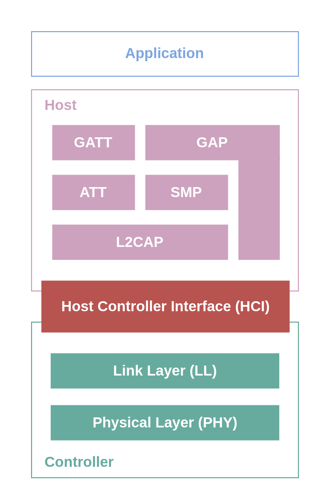

    Layered Architecture of Bluetooth LE

As an application developer, during the development process, we primarily interact with the APIs provided by the Host Layer, which requires a certain understanding of the Bluetooth protocols within the Host Layer. Next, we will introduce the basic concepts of the GAP and GATT/ATT layers from two perspectives: connection and data exchange.

GAP Layer - Defining Device Connections
^^^^^^^^^^^^^^^^^^^^^^^^^^^^^^^^^^^^^^^^^

The GAP (Generic Access Profile) layer defines the connection behaviors between Bluetooth LE devices and the roles they play in the connection.

GAP States and Roles
#######################

The GAP layer defines three connection states and five different device roles, as follows:

- Idle
    - In this state, the device is in a standby state without any role.
- Device Discovery
    - Advertiser
    - Scanner
    - Initiator
- Connection
    - Peripheral
    - Central

The advertising data contains information such as the device address, indicating the advertiser's presence to external devices and informing them whether they are connectable. A scanner continuously receives advertising packets in the environment. If a scanner detects a connectable advertiser and wishes to establish a connection, it can switch its role to initiator. When the initiator receives another advertising data from the same advertiser, it immediately sends a Connection Request. If the advertiser has not enabled a Filter Accept List (also known as White List), or if the initiator is included in the advertiser's Filter Accept List, the connection will be successfully established.

Once connected, the original advertiser becomes the peripheral device (formerly known as the slave device), and the original scanner or connection initiator becomes the central device (formerly known as the master device).

The diagram below shows the relationship between the GAP roles.

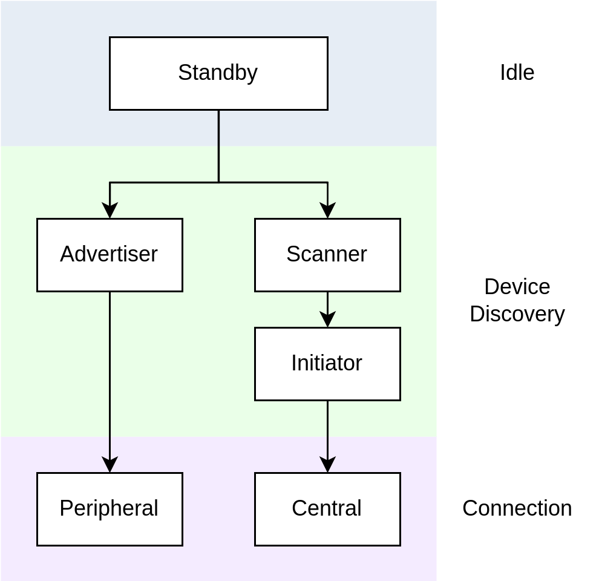

    GAP Roles Relationship

Bluetooth LE Network Topology
################################

Bluetooth LE devices can connect to multiple Bluetooth LE devices simultaneously, playing multiple peripheral or central device roles, or acting as both a peripheral and a central device at the same time. For example, a Bluetooth LE gateway can act as a central device to connect with peripheral devices such as smart switches, while also functioning as a peripheral device to connect with central devices like smartphones, serving as a data intermediary.

In a Bluetooth LE network, if all devices are connected to at least one other device and each plays only one type of role, this is referred to as a Connected Topology. If at least one device plays both peripheral and central roles simultaneously, the network is called a Multi-role Topology.

Bluetooth LE also supports a connectionless network topology known as Broadcast Topology. In such a network, there are two roles: the device sending the data is called the Broadcaster, and the device receiving the data is called the Observer. The broadcaster only sends data and does not accept connections, while the observer only receives advertising data and does not initiate connections. For example, in a network where a sensor's data is shared by multiple devices, maintaining multiple connections can be costly, so advertising sensor data to all devices in the network is a more suitable approach.

Learn More
##################

If you want to learn more about device discovery and connection, please refer to :doc:`Device Discovery <./ble-device-discovery>` and :doc:`Connection <./ble-connection>`.

GATT/ATT Layer - Data Representation and Exchange
^^^^^^^^^^^^^^^^^^^^^^^^^^^^^^^^^^^^^^^^^^^^^^^^^^^^^

.. _gatt_att_introduction:

The GATT/ATT layer defines the methods for data exchange between devices once they are connected, including how data is represented and the process of exchanging it.

ATT Layer
#############

ATT stands for Attribute Protocol (ATT), which defines a basic data structure called **Attribute** and data access methods based on a server/client architecture.

In simple terms, data is stored on a server as attributes, awaiting access by the client. For example, in a smart switch, the switch state is stored in the Bluetooth chip (server) of the smart switch as data in the form of an attribute. The user can then access the switch state attribute stored in the smart switch's Bluetooth chip (server) via their smartphone (client), to either read the current state (read access) or open and close the switch (write access).

The attribute data structure typically consists of the following three parts:

- Handle
- Type
- Value
- Permissions

In the protocol stack implementation, attributes are generally managed in an array-like structure called an **Attribute Table**. The index of an attribute in this table is its handle, usually an unsigned integer.

The type of an attribute is represented by a UUID and can be divided into three categories: 16-bit, 32-bit, and 128-bit UUIDs. The 16-bit UUIDs are universally defined by the Bluetooth Special Interest Group (Bluetooth SIG) and can be found in their publicly available `Assigned Numbers <https://www.bluetooth.com/specifications/assigned-numbers/>`__ document. The other two lengths of UUIDs are used for vendor-defined attribute types, with the 128-bit UUID being the most commonly used.

GATT Layer
###############

GATT stands for Generic Attribute Profile (GATT), and it builds on ATT by defining the following three concepts:

- Characteristic
- Service
- Profile

The hierarchical relationship between these three concepts is shown in the diagram below.

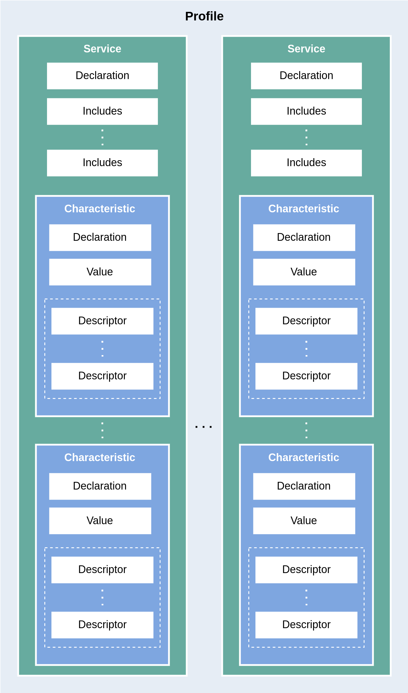

    GATT Hierarchical Architecture

.. _characteristic_structure:

Both characteristics and services are composite data structures based on attributes. A characteristic is often described by two or more attributes, including:

- Characteristic Declaration Attribute
- Characteristic Value Attribute

In addition, a characteristic may also include several optional Characteristic Descriptor Attributes.

A service itself is also described by an attribute, called the Service Declaration Attribute. A service can contain one or more characteristics, with a dependency relationship between them. Additionally, a service can reference another service using the `Include` mechanism, reusing its characteristic definitions to avoid redundant definitions for common characteristics, such as device names or manufacturer information.

A profile is a predefined set of services. A device that implements all the services defined in a profile is said to comply with that profile. For example, the Heart Rate Profile includes the Heart Rate Service and the Device Information Service. Thus, a device that implements both the Heart Rate Service and Device Information Service is considered compliant with the Heart Rate Profile.

Broadly speaking, any device that stores and manages characteristics is called a GATT Server, while any device that accesses the GATT Server to retrieve characteristics is called a GATT Client.

Learn More
####################

If you'd like to learn more about data representation and exchange, please refer to :doc:`Data Exchange <./ble-data-exchange>`.

Hands-On Practice
--------------------------

After learning the basic concepts of Bluetooth LE, let's load a simple Bluetooth LE example onto the {IDF_TARGET_NAME} development board to experience the functionalities of LED control and heart rate data reading, and gain an intuitive understanding of Bluetooth LE technology.

Prerequisites
^^^^^^^^^^^^^^^^

1. An {IDF_TARGET_NAME} development board
2. ESP-IDF development environment
3. The **nRF Connect for Mobile** app installed on your phone

If you haven't set up the ESP-IDF development environment yet, please refer to :doc:`IDF Get Started <../../../get-started/index>`.

Try It Out
^^^^^^^^^^^^^^^^^^

.. _nimble_gatt_server_practice:

Building and Flashing
##########################

The reference example for this tutorial is :example:`NimBLE_GATT_Server <bluetooth/ble_get_started/nimble/NimBLE_GATT_Server>`.

You can navigate to the example directory using the following command:

.. code-block:: shell

    $ cd <ESP-IDF Path>/examples/bluetooth/ble_get_started/nimble/NimBLE_GATT_Server

Please replace `<ESP-IDF Path>` with your local ESP-IDF folder path. Then, you can open the NimBLE_GATT_Server project using VSCode or another IDE you prefer. For example, after navigating to the example directory via the command line, you can open the project in VSCode using the following command:

.. code-block:: shell

    $ code .

Next, enter the ESP-IDF environment in the command line and set the target chip:

.. code-block:: shell

    $ idf.py set-target <chip-name>

You should see messages like:

.. code-block:: shell

    ...
    -- Configuring done
    -- Generating done
    -- Build files have been written to ...

These messages indicate that the chip has been successfully configured. Then, connect the development board to your computer and run the following command to build the firmware, flash it to the board, and monitor the serial output from the {IDF_TARGET_NAME} development board:

.. code-block:: shell

    $ idf.py flash monitor

You should see messages like:

.. code-block:: shell

    ...
    main_task: Returned from app_main()
    NimBLE_GATT_Server: Heart rate updated to 70

The heart rate data will update at a frequency of about 1 Hz, fluctuating between 60 and 80.

Connecting to the Development Board
#######################################

Now the development board is ready. Next, open the **nRF Connect for Mobile** app on your phone, refresh the **SCANNER** tab, and find the NimBLE_GATT device, as shown in the image below.

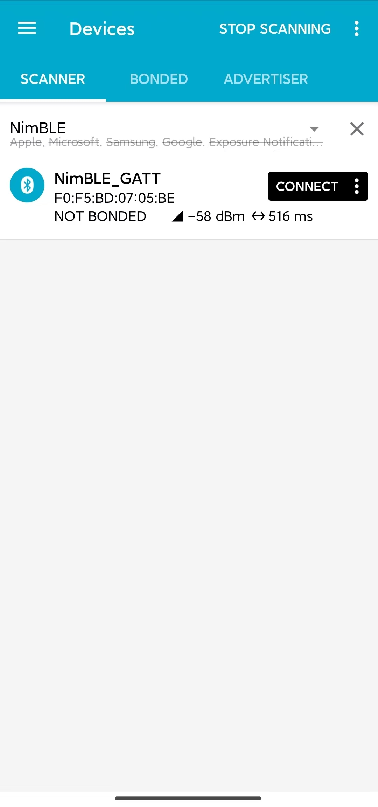

    Device Scan

If the device list is long, it is recommended to filter the device names using NimBLE as a keyword to quickly find the NimBLE_GATT device.

Click on the **NimBLE_GATT** device entry to expand and view the detailed advertising data.

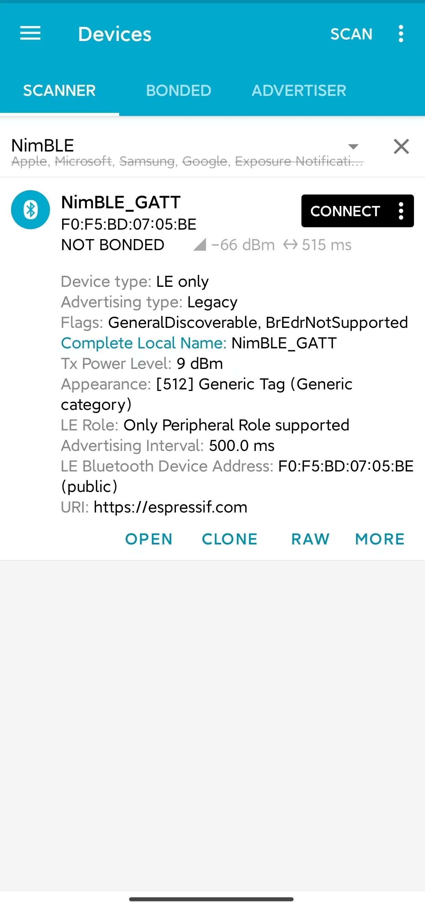

    Advertising Data Details

Click the **CONNECT** button on the right. While the phone is connecting, you can observe many connection-related log messages in the serial output of the development board. Then, the NimBLE_GATT tab will appear on the phone, and there should be a **CONNECTED** status in the upper left corner, indicating that the phone has successfully connected to the development board via the Bluetooth LE protocol. On the CLIENT subpage, you should be able to see four GATT services, as shown in the figure.

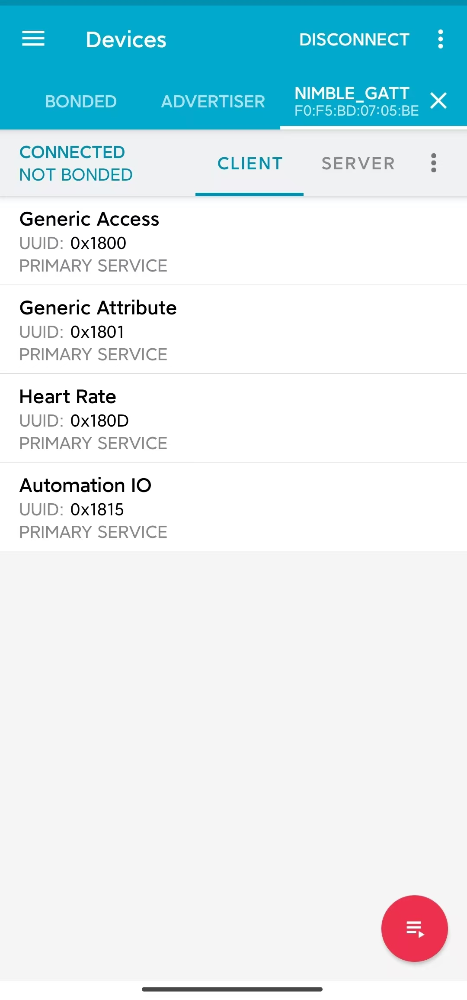

    GATT Services List

The first two services are the GAP service and GATT service, which are foundational services in Bluetooth LE applications. The other two services are the Heart Rate Service and Automation IO Service, both defined by the Bluetooth SIG. They provide heart rate data reading and LED control functionality, respectively.

Below the service names, you can see the corresponding UUIDs and the primary/secondary service designation. For example, the UUID for the Heart Rate Service is `0x180D`, which is a primary service. It’s important to note that the service names are derived from the UUIDs. In **nRF Connect for Mobile**, when implementing a GATT client, the developer preloads the database with services defined by the Bluetooth SIG or other customized services. Based on the GATT service UUID, service information is parsed. Therefore, if a service's UUID is not in the database, its information cannot be parsed, and the service name will be displayed as Unknown Service.

Let’s Light Up the LED!
###############################

Now, let's try out the functionality of this example. First, click on the **Automation IO Service**, and you will see an LED characteristic under this service.

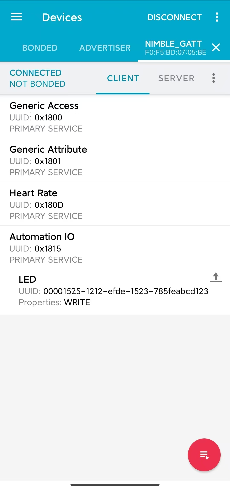

    Automation IO Service

As shown in the figure, the UUID of this LED characteristic is a 128-bit vendor-specific UUID. Click the **UPLOAD** button on the right to perform a write operation on this characteristic, as shown in the figure.

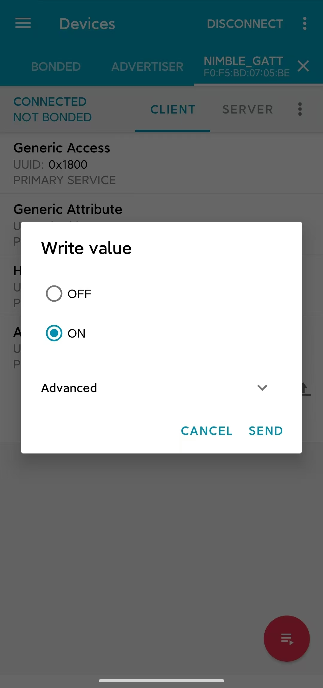

    Write to LED Characteristic Data

Select the **ON** option and send it. You should see the LED on the development board light up. Select the **OFF** option and send it, and you should observe the LED on the development board turning off again.

If your development board does not have other LED except the one for the power indicator, you should be able to observe the corresponding status indication in the log output.

Receiving Heart Rate Data
#############################

Next, click on the **Heart Rate Service**. You will see a Heart Rate Measurement characteristic under this service.

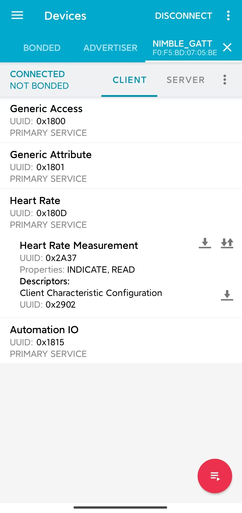

    Heart Rate Service

The UUID of the Heart Rate Measurement characteristic is `0x2A37`, which is a Bluetooth SIG-defined characteristic. Click the download button on the right to perform a read operation on the heart rate characteristic. You should see the latest heart rate measurement data appear in the `Value` field of the characteristic data section, as shown in the figure.

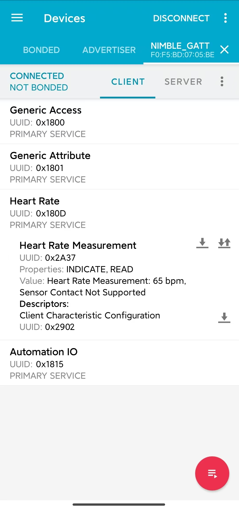

    Read Heart Rate Characteristic Data

In the application, it is best for heart rate data to be synchronized to the GATT client immediately when the measurement is updated. To achieve this, we can click the **SUBSCRIPTION** button on the far right to request the heart rate characteristic to perform an indication operation. At this point, you should be able to see the heart rate measurement data continuously updating, as shown in the figure.

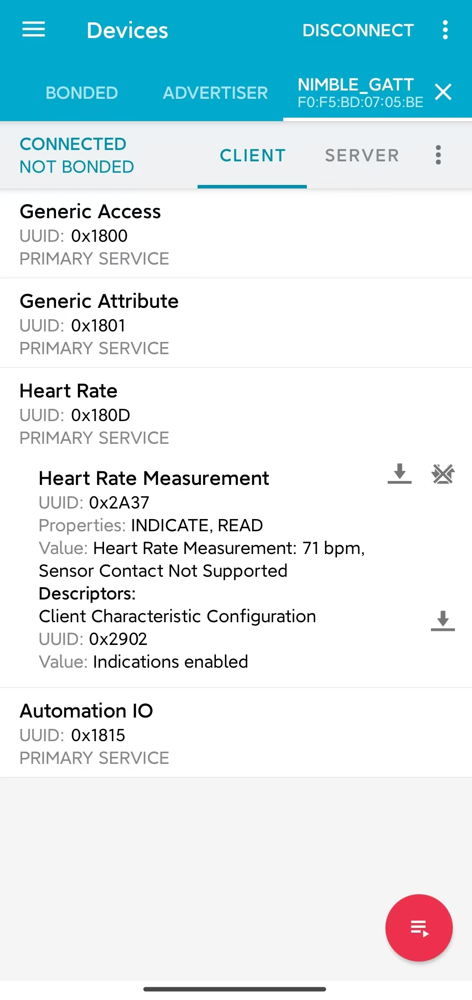

    Subscribe to Heart Rate Characteristic Data

You might have noticed that under the heart rate characteristic, there is a descriptor named *Client Characteristic Configuration* (often abbreviated as CCCD), with a UUID of `0x2902`. When you click the subscribe button, the value of this descriptor changes, which indicates that the characteristic's indications are enabled. Indeed, this descriptor is used to indicate the status of notifications or indications for the characteristic data. When you unsubscribe, the descriptor's value changes to indicate that notifications and indications are disabled.

Summary
-----------

Through this tutorial, you have learned about the layered architecture of Bluetooth LE, the basic functions of the host and controller layers in the Bluetooth LE protocol stack, and the roles of the GAP and GATT/ATT layers. Additionally, using the :example:`NimBLE_GATT_Server <bluetooth/ble_get_started/nimble/NimBLE_GATT_Server>` example, you have mastered how to build and flash Bluetooth LE applications with the ESP-IDF framework, debug the application on your phone using **nRF Connect for Mobile**, remotely control the LED on the development board, and receive randomly generated heart rate data. You've taken the first step towards becoming a Bluetooth LE developer—congratulations!
