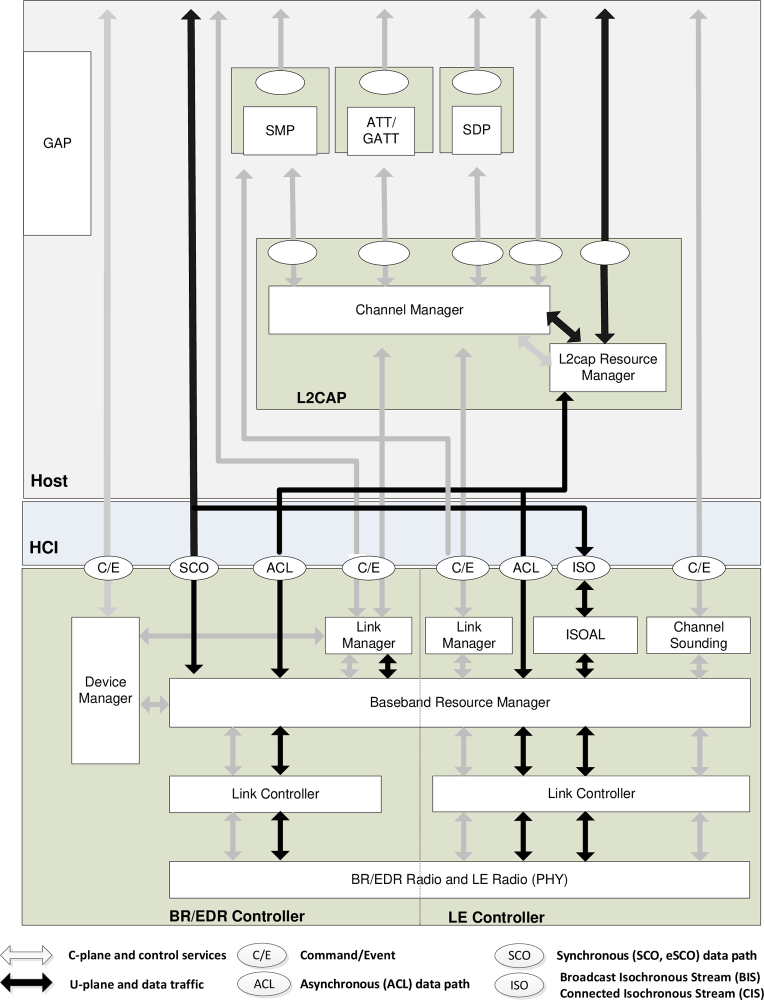

Overview
=============

:link_to_translation:`zh_CN:[中文]`

Bluetooth\ :sup:`®` wireless technology is a short-range communication standard known for its reliability, low power consumption, and cost efficiency. It is categorized into two primary types:

- **Bluetooth Classic:** Optimized for continuous, high-throughput data streaming, suitable for applications like audio transmission.
- **Bluetooth Low Energy (Bluetooth LE):** Designed for low-power, intermittent data transmission, ideal for devices such as sensors and wearables.

.. only:: esp32

   {IDF_TARGET_NAME} supports dual-mode Bluetooth, enabling both Bluetooth Classic and Bluetooth LE functionalities.

Chip Bluetooth Capability
----------------------------------

The following table summarizes the ESP chips that support Bluetooth in ESP-IDF, and their support for Bluetooth types (Y = supported, N = not supported).

.. list-table::
    :header-rows: 1

    * - Chip Series
      - Bluetooth Classic (BR/EDR)
      - Bluetooth LE
    * - ESP32
      - Y
      - Y
    * - ESP32-S3
      - N
      - Y
    * - ESP32-C2
      - N
      - Y
    * - ESP32-C3
      - N
      - Y
    * - ESP32-C5
      - N
      - Y
    * - ESP32-C6
      - N
      - Y
    * - ESP32-C61
      - N
      - Y
    * - ESP32-H2
      - N
      - Y

Bluetooth Protocol Stack
------------------------

The Bluetooth protocol stack is a layered communication architecture that defines how Bluetooth devices discover each other, establish connections, exchange data, and ensure secure and reliable communication. As shown in Figure :ref:`bluetooth-core-system-architecture`, The stack consists of two main parts: the Controller Stack and the Host Stack, which communicate via the HCI (Host Controller Interface).

.. _bluetooth-core-system-architecture:

    Bluetooth Core System Architecture (Source: Bluetooth Core Specification)

**Controller Stack**

The Controller Stack manages hardware-level operations and low-level link control. It includes:

- **PHY (Physical Layer):** Handles transmission and reception of Bluetooth signals in the 2.4 GHz ISM band.

- **Baseband:** Manages low-level timing and control functions, including frequency hopping, packet formatting, and error correction.

- **Link Controller:** Handles state machine operations for device connection and disconnection, flow control, and retransmissions.

- **Link Manager:** Manages link setup, authentication, encryption, and power control.

- **Device Manager:** Oversees device states, handles paging and inquiry processes, and manages stored link keys for security.

**Host Stack**

The Host Stack implements high-level protocols for application interaction. It includes:

- **L2CAP (Logical Link Control and Adaptation Protocol):** Handles data segmentation, reassembly, and multiplexing.

- **SMP (Security Manager Protocol):** Manages authentication, encryption, and secure pairing.

- **GAP (Generic Access Profile):** Manages device discovery, connection establishment, and defines roles and modes for Bluetooth devices.

- **ATT/GATT (Attribute Protocol/Generic Attribute Profile):** Implements attribute-based data exchange through services and characteristics, primarily in Bluetooth LE.

- **SDP (Service Discovery Protocol):** Allows devices to advertise and explore available services, mainly used in Bluetooth Classic.

.. only:: esp32

   The Bluetooth Host and Controller can be implemented on the same device or on separate devices. {IDF_TARGET_NAME} supports both approaches. Figure :ref:`bt-host-controller-structure` illustrates typical application structures.

   .. _bt-host-controller-structure:

   .. figure:: ../../../_static/bt-host-controller-structure.png
       :align: center
       :width: 70%
       :alt: {IDF_TARGET_NAME} Bluetooth Host and Controller Structure

       {IDF_TARGET_NAME} Bluetooth Host and Controller Structure

   - **Scenario 1 (Default ESP-IDF setting)**

     Bluedroid is used as the Bluetooth Host, and VHCI (software-implemented virtual HCI) facilitates communication between the Host and Controller. Both the Bluedroid and Controller run on the same device (i.e., the {IDF_TARGET_NAME} chip), eliminating the need for an external Host device.

   - **Scenario 2 (Controller-Only Mode)**

     The {IDF_TARGET_NAME} operates exclusively as a Bluetooth Controller. An external Host device (such as a Linux PC with BlueZ or an Android device with Bluedroid) manages Bluetooth operations.

   - **Scenario 3 (Testing/Certification)**

     Similar to Scenario 2, but used for Bluetooth Qualification Body (BQB) controller testing or certification. The {IDF_TARGET_NAME} chip is connected to test tools via UART.

Bluetooth Operating Environment
-------------------------------

The ESP-IDF Bluetooth implementation operates within a FreeRTOS environment, where Bluetooth tasks are assigned based on function and priority. Controller tasks have the highest priority due to their real-time requirements, except for certain inter-process communication (IPC) tasks that coordinate operations between CPU cores.

.. only:: esp32

   On {IDF_TARGET_NAME}, which operates on a dual-core FreeRTOS system, Controller tasks have the highest priority, second only to IPC tasks that manage communication between the two CPU cores. The default Bluetooth Host, Bluedroid, consists of three tasks: BTC, BTU, and HCI.

Bluedroid
---------

ESP-Bluedroid is a modified version of Android’s Bluedroid stack, supporting both Bluetooth Classic and Bluetooth LE. It consists of two layers:

- **Bluetooth Upper Layer (BTU):** Implements core protocols (L2CAP, GATT, SMP, etc.).
- **Bluetooth Transport Controller Layer (BTC):** Provides application-level APIs and manages profiles.

**Use Case:** Recommended for applications requiring both Bluetooth Classic and Bluetooth LE.

OS Adaptation
^^^^^^^^^^^^^

Bluedroid integrates with FreeRTOS by adapting system-related functions:

- **Timer (Alarm):** FreeRTOS Timer has been packaged as an Alarm, and is used to start the timer which triggers certain tasks.

- **Task (Thread):** FreeRTOS Task replaces POSIX Thread, and uses FreeRTOS Queue to trigger tasks (i.e., wake up).

- **Future Await/Ready (Semaphore):** ``xSemaphoreTake`` is packaged as ``future_await``, and ``xSemaphoreGive`` as ``future_ready``. These functions must not be called within the same task context.

- **Allocator (malloc/free):** ``malloc/free`` in the standard library is packaged as the ``Allocator`` function that reserves (mallocs) or frees memory.

Bluedroid Directory Structure
^^^^^^^^^^^^^^^^^^^^^^^^^^^^^

The ESP-IDF directory *component/bt/host/bluedroid* contains the following sub-folders:

.. code-block:: text

    ├── api
    ├── bta
    ├── btc
    ├── common/include/common
    ├── config
    ├── device
    ├── external/sbc
    ├── hci
    ├── main
    ├── stack
    └── Kconfig.in

The detailed description of each sub-folder can be found in the table below:

.. list-table:: Description of *component/bt/host/bluedroid* in ESP-IDF
    :header-rows: 1
    :widths: 20 80

    * - **Sub-folder**
      - **Description**
    * - *api*
      - The API directory, which includes all the APIs (except for those that are related to the Controller).
    * - *bta*
      - The Bluetooth adaptation layer, which is suitable for the interface of some bottom layer protocols in the host.
    * - *btc*
      - The Bluetooth control layer, which controls the upper-layer protocols (including profiles) and miscellaneous items in the host.
    * - *common*
      - Common header file for the protocol stack.
    * - *config*
      - Configure some parameters for the protocol stack.
    * - *device*
      - Related to the device control of the Controller, e.g., the basic set of HCI CMD controller processes.
    * - *external*
      - Codes that are not directly related to the Bluetooth, but are still usable, e.g., the SBC codec software programs.
    * - *hci*
      - HCI layer protocols.
    * - *main*
      - Main program (mainly to start or halt the process).
    * - *stack*
      - The bottom layer protocol stacks in the Host (GAP/ ATT/ GATT/ SDP/ SMP, etc.).
    * - *Kconfig.in*
      - Menuconfig files.
