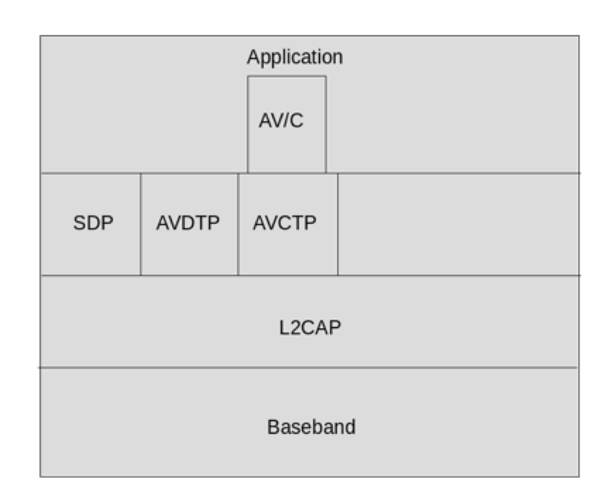

Profiles and Protocols
========================

:link_to_translation:`zh_CN:[中文]`

Protocols define message formats and procedures to accomplish specific functions, e.g., data transportation, link control, security service, and service information exchange. Bluetooth profiles, on the other hand, define the functions and features required of each layer in the Bluetooth system, from PHY to L2CAP, and any other protocols outside the core specification.

Below are the supported Bluetooth Classic protocols and profiles in ESP-Bluedroid:

- Protocols: L2CAP, SDP, AVDTP, AVCTP, RFCOMM
- Profiles: GAP, A2DP, AVRCP, SPP, HFP

The protocol model is depicted in Figure :ref:`bluetooth-protocol-model`.

.. _bluetooth-protocol-model:

    Bluetooth Protocol Model

In Figure :ref:`bluetooth-protocol-model`, L2CAP and SDP are necessary in a minimal Host Stack for Bluetooth Classic. AVDTP, AV/C, and AVCTP are outside the core specification and are used by specific profiles.

L2CAP
--------

The Bluetooth Logical Link Control and Adaptation Protocol (L2CAP) is an OSI layer 2 protocol that supports higher-level protocol multiplexing, packet segmentation, and reassembly, as well as the delivery of service information quality. L2CAP makes it possible for different applications to share an ACL-U logical link. Applications and service protocols interface with L2CAP, using a channel-oriented interface, to create connections to equivalent entities on other devices.

L2CAP channels operate in one of the six modes selected through the L2CAP channel configuration procedure. The operation modes are distinguished from the QoS that they can provide, and are utilized in different application conditions. These modes are:

- Basic L2CAP Mode
- Flow Control Mode
- Retransmission Mode
- Enhanced Retransmission Mode
- Streaming Mode
- LE Credit-Based Flow Control Mode

For ACL-U logical links, the supported operation modes are the Basic L2CAP Mode, Enhanced Retransmission Mode and Streaming Mode. For other features, the L2CAP Signaling channel is the supported fixed channel, while the Frame Check Sequence (FCS) is also a supported option.

SDP
--------

The Service Discovery Protocol (SDP) provides a means for applications to discover services offered by a peer Bluetooth device, as well as to determine the characteristics of the available services. The SDP involves communication between an SDP server and an SDP client. A server maintains a list of service records that describe the characteristics of services associated with the server. A client can retrieve this information by issuing an SDP request.

GAP
--------

The Generic Access Profile (GAP) provides a description of the modes and procedures in device discoverability, connection and security.

A2DP and AVRCP
----------------

The Advanced Audio Distribution Profile (A2DP) defines the protocols and procedures that realize the distribution of high-quality audio content in mono or stereo on ACL channels. A2DP handles audio streaming and is often used together with the Audio/Video Remote Control Profile (AVRCP), which includes the audio/video control functions. Figure :ref:`profile-dependencies` depicts the structure and dependencies of the profiles:

.. _profile-dependencies:

.. figure:: ../../../_static/profile-dependencies.png
    :align: center
    :width: 50%
    :alt: Profile Dependencies

    Profile Dependencies

As indicated in Figure :ref:`profile-dependencies`, the A2DP is dependent upon GAP, as well as the Generic Audio/Video Distribution Profile (GAVDP), which defines procedures required to set up an audio/video streaming.

A2DP defines two roles: Source (SRC) and Sink (SNK). SRC functions as a source of a digital audio stream and SNK functions as a sink of a digital audio stream delivered from the SRC.

Similarly, AVRCP defines two roles: Controller (CT) and Target (TG). CT is a device that initiates a transaction by sending a command frame to a target. Examples of CT include personal computers, PDAs, and mobile phones. TG is a device that receives a command frame and accordingly generates a response frame. Audio players or headphones are examples of TG.

In the current A2DP solution, the only audio codec supported is SBC, which is mandated in the A2DP specification. A2DP Version 1.4 and AVDTP Version 1.3 are implemented.

Audio/Video Distribution Transport Protocol (AVDTP) defines the binary transactions between Bluetooth devices for a streaming set-up, and media streaming for audio and video using L2CAP. As the basic transport protocol for A2DP, AVDTP is built upon the L2CAP layer and consists of a signaling entity for negotiating streaming parameters and a transport entity that handles the streaming itself.

The basic service of AVDTP transport capabilities is mandated by the A2DP specification. According to the configuration of current service capabilities, Media Transport and Media Codec in the basic service capability are provided.

AVRCP defines the requirements necessary for the support of the Audio/Video remote control use case. The commands used in AVRCP fall into three main categories:

- **AV/C Digital Interface Command Set:** Applied only on certain occasions and transported with the Audio/Video Control Transport Protocol (AVCTP).
- **Browsing commands:** Provides browsing functionality over another transport channel called the AVCTP browsing channel.
- **Cover Art Commands:** Used to transmit images associated with media items, and is provided through the protocol defined in the Bluetooth Basic Imaging Profile (BIP) with the OBEX protocol.

AVRCP uses two sets of AV/C commands. The first set includes the PASS THROUGH command, UNIT INFO command, and SUBUNIT INFO command, as defined in the AV/C specification. The second set consists of AVRCP-specific AV/C commands, which are defined as a Bluetooth SIG Vendor-Dependent extension.

AV/C commands are transmitted over the AVCTP control channel. The PASS THROUGH command transfers user operations from the Controller to the panel subunit via button presses, providing a straightforward mechanism for controlling the target device. For example, the operation IDs in PASS THROUGH include common commands such as Play, Pause, Stop, Volume Up, and Volume Down.

AVRCP arranges the A/V functions in four categories to ensure interoperability:

- Player/ Recorder
- Monitor/ Amplifier
- Tuner
- Menu

In the current implementation, AVRCP Version 1.6 and AVCTP Version 1.4 are provided. The default configuration for AVRCP-supported features is Category 2: Monitor/ Amplifier. Also, APIs for sending PASS THROUGH commands are provided.

A2DP and AVRCP are often used together. In the current solution, the lower Host stack implements AVDTP and the AVCTP logic, while providing interfaces for A2DP and AVRCP independently. In the upper layer of the stack, however, the two profiles combined make up the "AV" module. The BTA layer, for example, provides a unified "AV" interface, and in BTC layer there is a state machine that handles the events for both profiles. The APIs, however, are provided separately for A2DP and AVRCP.
