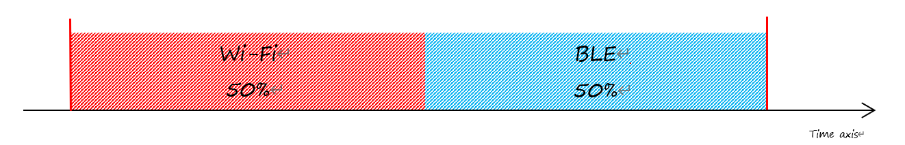

RF Coexistence
==================
:link_to_translation:`zh_CN:[中文]`

Overview
---------------

{IDF_TARGET_NAME} has only one 2.4 GHz ISM band RF module, which is shared by Bluetooth (BT & BLE) and Wi-Fi, so Bluetooth can't receive or transmit data while Wi-Fi is receiving or transmitting data and vice versa. Under such circumstances, {IDF_TARGET_NAME} uses the time-division multiplexing method to receive and transmit packets.

Supported Coexistence Scenario for {IDF_TARGET_NAME}
---------------------------------------------------------------------
.. only:: esp32c3 or esp32s3 or esp32

  .. table:: Supported Features of Wi-Fi and BLE Coexistence

      +-------+--------+-----------+-----+------------+-----------+----------+
      |                            |BLE                                      |
      +                            +-----+------------+-----------+----------+
      |                            |Scan |Advertising |Connecting |Connected |
      +-------+--------+-----------+-----+------------+-----------+----------+
      | Wi-Fi |STA     |Scan       |Y    |Y           |Y          |Y         |
      +       +        +-----------+-----+------------+-----------+----------+
      |       |        |Connecting |Y    |Y           |Y          |Y         |
      +       +        +-----------+-----+------------+-----------+----------+
      |       |        |Connected  |Y    |Y           |Y          |Y         |
      +       +--------+-----------+-----+------------+-----------+----------+
      |       |SOFTAP  |TX Beacon  |Y    |Y           |Y          |Y         |
      +       +        +-----------+-----+------------+-----------+----------+
      |       |        |Connecting |Y    |Y           |Y          |Y         |
      +       +        +-----------+-----+------------+-----------+----------+
      |       |        |Connected  |C1   |C1          |C1         |C1        |
      +       +--------+-----------+-----+------------+-----------+----------+
      |       |Sniffer |RX         |C2   |C2          |C2         |C2        |
      +       +--------+-----------+-----+------------+-----------+----------+
      |       |ESP-NOW |RX         |X    |X           |X          |X         |
      +       +        +-----------+-----+------------+-----------+----------+
      |       |        |TX         |Y    |Y           |Y          |Y         |
      +-------+--------+-----------+-----+------------+-----------+----------+

.. only:: esp32

  .. table:: Supported Features of Wi-Fi and Classic Bluetooth (BT) Coexistence

      +-------+--------+-----------+--------+-------------+-----+----------+-----------+
      |                            |BR/EDR                                             |
      +                            +--------+-------------+-----+----------+-----------+
      |                            |Inquiry |Inquiry scan |Page |Page scan | Connected |
      +-------+--------+-----------+--------+-------------+-----+----------+-----------+
      | Wi-Fi |STA     |Scan       |Y       |Y            |Y    |Y         |Y          |
      +       +        +-----------+--------+-------------+-----+----------+-----------+
      |       |        |Connecting |Y       |Y            |Y    |Y         |Y          |
      +       +        +-----------+--------+-------------+-----+----------+-----------+
      |       |        |Connected  |Y       |Y            |Y    |Y         |Y          |
      +       +--------+-----------+--------+-------------+-----+----------+-----------+
      |       |SOFTAP  |TX Beacon  |Y       |Y            |Y    |Y         |Y          |
      +       +        +-----------+--------+-------------+-----+----------+-----------+
      |       |        |Connecting |Y       |Y            |Y    |Y         |Y          |
      +       +        +-----------+--------+-------------+-----+----------+-----------+
      |       |        |Connected  |C1      |C1           |C1   |C1        |C1         |
      +       +--------+-----------+--------+-------------+-----+----------+-----------+
      |       |Sniffer |RX         |C2      |C2           |C2   |C2        |C2         |
      +       +--------+-----------+--------+-------------+-----+----------+-----------+
      |       |ESP-NOW |RX         |X       |X            |X    |X         |X          |
      +       +        +-----------+--------+-------------+-----+----------+-----------+
      |       |        |TX         |Y       |Y            |Y    |Y         |Y          |
      +-------+--------+-----------+--------+-------------+-----+----------+-----------+

.. note::

  Y: supported and performance is stable
  C1: supported but the performance is unstable
  C2: supported but the packet loss rate of Sniffer is unstable
  X: not supported

Coexistence Mechanism and Policy
------------------------------------------------

Coexistence Mechanism
^^^^^^^^^^^^^^^^^^^^^^^^^^^

The RF resource allocation mechanism is based on priority. As shown below, both Bluetooth module and Wi-Fi module request RF resources from the coexistence module, and the coexistence module decides who will use the RF resource based on their priority.

.. blockdiag::
    :scale: 100%
    :caption: Coexistence Mechanism
    :align: center

    blockdiag {

      # global attributes
      node_height = 60;
      node_width = 120;
      span_width = 100;
      span_height = 60;
      default_shape = roundedbox;
      default_group_color = none;

      # node labels
   	  Wi-Fi [shape = box];
   	  Bluetooth [shape = box];
   	  Coexistence [shape = box, label = 'Coexistence module'];
   	  RF [shape = box, label = 'RF module'];

      # node connections
   	  Wi-Fi -> Coexistence;
   	  Bluetooth  -> Coexistence;
   	  Coexistence -> RF;
    }

Coexistence Policy
^^^^^^^^^^^^^^^^^^^^^^^^^^^

Coexistence Period and Time Slice
""""""""""""""""""""""""""""""""""""""""

.. only:: esp32

  Wi-Fi, BT, and BLE have their fixed time slice to use the RF. A coexistence period is divided into 3 time slices in the order of Wi-Fi, BT, and BLE. In the Wi-Fi slice, Wi-Fi's request to the coexistence arbitration module will have higher priority. Similarly, BT/BLE can enjoy higher priority at their own time slices. The duration of the coexistence period and the proportion of each time slice are divided into four categories according to the Wi-Fi status:

.. only:: esp32c3 or esp32s3

  Wi-Fi and BLE have their fixed time slice to use the RF. In the Wi-Fi time slice, Wi-Fi will send a higher priority request to the coexistence arbitration module. Similarly, BLE can enjoy higher priority at their own time slice. The duration of the coexistence period and the proportion of each time slice are divided into four categories according to the Wi-Fi status:

.. list::

  :esp32: 1) IDLE status: the coexistence of BT and BLE is controlled by Bluetooth module.
  :esp32c3 or esp32s3: 1) IDLE status: RF module is controlled by Bluetooth module.
  #) CONNECTED status: the coexistence period starts at the Target Beacon Transmission Time (TBTT) and is more than 100 ms.
  #) SCAN status: Wi-Fi slice and coexistence period are longer than in the CONNECTED status. To ensure Bluetooth performance, the Bluetooth time slice will also be adjusted accordingly.
  #) CONNECTING status: Wi-Fi slice is longer than in the CONNECTED status. To ensure Bluetooth performance, the Bluetooth time slice will also be adjusted accordingly.

According to the coexistence logic, different coexistence periods and time slice strategies will be selected based on the Wi-Fi and Bluetooth usage scenarios. A Coexistence policy corresponding to a certain usage scenarios is called a "coexistence scheme". For example, the scenario of Wi-Fi CONNECTED and BLE CONNECTED has a corresponding coexistence scheme. In this scheme, the time slices of Wi-Fi and BLE in a coexistence period each account for 50%. The time allocation is shown in the following figure:

    Time Slice Under the Status of Wi-Fi CONNECTED and BLE CONNECTED

Dynamic Priority
""""""""""""""""""""""""""""

The coexistence module assigns different priorities to different status of Wi-Fi and Bluetooth. And the priority for each status is dynamic. For example, in every N BLE Advertising events, there is always one event with high priority. If a high-priority BLE Advertising event occurs within the Wi-Fi time slice, the right to use the RF may be preempted by BLE.

How to Use the Coexistence Feature
--------------------------------------

Coexistence API
^^^^^^^^^^^^^^^^^^^^^^^^^^^

For most coexistence cases, {IDF_TARGET_NAME} will switch the coexistence status automatically without calling API. However, {IDF_TARGET_NAME} provides two APIs for the coexistence of BLE MESH and Wi-Fi. When the status of BLE MESH changes, call :code:`esp_coex_status_bit_clear` to clear the previous status first and then call :code:`esp_coex_status_bit_set` to set the current status.

BLE MESH Coexistence Status
""""""""""""""""""""""""""""""""""

As the firmware of Wi-Fi and Bluetooth are not aware of the current scenario of the upper layer application, some coexistence schemes require application code to call the coexistence API to take effect. The application layer needs to pass the working status of BLE MESH to the coexistence module for selecting the coexistence scheme.

  - ESP_COEX_BLE_ST_MESH_CONFIG: network is provisioning
  - ESP_COEX_BLE_ST_MESH_TRAFFIC: data is transmitting
  - ESP_COEX_BLE_ST_MESH_STANDBY: in idle status with no significant data interaction

Coexistence API Error Codes
^^^^^^^^^^^^^^^^^^^^^^^^^^^^^^^^

All coexistence APIs have custom return values, i.e. error codes. These error codes can be categorized as:

  - No error. For example, the return value ESP_OK siginifies the API returned successfully.
  - Recoverable errors. For example, the return value ESP_ERR_INVALID_ARG signifies API parameter errors.

Setting Coexistence Compile-time Options
^^^^^^^^^^^^^^^^^^^^^^^^^^^^^^^^^^^^^^^^^^^^^^^

.. list::

    - After writing the coexistence program, you must check  :ref:`CONFIG_ESP32_WIFI_SW_COEXIST_ENABLE` option through menuconfig to open coexistence configuration on software, otherwise the coexistence function mentioned above cannot be used.

    :esp32: - To ensure better communication performance of Wi-Fi and Bluetooth in the case of coexistence, run the task of the Wi-Fi protocol stack, the task of the Bluetooth Controller and Host protocol stack on different CPUs. You can use :ref:`CONFIG_BTDM_CTRL_PINNED_TO_CORE_CHOICE` and :ref:`CONFIG_BT_BLUEDROID_PINNED_TO_CORE_CHOICE` (or :ref:`CONFIG_BT_NIMBLE_PINNED_TO_CORE_CHOICE`) to put the tasks of the Bluetooth controller and the host protocol stack on the same CPU, and then use :ref:`CONFIG_ESP32_WIFI_TASK_CORE_ID` to place the task of the Wi-Fi protocol stack on another CPU.

    :esp32s3: - To ensure better communication performance of Wi-Fi and Bluetooth in the case of coexistence, run the task of the Wi-Fi protocol stack, the task of the Bluetooth Controller and Host protocol stack on different CPUs. You can use :ref:`CONFIG_BT_CTRL_PINNED_TO_CORE_CHOICE` and :ref:`CONFIG_BT_BLUEDROID_PINNED_TO_CORE_CHOICE` (or :ref:`CONFIG_BT_NIMBLE_PINNED_TO_CORE_CHOICE` ）to put the tasks of the Bluetooth controller and the host protocol stack on the same CPU, and then use :ref:`CONFIG_ESP32_WIFI_TASK_CORE_ID` to place the task of the Wi-Fi protocol stack on another CPU.

    :esp32: - In the case of coexistence, BLE SCAN may be interrupted by Wi-Fi and Wi-Fi releases RF resources before the end of the current BLE scan window. In order to make BLE acquire RF resources again within the current scan window, you can check the FULL SCAN configuration option through :ref:`CONFIG_BTDM_CTRL_FULL_SCAN_SUPPORTED`.

    :esp32c3 or esp32s3: - When using LE Coded PHY during a BLE connection, to avoid affecting Wi-Fi performance due to the long duration of Bluetooth packets, you can select `BT_CTRL_COEX_PHY_CODED_TX_RX_TLIM_EN` in the sub-options of :ref:`CONFIG_BT_CTRL_COEX_PHY_CODED_TX_RX_TLIM` to limit the maximum time of TX/RX.

    - You can reduce the memory consumption by configuring the following options on menuconfig.

      1) :ref:`CONFIG_BT_BLE_DYNAMIC_ENV_MEMORY`: enable the configuration of dynamic memory for Bluetooth protocol stack.
      #) :ref:`CONFIG_ESP32_WIFI_STATIC_RX_BUFFER_NUM`: reduce the number of Wi-Fi static RX buffers.
      #) :ref:`CONFIG_ESP32_WIFI_DYNAMIC_RX_BUFFER_NUM`: reduce the number of Wi-Fi dynamic RX buffers.
      #) :ref:`CONFIG_ESP32_WIFI_TX_BUFFER`: enable the configuration of dynamic allocation TX buffers.
      #) :ref:`CONFIG_ESP32_WIFI_DYNAMIC_TX_BUFFER_NUM`: reduce the number of Wi-Fi dynamic TX buffers.
      #) :ref:`CONFIG_ESP32_WIFI_TX_BA_WIN`: reduce the number of Wi-Fi Block Ack TX windows.
      #) :ref:`CONFIG_ESP32_WIFI_RX_BA_WIN`: reduce the number of Wi-Fi Block Ack RX windows.
      #) :ref:`CONFIG_ESP32_WIFI_MGMT_SBUF_NUM`: reduce the number of Wi-Fi Management Short Buffer.
      #) :ref:`CONFIG_ESP32_WIFI_RX_IRAM_OPT`: turning off this configuration option will reduce the IRAM memory by approximately 17 KB.
      #) :ref:`CONFIG_LWIP_TCP_SND_BUF_DEFAULT`: reduce the default TX buffer size for TCP sockets.
      #) :ref:`CONFIG_LWIP_TCP_WND_DEFAULT`:  reduce the default size of the RX window for TCP sockets.
      #) :ref:`CONFIG_LWIP_TCP_RECVMBOX_SIZE`: reduce the size of the TCP receive mailbox.
      #) :ref:`CONFIG_LWIP_UDP_RECVMBOX_SIZE`: reduce the size of the UDP receive mailbox.
      #) :ref:`CONFIG_LWIP_TCPIP_RECVMBOX_SIZE`: reduce the size of TCPIP task receive mailbox.

.. note::

  Since the coexistence configuration option depends on the Bluetooth configuration option, please turn on the Bluetooth configuration option first before configuring the coexistence feature in the Wi-Fi configuration option.
