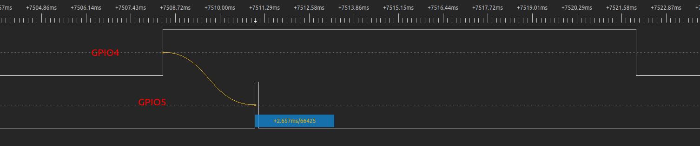

Deep-sleep Wake Stubs
=====================

:link_to_translation:`zh_CN:[中文]`

Introduction
------------

The wakeup time from Deep-sleep mode is much longer, compared to Light-sleep and Modem-sleep modes as ROM and RAM are both powered down in this case, and the CPU needs more time for SPI booting. However, {IDF_TARGET_NAME} supports running a “Deep-sleep wake stub” when coming out of Deep-sleep. This function runs immediately as soon as the chip wakes up - before any normal initialization, bootloader, or ESP-IDF code has run.

Specifically, after waking up from Deep-sleep mode, {IDF_TARGET_NAME} starts partial initialization. Then RTC fast memory will be validated with CRC. If validation passes, the wake stub code will be executed.

As {IDF_TARGET_NAME} has just woken up from Deep-sleep, most of the peripherals are in the reset state. The SPI flash has not been mapped. Thus, wake stub code can only call functions implemented in ROM or loaded into RTC fast memory, which retains content during Deep-sleep.

From the above, by utilizing the wake stub functionality in an application, you can quickly run some code when waking up from Deep-sleep mode, without having to wait for the whole boot-up process. However, the stub size is restricted by the size of RTC fast memory.

.. only:: SOC_RTC_SLOW_MEM_SUPPORTED

    {IDF_TARGET_NAME} supports RTC memory, including both RTC fast memory and RTC slow memory. The wake stub code should be loaded into RTC fast memory, with data utilized by the code being stored in RTC fast or RTC slow memory.

.. only:: not SOC_RTC_SLOW_MEM_SUPPORTED

    {IDF_TARGET_NAME} only supports RTC fast memory. The wake stub code and data that it utilizes should be loaded into RTC fast memory.

Next we will introduce how to implement the wake stub code in an application.

Implement wake stub
-------------------

The wake stub in esp-idf is realized by the function :cpp:func:`esp_wake_deep_sleep()`. This function is executed whenever the SoC wakes from Deep-sleep. As this function is weakly-linked to the default function :cpp:func:`esp_default_wake_deep_sleep()`, if your application contains a function with the name ``esp_wake_deep_sleep()``, the default version :cpp:func:`esp_default_wake_deep_sleep()` in esp-idf will be overridden.

Please note that implementing the function :cpp:func:`esp_wake_deep_sleep()` in your application is not mandatory for utilizing the Deep-sleep functionality. It becomes necessary only if you want to introduce certain behavior immediately upon the SoC's wake-up.

When you develop a customized wake stub, the first step it should do is to call the default function :cpp:func:`esp_default_wake_deep_sleep()`.

In addition, you can switch between different wake stubs by calling the function :cpp:func:`esp_set_deep_sleep_wake_stub()` during runtime.

Implementing the wake stub function in your application includes the following steps:

.. list::

    - Loading wake stub code into RTC fast memory
    :SOC_RTC_SLOW_MEM_SUPPORTED: - Loading data into RTC memory
    :not SOC_RTC_SLOW_MEM_SUPPORTED: - Loading data into RTC fast memory

Load Wake Stub Code into RTC Fast Memory
^^^^^^^^^^^^^^^^^^^^^^^^^^^^^^^^^^^^^^^^

The wake stub code can only call functions present in ROM or loaded into RTC fast memory. All other RAM locations are unintiailized and contain random data. While the wake stub code can use other RAM areas for temporary storage, the contents of these areas will be overwritten either upon returning to Deep-sleep mode or upon initiating esp-idf.

Wake stub code is a part of the main esp-idf application. During regular execution of esp-idf, functions can call the wake stub code or access RTC memory, treating them as a regular part of the application.

Wake stub code must reside in RTC fast memory. This can be realized in two ways.

- Employ the attribute ``RTC_IRAM_ATTR`` to place :cpp:func:`esp_wake_deep_sleep()` into RTC fast memory:

.. code:: c

    void RTC_IRAM_ATTR esp_wake_deep_sleep(void) {
        esp_default_wake_deep_sleep();
        // Add additional functionality here
    }

The first approach is suitable for short and simple code segments or for source files including both "normal" and "RTC" code.

- Place the function :cpp:func:`esp_wake_deep_sleep()` into any source file with name starting with ``rtc_wake_stub``. For files with such names ``rtc_wake_stub*``, their contents can be automatically put into RTC fast memory by the linker.

The second method is preferable when writing longer code segments in RTC fast memory.

.. only:: SOC_RTC_SLOW_MEM_SUPPORTED

    Load Wake Stub Data into RTC memory
    ^^^^^^^^^^^^^^^^^^^^^^^^^^^^^^^^^^^

    RTC memory must include read-only data used by the wake stub code. Data in RTC memory is initialized whenever the SoC restarts, except when waking from Deep-sleep. In such cases, the data retained before entering to Deep-sleep are kept. Data used by the wake stub code must be resident in RTC memory, i.e. RTC fast memory or in RTC slow memory.

    The data can be specified in the following two methods:

    - Utilize attributes ``RTC_DATA_ATTR`` and ``RTC_RODATA_ATTR`` to specify writable or read-only data, respectively.

    .. code:: c

        RTC_DATA_ATTR int wake_count;

        void RTC_IRAM_ATTR esp_wake_deep_sleep(void) {
            esp_default_wake_deep_sleep();
            static RTC_RODATA_ATTR const char fmt_str[] = "Wake count %d\n";
            esp_rom_printf(fmt_str, wake_count++);
        }

    The RTC memory area where the data will be placed can be configured via the menuconfig option :ref:`CONFIG_{IDF_TARGET_CFG_PREFIX}_RTCDATA_IN_FAST_MEM`. This option allows keeping slow memory area for ULP programs. Once it is enabled, the data marked with ``RTC_DATA_ATTR`` and ``RTC_RODATA_ATTR`` are placed in the RTC fast memory segment; otherwise, it goes to RTC slow memory (the default option). This option depends on the :ref:`CONFIG_FREERTOS_UNICORE` option because RTC fast memory can be accessed only by PRO_CPU.

    .. only:: esp32

        This option depends on the :ref:`CONFIG_FREERTOS_UNICORE` because RTC fast memory can be accessed only by PRO_CPU.

        The attributes ``RTC_FAST_ATTR`` and ``RTC_SLOW_ATTR`` can be used to specify data that is forcefully placed into RTC fast memory and RTC slow memory, respectively. Any access to data marked with ``RTC_FAST_ATTR`` is allowed by PRO_CPU only.

    .. only:: esp32s2 or esp32s3

        The attributes ``RTC_FAST_ATTR`` and ``RTC_SLOW_ATTR`` can be used to specify data that is forcefully placed into RTC fast memory and RTC slow memory, respectively.

.. only:: not SOC_RTC_SLOW_MEM_SUPPORTED

    Load Wake Stub Data into RTC Fast memory
    ^^^^^^^^^^^^^^^^^^^^^^^^^^^^^^^^^^^^^^^^

    Data used by wake stub code must be resident in RTC fast memory.

    The data can be specified in the following two methods:

    - Use the ``RTC_DATA_ATTR`` and ``RTC_RODATA_ATTR`` to specify writable or read-only data, respectively.

    .. code:: c

        RTC_DATA_ATTR int wake_count;

        void RTC_IRAM_ATTR esp_wake_deep_sleep(void) {
            esp_default_wake_deep_sleep();
            static RTC_RODATA_ATTR const char fmt_str[] = "Wake count %d\n";
            esp_rom_printf(fmt_str, wake_count++);
        }

    The attributes ``RTC_FAST_ATTR`` and ``RTC_SLOW_ATTR`` can be used to specify data that will be force placed into RTC fast memory and RTC slow memory respectively. However, {IDF_TARGET_NAME} includes RTC fast memory only, so both these two attributes will map to this region.

However, any string constants used in this way must be declared as arrays and marked with ``RTC_RODATA_ATTR``, as shown in the example above.

- Place the data into any source file with name starting with ``rtc_wake_stub``, as demonstrated in the example source file :example_file:`system/deep_sleep_wake_stub/main/rtc_wake_stub_example.c`.

.. code:: c

    if (s_count >= s_max_count) {
        // Reset s_count
        s_count = 0;

        // Set the default wake stub.
        // There is a default version of this function provided in esp-idf.
        esp_default_wake_deep_sleep();

        // Return from the wake stub function to continue
        // booting the firmware.
        return;
    }

The second approach is advisable when incorporating strings or more complex code segments.

You can enable the Kconfig option :ref:`CONFIG_BOOTLOADER_SKIP_VALIDATE_IN_DEEP_SLEEP` to reduce wake-up time. See more information in :doc:`Fast boot from Deep-sleep <bootloader>`.

All of the above functions are declared in :component_file:`esp_hw_support/include/esp_sleep.h`.

Application Examples
--------------------

.. only:: SOC_RTC_FAST_MEM_SUPPORTED

    - :example:`system/deep_sleep_wake_stub` demonstrates how to use the Deep-sleep wake stub on {IDF_TARGET_NAME} to quickly perform some tasks (the wake stub code) immediately after wake-up before going back to sleep.

Measure Time from Deep-sleep Wake-up to Wake Stub Execution
-------------------------------------------------------------

In certain low-power scenarios, you may want to measure the time it takes for an {IDF_TARGET_NAME} chip to wake up from Deep-sleep to executing the wake stub function.

This section describes two methods for measuring this wake-up duration.

Method 1: Estimate Using CPU Cycle Count
^^^^^^^^^^^^^^^^^^^^^^^^^^^^^^^^^^^^^^^^

This method uses the CPU's internal cycle counter to estimate the wake-up time. At the beginning of the stub (with the function type of `esp_deep_sleep_wake_stub_fn_t`), the current CPU cycle count is read and converted into time based on the running CPU frequency.

Reference example: :example:`system/deep_sleep_wake_stub`.

After running the example, you will see a log similar to:

.. code-block:: bash

    Enabling timer wakeup, 10s
    Entering deep sleep
    ESP-ROM:esp32c3-api1-20210207
    Build:Feb  7 2021
    rst:0x5 (DSLEEP),boot:0xc (SPI_FAST_FLASH_BOOT)
    wake stub: wakeup count is 1, wakeup cause is 8, wakeup cost 12734 us
    wake stub: going to deep sleep
    ESP-ROM:esp32c3-api1-20210207
    Build:Feb  7 2021
    rst:0x5 (DSLEEP),boot:0xc (SPI_FAST_FLASH_BOOT)

The ``wakeup cost 12734 us`` is time between Deep-sleep wake-up and wake stub execution.

Advantages:

- Requires no external hardware.
- Easy to implement.

Limitations:

- The measured duration may include part of the initialization flow.
- Not suitable for ultra-precise timing analysis.

Method 2: Use GPIO pins and Logic Analyzer
^^^^^^^^^^^^^^^^^^^^^^^^^^^^^^^^^^^^^^^^^^^^

You can use one GPIO pin as the wake-up source and another GPIO pin to indicate when the wake stub begins execution. By observing the timing between these GPIO transitions on a logic analyzer, you can obtain an accurate measurement of the time from wake-up to stub execution.

For example, in the screenshot below, GPIO4 functions as the wake-up source, and GPIO5 indicates when the wake stub begins execution. The timing between the high level of GPIO4 and GPIO5 is the time from wake-up to stub execution.

    Time from Wake-up to Stub Execution

The ``2.657ms`` is time between Deep-sleep wake-up and wake stub execution.

Advantages:

- High accuracy.
- Useful for validating hardware timing behavior.

Limitations:

- Requires external equipment (logic analyzer or oscilloscope).
- May require test pin wiring on custom boards.

Recommendation
^^^^^^^^^^^^^^^^

- For quick estimation or software-only testing, Method 1 is sufficient.
- For precise validation and hardware-level timing, Method 2 is recommended.
