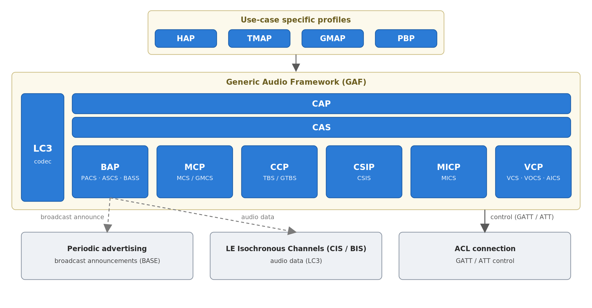

Bluetooth LE Audio Standard
===========================

:link_to_translation:`zh_CN:[中文]`

This document introduces the Bluetooth LE Audio specification: its profiles, services, the roles they define, and the dependency relationships among them. It is intended as a conceptual reference to help you choose the right set of profiles for your application before working with the :doc:`ESP-BLE-AUDIO API reference <../../api-reference/bluetooth/esp-ble-audio>`.

.. note::

   This document covers the Bluetooth LE Audio **specification** — its profiles, services, roles, and dependencies. For the **ESP-IDF implementation** architecture (the ESP-BLE-ISO and ESP-BLE-AUDIO components, their task and locking model, and the per-host adapters), see :doc:`ESP-IDF Bluetooth LE Audio Architecture <ble-audio-architecture-overview>`.

Overview
--------

Bluetooth LE Audio, introduced in the Bluetooth Core Specification 5.2, enables high-quality, low-power audio over Bluetooth LE using the following key additions to the standard:

- **LE Isochronous Channels (ISO)** — A new controller-level transport for time-synchronized, low-latency data streams, supporting both connected (CIS) and connectionless (BIS) modes.
- **LC3 Codec** — The Low Complexity Communication Codec, which provides better audio quality at lower bitrates compared to SBC.
- **Generic Audio Framework (GAF)** — A layered set of profiles and services that standardize audio stream setup, volume control, media control, call control, and device coordination.

Bluetooth LE Audio supports two fundamental audio scenarios:

- **Unicast Audio** — Bidirectional or unidirectional audio between two connected devices over Connected Isochronous Streams (CIS). Typical use cases: TWS earbuds, hearing aids, headsets, telephony.
- **Broadcast Audio (Auracast™)** — Unidirectional audio from one broadcaster to any number of receivers over Broadcast Isochronous Streams (BIS). Typical use cases: public venue audio, accessibility assistive listening, group TV listening.

Specification Overview
----------------------

The Bluetooth LE Audio specification is organized into three tiers:

1. **Transport** — The underlying Bluetooth LE transport: LE Isochronous Channels (CIS/BIS) carry the audio data, the ACL connection carries GATT/ATT profile control, and periodic advertising carries broadcast announcements. Only the isochronous channels are new to LE Audio (detailed below).
2. **Generic Audio Framework (GAF)** — The core specification suite, organized into four functional layers: stream control, content control, rendering/capture control, and transition/coordination control.
3. **Use-Case Specific Profiles** — Higher-level profiles (HAP, TMAP, GMAP, PBP) that select and configure specific GAF components for a target use case.

   The Bluetooth LE Audio stack: use-case profiles build on the Generic Audio Framework (GAF). Profile control rides GATT/ATT over the ACL connection, audio data rides the LE isochronous channels (CIS/BIS), and broadcast announcements ride periodic advertising.

Each GAF layer depends only on the layers below it. Use-case profiles select a subset of GAF layers and add role-specific constraints on top. The sections below describe each component in detail.

LE Isochronous Channels
-----------------------

LE Isochronous Channels are a feature of the Bluetooth controller, defined in the Bluetooth Core Specification. They provide the time-synchronized, low-latency data transport that Bluetooth LE Audio relies on.

.. list-table::
    :header-rows: 1
    :widths: 15 15 70

    * - Type
      - Abbreviation
      - Description
    * - Connected Isochronous Stream
      - CIS
      - Bidirectional isochronous link between two devices; requires a prior ACL connection. Multiple CIS instances can be grouped into a Connected Isochronous Group (CIG) for synchronized playback (e.g., left and right earbuds).
    * - Broadcast Isochronous Stream
      - BIS
      - Unidirectional isochronous stream from a Broadcaster to any number of Synchronized Receivers, without a prior connection. Multiple BIS instances belong to a Broadcast Isochronous Group (BIG).

ESP-IDF provides direct access to CIS and BIS via the :doc:`ESP-BLE-ISO API <../../api-reference/bluetooth/esp-ble-iso>`. When using Bluetooth LE Audio profiles (BAP and above), the ISO layer is managed automatically by the profile stack.

Generic Audio Framework
-----------------------

The Generic Audio Framework (GAF) is the core of Bluetooth LE Audio. It defines four functional layers, described below from the bottom up.

Stream Control Layer
^^^^^^^^^^^^^^^^^^^^

The stream control layer is responsible for discovering audio capabilities, setting up audio streams (codec configuration and QoS), and managing the lifecycle of CIS and BIS connections.

**Basic Audio Profile (BAP)**

BAP is the foundational profile for all Bluetooth LE Audio streaming. It defines the following roles:

- **Unicast Client** — Discovers ASEs on a remote Unicast Server, initiates codec configuration, QoS negotiation, and stream control (enable, connect, start, disable, release).
- **Unicast Server** — Exposes audio endpoints (ASEs) via ASCS and responds to client-initiated stream control procedures.
- **Broadcast Source** — Creates a BIG, configures BIS streams, and sends audio data.
- **Broadcast Sink** — Scans for and synchronizes to a Broadcast Source, receives BIS audio data.
- **Broadcast Assistant** — Scans for Broadcast Sources on behalf of a low-power Scan Delegator and writes the results to BASS on the delegator.
- **Scan Delegator** — Exposes BASS and delegates BIS scanning to a Broadcast Assistant.

BAP depends on three GATT services:

.. list-table::
    :header-rows: 1
    :widths: 35 65

    * - Service
      - Role
    * - Published Audio Capabilities Service (PACS)
      - Exposes the device's supported codecs, codec configurations, and available audio contexts. Present on both Unicast Server and Broadcast Sink.
    * - Audio Stream Control Service (ASCS)
      - Exposes one or more Audio Stream Endpoints (ASEs), each representing a sink or source data path. Present on the Unicast Server only.
    * - Broadcast Audio Scan Service (BASS)
      - Used by the Scan Delegator to expose receive state; written by the Broadcast Assistant with Broadcast Source information. Present on the Scan Delegator only.

Content Control Layer
^^^^^^^^^^^^^^^^^^^^^

The content control layer provides standardized control over the media content and telephony activity that is being rendered by the audio stream.

**Media Control Profile (MCP) and Media Control Service (MCS)**

MCP defines a **Media Control Server** (which exposes a media player via MCS) and a **Media Control Client** (which discovers and controls the player). MCS exposes media state (playing/paused/stopped), playback position, track metadata, and control point operations (play, pause, next track, seek, etc.).

MCS comes in two forms:

- **MCS** — Per-player instance, for devices with multiple concurrent media players.
- **Generic MCS (GMCS)** — A single mandatory instance that provides access to the currently active player, used by clients that do not need per-player granularity.

MCP can optionally depend on the **Object Transfer Profile (OTP)** and **Object Transfer Service (OTS)** for transferring media objects (track names, icons, object metadata) when the device supports it.

**Call Control Profile (CCP) and Telephone Bearer Service (TBS)**

CCP defines a **Call Control Server** (which exposes one or more telephone bearers via TBS) and a **Call Control Client** (which discovers and controls calls). TBS exposes call state, call URI schemes, incoming/outgoing call control, signal strength, and provider name.

TBS comes in two forms:

- **TBS** — Per-bearer instance for devices with multiple telephony bearers (e.g., separate SIM cards or VoIP applications).
- **Generic TBS (GTBS)** — A single mandatory instance that provides a unified view of all bearers.

Rendering and Capture Control Layer
^^^^^^^^^^^^^^^^^^^^^^^^^^^^^^^^^^^^^

The rendering and capture control layer provides standardized control over the audio output level and audio input gain of a device, independent of the content being played.

**Volume Control Profile (VCP)**

VCP defines a **Volume Renderer** (which exposes volume state and accepts remote control) and a **Volume Controller** (which discovers and controls the renderer). VCP depends on the following GATT services:

.. list-table::
    :header-rows: 1
    :widths: 35 15 50

    * - Service
      - Required
      - Description
    * - Volume Control Service (VCS)
      - Mandatory
      - Exposes volume setting (0–255), mute state, and a volume control point for absolute or relative volume changes.
    * - Volume Offset Control Service (VOCS)
      - Optional
      - Allows per-output volume offset adjustment (e.g., different offsets for left and right channel outputs). A VCS may include one or more VOCS instances.
    * - Audio Input Control Service (AICS)
      - Optional
      - Allows control of audio input gain and mute state for one audio input (e.g., microphone). A VCS may include one or more AICS instances.

**Microphone Control Profile (MICP)**

MICP defines a **Microphone Device** (which exposes microphone state) and a **Microphone Controller** (which discovers and mutes/unmutes it). MICP depends on the following GATT services:

.. list-table::
    :header-rows: 1
    :widths: 35 15 50

    * - Service
      - Required
      - Description
    * - Microphone Control Service (MICS)
      - Mandatory
      - Exposes the microphone mute state and a mute control point. Present on the Microphone Device.
    * - Audio Input Control Service (AICS)
      - Optional
      - Allows control of audio input gain for specific inputs. A MICS may include one or more AICS instances.

.. note::

    AICS is a shared service: it can be included by both VCS (as part of VCP) and MICS (as part of MICP), each as independent instances with separate handles.

Transition and Coordination Control Layer
^^^^^^^^^^^^^^^^^^^^^^^^^^^^^^^^^^^^^^^^^^

The transition and coordination control layer is the top of the GAF. It coordinates audio procedures across multiple devices acting as a group (e.g., a pair of TWS earbuds, or a room of speakers).

**Common Audio Profile (CAP)**

CAP is the top-level profile that defines how a single initiating device can coordinate audio operations (stream setup, volume control, microphone control) across one or more target devices. It defines three roles:

- **CAP Acceptor** — A device that accepts audio streams and volume/microphone control from a CAP Initiator or Commander. A CAP Acceptor shall support BAP Unicast Server or BAP Broadcast Sink (or both), and VCP Volume Renderer. MICP Microphone Device is optional.
- **CAP Initiator** — A device that discovers CAP Acceptors and initiates unicast or broadcast audio procedures using BAP, VCP, and MICP on one or more acceptors simultaneously.
- **CAP Commander** — A device that issues coordinated volume and microphone control commands to one or more CAP Acceptors without managing audio streams directly.

CAP depends on the **Common Audio Service (CAS)**, a mandatory GATT service on every CAP Acceptor. CAS is used for coordinated set member announcement and provides a stable discovery anchor for the CAP Initiator/Commander.

CAP also uses **CSIP** (described below) to identify and address the members of a coordinated set as a group.

**Coordinated Set Identification Profile (CSIP)**

CSIP defines how a group of devices (a "coordinated set") can be discovered and identified as belonging together. A common example is a left/right earbud pair: each earbud is a **CSIP Set Member** and a phone or source device is a **CSIP Set Coordinator**.

CSIP depends on the **Coordinated Set Identification Service (CSIS)**, which exposes:

- A **Set Identity Resolving Key (SIRK)** — Used by the Set Coordinator to match devices belonging to the same set, even across re-advertisements.
- **Set Size** — The number of members in the set.
- **Member Rank** — The rank of this device within the set (used for ordered operations).

Use-Case Specific Profiles
---------------------------

Use-case specific profiles sit on top of the GAF. Each profile selects a specific subset of GAF profiles, defines role-specific configuration constraints (e.g., codec parameters, QoS settings), and may add its own small GATT service for role advertisement.

**Hearing Access Profile (HAP)**

HAP targets hearing aid devices. It adds the concept of **hearing aid presets**: named audio configurations (e.g., "Outdoor", "Restaurant") that the user can select. HAP defines:

- **Hearing Aid** — Implements all GAF roles needed for audio reception, volume control, and (for binaural hearing aid pairs) coordinated set membership.
- **Hearing Aid Unicast Client** — Discovers hearing aids, controls presets, and manages unicast audio streams.

HAP depends on the **Hearing Access Service (HAS)** for preset read/write operations and on BAP, PACS, VCP, MICP, and CSIP from the GAF.

**Telephony and Media Audio Profile (TMAP)**

TMAP defines interoperability configurations for telephony and media use cases. It defines six roles:

.. list-table::
    :header-rows: 1
    :widths: 20 20 60

    * - Role
      - Abbreviation
      - Description
    * - Call Gateway
      - CG
      - Controls calls on a remote CT using CCP/TBS. Sends and receives bidirectional audio over CIS.
    * - Call Terminal
      - CT
      - Exposes calls via TBS; receives and sends bidirectional audio over CIS.
    * - Unicast Media Sender
      - UMS
      - Sends unidirectional media audio to one or more UMRs over CIS. Acts as BAP Unicast Client and MCP server.
    * - Unicast Media Receiver
      - UMR
      - Receives media audio from a UMS over CIS. Acts as BAP Unicast Server and VCP Volume Renderer.
    * - Broadcast Media Sender
      - BMS
      - Sends media audio to any number of BMRs over BIS. Acts as BAP Broadcast Source.
    * - Broadcast Media Receiver
      - BMR
      - Receives media audio from a BMS over BIS. Acts as BAP Broadcast Sink.

TMAP advertises its roles via the **Telephony and Media Audio Service (TMAS)**, a small GATT service containing a single TMAP Role characteristic. This allows a remote device to discover which TMAP roles the local device supports before establishing a connection. TMAP itself does not define new audio transport mechanisms; it delegates entirely to BAP (for stream setup), VCP (for volume), MCP/MCS (for media control in UMS/UMR), and CCP/TBS (for call control in CG/CT).

**Gaming Audio Profile (GMAP)**

GMAP targets gaming audio products with parameters tuned for lower transport latency and fewer retransmissions. It defines four roles:

.. list-table::
    :header-rows: 1
    :widths: 20 20 60

    * - Role
      - Abbreviation
      - Description
    * - Unicast Game Gateway
      - UGG
      - Sends game audio to UGTs and optionally receives voice audio back. Acts as BAP Unicast Client.
    * - Unicast Game Terminal
      - UGT
      - Receives game audio from a UGG and optionally sends voice audio back. Acts as BAP Unicast Server.
    * - Broadcast Game Sender
      - BGS
      - Sends game audio over BIS. Acts as BAP Broadcast Source.
    * - Broadcast Game Receiver
      - BGR
      - Receives game audio over BIS. Acts as BAP Broadcast Sink.

GMAP advertises roles via the **Gaming Audio Service (GMAS)** and depends on BAP for stream setup and VCP for volume control.

**Public Broadcast Profile (PBP)**

PBP standardizes the metadata format used by a public broadcast source so that any compatible receiver can discover and synchronize to it without prior pairing. It defines:

- **Public Broadcast Source** — Advertises Auracast™ audio streams with standardized extended advertising data including the Broadcast Audio Announcement and Public Broadcast Announcement. Delegates to BAP Broadcast Source for BIS setup.
- **Public Broadcast Sink** — Scans for PBP sources, reads the announcement metadata to determine audio quality and content, and synchronizes to the BIG. Delegates to BAP Broadcast Sink.

PBP depends entirely on BAP for the underlying broadcast transport; it does not define a new GATT service.

Profile and Service Dependencies
--------------------------------

The diagram below expands each abbreviation to its full name and shows the layered dependency hierarchy — solid arrows are a depends-on relationship, dotted arrows an optional included sub-service. The tables that follow give the exact per-profile dependencies.

.. mermaid::

   %%{init: {'flowchart': {'nodeSpacing': 35, 'rankSpacing': 65}}}%%
   flowchart LR
       HAP["HAP (Hearing Access Profile)"]
       TMAP["TMAP (Telephony and Media Audio Profile)"]
       GMAP["GMAP (Gaming Audio Profile)"]
       PBP["PBP (Public Broadcast Profile)"]
       CAP["CAP (Common Audio Profile)"]
       VCP["VCP (Volume Control Profile)"]
       MICP["MICP (Microphone Control Profile)"]
       CSIP["CSIP (Coordinated Set Identification Profile)"]
       MCP["MCP (Media Control Profile)"]
       CCP["CCP (Call Control Profile)"]
       BAP["BAP (Basic Audio Profile)"]
       HAS["HAS (Hearing Access Service)"]
       TMAS["TMAS (Telephony and Media Audio Service)"]
       GMAS["GMAS (Gaming Audio Service)"]
       CAS["CAS (Common Audio Service)"]
       PACS["PACS (Published Audio Capabilities Service)"]
       ASCS["ASCS (Audio Stream Control Service)"]
       BASS["BASS (Broadcast Audio Scan Service)"]
       CSIS["CSIS (Coordinated Set Identification Service)"]
       VCS["VCS (Volume Control Service)"]
       MICS["MICS (Microphone Control Service)"]
       MCS["MCS / GMCS (Media Control Service)"]
       TBS["TBS / GTBS (Telephone Bearer Service)"]
       VOCS["VOCS (Volume Offset Control Service)"]
       AICS["AICS (Audio Input Control Service)"]
       OTS["OTS (Object Transfer Service)"]
       HAP --> CAP
       TMAP --> CAP & MCP & CCP
       GMAP --> CAP
       PBP --> BAP
       CAP --> BAP & VCP & MICP & CSIP
       CAP --> CAS
       HAP --> HAS
       TMAP --> TMAS
       GMAP --> GMAS
       BAP --> PACS & ASCS & BASS
       VCP --> VCS
       MICP --> MICS
       CSIP --> CSIS
       MCP --> MCS
       CCP --> TBS
       VCS -.-> VOCS & AICS
       MICS -.-> AICS
       MCS -.-> OTS
       CAP ~~~ MCP
       CAP ~~~ CCP
       classDef uc fill:#dbe8ff,stroke:#5b8def,color:#173;
       classDef coord fill:#ffe6c7,stroke:#e0922f;
       classDef ctrl fill:#e3f6da,stroke:#5aa84f;
       classDef svc fill:#efe3ff,stroke:#9a6fd6;
       classDef opt fill:#f0f0f0,stroke:#9e9e9e,color:#555;
       class HAP,TMAP,GMAP,PBP uc;
       class CAP,BAP coord;
       class VCP,MICP,CSIP,MCP,CCP ctrl;
       class HAS,TMAS,GMAS,CAS,PACS,ASCS,BASS,CSIS,VCS,MICS,MCS,TBS svc;
       class VOCS,AICS,OTS opt;

Profile-to-Service Dependencies
^^^^^^^^^^^^^^^^^^^^^^^^^^^^^^^^^

.. list-table::
    :header-rows: 1
    :widths: 22 20 58

    * - Profile
      - Depends on (Services)
      - Notes
    * - BAP
      - PACS, ASCS, BASS
      - PACS on Unicast Server and Broadcast Sink; ASCS on Unicast Server only; BASS on Scan Delegator only.
    * - VCP
      - VCS (mandatory), VOCS (optional), AICS (optional)
      - VOCS and AICS are sub-included services within VCS; each may have multiple instances.
    * - MICP
      - MICS (mandatory), AICS (optional)
      - AICS is a sub-included service within MICS.
    * - CAP
      - CAS (mandatory)
      - CAS must be present on every CAP Acceptor. CAP also uses BAP, VCP, MICP, and CSIP procedures.
    * - CSIP
      - CSIS (mandatory)
      - CSIS on the Set Member device.
    * - MCP
      - MCS / GMCS (mandatory), OTS (optional)
      - GMCS is the single mandatory generic instance; per-player MCS instances are optional. OTS is used when media objects are available.
    * - CCP
      - TBS / GTBS (mandatory)
      - GTBS is the single mandatory generic instance; per-bearer TBS instances are optional.
    * - HAP
      - HAS (mandatory)
      - HAS for preset control. HAP also mandates BAP, PACS, VCP, MICP, and CSIP (for binaural sets).
    * - TMAP
      - TMAS (mandatory)
      - TMAS contains only the TMAP Role characteristic. TMAP delegates stream and control operations to BAP, VCP, MCP, and CCP.
    * - GMAP
      - GMAS (mandatory)
      - GMAS contains only the GMAP Role characteristic. GMAP delegates to BAP and VCP.
    * - PBP
      - None (no dedicated service)
      - PBP uses BAP Broadcast Source/Sink and standardized extended advertising metadata only.

Profile-to-Profile Dependencies
^^^^^^^^^^^^^^^^^^^^^^^^^^^^^^^^^

.. list-table::
    :header-rows: 1
    :widths: 22 22 56

    * - Profile
      - Depends on (Profiles)
      - Notes
    * - CAP Initiator / Commander
      - BAP, VCP, MICP, CSIP
      - Uses BAP for stream setup, VCP and MICP for rendering/capture control, CSIP to address a coordinated set of Acceptors.
    * - HAP
      - BAP, VCP, MICP, CSIP, CAP
      - CAP Acceptor role is mandatory on Hearing Aid devices. CSIP is required for binaural hearing aid pairs.
    * - TMAP CG / CT
      - BAP (unicast), VCP, CCP
      - CG also acts as MCP server (media proxy) in some implementations.
    * - TMAP UMS / UMR
      - BAP (unicast), VCP, MCP
      - —
    * - TMAP BMS / BMR
      - BAP (broadcast), VCP
      - —
    * - GMAP UGG / UGT
      - BAP (unicast), VCP
      - —
    * - GMAP BGS / BGR
      - BAP (broadcast), VCP
      - —
    * - PBP Source / Sink
      - BAP (broadcast)
      - —

Typical Use-Case Profiles
^^^^^^^^^^^^^^^^^^^^^^^^^^

The table below maps common product types to the profiles they require.

.. list-table::
    :header-rows: 1
    :widths: 30 70

    * - Product Type
      - Required Profiles / Roles
    * - TWS Earbuds (receiver side)
      - CAP Acceptor, BAP Unicast Server, VCP Volume Renderer, CSIP Set Member, MICP Microphone Device (if mic present)
    * - Phone / Audio Source
      - CAP Initiator, BAP Unicast Client, VCP Volume Controller, CSIP Set Coordinator
    * - Hearing Aid
      - HAP Hearing Aid, CAP Acceptor, BAP Unicast Server, VCP Volume Renderer, CSIP Set Member (for binaural pair)
    * - TV / Broadcast Source
      - BAP Broadcast Source, PBP Public Broadcast Source (for Auracast™)
    * - Hearing Loop Receiver
      - BAP Broadcast Sink, PBP Public Broadcast Sink
    * - Telephony Headset
      - TMAP CT + UMR (or CG + UMS for gateway side), VCP, CCP
    * - Gaming Headset
      - GMAP UGT (receiver), BAP Unicast Server, VCP Volume Renderer
    * - Media Sender (audio bar)
      - TMAP UMS (or BMS for broadcast), BAP, MCP/MCS server, VCP
