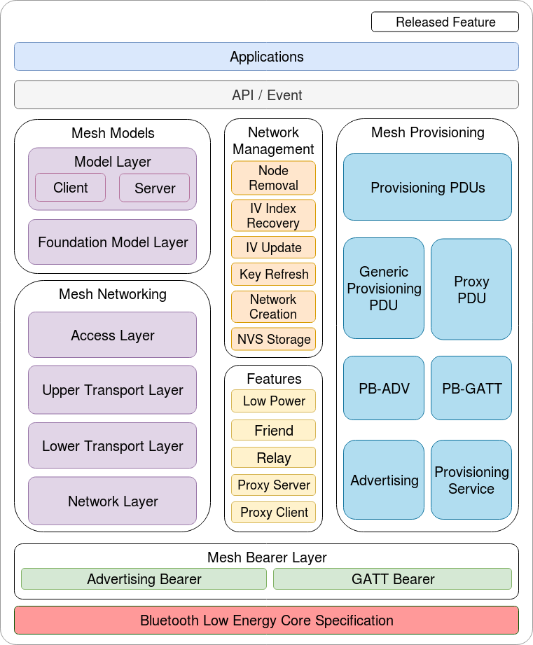
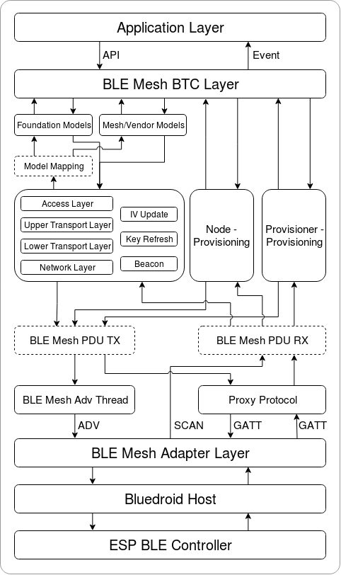

ESP-BLE-MESH Architecture
=========================

:link_to_translation:`zh_CN:[中文]`

This document introduces ESP-BLE-MESH architecture overview, ESP-BLE-MESH architecture implementation as well as ESP-BLE-MESH auxiliary routines.

- ESP-BLE-MESH Architecture Overview

  - Describes the five major parts of ESP-BLE-MESH architecture and the functionality of each part.

- ESP-BLE-MESH Architecture Implementation

  - Describes the basic functions of ESP-BLE-MESH files, the correspondence between files and ESP-BLE-MESH architecture, and the interface for calling among files.

- ESP-BLE-MESH Auxiliary Routines

  - Describe the auxiliary routines of ESP-BLE-MESH, such as Mesh network management, Mesh features, etc.

1. ESP-BLE-MESH Architecture Overview
-------------------------------------

Currently ESP-BLE-MESH has implemented most functions of Mesh Profile and all the Client Models defined in Mesh Model specification. Those missing functions/models are under development and will be provided soon. ESP-BLE-MESH architecture has been granted the official Bluetooth `certification <https://launchstudio.bluetooth.com/ListingDetails/76255>`__.

  Figure 1.1 ESP-BLE-MESH Architecture Diagram

ESP-BLE-MESH architecture includes five key parts:

- ``Mesh Protocol Stack``

  - ``Mesh Networking`` is responsible for processing of messages of ESP-BLE-MESH nodes.
  - ``Mesh Provisioning`` is responsible for provisioning flow of ESP-BLE-MESH devices.
  - ``Mesh Models`` is responsible for the implementation of SIG-defined models.

- ``Network Management``

  - Implements several network management procedures, including node removal procedure, IV Index recovery procedure, etc.

- ``Features``

  - Include several ESP-BLE-MESH features, e.g., Low Power feature, Friend feature, Relay feature, etc.

- ``Mesh Bearer Layer``

  - Includes ``Advertising Bearer`` and ``GATT Bearer``. The bearer layer is crucial to ESP-BLE-MESH protocol stack which is built on Bluetooth Low-Energy technology, because the protocol stack must make use of the bearer layer to transmit data via the BLE advertising channel and connection channel.

- ``Applications``

  - Based on ESP-BLE-MESH protocol stack and ``Mesh Models``.
  - By calling API and handling Event, ``Applications`` interact with ``Mesh Networking`` and ``Mesh Provisioning`` in ESP-BLE-MESH protocol stack, as well as a series of Models provided by ``Mesh Models``.

1.1 Mesh Protocol Stack
-----------------------

1.1.1 Mesh Networking
^^^^^^^^^^^^^^^^^^^^^

``Mesh Networking`` in the protocol stack architecture implements the following functions:

- The communication between nodes in the Mesh network.
- Encryption and decryption of messages in the Mesh network.
- Management of Mesh network resources (Network Key, IV Index, etc.).
- Segmentation and reassembly of Mesh network messages.
- Model mapping of messages between different models.
- For more features, please see :doc:`ble-mesh-feature-list`.

The implementation of ``Mesh Networking`` functions is based on hierarchy structure. Functions of each layer are shown in Table 1.1:

.. list-table:: Table 1.1  Mesh Networking Architecture Description
  :widths: 40 150
  :header-rows: 1

  * - Layer
    - Function
  * - Access Layer
    - Access Layer not only defines the format of application data, but also defines and controls the encryption and decryption of the data packets conducted by Upper Transport Layer.
  * - Upper Transport Layer
    - Upper Transport Layer encrypts, decrypts, and authenticates application data to and from the access layer; it also handles special messages called "transport control messages", including messages related to "friendship" and heartbeat messages.
  * - Lower Transport Layer
    - Lower Transport Layer handles segmentation and reassembly of PDU.
  * - Network Layer
    - Network Layer defines the address type and format of the network messages, and implements the relay function of the device.

1.1.2 Mesh Provisioning
^^^^^^^^^^^^^^^^^^^^^^^

``Mesh Provisioning`` in the protocol stack architecture implements the following functions:

- Provisioning of unprovisioned devices.
- Allocation of Mesh network resources (unicast address, IV Index, NetKey, etc.).
- Four authentication methods support during provisioning.
- For more features, please see :doc:`ble-mesh-feature-list`.

The implementation of ``Mesh Provisioning`` functions is based on hierarchy structure. Functions of each layer are shown in Table 1.2:

.. list-table:: Table 1.2  Mesh Provisioning Architecture Description
  :widths: 40 150
  :header-rows: 1

  * - Layer
    - Function
  * - Provisioning PDUs
    - Provisioning PDUs from different layers are handled using provisioning protocol.
  * - Generic Provisioning PDU/Proxy PDU
    - The Provisioning PDUs are transmitted to an unprovisioned device using a Generic Provisioning layer or Proxy protocol layer.
  * - PB-ADV/PB-GATT
    - These layers define how the Provisioning PDUs are transmitted as transactions that can be segmented and reassembled.
  * - Advertising/Provisioning Service
    - The provisioning bearers define how sessions are established such that the transactions from the generic provisioning layer can be delivered to a single device.

1.1.3 Mesh Models
^^^^^^^^^^^^^^^^^

``Mesh Models`` in the protocol stack architecture implements the following functions:

- Configuration Client/Server Models
- Health Client/Server Models
- Generic Client/Server Models
- Sensor Client/Server Models
- Time and Scenes Client/Server Models
- Lighting Client/Server Models

Functions of each layer are shown in Table 1.3:

.. list-table:: Table 1.3  Mesh Models Architecture Description
  :widths: 40 150
  :header-rows: 1

  * - Layer
    - Function
  * - Model Layer
    - Model Layer implements models used to standardize the operation of typical user scenarios, including Generic Client/Server Models, Sensor Client/Server Models, Time and Scenes Client/Server Models, Lighting Client/Server Models and several vendor models.
  * - Foundation Model Layer
    - Foundation Model Layer implements models related to ESP-BLE-MESH configuration, management, self diagnosis, etc.

1.2 Mesh Network Management
---------------------------

``Network Management`` implements the following functions:

- Node removal procedure is used to remove a node from the network.
- IV Index recovery procedure is used to recover a node's IV Index.
- IV update procedure is used to update the nodes' IV Index.
- Key refresh procedure is used to update the nodes' NetKey, AppKey, etc.
- Network creation procedure is used to create a mesh network.
- NVS storage is used to store node's networking information.

1.3 Mesh Features
-----------------

``Features`` includes the following options:

- Low Power feature is used to reduce node's power consumption.
- Friend feature is used to store messages for Low Power nodes.
- Relay feature is used to relay/forward Network PDUs received by a node over the advertising bearer.
- Proxy Server/Client are two node roles in proxy protocol, which enable nodes to send and receive Network PDUs, mesh beacons, proxy configuration messages and Provisioning PDUs over a connection-oriented bearer.

1.4 Mesh Bearer Layer
---------------------

``Bearers`` in the protocol stack architecture are responsible for passing of data between ESP-BLE-MESH protocol stack and Bluetooth Low Energy Core.

``Bearers`` can be taken as a carrier layer based on Bluetooth Low Energy Core, which implements the function of receiving and transmitting data for the ESP-BLE-MESH protocol stack.

.. list-table:: Table 1.3  Mesh Bearers Description
  :widths: 40 150
  :header-rows: 1

  * - Layer
    - Function
  * - GATT Bearer
    - The GATT Bearer uses the Proxy protocol to transmit and receive ``Proxy PDUs`` between two devices over a GATT connection.
  * - Advertising Bearer
    - When using the Advertising Bearer, a mesh packet shall be sent in the Advertising Data of a ``Bluetooth Low Energy advertising PDU`` using the Mesh Message AD Type.

1.5 Mesh Applications
---------------------

The ``Applications`` in the protocol stack architecture implement the corresponding functions by calling the API provided by the ESP-BLE-MESH protocol stack and processing the Event reported by the protocol stack. There are some common applications, such as gateway, lighting and etc.

Interaction between application layer (``Applications``) and ``API/Event``

- Application layer calls API

  - Call the provisioning-related API for provisioning.
  - Call the model-related API to send messages.
  - Call the device-attributes-related API to get local information about the device.

- Application layer processes Event

  The application layer is designed based on events, which take parameters to the application layer. Events are mainly divided into two categories.

    - The events completed by calling API.
        - Such as nodes sending messages.
    - The events that the protocol stack actively reports to the application layer.
        - The Event that the protocol stack actively reports.
        - The Event that Model actively reports.

- The event is reported by the callback function registered by the application layer, and the callback function also contains the corresponding processing of the event.

Interaction between ``API / Event`` and ESP-BLE-MESH protocol stack

- API used by user mainly calls functions provided by ``Mesh Networking``, ``Mesh Provisioning`` and ``Mesh Models``.

- The interaction between ``API / Event`` and the protocol stack does not operate across the hierarchy of the protocol stack. For example, API does not call functions related to ``Network Layer``.

2. ESP-BLE-MESH Architecture Implementation
-------------------------------------------

The design and implementation of ESP-BLE-MESH architecture is based on layers and modules. In details, Section 2.1 (Mesh Networking Implementation), Section 2.2 (Mesh Provisioning Implementation) and Section 2.3 (Mesh Bearers Implementation) are based on layers, and Section 2.4 (Mesh Models Implementation) is on modules.

- **Layer-based Approach**: With Layer-based approach, the architecture is designed according to the layers specified in the Mesh Profile Specification. Each layer has its unique files which include APIs of this layer and etc. The specific design is shown in Figure 2.1.

- **Module-based Approach**: Every file implements an independent function that can be called by other programs.

  Figure 2.1 ESP-BLE-MESH Architecture Implementation Diagram

The design of ESP-BLE-MESH architecture uses layer-based approach. The sequence of layers which data packets are processed through is fixed, i.e., the processing of packets will form a ``message flow``. Thus, we could see flows of messages from the Protocol Stack Interface Diagram in Figure 2.1.

2.1 Mesh Protocol Stack Implementation
--------------------------------------

2.1.1 Mesh Networking Implementation
^^^^^^^^^^^^^^^^^^^^^^^^^^^^^^^^^^^^

The list of files and the functions implemented in each file in ``Mesh Networking`` are shown in Table 2.1:

.. list-table:: Table 2.1  Mesh Networking File Description
   :widths: 40 150
   :header-rows: 1

  * - File
    - Functionality
  * - :component_file:`access.c <bt/esp_ble_mesh/core/access.c>`
    - ESP-BLE-MESH Access Layer
  * - :component_file:`transport.c <bt/esp_ble_mesh/core/transport.c>`
    - ESP-BLE-MESH Lower/Upper Transport Layer
  * - :component_file:`net.c <bt/esp_ble_mesh/core/net.c>`
    - ESP-BLE-MESH Network Layer
  * - :component_file:`adv.c <bt/esp_ble_mesh/core/adv.c>`
    - A task used to send ESP-BLE-MESH advertising packets, a callback used to handle received advertising packets and APIs used to allocate adv buffers

2.1.2 Mesh Provisioning Implementation
^^^^^^^^^^^^^^^^^^^^^^^^^^^^^^^^^^^^^^

The implementation of Mesh Provisioning is divided into two chunks due to the Node/Provisioner coexistence.

Specific files that provide implementation of provisioning of Node are shown in Table 2.2:

.. list-table:: Table 2.2  Mesh Provisioning (Node) File Description
  :widths: 40 150
  :header-rows: 1

  * - File
    - Functionality
  * - :component_file:`prov_node.c <bt/esp_ble_mesh/core/prov_node.c>`
    - ESP-BLE-MESH Node provisioning (PB-ADV & PB-GATT)
  * - :component_file:`proxy_server.c <bt/esp_ble_mesh/core/proxy_server.c>`
    - ESP-BLE-MESH Proxy Server related functionalities
  * - :component_file:`beacon.c <bt/esp_ble_mesh/core/beacon.c>`
    - APIs used to handle ESP-BLE-MESH Beacons

Specific files that implement functions of Provisioner are shown in Table 2.3:

.. list-table:: Table 2.3  Mesh Provisioning (Provisioner) File Description
  :widths: 40 150
  :header-rows: 1

  * - File
    - Functionality
  * - :component_file:`prov_pvnr.c <bt/esp_ble_mesh/core/prov_pvnr.c>`
    - ESP-BLE-MESH Provisioner provisioning (PB-ADV & PB-GATT)
  * - :component_file:`proxy_client.c <bt/esp_ble_mesh/core/proxy_client.c>`
    - ESP-BLE-MESH Proxy Client related functionalities
  * - :component_file:`pvnr_mgmt.c <bt/esp_ble_mesh/core/pvnr_mgmt.c>`
    - ESP-BLE-MESH Provisioner networking related functionalities

2.1.3 Mesh Models Implementation
^^^^^^^^^^^^^^^^^^^^^^^^^^^^^^^^

Mesh Models are used to implement the specific functions of model in nodes. Server model is used to maintain node status. Client model is used to obtain and modify node state.

.. list-table:: Table 2.4  Mesh Models File Description
  :widths: 40 150
  :header-rows: 1

  * - File
    - Functionality
  * - :component_file:`cfg_cli.c <bt/esp_ble_mesh/core/cfg_cli.c>`
    - Send Configuration Client messages and receive corresponding response messages
  * - :component_file:`cfg_srv.c <bt/esp_ble_mesh/core/cfg_srv.c>`
    - Receive Configuration Client messages and send proper response messages
  * - :component_file:`health_cli.c <bt/esp_ble_mesh/core/health_cli.c>`
    - Send Health Client messages and receive corresponding response messages
  * - :component_file:`health_srv.c <bt/esp_ble_mesh/core/health_srv.c>`
    - Receive Health Client messages and send proper response messages
  * - :component_file:`client_common.c <bt/esp_ble_mesh/models/client/client_common.c>`
    - ESP-BLE-MESH model related operations
  * - :component_file:`generic_client.c <bt/esp_ble_mesh/models/client/generic_client.c>`
    - Send ESP-BLE-MESH Generic Client messages and receive corresponding response messages
  * - :component_file:`lighting_client.c <bt/esp_ble_mesh/models/client/lighting_client.c>`
    - Send ESP-BLE-MESH Lighting Client messages and receive corresponding response messages
  * - :component_file:`sensor_client.c <bt/esp_ble_mesh/models/client/sensor_client.c>`
    - Send ESP-BLE-MESH Sensor Client messages and receive corresponding response messages
  * - :component_file:`time_scene_client.c <bt/esp_ble_mesh/models/client/time_scene_client.c>`
    - Send ESP-BLE-MESH Time Scene Client messages and receive corresponding response messages
  * - :component_file:`generic_server.c <bt/esp_ble_mesh/models/server/generic_server.c>`
    - Receive ESP-BLE-MESH Generic Client messages and send corresponding response messages
  * - :component_file:`lighting_server.c <bt/esp_ble_mesh/models/server/lighting_server.c>`
    - Receive ESP-BLE-MESH Lighting Client messages and send corresponding response messages
  * - :component_file:`sensor_server.c <bt/esp_ble_mesh/models/server/sensor_server.c>`
    - Receive ESP-BLE-MESH Sensor Client messages and send corresponding response messages
  * - :component_file:`time_scene_server.c <bt/esp_ble_mesh/models/server/time_scene_server.c>`
    - Receive ESP-BLE-MESH Time Scene Client messages and send corresponding response messages

2.2 Mesh Bearers Implementation
^^^^^^^^^^^^^^^^^^^^^^^^^^^^^^^

Portability is fully considered in the implementation of Mesh Bearers. When the ESP-BLE-MESH protocol stack is being ported to other platforms, users only need to modify :component_file:`adapter.c <bt/esp_ble_mesh/core/bluedroid_host/adapter.c>` (example of :component_file:`NimBLE version <bt/esp_ble_mesh/core/nimble_host/adapter.c>`).

.. list-table:: Table 2.5  Mesh Bearers File Description
  :widths: 40 150
  :header-rows: 1

  * - File
    - Functionality
  * - :component_file:`adapter.c <bt/esp_ble_mesh/core/bluedroid_host/adapter.c>`
    - ESP-BLE-MESH Bearer Layer adapter，This file provides the interfaces used to receive and send ESP-BLE-MESH ADV & GATT related packets.

.. note::

  :component_file:`adapter.c <bt/esp_ble_mesh/core/bluedroid_host/adapter.c>` is the implementation of ``Advertising Bearer`` and ``GATT Bearer`` in Mesh Networking framework.

2.3 Mesh Applications Implementation
^^^^^^^^^^^^^^^^^^^^^^^^^^^^^^^^^^^^

We have provided a series of application examples for customer development, and users can develop products based on :ref:`esp-ble-mesh-examples`.

3. Auxiliary Routine
---------------------

Auxiliary routine refers to optional functions in the ESP-BLE-MESH protocol stack. The design of the auxiliary routine generally implement the truncation of code through :ref:`CONFIG_BLE_MESH`.

3.1 Features
^^^^^^^^^^^^

- Low Power
- Friend
- Relay
- Proxy Client/Server

3.2 Network Management
^^^^^^^^^^^^^^^^^^^^^^

- Node Removal procedure
- IV Index Recovery procedure
- IV Update procedure
- Key Refresh procedure
- Network Creation procedure
- NVS Storage

3.3 Auxiliary Routine Implementation
^^^^^^^^^^^^^^^^^^^^^^^^^^^^^^^^^^^^

When adopting the design of independent module, the two main factors should be considered:

- The module can not be implemented hierarchically, and it can be completely independent, which means it does not rely on the implementation of other modules.
- The functions in the module will be used repeatedly, so it is reasonable to design it into a module. Independent module is shown in Table 3.1:

.. list-table:: Table 3.1 Module File Description
  :widths: 40 150
  :header-rows: 1

  * - File
    - Functionality
  * - :component_file:`lpn.c <bt/esp_ble_mesh/core/lpn.c>`
    - ESP-BLE-MESH Low Power functionality
  * - :component_file:`friend.c <bt/esp_ble_mesh/core/friend.c>`
    - ESP-BLE-MESH Friend functionality
  * - :component_file:`net.c <bt/esp_ble_mesh/core/net.c>`
    - ESP-BLE-MESH Relay feature, network creation, IV Update procedure, IV Index recovery procedure, Key Refresh procedure related functionalities
  * - :component_file:`proxy_server.c <bt/esp_ble_mesh/core/proxy_server.c>`
    - ESP-BLE-MESH Proxy Server related functionalities
  * - :component_file:`proxy_client.c <bt/esp_ble_mesh/core/proxy_client.c>`
    - ESP-BLE-MESH Proxy Client related functionalities
  * - :component_file:`settings.c <bt/esp_ble_mesh/core/storage/settings.c>`
    - ESP-BLE-MESH NVS storage functionality
  * - :component_file:`main.c <bt/esp_ble_mesh/core/main.c>`
    - ESP-BLE-MESH stack initialize, stack enable, node removal related functionalities
