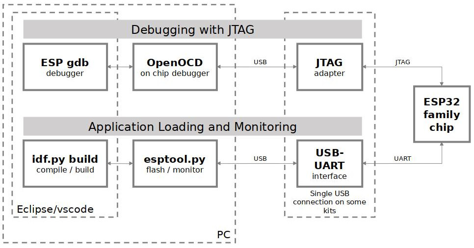

JTAG Debugging
==============
:link_to_translation:`zh_CN:[中文]`

This document provides a guide to installing OpenOCD for {IDF_TARGET_NAME} and debugging using
GDB. The document is structured as follows:

:ref:`jtag-debugging-introduction`
    Introduction to the purpose of this guide.
:ref:`jtag-debugging-how-it-works`
    Description how {IDF_TARGET_NAME}, JTAG interface, OpenOCD and GDB are interconnected and working together to enable debugging of {IDF_TARGET_NAME}.
:ref:`jtag-debugging-selecting-jtag-adapter`
    What are the criteria and options to select JTAG adapter hardware.
:ref:`jtag-debugging-setup-openocd`
    Procedure to install OpenOCD and verify that it is installed.
:ref:`jtag-debugging-configuring-target`
    Configuration of OpenOCD software and set up JTAG adapter hardware that will make together a debugging target.
:ref:`jtag-debugging-launching-debugger`
    Steps to start up a debug session with GDB from :ref:`jtag-debugging-using-debugger-eclipse` and from :ref:`jtag-debugging-using-debugger-command-line`.
:ref:`jtag-debugging-examples`
    If you are not familiar with GDB, check this section for debugging examples provided from :ref:`jtag-debugging-examples-eclipse` as well as from :ref:`jtag-debugging-examples-command-line`.
:ref:`jtag-debugging-building-openocd`
    Procedure to build OpenOCD from sources for :doc:`Windows <building-openocd-windows>`, :doc:`Linux <building-openocd-linux>` and :doc:`MacOS <building-openocd-macos>` operating systems.
:ref:`jtag-debugging-tips-and-quirks`
    This section provides collection of tips and quirks related JTAG debugging of {IDF_TARGET_NAME} with OpenOCD and GDB.

.. include:: {IDF_TARGET_TOOLCHAIN_NAME}.inc
   :start-after: devkit-defs
   :end-before: ---

.. _jtag-debugging-introduction:

Introduction
------------

.. only:: esp32

    The ESP32 has two powerful Xtensa cores, allowing for a great deal of variety of program architectures. The FreeRTOS OS that comes with ESP-IDF is capable of multi-core preemptive multithreading, allowing for an intuitive way of writing software.

    The downside of the ease of programming is that debugging without the right tools is harder: figuring out a bug that is caused by two threads, running even simultaneously on two different CPU cores, can take a long time when all you have are printf statements. A better and in many cases quicker way to debug such problems is by using a debugger, connected to the processors over a debug port.

Espressif has ported OpenOCD to support the {IDF_TARGET_NAME} processor and the multicore FreeRTOS, which will be the foundation of most {IDF_TARGET_NAME} apps, and has written some tools to help with features OpenOCD does not support natively.

This document provides a guide to installing OpenOCD for {IDF_TARGET_NAME} and debugging using GDB under Linux, Windows and MacOS. Except for OS specific installation procedures, the s/w user interface and use procedures are the same across all supported operating systems.

.. note::

    Screenshots presented in this document have been made for Eclipse Neon 3 running on Ubuntu 16.04 LTS. There may be some small differences in what a particular user interface looks like, depending on whether you are using Windows, MacOS or Linux and / or a different release of Eclipse.

.. _jtag-debugging-how-it-works:

How it Works?
-------------

The key software and hardware to perform debugging of {IDF_TARGET_NAME} with OpenOCD over JTAG (Joint Test Action Group) interface is presented below and includes xtensa-{IDF_TARGET_TOOLCHAIN_NAME}-elf-gdb debugger, OpenOCD on chip debugger and JTAG adapter connected to {IDF_TARGET_NAME} target.

    JTAG debugging - overview diagram

Under "Application Loading and Monitoring" there is another software and hardware to compile, build and flash application to {IDF_TARGET_NAME}, as well as to provide means to monitor diagnostic messages from {IDF_TARGET_NAME}.

Debugging using JTAG and application loading / monitoring is integrated under the `Eclipse <https://www.eclipse.org/>`_ environment, to provide quick and easy transition from writing, compiling and loading the code to debugging, back to writing the code, and so on. All the software is available for Windows, Linux and MacOS platforms.

If the |devkit-name-with-link| is used, then connection from PC to {IDF_TARGET_NAME} is done effectively with a single USB cable. This is made possible by the FT2232H chip, which provides two USB channels, one for JTAG and the one for UART connection.

Depending on user preferences, both `debugger` and `idf.py build` can be operated directly from terminal/command line, instead from Eclipse.

.. _jtag-debugging-selecting-jtag-adapter:

Selecting JTAG Adapter
----------------------

The quickest and most convenient way to start with JTAG debugging is by using |devkit-name-with-link|. Each version of this development board has JTAG interface already build in. No need for an external JTAG adapter and extra wiring / cable to connect JTAG to {IDF_TARGET_NAME}. |devkit-name| is using FT2232H JTAG interface operating at 20 MHz clock speed, which is difficult to achieve with an external adapter.

If you decide to use separate JTAG adapter, look for one that is compatible with both the voltage levels on the {IDF_TARGET_NAME} as well as with the OpenOCD software. The JTAG port on the {IDF_TARGET_NAME} is an industry-standard JTAG port which lacks (and does not need) the TRST pin. The JTAG I/O pins all are powered from the VDD_3P3_RTC pin (which normally would be powered by a 3.3 V rail) so the JTAG adapter needs to be able to work with JTAG pins in that voltage range.

On the software side, OpenOCD supports a fair amount of JTAG adapters. See http://openocd.org/doc/html/Debug-Adapter-Hardware.html for an (unfortunately slightly incomplete) list of the adapters OpenOCD works with. This page lists SWD-compatible adapters as well; take note that the {IDF_TARGET_NAME} does not support SWD. JTAG adapters that are hardcoded to a specific product line, e.g. ST-LINK debugging adapters for STM32 families, will not work.

The minimal signalling to get a working JTAG connection are TDI, TDO, TCK, TMS and GND. Some JTAG debuggers also need a connection from the {IDF_TARGET_NAME} power line to a line called e.g. Vtar to set the working voltage. SRST can optionally be connected to the CH_PD of the {IDF_TARGET_NAME}, although for now, support in OpenOCD for that line is pretty minimal.

.. _jtag-debugging-setup-openocd:

Setup of OpenOCD
----------------

.. highlight:: bash

If you have already set up ESP-IDF with CMake build system according to the :doc:`Getting Started Guide <../../get-started/index>`, then OpenOCD is already installed. After :ref:`setting up the environment <get-started-set-up-env>` in your terminal, you should be able to run OpenOCD. Check this by executing the following command::

    openocd --version

.. highlight:: none

The output should be as follows (although the version may be more recent than listed here)::

    Open On-Chip Debugger  v0.10.0-esp32-20190708 (2019-07-08-11:04)
    Licensed under GNU GPL v2
    For bug reports, read
        http://openocd.org/doc/doxygen/bugs.html

You may also verify that OpenOCD knows where its configuration scripts are located by printing the value of ``OPENOCD_SCRIPTS`` environment variable, by typing ``echo $OPENOCD_SCRIPTS`` (for Linux and macOS) or ``echo %OPENOCD_SCRIPTS%`` (for Windows). If a valid path is printed, then OpenOCD is set up correctly.

If any of these steps do not work, please go back to the :ref:`setting up the tools <get-started-set-up-tools>` section of the Getting Started Guide.

.. note::

    It is also possible to build OpenOCD from source. Please refer to :ref:`jtag-debugging-building-openocd` section for details.

.. _jtag-debugging-configuring-target:

Configuring {IDF_TARGET_NAME} Target
-------------------------------------

Once OpenOCD is installed, move to configuring {IDF_TARGET_NAME} target (i.e {IDF_TARGET_NAME} board with JTAG interface). You will do it in the following three steps:

* Configure and connect JTAG interface
* Run OpenOCD
* Upload application for debugging

Configure and connect JTAG interface
^^^^^^^^^^^^^^^^^^^^^^^^^^^^^^^^^^^^

This step depends on JTAG and {IDF_TARGET_NAME} board you are using - see the two cases described below.

.. toctree::
    :maxdepth: 1

    configure-ft2232h-jtag
    configure-other-jtag

.. _jtag-debugging-run-openocd:

Run OpenOCD
^^^^^^^^^^^

Once target is configured and connected to computer, you are ready to launch OpenOCD.

.. highlight:: bash

Open a terminal and set it up for using the ESP-IDF as described in the :ref:`setting up the environment <get-started-set-up-env>` section of the Getting Started Guide. Then run OpenOCD (this command works on Windows, Linux, and macOS):

.. include:: {IDF_TARGET_TOOLCHAIN_NAME}.inc
   :start-after: run-openocd
   :end-before: ---

.. note::

    The files provided after ``-f`` above are specific for |run-openocd-device-name|. You may need to provide different files depending on used hardware. For guidance see :ref:`jtag-debugging-tip-openocd-configure-target`.

.. highlight:: none

You should now see similar output (this log is for |run-openocd-device-name|):

.. include:: {IDF_TARGET_TOOLCHAIN_NAME}.inc
   :start-after: run-openocd-output
   :end-before: ---

* If there is an error indicating permission problems, please see the "Permissions delegation" bit in the OpenOCD README file in ``~/esp/openocd-esp32`` directory.
* In case there is an error finding configuration files, e.g. |run-openocd-cfg-file-err|, check ``OPENOCD_SCRIPTS`` environment variable is set correctly. This variable is used by OpenOCD to look for the files specified after ``-f``. See :ref:`jtag-debugging-setup-openocd` section for details. Also check if the file is indeed under provided path.
* If you see JTAG errors (...all ones/...all zeroes) please check your connections, whether no other signals are connected to JTAG besides {IDF_TARGET_NAME}'s pins, and see if everything is powered on.

.. _jtag-upload-app-debug:

Upload application for debugging
^^^^^^^^^^^^^^^^^^^^^^^^^^^^^^^^

Build and upload your application to {IDF_TARGET_NAME} as usual, see :ref:`get-started-build`.

Another option is to write application image to flash using OpenOCD via JTAG with commands like this:

.. include:: {IDF_TARGET_TOOLCHAIN_NAME}.inc
   :start-after: run-openocd-upload
   :end-before: ---

OpenOCD flashing command ``program_esp`` has the following format:

``program_esp <image_file> <offset> [verify] [reset] [exit]``

 - ``image_file`` - Path to program image file.
 - ``offset`` - Offset in flash bank to write image.
 - ``verify`` - Optional. Verify flash contents after writing.
 - ``reset`` - Optional. Reset target after programing.
 - ``exit`` - Optional. Finally exit OpenOCD.

You are now ready to start application debugging. Follow steps described in section below.

.. _jtag-debugging-launching-debugger:

Launching Debugger
------------------

The toolchain for {IDF_TARGET_NAME} features GNU Debugger, in short GDB. It is available with other toolchain programs under filename: xtensa-{IDF_TARGET_TOOLCHAIN_NAME}-elf-gdb. GDB can be called and operated directly from command line in a terminal. Another option is to call it from within IDE (like Eclipse, Visual Studio Code, etc.) and operate indirectly with help of GUI instead of typing commands in a terminal.

Both options of using debugger are discussed under links below.

* :ref:`jtag-debugging-using-debugger-eclipse`
* :ref:`jtag-debugging-using-debugger-command-line`

It is recommended to first check if debugger works from :ref:`jtag-debugging-using-debugger-command-line` and then move to using :ref:`jtag-debugging-using-debugger-eclipse`.

.. _jtag-debugging-examples:

Debugging Examples
------------------

This section is intended for users not familiar with GDB. It presents example debugging session from :ref:`jtag-debugging-examples-eclipse` using simple application available under :example:`get-started/blink` and covers the following debugging actions:

1. :ref:`jtag-debugging-examples-eclipse-01`
2. :ref:`jtag-debugging-examples-eclipse-02`
3. :ref:`jtag-debugging-examples-eclipse-03`
4. :ref:`jtag-debugging-examples-eclipse-04`
5. :ref:`jtag-debugging-examples-eclipse-05`
6. :ref:`jtag-debugging-examples-eclipse-06`
7. :ref:`jtag-debugging-examples-eclipse-07`

Similar debugging actions are provided using GDB from :ref:`jtag-debugging-examples-command-line`.

Before proceeding to examples, set up your {IDF_TARGET_NAME} target and load it with :example:`get-started/blink`.

.. _jtag-debugging-building-openocd:

Building OpenOCD from Sources
-----------------------------

Please refer to separate documents listed below, that describe build process.

.. toctree::
    :maxdepth: 1

    Windows <building-openocd-windows>
    Linux <building-openocd-linux>
    MacOS <building-openocd-macos>

The examples of invoking OpenOCD in this document assume using pre-built binary distribution described in section :ref:`jtag-debugging-setup-openocd`.

To use binaries build locally from sources, change the path to OpenOCD executable to ``src/openocd`` and set the ``OPENOCD_SCRIPTS`` environment variable so that OpenOCD can find the configuration files. For Linux and macOS:

.. code-block:: bash

    cd ~/esp/openocd-esp32
    export OPENOCD_SCRIPTS=$PWD/tcl

For Windows:

.. code-block:: batch

    cd %USERPROFILE%\esp\openocd-esp32
    set "OPENOCD_SCRIPTS=%CD%\tcl"

Example of invoking OpenOCD build locally from sources, for Linux and macOS:

.. include:: {IDF_TARGET_TOOLCHAIN_NAME}.inc
   :start-after: run-openocd-src-linux
   :end-before: ---

and Windows:

.. include:: {IDF_TARGET_TOOLCHAIN_NAME}.inc
   :start-after: run-openocd-src-win
   :end-before: ---

.. _jtag-debugging-tips-and-quirks:

Tips and Quirks
---------------

This section provides collection of links to all tips and quirks referred to from various parts of this guide.

.. toctree::
    :maxdepth: 2

    tips-and-quirks

Related Documents
-----------------

.. toctree::
    :hidden:
    
    :maxdepth: 1

    using-debugger
    debugging-examples
    tips-and-quirks
    ../app_trace

- :doc:`using-debugger`
- :doc:`debugging-examples`
- :doc:`tips-and-quirks`
- :doc:`../app_trace`
- `Introduction to ESP-Prog Board <https://docs.espressif.com/projects/espressif-esp-iot-solution/en/latest/hw-reference/ESP-Prog_guide.html>`__ 
