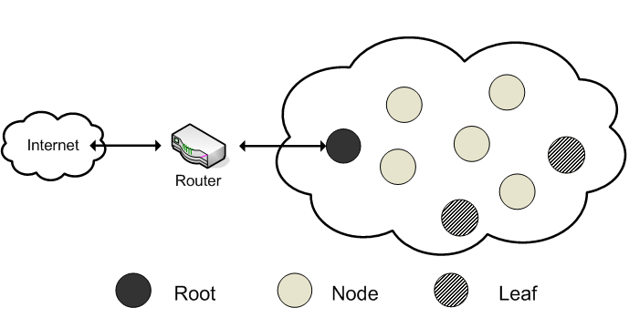
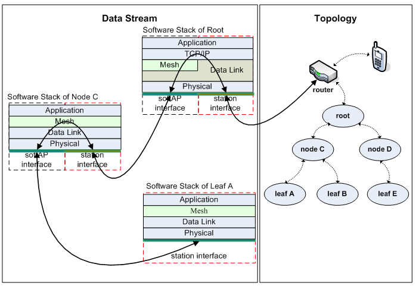
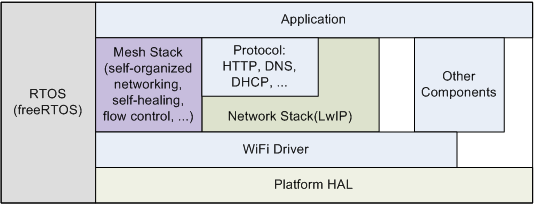
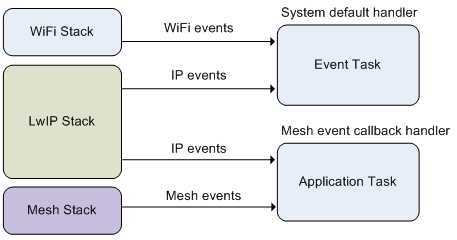

ESP-MESH
========

Overview
--------
ESP-MESH is a "multi-hop" network, meaning that two or more wireless hops (intermediate connections of two Internet devices) are needed for conveying information from a source to a destination. Mesh networking (or mesh routing) is a type of network topology in which a device (node) transmits its own data, while serving as a relay for other nodes at the same time. The prerequisite for successful wireless mesh routing is that all mesh nodes need to be interconnected on the physical layer first. The mesh routing algorithm, then, chooses the transmission path among these physical-layer links. As a highly reliable, widely-covered Wireless Local-Area Network (WLAN) network, the ESP-MESH is ideal for wireless solutions covering a large open area (both outdoors and indoors).

ESP-MESH network is different from traditional wireless networks. The traditional wireless access technology implements a point-to-point or multipoint topology. There is generally one central node in such a topology, for example, a base station in a mobile communication system or an access point (AP) in an 802.11 WLAN. The central node and each wireless terminal are connected through single-hop wireless routing which controls each wireless terminal's access to the wireless network. Besides, the central node is connected to the backbone network through a wired link. In comparison, the ESP-MESH adopts a tree topology, with a root node, intermediate nodes and leaf nodes, making the network more expandable and fault-tolerant. Any mesh device on the network can compete to be the root node. Should the root node break down, the network will automatically select a new root node. This effectively decreases the tree topology’s dependence on a single node and allows every node to participate in the relay of information.

    ESP-MESH Network Architecture

Introduction
------------
ESP-MESH defines a network that organizes and heals itself, enabling faster networking and better control.

There are three types of nodes in a mesh network, in terms of their function within the mesh network: root node, intermediate node and leaf node.

- Root node: this is the top node in the mesh network, which serves as the only interface between the mesh network and an external IP network. It functions as a gateway that relays packets outside the mesh network.

- Intermediate node: a mesh node other than the root node and leaf nodes in a mesh network. An intermediate node can receive, send and forward the packets coming from its parent (immediately preceding) node, as well as its child (immediately following) nodes.

- Leaf node: this is a mesh node that can only receive or send packets, but cannot forward packets.

Each node that forwards data forms a parent/child node relationship with other nodes according to their position in the mesh network. The root node, through which the mesh network can communicate with an external IP network, is a node directly connected to the router and can transmit data between its child nodes and the router. The number of access devices and the bandwidth of the router directly affect the throughput of the root-node device, when accessing the external IP network.

    ESP-MESH Network Topology and Data Stream

As the above figure shows, node C and node D are intermediate nodes, while also being child nodes to the root node. Leaf E is the child node of node D. Leaf nodes A, B, and E have no child nodes. ESP-MESH is based on data link layer packet-forwarding, and no TCP/IP layer is needed in the mesh system except for the root node. See the figure “ESP-MESH Software Stack” for reference.

Function Description
--------------------

1. Mesh Networking
^^^^^^^^^^^^^^^^^^^^^
**(1) Mesh Configuration**

A router is mandatory during the ESP-MESH networking. Users need to configure the Service Set Identification (SSID), password and channel of the router for each node. If the router is hidden, users will need to configure the Basic Service Set Identification (BSSID) for the nodes.（For mesh configuration solutions, please refer to the link to Mesh IoT solutions. The link will be released soon.）

The information needed for mesh networking is carried by the Vendor Information Element (VIE) in beacon frame, which includes the node type, the layer of the node in the network, the maximum number of layers allowed in the network, the number of child nodes, the maximum number of nodes allowed to be connected to a single node, and more.

**(2) Root Node Election**

If there is no root node in the network, all the mesh devices will broadcast the real-time signal strength (RSSI) with the router. Each device networking information, including the signal strength with the router, is transmitted to the entire mesh network, so that all mesh devices can use that infromation to choose the one with the strongest signal as the root node.

POR, all devices are scanned separately. Each device selects the device with the greatest real-time signal strength, compared to the signal received by other devices from the router as well as to the strength of the router itself. The selection is, then, broadcast as a root-node candidate.

Subsequently, each mesh device scans the mesh network for a second time, and selects the device with the greatest real-time signal strength as root-node candidate. The selection is broadcast again. This process is repeated until only one root-node candidate remains in the end.

ESP-MESH also employs methods to accelerate the convergence of the root node election.

**(3) Parent Node Selection**

ESP-MESH provides a method for selecting the strongest parent node in a mesh network. According to this method, a node obtains information about other nodes from received VIE messages, and generates a set of parent nodes. If the parent set comprises at least two nodes, the one with the highest performance parameter is selected as the preferred parent. According to this method, a preferred parent node is selected because of the node type and the performance parameter of each node in the parent set. This method ensures that the preferred parent is the optimal one, thus reducing packet loss rate which, in turn, improves network performance.

2. Routing Generation and Maintenance
^^^^^^^^^^^^^^^^^^^^^^^^^^^^^^^^^^^^^

3. Network Management
^^^^^^^^^^^^^^^^^^^^^

+-----------------------+------------------------------------------------------------------------------------------+
| Function              | Description                                                                              |
+=======================+==========================================================================================+
|Self-healing           |Self-healing allows such routing-based network to operate when a node breaks down or when |
|                       |a connection becomes unreliable.                                                          |
|                       |                                                                                          |
|                       |If a root node breaks down, the nodes directly connected with it on the second layer will |
|                       |detect the root-node failure quickly and initialize a new round of root node election. If |
|                       |the root node and all the nodes on the second layer break down, the nodes on the third    |
|                       |layer will initialize root node election and a new root node will be elected eventually.  |
|                       |                                                                                          |
|                       |In the event of a failure of the intermediate nodes and the leaf nodes, failed nodes will |
|                       |reconnect their parent nodes respectively for a predefined number of times and will, then,|
|                       |reselect a new parent node to join the mesh network.                                      |
+-----------------------+------------------------------------------------------------------------------------------+
|Root node switch       |Users can call :cpp:func:`esp_mesh_waive_root` to switch root nodes in the network.       |
|                       |The new root node can be specified by the users or be automatically elected by the        |
|                       |network.                                                                                  |
+-----------------------+------------------------------------------------------------------------------------------+
|Root conflicts handling|Only the conflicts of root nodes connecting to the same router are handled. Conflicts of  |
|                       |root nodes having the same router SSID, but different router BSSID, are not handled.      |
+-----------------------+------------------------------------------------------------------------------------------+
|Parent node switch     |Changing the physical position of a node in the mesh network will lead to declined signal |
|                       |strength of the parent node and problematic communication. Upon detecting such a problem, |
|                       |this function will automatically choose a better parent node for this node.               |
|                       |                                                                                          |
|                       |When the position of a mobile node changes constantly, communication with the parent node |
|                       |deteriorates or even drops. After such a situation is detected, the parent of the mobile  |
|                       |node is automatically reselected, so that communication with the network is maintained.   |
+-----------------------+------------------------------------------------------------------------------------------+
|Loopback avoidance,    |During the parent selection, the nodes covered in its own routing table are excluded,     |
|detection and handling |so that the occurrence of a loopback is avoided.                                          |
|                       |                                                                                          |
|                       |The path verification mechanism and the energy transfer mechanism are used for detecting  |
|                       |the loopback.                                                                             |
|                       |                                                                                          |
|                       |When a loopback is detected, the parent node will disconnect with the child node and      |
|                       |inform it about the occurrence of the loop with a predefined reason code.                 |
+-----------------------+------------------------------------------------------------------------------------------+
|Channel switch         |TO-DO                                                                                     |
+-----------------------+------------------------------------------------------------------------------------------+
|Isolated node avoidance|TO-DO                                                                                     |
|and handling           |                                                                                          |
+-----------------------+------------------------------------------------------------------------------------------+

4. Data Transmission
^^^^^^^^^^^^^^^^^^^^

+-----------------------+------------------------------------------------------------------------------------------+
| Function              | Description                                                                              |
+=======================+==========================================================================================+
|Reliability            |ESP-MESH provides P2P(point-to-point) retransmission on mesh layer.                       |
+-----------------------+------------------------------------------------------------------------------------------+
|Upstream flow control  |When a node in the mesh network is chosen as a parent node, the upstream data of each of  |
|                       |its child nodes is allocated a receiving window, the size of which can be dynamically     |
|                       |adjusted. The child node sends a window request to the parent node before sending data    |
|                       |packets. The parent node compares the request’s sequence number, which corresponds to the |
|                       |child node's pending packet in the window request, with the sequence number of the parent |
|                       |node's most recently received packet from the child node. The size of the receiving window|
|                       |is calculated and returned to the child node. The child node, then, sends the packet,     |
|                       |according to the reply’s receiving-window size.                                           |
|                       |                                                                                          |
|                       |In addition, considering that there is only one exit from the entire mesh network, which  |
|                       |is the root node, it is only the root node which can access external IP networks. If the  |
|                       |other nodes are uninformed of the connection status between the root node and the external|
|                       |network, and keep sending packets to the root node, there is a possibility of packet loss |
|                       |or unnecessary packet-sending. ESP-MESH provides a method of flow control on the upstream |
|                       |data, which stabilizes the throughput of the mesh network’s exit by monitoring the        |
|                       |connection status between the root node and the external network, thus avoiding packet    |
|                       |loss or unnecessary packet-sending.                                                       |
+-----------------------+------------------------------------------------------------------------------------------+
|Supporting multicast   |Only specified devices can receive multicast packets. Thus, users need to specify these   |
|packets                |devices by configuring the relevant input parameters for the API :cpp:func:`esp_mesh_send`|
+-----------------------+------------------------------------------------------------------------------------------+
|Supporting broadcast   |ESP-MESH provides a method to avoid a waste of bandwidth.                                 |
|packets                |                                                                                          |
|                       |1. When the broadcast packet transmitted by the intermediate node has been received from  |
|                       |its parent node, the intermediate node sends itself a copy of the broadcast packet, while |
|                       |sending the original broadcast packet to its child nodes.                                 |
|                       |                                                                                          |
|                       |2. When a broadcast packet transmitted by an intermediate node has been generated by      |
|                       |itself, the broadcast packet is sent both to its parent and child nodes.                  |
|                       |                                                                                          |
|                       |3. When a broadcast packet transmitted by an intermediate node has been received from its |
|                       |child node, the broadcast packet is delivered to the intermediate node itself and its     |
|                       |remaining child nodes, while a copy of the broadcast packet is transmitted to the         |
|                       |intermediate’s parent node.                                                               |
|                       |                                                                                          |
|                       |4. When a leaf node generates a broadcast packet, the leaf node sends the broadcast packet|
|                       |to its parent node directly.                                                              |
|                       |                                                                                          |
|                       |5. When the broadcast packet transmitted by the root node has been generated by the root  |
|                       |node itself, the broadcast packet is delivered to the root’s child node.                  |
|                       |                                                                                          |
|                       |6. When the broadcast packet transmitted by the root node has been received from its child|
|                       |node, the broadcast packet is sent to the remaining child nodes of the root node.         |
|                       |                                                                                          |
|                       |7. When a node receives a broadcast packet initially sent from the address of the node    |
|                       |itself, it discards this broadcast packet.                                                |
|                       |                                                                                          |
|                       |8. When a node receives a broadcast packet from its parent node, which has been originally|
|                       |sent from its own child node, it discards this broadcast packet.                          |
+-----------------------+------------------------------------------------------------------------------------------+
|Group control          |Firsty users must specify a group ID for the device via :cpp:func:`esp_mesh_set_group_id`.|
|                       |Then when one packet is sent target to this group, only devices in this group can receive |
|                       |it.                                                                                       |
+-----------------------+------------------------------------------------------------------------------------------+

5. Performance
^^^^^^^^^^^^^^

+--------------------+------------------------------------------------------------------------------------------+
| Function           | Description                                                                              |
+====================+==========================================================================================+
|Networking time     |Less than 15 seconds. The time is from tests executed on a network with 50 devices.       |
+--------------------+------------------------------------------------------------------------------------------+
|Healing time        |If a root node breaks down, less than 10 seconds is taken for the network to detect that  |
|                    |and generate a new root. If a parent node breaks down, less than 5 seconds is taken for   |
|                    |its child nodes to detect that and reselect a new parent node.                            |
|                    |The time is also from tests executed on a network with 50 devices.                        |
+--------------------+------------------------------------------------------------------------------------------+
|Layer forward delay |30ms. The delay is from tests executed on a network with 100 devices and all devices did  |
|                    |not enable AMPDU.                                                                         |
+--------------------+------------------------------------------------------------------------------------------+
|Packet loss rate    |max: %0.32 in data transmitted from layer 2 to layer 4; min: %0.00                        |
|                    |The results are also from tests executed on a network with 100 devices.                   |
+--------------------+------------------------------------------------------------------------------------------+
|Network capacity    |The network capacity is terminated by the maximum number of devices allowed to be         |
|                    |connected to the softAP, and by the maximum number of network layers allowed in the       |
|                    |network.                                                                                  |
+--------------------+------------------------------------------------------------------------------------------+

**Note:** All device are configured 6 connections and 6 layers during the above mentioned tests.

6. Security and Encryption
^^^^^^^^^^^^^^^^^^^^^^^^^^
**(1) Uses WPA2-PSK**

**(2) AES Encryption for Mesh VIE**

7. Power Management (TO-DO)
^^^^^^^^^^^^^^^^^^^^^^^^^^^
**(1) Network Sleep**

**(2) Standalone Station**

8. User Intervention Network (TO-DO)
^^^^^^^^^^^^^^^^^^^^^^^^^^^^^^^^^^^^
+-----------------------+---------------------------------------------------------------------------------------+
| Function              | Description                                                                           |
+=======================+=======================================================================================+
|Specifying the node    |The user designates a node in the network as the root node, intermediate node or leaf  |
|type                   |node.                                                                                  |
+-----------------------+---------------------------------------------------------------------------------------+
|Specifying the parent  |The user designates a parent node for a certain node.                                  |
|type                   |                                                                                       |
+-----------------------+---------------------------------------------------------------------------------------+
|Specifying the layer   |The user designates the layer in which the above-mentioned node is to be located.      |
+-----------------------+---------------------------------------------------------------------------------------+

How to Write a Mesh Application
-------------------------------

**ESP-MESH API Error Code**

We suggest that users regularly check the error code and add relevant handlers accordingly.

ESP-MESH Programming Model
--------------------------

**Software Stack is demonstrated below:**

    ESP-MESH Software Stack

**System Events delivery is demonstrated below:**

    ESP-MESH System Events Delivery

ESP-MESH events define almost all system events for any application tasks needed. The events include the Wi-Fi connection status of the station interface, the connection status of child nodes on the softAP interface, and the like. Firstly, application tasks need to register a mesh event callback handler via the API :cpp:func:`esp_mesh_set_config`. This handler is used for receiving events posted from the mesh stack and the LwIP stack. Application tasks can add relevant handlers to each event.

**Examples:**

(1) Application tasks can use Wi-Fi station connect statuses to determine when to send data to a parent node, to a root node or to external IP network.
(2) Application tasks can use Wi-Fi softAP statuses to determine when to send data to child nodes.

Application tasks can access the mesh stack directly without having to go through the LwIP stack. The LwIP stack is not necessery for non-root nodes.
:cpp:func:`esp_mesh_send` and :cpp:func:`esp_mesh_recv` are used in the application tasks to send and receive messages over the mesh network.

**Notes:**

Since current ESP-IDF does not support system initializing without calling :cpp:func:`tcpip_adapter_init`, application tasks still need to perform the LwIP initialization and do remember firstly
1. stoping the DHCP server service on the softAP interface
2. stoping the DHCP client service on the station interface.

Code Example:

:cpp:func:`tcpip_adapter_init`;

:cpp:func:`tcpip_adapter_dhcps_stop`;

:cpp:func:`tcpip_adapter_dhcpc_stop`;

The root node is connected with a router. Thus, in the application mesh event handler, once a node becomes the root, the DHCP client service must be started immediately to obtain IP address unless static IP settings is used.
