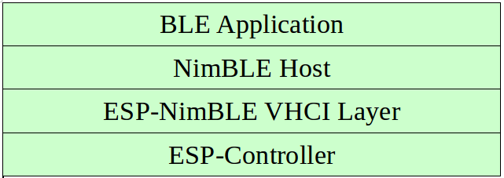

NimBLE-based Host APIs
**********************

Overview
========

Apache MyNewt NimBLE is a highly configurable and Bluetooth® SIG qualifiable Bluetooth Low Energy (Bluetooth LE) stack providing both host and controller functionalities. ESP-IDF supports NimBLE host stack which is specifically ported for ESP32 platform and FreeRTOS. The underlying controller is still the same (as in case of Bluedroid) providing VHCI interface. Refer to  `NimBLE user guide <https://mynewt.apache.org/latest/network/index.html>`_ for a complete list of features and additional information on NimBLE stack. Most features of NimBLE including Bluetooth Low Energy Mesh are supported by ESP-IDF. The porting layer is kept cleaner by maintaining all the existing APIs of NimBLE along with a single ESP-NimBLE API for initialization, making it simpler for the application developers.

Architecture
============

Currently, NimBLE host and controller support different transports such as UART and RAM between them. However, RAM transport cannot be used as is in case of ESP as ESP controller supports VHCI interface and buffering schemes used by NimBLE host is incompatible with that used by ESP controller. Therefore, a new transport between NimBLE host and ESP controller has been added. This is depicted in the figure below. This layer is responsible for maintaining pool of transport buffers and formatting buffers exchanges between host and controller as per the requirements.

    ESP NimBLE Stack

Threading Model
===============

The NimBLE host can run inside the application thread or can have its own independent thread. This flexibility is inherently provided by NimBLE design. By default, a thread is spawned by the porting function ``nimble_port_freertos_init``. This behavior can be changed by overriding the same function. For Bluetooth Low Energy Mesh, additional thread (advertising thread) is used which keeps on feeding advertisement events to the main thread.

Programming Sequence
====================

To begin with, make sure that the NimBLE stack is enabled from menuconfig :ref:`choose NimBLE for the Bluetooth host <CONFIG_BT_HOST>`.

Typical programming sequence with NimBLE stack consists of the following steps:
    * Initialize NVS flash using :cpp:func:`nvs_flash_init` API. This is because ESP controller uses NVS during initialization.
    * Initialize the host and controller stack using ``nimble_port_init``.
    * Initialize the required NimBLE host configuration parameters and callbacks
    * Perform application specific tasks/initialization
    * Run the thread for host stack using ``nimble_port_freertos_init``

This documentation does not cover NimBLE APIs. Refer to `NimBLE tutorial <https://mynewt.apache.org/latest/network/index.html#ble-user-guide>`_ for more details on the programming sequence/NimBLE APIs for different scenarios.

API Reference
=============

.. include-build-file:: inc/esp_nimble_hci.inc
