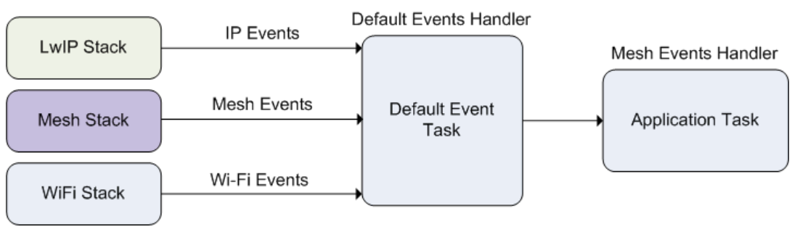

ESP-WIFI-MESH Programming Guide
===============================

:link_to_translation:`zh_CN:[中文]`

This is a programming guide for ESP-WIFI-MESH, including the API reference and coding examples. This guide is split into the following parts:

1. :ref:`mesh-programming-model`

2. :ref:`mesh-writing-mesh-application`

3. :ref:`mesh-self-organized-behavior`

4. :ref:`mesh-application-examples`

5. :ref:`mesh-api-reference`

For documentation regarding the ESP-WIFI-MESH protocol, please see the :doc:`ESP-WIFI-MESH API Guide <../../api-guides/esp-wifi-mesh>`. For more information about ESP-WIFI-MESH Development Framework, please see `ESP-WIFI-MESH Development Framework <https://github.com/espressif/esp-mdf>`_.

.. ---------------------- ESP-WIFI-MESH Programming Model --------------------------

.. _mesh-programming-model:

ESP-WIFI-MESH Programming Model
-------------------------------------

Software Stack
^^^^^^^^^^^^^^

The ESP-WIFI-MESH software stack is built atop the Wi-Fi Driver/FreeRTOS and may use the LwIP Stack in some instances (i.e., the root node). The following diagram illustrates the ESP-WIFI-MESH software stack.

.. _mesh-going-to-software-stack:

.. figure:: ../../../_static/mesh-software-stack.png
    :align: center
    :alt: ESP-WIFI-MESH Software Stack
    :figclass: align-center

    ESP-WIFI-MESH Software Stack

.. _mesh-events:

System Events
^^^^^^^^^^^^^

An application interfaces with ESP-WIFI-MESH via **ESP-WIFI-MESH Events**. Since ESP-WIFI-MESH is built atop the Wi-Fi stack, it is also possible for the application to interface with the Wi-Fi driver via the **Wi-Fi Event Task**. The following diagram illustrates the interfaces for the various System Events in an ESP-WIFI-MESH application.

    ESP-WIFI-MESH System Events Delivery

The :cpp:type:`mesh_event_id_t` defines all possible ESP-WIFI-MESH events and can indicate events such as the connection/disconnection of parent/child. Before ESP-WIFI-MESH events can be used, the application must register a **Mesh Events handler** via :cpp:func:`esp_event_handler_register` to the default event task. The Mesh Events handler that is registered contain handlers for each ESP-WIFI-MESH event relevant to the application.

Typical use cases of mesh events include using events such as :cpp:enumerator:`MESH_EVENT_PARENT_CONNECTED` and :cpp:enumerator:`MESH_EVENT_CHILD_CONNECTED` to indicate when a node can begin transmitting data upstream and downstream respectively. Likewise, :cpp:enumerator:`IP_EVENT_STA_GOT_IP` and :cpp:enumerator:`IP_EVENT_STA_LOST_IP` can be used to indicate when the root node can and cannot transmit data to the external IP network.

.. warning::

    When using ESP-WIFI-MESH under self-organized mode, users must ensure that no calls to Wi-Fi API are made. This is due to the fact that the self-organizing mode will internally make Wi-Fi API calls to connect/disconnect/scan etc. **Any Wi-Fi calls from the application (including calls from callbacks and handlers of Wi-Fi events) may interfere with ESP-WIFI-MESH's self-organizing behavior**. Therefore, users should not call Wi-Fi APIs after :cpp:func:`esp_mesh_start` is called, and before :cpp:func:`esp_mesh_stop` is called.

LwIP & ESP-WIFI-MESH
^^^^^^^^^^^^^^^^^^^^^^^^^^

The application can access the ESP-WIFI-MESH stack directly without having to go through the LwIP stack. The LwIP stack is only required by the root node to transmit/receive data to/from an external IP network. However, since every node can potentially become the root node (due to automatic root node selection), each node must still initialize the LwIP stack.

**Each node that could become root is required to initialize LwIP by calling** :cpp:func:`esp_netif_init`. In order to prevent non-root node access to LwIP, the application should not create or register any network interfaces using esp_netif APIs.

    ESP-WIFI-MESH requires a root node to be connected with a router. Therefore, in the event that a node becomes the root, **the corresponding handler must start the DHCP client service and immediately obtain an IP address**. Doing so will allow other nodes to begin transmitting/receiving packets to/from the external IP network. However, this step is unnecessary if static IP settings are used.

.. ---------------------- Writing a Mesh Application --------------------------

.. _mesh-writing-mesh-application:

Writing an ESP-WIFI-MESH Application
-------------------------------------------

The prerequisites for starting ESP-WIFI-MESH is to initialize LwIP and Wi-Fi, The following code snippet demonstrates the necessary prerequisite steps before ESP-WIFI-MESH itself can be initialized.

.. code-block:: c

    ESP_ERROR_CHECK(esp_netif_init());

    /*  event initialization */
    ESP_ERROR_CHECK(esp_event_loop_create_default());

    /*  Wi-Fi initialization */
    wifi_init_config_t config = WIFI_INIT_CONFIG_DEFAULT();
    ESP_ERROR_CHECK(esp_wifi_init(&config));
    /*  register IP events handler */
    ESP_ERROR_CHECK(esp_event_handler_register(IP_EVENT, IP_EVENT_STA_GOT_IP, &ip_event_handler, NULL));
    ESP_ERROR_CHECK(esp_wifi_set_storage(WIFI_STORAGE_FLASH));
    ESP_ERROR_CHECK(esp_wifi_start());

After initializing LwIP and Wi-Fi, the process of getting an ESP-WIFI-MESH network up and running can be summarized into the following three steps:

1. :ref:`mesh-initialize-mesh`
2. :ref:`mesh-configuring-mesh`
3. :ref:`mesh-start-mesh`

.. _mesh-initialize-mesh:

Initialize Mesh
^^^^^^^^^^^^^^^

The following code snippet demonstrates how to initialize ESP-WIFI-MESH

.. code-block:: c

    /*  mesh initialization */
    ESP_ERROR_CHECK(esp_mesh_init());
    /*  register mesh events handler */
    ESP_ERROR_CHECK(esp_event_handler_register(MESH_EVENT, ESP_EVENT_ANY_ID, &mesh_event_handler, NULL));

.. _mesh-configuring-mesh:

Configuring an ESP-WIFI-MESH Network
^^^^^^^^^^^^^^^^^^^^^^^^^^^^^^^^^^^^^^^^^

.. todo - Add note about unified configuration

ESP-WIFI-MESH is configured via :cpp:func:`esp_mesh_set_config` which receives its arguments using the :cpp:type:`mesh_cfg_t` structure. The structure contains the following parameters used to configure ESP-WIFI-MESH:

.. list-table::
   :header-rows: 1
   :widths: 15 25

   * - Parameter
     - Description

   * - Channel
     - Range from 1 to 14

   * - Mesh ID
     - ID of ESP-WIFI-MESH Network, see :cpp:type:`mesh_addr_t`

   * - Router
     - Router Configuration, see :cpp:type:`mesh_router_t`

   * - Mesh AP
     - Mesh AP Configuration, see :cpp:type:`mesh_ap_cfg_t`

   * - Crypto Functions
     - Crypto Functions for Mesh IE, see :cpp:type:`mesh_crypto_funcs_t`

The following code snippet demonstrates how to configure ESP-WIFI-MESH.

.. code-block:: c

    /* Enable the Mesh IE encryption by default */
    mesh_cfg_t cfg = MESH_INIT_CONFIG_DEFAULT();
    /* mesh ID */
    memcpy((uint8_t *) &cfg.mesh_id, MESH_ID, 6);
    /* channel (must match the router's channel) */
    cfg.channel = CONFIG_MESH_CHANNEL;
    /* router */
    cfg.router.ssid_len = strlen(CONFIG_MESH_ROUTER_SSID);
    memcpy((uint8_t *) &cfg.router.ssid, CONFIG_MESH_ROUTER_SSID, cfg.router.ssid_len);
    memcpy((uint8_t *) &cfg.router.password, CONFIG_MESH_ROUTER_PASSWD,
           strlen(CONFIG_MESH_ROUTER_PASSWD));
    /* mesh softAP */
    cfg.mesh_ap.max_connection = CONFIG_MESH_AP_CONNECTIONS;
    memcpy((uint8_t *) &cfg.mesh_ap.password, CONFIG_MESH_AP_PASSWD,
           strlen(CONFIG_MESH_AP_PASSWD));
    ESP_ERROR_CHECK(esp_mesh_set_config(&cfg));

.. _mesh-start-mesh:

Start Mesh
^^^^^^^^^^

The following code snippet demonstrates how to start ESP-WIFI-MESH.

.. code-block:: c

    /* mesh start */
    ESP_ERROR_CHECK(esp_mesh_start());

After starting ESP-WIFI-MESH, the application should check for ESP-WIFI-MESH events to determine when it has connected to the network. After connecting, the application can start transmitting and receiving packets over the ESP-WIFI-MESH network using :cpp:func:`esp_mesh_send` and :cpp:func:`esp_mesh_recv`.

.. --------------------- ESP-WIFI-MESH Application Examples ------------------------

.. _mesh-self-organized-behavior:

Self-Organized Networking
-------------------------

Self-organized networking is a feature of ESP-WIFI-MESH where nodes can autonomously scan/select/connect/reconnect to other nodes and routers. This feature allows an ESP-WIFI-MESH network to operate with high degree of autonomy by making the network robust to dynamic network topologies and conditions. With self-organized networking enabled, nodes in an ESP-WIFI-MESH network are able to carry out the following actions without autonomously:

- Selection or election of the root node (see **Automatic Root Node Selection** in :ref:`mesh-building-a-network`)
- Selection of a preferred parent node (see **Parent Node Selection** in :ref:`mesh-building-a-network`)
- Automatic reconnection upon detecting a disconnection (see **Intermediate Parent Node Failure** in :ref:`mesh-managing-a-network`)

When self-organized networking is enabled, the ESP-WIFI-MESH stack will internally make calls to Wi-Fi APIs. Therefore, **the application layer should not make any calls to Wi-Fi APIs whilst self-organized networking is enabled as doing so would risk interfering with ESP-WIFI-MESH**.

Toggling Self-Organized Networking
^^^^^^^^^^^^^^^^^^^^^^^^^^^^^^^^^^

Self-organized networking can be enabled or disabled by the application at runtime by calling the :cpp:func:`esp_mesh_set_self_organized` function. The function has the two following parameters:

- ``bool enable`` specifies whether to enable or disable self-organized networking.

- ``bool select_parent`` specifies whether a new parent node should be selected when enabling self-organized networking. Selecting a new parent has different effects depending the node type and the node's current state. This parameter is unused when disabling self-organized networking.

Disabling Self-Organized Networking
"""""""""""""""""""""""""""""""""""
The following code snippet demonstrates how to disable self-organized networking.

.. code-block:: c

    //Disable self-organized networking
    esp_mesh_set_self_organized(false, false);

ESP-WIFI-MESH will attempt to maintain the node's current Wi-Fi state when disabling self-organized networking.

- If the node was previously connected to other nodes, it will remain connected.
- If the node was previously disconnected and was scanning for a parent node or router, it will stop scanning.
- If the node was previously attempting to reconnect to a parent node or router, it will stop reconnecting.

Enabling Self-Organized Networking
""""""""""""""""""""""""""""""""""

ESP-WIFI-MESH will attempt to maintain the node's current Wi-Fi state when enabling self-organized networking. However, depending on the node type and whether a new parent is selected, the Wi-Fi state of the node can change. The following table shows effects of enabling self-organized networking.

+---------------+--------------+------------------------------------------------------------------------------------------------------------------+
| Select Parent | Is Root Node | Effects                                                                                                          |
+===============+==============+==================================================================================================================+
| N             | N            | - Nodes already connected to a parent node will remain connected.                                                |
|               |              | - Nodes previously scanning for a parent nodes will stop scanning. Call :cpp:func:`esp_mesh_connect` to restart. |
|               +--------------+------------------------------------------------------------------------------------------------------------------+
|               | Y            | - A root node already connected to router will stay connected.                                                   |
|               |              | - A root node disconnected from router will need to call :cpp:func:`esp_mesh_connect` to reconnect.              |
+---------------+--------------+------------------------------------------------------------------------------------------------------------------+
| Y             | N            | - Nodes without a parent node will automatically select a preferred parent and connect.                          |
|               |              | - Nodes already connected to a parent node will disconnect, reselect a preferred parent node, and connect.       |
|               +--------------+------------------------------------------------------------------------------------------------------------------+
|               | Y            | - For a root node to connect to a parent node, it must give up it's role as root. Therefore, a root node will    |
|               |              |   disconnect from the router and all child nodes, select a preferred parent node, and connect.                   |
+---------------+--------------+------------------------------------------------------------------------------------------------------------------+

The following code snipping demonstrates how to enable self-organized networking.

.. code-block:: c

    //Enable self-organized networking and select a new parent
    esp_mesh_set_self_organized(true, true);

    ...

    //Enable self-organized networking and manually reconnect
    esp_mesh_set_self_organized(true, false);
    esp_mesh_connect();

Calling Wi-Fi API
^^^^^^^^^^^^^^^^^

There can be instances in which an application may want to directly call Wi-Fi API whilst using ESP-WIFI-MESH. For example, an application may want to manually scan for neighboring APs. However, **self-organized networking must be disabled before the application calls any Wi-Fi APIs**. This will prevent the ESP-WIFI-MESH stack from attempting to call any Wi-Fi APIs and potentially interfering with the application's calls.

Therefore, application calls to Wi-Fi APIs should be placed in between calls of :cpp:func:`esp_mesh_set_self_organized` which disable and enable self-organized networking. The following code snippet demonstrates how an application can safely call :cpp:func:`esp_wifi_scan_start` whilst using ESP-WIFI-MESH.

.. code-block:: c

    //Disable self-organized networking
    esp_mesh_set_self_organized(0, 0);

    //Stop any scans already in progress
    esp_wifi_scan_stop();
    //Manually start scan. Will automatically stop when run to completion
    esp_wifi_scan_start();

    //Process scan results

    ...

    //Re-enable self-organized networking if still connected
    esp_mesh_set_self_organized(1, 0);

    ...

    //Re-enable self-organized networking if non-root and disconnected
    esp_mesh_set_self_organized(1, 1);

    ...

    //Re-enable self-organized networking if root and disconnected
    esp_mesh_set_self_organized(1, 0);  //Do not select new parent
    esp_mesh_connect();                 //Manually reconnect to router

.. --------------------- ESP-WIFI-MESH Application Examples ------------------------

.. _mesh-application-examples:

Application Examples
--------------------

ESP-IDF contains these ESP-WIFI-MESH example projects:

:example:`The Internal Communication Example <mesh/internal_communication>` demonstrates how to set up a ESP-WIFI-MESH network and have the root node send a data packet to every node within the network.

:example:`The Manual Networking Example <mesh/manual_networking>` demonstrates how to use ESP-WIFI-MESH without the self-organizing features. This example shows how to program a node to manually scan for a list of potential parent nodes and select a parent node based on custom criteria.

.. ------------------------- ESP-WIFI-MESH API Reference ---------------------------

.. _mesh-api-reference:

API Reference
--------------

.. include-build-file:: inc/esp_mesh.inc
