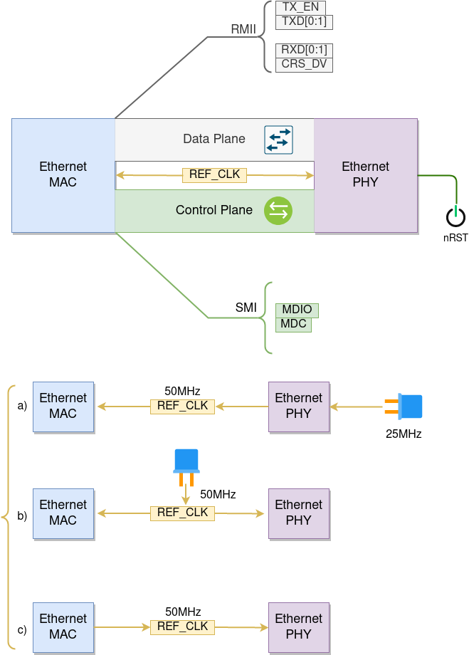

Ethernet
========
:link_to_translation:`zh_CN:[中文]`

.. -------------------------------- Overview -----------------------------------

Overview
--------

ESP-IDF provides a set of consistent and flexible APIs to support both internal Ethernet MAC (EMAC) controller and external SPI-Ethernet modules.

This programming guide is split into the following sections:

    1. :ref:`basic-ethernet-concepts`
    2. :ref:`driver-configuration-and-installation`
    3. :ref:`connect-driver-to-stack`
    4. :ref:`misc-operation-of-driver`

.. --------------------------- Basic Ethernet Concepts ------------------------------

.. _basic-ethernet-concepts:

Basic Ethernet Concepts
-----------------------

Ethernet is an asynchronous Carrier Sense Multiple Access with Collision Detect (CSMA/CD) protocol/interface.
It is generally not well suited for low power applications. However, with ubiquitous deployment, internet connectivity, high data rates and limitless rage expandability, Ethernet can accommodate nearly all wired communications.

Normal IEEE 802.3 compliant Ethernet frames are between 64 and 1518 bytes in length. They are made up of five or six different fields: a destination MAC address (DA), a source MAC address (SA), a type/length field, data payload, an optional padding field and a Cyclic Redundancy Check (CRC). 
Additionally, when transmitted on the Ethernet medium, a 7-byte preamble field and Start-of-Frame (SOF) delimiter byte are appended to the beginning of the Ethernet packet.

Thus the traffic on the twist-pair cabling will appear as shown blow:

.. rackdiag:: ../../../_static/diagrams/ethernet/data_frame_format.diag
    :caption: Ethernet Data Frame Format
    :align: center

Preamble and Start-of-Frame Delimiter
^^^^^^^^^^^^^^^^^^^^^^^^^^^^^^^^^^^^^

The preamble contains seven bytes of ``55H``, it allows the receiver to lock onto the stream of data before the actual frame arrives.
The Start-of-Frame Delimiter (SFD) is a binary sequence ``10101011`` (as seen on the physical medium). It is sometimes considered to be part of the preamble.

When transmitting and receiving data, the preamble and SFD bytes will automatically be generated or stripped from the packets. 

Destination Address
^^^^^^^^^^^^^^^^^^^

The destination address field contains a 6-byte length MAC address of the device that the packet is directed to.
If the Least Significant bit in the first byte of the MAC address is set, the address is a multi-cast destination. 
For example, 01-00-00-00-F0-00 and 33-45-67-89-AB-CD are multi-cast addresses, while 00-00-00-00-F0-00 and 32-45-67-89-AB-CD are not.
Packets with multi-cast destination addresses are designed to arrive and be important to a selected group of Ethernet nodes. 
If the destination address field is the reserved multi-cast address, i.e. FF-FF-FF-FF-FF-FF, the packet is a broadcast packet and it will be directed to everyone sharing the network. 
If the Least Significant bit in the first byte of the MAC address is clear, the address is a uni-cast address and will be designed for usage by only the addressed node.

Normally the EMAC controller incorporates receive filters which can be used to discard or accept packets with multi-cast, broadcast and/or uni-cast destination addresses.
When transmitting packets, the host controller is responsible for writing the desired destination address into the transmit buffer.

Source Address
^^^^^^^^^^^^^^

The source address field contains a 6-byte length MAC address of the node which created the Ethernet packet.
Users of Ethernet must generate a unique MAC address for each controller used.
MAC addresses consist of two portions. The first three bytes are known as the Organizationally Unique Identifier (OUI). OUIs are distributed by the IEEE. 
The last three bytes are address bytes at the discretion of the company that purchased the OUI. More information about MAC Address used in ESP-IDF, please see :ref:`MAC Address Allocation <MAC-Address-Allocation>`.

When transmitting packets, the assigned source MAC address must be written into the transmit buffer by the host controller.

Type / Length
^^^^^^^^^^^^^

The type/length field is a 2-byte field, if the value in this field is <= 1500 (decimal), it is considered a length field and it specifies the amount of non-padding data which follows in the data field.
If the value is >= 1536, it represents the protocol the following packet data belongs to. The following are the most common type values:

  * IPv4 = 0800H
  * IPv6 = 86DDH
  * ARP = 0806H

Users implementing proprietary networks may choose to treat this field as a length field, while applications implementing protocols such as the Internet Protocol (IP) or Address Resolution Protocol (ARP), should program this field with the appropriate type defined by the protocol’s specification when transmitting packets.

Payload
^^^^^^^

The payload field is a variable length field, anywhere from 0 to 1500 bytes. Larger data packets will violate Ethernet standards and will be dropped by most Ethernet nodes.
This field contains the client data, such as an IP datagram.

Padding and FCS
^^^^^^^^^^^^^^^

The padding field is a variable length field added to meet IEEE 802.3 specification requirements when small data payloads are used.
The DA, SA, type, payload and padding of an Ethernet packet must be no smaller than 60 bytes.
Adding the required 4-byte FCS field, packets must be no smaller than 64 bytes. 
If the data field is less than 46 bytes long, a padding field is required.

The FCS field is a 4-byte field which contains an industry standard 32-bit CRC calculated with the data from the DA, SA, type, payload and padding fields.
Given the complexity of calculating a CRC, the hardware normally will automatically generate a valid CRC and transmit it. Otherwise, the host controller must generate the CRC and place it in the transmit buffer.

Normally, the host controller does not need to concern itself with padding and the CRC which the hardware EMAC will also be able to automatically generate when transmitting and verify when receiving.
However, the padding and CRC fields will be written into the receive buffer when packets arrive, so they may be evaluated by the host controller if needed.

.. note::
    Besides the basic data frame described above, there're two other common frame types in 10/100 Mbps Ethernet: control frames and VLAN tagged frames. 
    They're not supported in ESP-IDF.

.. ------------------------------ Driver Operation --------------------------------

.. _driver-configuration-and-installation:

Configure MAC and PHY
---------------------

Ethernet driver is composed of two parts: MAC and PHY. The communication between MAC and PHY can have diverse choices: **MII** (Media Independent Interface), **RMII** (Reduced Media Independent Interface) and etc.

    Ethernet RMII Interface

.. only:: esp32

    One of the obvious difference between MII and RMII is the signal consumption. For MII, it usually costs up to 18 signals. Instead, RMII interface can reduce the consumption to 9.

    In RMII mode, both the receiver and transmitter signals are referenced to the ``REF_CLK``. **REF_CLK must be stable during any access to PHY and MAC**.
    Generally there're three ways to generate the ``REF_CLK`` depending on the PHY device in your design:

    * Some PHY chip can derive the ``REF_CLK`` from its external connected 25MHz crystal oscillator (as seen the option *a* in the picture). In this case, you should select ``CONFIG_ETH_RMII_CLK_INPUT`` in :ref:`CONFIG_ETH_RMII_CLK_MODE`.
    * Some PHY chip uses an external connected 50MHz crystal oscillator or other clock source, which can also be used as the ``REF_CLK`` for MAC side (as seen the option *b* in the picture). In this case, you still need to select ``CONFIG_ETH_RMII_CLK_INPUT`` in :ref:`CONFIG_ETH_RMII_CLK_MODE`.
    * Some EMAC controller can generate the ``REF_CLK`` using its internal high precision PLL (as seen the option *c* in the picture). In this case, you should select ``CONFIG_ETH_RMII_CLK_OUTPUT`` in :ref:`CONFIG_ETH_RMII_CLK_MODE`.

    .. warning::
        If the RMII clock mode is selected to ``CONFIG_ETH_RMII_CLK_OUTPUT``, then ``GPIO0`` can be used to output the ``REF_CLK`` signal. See :ref:`CONFIG_ETH_RMII_CLK_OUTPUT_GPIO0` for more information.
        What's more, if you're not using PSRAM in your design, GPIO16 and GPIO17 are also available to output the reference clock. See :ref:`CONFIG_ETH_RMII_CLK_OUT_GPIO` for more information.

        If the RMII clock mode is selected to ``CONFIG_ETH_RMII_CLK_INPUT``, then ``GPIO0`` is the only choice to input the ``REF_CLK`` signal.
        Please note that, ``GPIO0`` is also an important strapping GPIO on ESP32.
        If GPIO0 samples a low level during power up, ESP32 will go into download mode. The system will get halted until a manually reset.
        The workaround of this issue is disabling the ``REF_CLK`` in hardware by default, so that the strapping pin won't be interfered by other signals in boot stage. Then re-enable the ``REF_CLK`` in Ethernet driver installation stage.
        The ways to disable the ``REF_CLK`` signal can be:

        * Disable or power down the crystal oscillator (as the case *b* in the picture).
        * Force the PHY device in reset status (as the case *a* in the picture). **This could fail for some PHY device** (i.e. it still outputs signal to GPIO0 even in reset state).

    **No matter which RMII clock mode you select, you really need to take care of the signal integrity of REF_CLK in your hardware design!**
    Keep the trace as short as possible. Keep it away from RF devices. Keep it away from inductor elements.

    .. note::
        ESP-IDF only supports the RMII interface (i.e. always select ``CONFIG_ETH_PHY_INTERFACE_RMII`` in Kconfig option :ref:`CONFIG_ETH_PHY_INTERFACE`).

        Signals used in data plane are fixed to specific GPIOs via MUX, they can't be modified to other GPIOs.
        Signals used in control plane can be routed to any free GPIOs via Matrix.
        Please refer to :doc:`ESP32-Ethernet-Kit <../../hw-reference/esp32/get-started-ethernet-kit>` for hardware design example.

We need to setup necessary parameters for MAC and PHY respectively based on your Ethernet board design and then combine the two together, completing the driver installation.

Configuration for MAC is described in :cpp:class:`eth_mac_config_t`, including:

* :cpp:member:`sw_reset_timeout_ms`: software reset timeout value, in milliseconds, typically MAC reset should be finished within 100ms.
* :cpp:member:`rx_task_stack_size` and :cpp:member:`rx_task_prio`: the MAC driver creates a dedicated task to process incoming packets, these two parameters are used to set the stack size and priority of the task.
* :cpp:member:`smi_mdc_gpio_num` and :cpp:member:`smi_mdio_gpio_num`: the GPIO number used to connect the SMI signals.
* :cpp:member:`flags`: specifying extra features that the MAC driver should have, it could be useful in some special situations. The value of this field can be OR'd with macros prefixed with ``ETH_MAC_FLAG_``. For example, if the MAC driver should work when cache is disabled, then you should configure this field with :c:macro:`ETH_MAC_FLAG_WORK_WITH_CACHE_DISABLE`.

Configuration for PHY is described in :cpp:class:`eth_phy_config_t`, including:

* :cpp:member:`phy_addr`: multiple PHY device can share the same SMI bus, so each PHY needs a unique address. Usually this address is configured during hardware design by pulling up/down some PHY strapping pins. You can set the value from 0 to 15 based on your Ethernet board. Especially, if the SMI bus is shared by only one PHY device, setting this value to -1 can enable the driver to detect the PHY address automatically.
* :cpp:member:`reset_timeout_ms`: reset timeout value, in milliseconds, typically PHY reset should be finished within 100ms.
* :cpp:member:`autonego_timeout_ms`: auto-negotiation timeout value, in milliseconds. Ethernet driver will start negotiation with the peer Ethernet node automatically, to determine to duplex and speed mode. This value usually depends on the ability of the PHY device on your board.
* :cpp:member:`reset_gpio_num`: if your board also connect the PHY reset pin to one of the GPIO, then set it here. Otherwise, set this field to -1.

ESP-IDF provides a default configuration for MAC and PHY in macro :c:macro:`ETH_MAC_DEFAULT_CONFIG` and :c:macro:`ETH_PHY_DEFAULT_CONFIG`.

Create MAC and PHY Instance
---------------------------

Ethernet driver is implemented in an Object-Oriented style. Any operation on MAC and PHY should be based on the instance of them two.

.. highlight:: c

::

    eth_mac_config_t mac_config = ETH_MAC_DEFAULT_CONFIG();  // apply default MAC configuration
    mac_config.smi_mdc_gpio_num = 23;  // alter the GPIO used for MDC signal
    mac_config.smi_mdio_gpio_num = 18; // alter the GPIO used for MDIO signal
    esp_eth_mac_t *mac = esp_eth_mac_new_esp32(&mac_config); // create MAC instance

    eth_phy_config_t phy_config = ETH_PHY_DEFAULT_CONFIG(); // apply default PHY configuration
    phy_config.phy_addr = 1;       // alter the PHY address according to your board design
    phy_config.reset_gpio_num = 5; // alter the GPIO used for PHY reset
    esp_eth_phy_t *phy = esp_eth_phy_new_ip101(&phy_config); // create PHY instance
    // ESP-IDF officially supports several different Ethernet PHY
    // esp_eth_phy_t *phy = esp_eth_phy_new_rtl8201(&phy_config);
    // esp_eth_phy_t *phy = esp_eth_phy_new_lan8720(&phy_config);
    // esp_eth_phy_t *phy = esp_eth_phy_new_dp83848(&phy_config);

.. note::
    Care should be taken, when creating MAC and PHY instance for SPI-Ethernet modules (e.g. DM9051), the constructor function must have the same suffix (e.g. `esp_eth_mac_new_dm9051` and `esp_eth_phy_new_dm9051`). This is because we don't have other choices but the integrated PHY.
    Besides that, we have to create an SPI device handle firstly and then pass it to the MAC constructor function. More instructions on creating SPI device handle, please refer to :doc:`SPI Master <../peripherals/spi_master>`.

Install Driver
--------------

Ethernet driver also includes event-driven model, which will send useful and important event to user space. We need to initialize the event loop before installing the Ethernet driver. For more information about event-driven programming, please refer to :doc:`ESP Event <../system/esp_event>`.

.. highlight:: c

::

    /** Event handler for Ethernet events */
    static void eth_event_handler(void *arg, esp_event_base_t event_base,
                                  int32_t event_id, void *event_data)
    {
        uint8_t mac_addr[6] = {0};
        /* we can get the ethernet driver handle from event data */
        esp_eth_handle_t eth_handle = *(esp_eth_handle_t *)event_data;

        switch (event_id) {
        case ETHERNET_EVENT_CONNECTED:
            esp_eth_ioctl(eth_handle, ETH_CMD_G_MAC_ADDR, mac_addr);
            ESP_LOGI(TAG, "Ethernet Link Up");
            ESP_LOGI(TAG, "Ethernet HW Addr %02x:%02x:%02x:%02x:%02x:%02x",
                     mac_addr[0], mac_addr[1], mac_addr[2], mac_addr[3], mac_addr[4], mac_addr[5]);
            break;
        case ETHERNET_EVENT_DISCONNECTED:
            ESP_LOGI(TAG, "Ethernet Link Down");
            break;
        case ETHERNET_EVENT_START:
            ESP_LOGI(TAG, "Ethernet Started");
            break;
        case ETHERNET_EVENT_STOP:
            ESP_LOGI(TAG, "Ethernet Stopped");
            break;
        default:
            break;
        }
    }

    esp_event_loop_create_default(); // create a default event loop that running in background
    esp_event_handler_register(ETH_EVENT, ESP_EVENT_ANY_ID, &eth_event_handler, NULL); // register Ethernet event handler (to deal with user specific stuffs when event like link up/down happened)

To install the Ethernet driver, we need to combine the instance of MAC and PHY and set some additional high-level configurations (i.e. not specific to either MAC or PHY) in :cpp:class:`esp_eth_config_t`:

* :cpp:member:`mac`: instance that created from MAC generator (e.g. :cpp:func:`esp_eth_mac_new_esp32`).
* :cpp:member:`phy`: instance that created from PHY generator (e.g. :cpp:func:`esp_eth_phy_new_ip101`).
* :cpp:member:`check_link_period_ms`: Ethernet driver starts an OS timer to check the link status periodically, this field is used to set the interval, in milliseconds.
* :cpp:member:`stack_input`: In most of Ethernet IoT applications, any Ethernet frame that received by driver should be passed to upper layer (e.g. TCP/IP stack). This field is set to a function which is responsible to deal with the incoming frames. You can even update this field at runtime via function :cpp:func:`esp_eth_update_input_path` after driver installation.
* :cpp:member:`on_lowlevel_init_done` and :cpp:member:`on_lowlevel_deinit_done`: These two fields are used to specify the hooks which get invoked when low level hardware has been initialized or de-initialized.

ESP-IDF provides a default configuration for driver installation in macro :c:macro:`ETH_DEFAULT_CONFIG`.

.. highlight:: c

::

    esp_eth_config_t config = ETH_DEFAULT_CONFIG(mac, phy); // apply default driver configuration
    esp_eth_handle_t eth_handle = NULL; // after driver installed, we will get the handle of the driver
    esp_eth_driver_install(&config, &eth_handle); // install driver

Start Ethernet Driver
---------------------

After driver installation, we can start Ethernet immediately.

.. highlight:: c

::

    esp_eth_start(eth_handle); // start Ethernet driver state machine

.. _connect-driver-to-stack:

Connect Driver to TCP/IP Stack
------------------------------

Up until now, we have installed the Ethernet driver. From the view of OSI (Open System Interconnection), we're still on level 2 (i.e. Data Link Layer). We can detect link up and down event, we can gain MAC address in user space, but we can't obtain IP address, let alone send HTTP request.
The TCP/IP stack used in ESP-IDF is called LwIP, for more information about it, please refer to :doc:`LwIP <../../api-guides/lwip>`.

To connect Ethernet driver to TCP/IP stack, these three steps need to follow:

1. Create network interface for Ethernet driver
2. Register IP event handlers
3. Attach the network interface to Ethernet driver

More information about network interface, please refer to :doc:`Network Interface <esp_netif>`.

.. highlight:: c

::

    /** Event handler for IP_EVENT_ETH_GOT_IP */
    static void got_ip_event_handler(void *arg, esp_event_base_t event_base,
                                     int32_t event_id, void *event_data)
    {
        ip_event_got_ip_t *event = (ip_event_got_ip_t *) event_data;
        const esp_netif_ip_info_t *ip_info = &event->ip_info;

        ESP_LOGI(TAG, "Ethernet Got IP Address");
        ESP_LOGI(TAG, "~~~~~~~~~~~");
        ESP_LOGI(TAG, "ETHIP:" IPSTR, IP2STR(&ip_info->ip));
        ESP_LOGI(TAG, "ETHMASK:" IPSTR, IP2STR(&ip_info->netmask));
        ESP_LOGI(TAG, "ETHGW:" IPSTR, IP2STR(&ip_info->gw));
        ESP_LOGI(TAG, "~~~~~~~~~~~");
    }

    esp_netif_init()); // Initialize TCP/IP network interface (should be called only once in application)
    esp_netif_config_t cfg = ESP_NETIF_DEFAULT_ETH(); // apply default network interface configuration for Ethernet
    esp_netif_t *eth_netif = esp_netif_new(&cfg); // create network interface for Ethernet driver
    esp_eth_set_default_handlers(eth_netif); // set default handlers to process TCP/IP stuffs
    esp_event_handler_register(IP_EVENT, IP_EVENT_ETH_GOT_IP, &got_ip_event_handler, NULL); // register user defined IP event handlers

    esp_netif_attach(eth_netif, esp_eth_new_netif_glue(eth_handle)); // attach Ethernet driver to TCP/IP stack
    esp_eth_start(eth_handle); // start Ethernet driver state machine

.. warning::
    User's Ethernet/IP event handlers need to be registered after registration of default handlers (i.e. after :cpp:func:`esp_eth_set_default_handlers`). General recommendation is to fully initialize Ethernet driver and network interface prior registering user's Ethernet/IP event handlers, i.e. register the user event handlers as the last thing prior starting the Ethernet driver. Such approach ensures that Ethernet/IP events get executed first by the Ethernet driver or network interface and so the system is in expected state when executing user's handlers.

.. _misc-operation-of-driver:

Misc control of Ethernet driver
-------------------------------

The following functions should only be invoked after the Ethernet driver has been installed.

* Stop Ethernet driver: :cpp:func:`esp_eth_stop`
* Update Ethernet data input path: :cpp:func:`esp_eth_update_input_path`
* Misc get/set of Ethernet driver attributes: :cpp:func:`esp_eth_ioctl`

.. highlight:: c

::
    
    /* get MAC address */
    uint8_t mac_addr[6];
    memset(mac_addr, 0, sizeof(mac_addr));
    esp_eth_ioctl(eth_handle, ETH_CMD_G_MAC_ADDR, mac_addr);
    ESP_LOGI(TAG, "Ethernet MAC Address: %02x:%02x:%02x:%02x:%02x:%02x",
             mac_addr[0], mac_addr[1], mac_addr[2], mac_addr[3], mac_addr[4], mac_addr[5]);

    /* get PHY address */
    int phy_addr = -1;
    esp_eth_ioctl(eth_handle, ETH_CMD_G_PHY_ADDR, &phy_addr);
    ESP_LOGI(TAG, "Ethernet PHY Address: %d", phy_addr);

.. -------------------------------- Examples -----------------------------------

Application Example
-------------------

  * Ethernet basic example: :example:`ethernet/basic`.
  * Ethernet iperf example: :example:`ethernet/iperf`.
  * Ethernet to Wi-Fi AP "router": :example:`ethernet/eth2ap`.
  * Most of protocol examples should also work for Ethernet: :example:`protocols`.

.. ---------------------------- API Reference ----------------------------------

API Reference
-------------

.. include-build-file:: inc/esp_eth.inc
.. include-build-file:: inc/esp_eth_com.inc
.. include-build-file:: inc/esp_eth_mac.inc
.. include-build-file:: inc/esp_eth_phy.inc
.. include-build-file:: inc/esp_eth_netif_glue.inc
