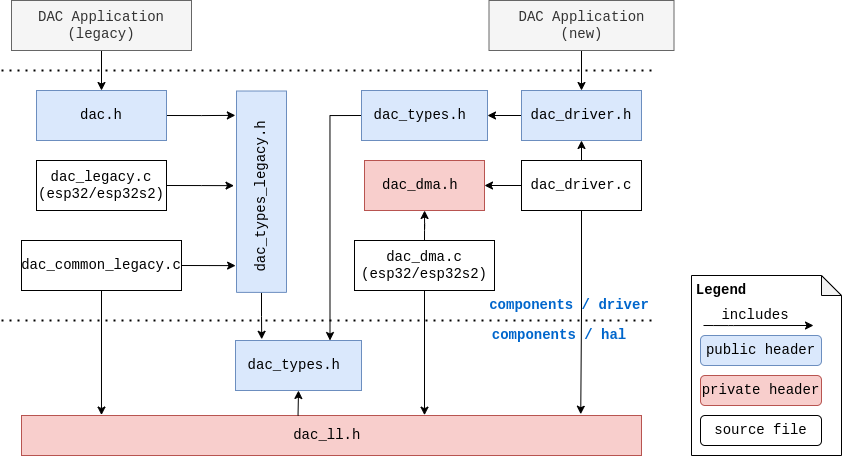

Digital To Analog Converter (DAC)
=================================

:link_to_translation:`zh_CN:[中文]`

{IDF_TARGET_DAC_CH_1: default = "Not Updated!", esp32 = "GPIO25", esp32s2 = "GPIO17"}
{IDF_TARGET_DAC_CH_2: default = "Not Updated!", esp32 = "GPIO26", esp32s2 = "GPIO18"}
{IDF_TARGET_DAC_REF_PIN: default = "Not Updated!", esp32 = "VDD3P3_RTC", esp32s2 = "VDD3P3_RTC_IO"}

Overview
--------

{IDF_TARGET_NAME} has two 8-bit DAC (digital to analog converter) channels respectively connected to {IDF_TARGET_DAC_CH_1} (Channel 1) and {IDF_TARGET_DAC_CH_2} (Channel 2). Each DAC channel can convert the digital value 0~255 to the analog voltage 0~Vref (The reference voltage 'Vref' here is input from the pin {IDF_TARGET_DAC_REF_PIN}, which ideally equals to the power supply VDD). The output voltage can be calculated as the following::

    out_voltage = Vref * digi_val / 255

The DAC peripheral supports outputting analog signal in the following ways:

1. Outputting a voltage directly. The DAC channel keeps outputting a specified voltage.
2. Outputting continuous analog signal by DMA. The DAC converts the data in a buffer at a specified frequency.
3. Outputting a cosine wave by the cosine wave generator. The DAC channel can output a cosine wave with specified frequency and amplitude.

For other analog output options, see :doc:`Sigma-Delta Modulation <sdm>` and :doc:`LED Control <ledc>`. Both modules produce high-frequency PWM/PDM output, which can be hardware low-pass filtered in order to generate a lower frequency analog output.

DAC File Structure
------------------

    DAC File Structure

**Public headers that need to be included in the DAC application are listed as follows:**

- ``dac.h``: The top header file of the legacy DAC driver, which should be only included in the apps which use the legacy driver API.
- ``dac_oneshot.h``: The top header file of the new DAC driver, which should be included in the apps which use the new driver API with one-shot mode.
- ``dac_cosine.h``: The top header file of the new DAC driver, which should be included in the apps which use the new driver API with cosine mode.
- ``dac_continuous.h``: The top header file of the new DAC driver, which should be included in the apps which use the new driver API with continuous mode.

.. note::

    The legacy driver cannot coexist with the new driver. Include ``dac.h`` to use the legacy driver or ``dac_oneshot.h``, ``dac_cosine.h``, and ``dac_continuous.h`` to use the new driver. The legacy driver might be removed in the future.

Functional Overview
-------------------

Resources Management
^^^^^^^^^^^^^^^^^^^^

The DAC on {IDF_TARGET_NAME} has two channels. The channels have separate software resources and can be managed by :cpp:type:`dac_oneshot_handle_t`, :cpp:type:`dac_cosine_handle_t`, or :cpp:type:`dac_continuous_handle_t` according to the usage. Registering different modes on a same DAC channel is not allowed.

Direct Voltage Output (One-shot/Direct Mode)
^^^^^^^^^^^^^^^^^^^^^^^^^^^^^^^^^^^^^^^^^^^^

The DAC channels in the group can convert an 8-bit digital value into the analog when :cpp:func:`dac_oneshot_output_voltage` is called (it can be called in ISR). The analog voltage is kept on the DAC channel until the next conversion starts. To start the voltage conversion, the DAC channels need to be enabled first through registering by :cpp:func:`dac_oneshot_new_channel`.

Continuous Wave Output (Continuous/DMA Mode)
^^^^^^^^^^^^^^^^^^^^^^^^^^^^^^^^^^^^^^^^^^^^

DAC channels can convert digital data continuously via the DMA. There are three ways to write the DAC data:

    1. Normal writing (synchronous): Data can be transmitted at one time and kept blocked until all the data has been loaded into the DMA buffer, and the voltage is kept as the last conversion value while no more data is inputted. It is usually used to transport a long signal like an audio. To convert data continuously, the continuous channel handle need to be allocated by calling :cpp:func:`dac_continuous_new_channels` and the DMA conversion should be enabled by calling :cpp:func:`dac_continuous_enable`. Then data can be written by :cpp:func:`dac_continuous_write` synchronously. Refer to :example:`peripherals/dac/dac_continuous/dac_audio` for examples.
    2. Cyclical writing: A piece of data can be converted cyclically without blocking, and no more operation is needed after the data are loaded into the DMA buffer. But note that the inputted buffer size is limited by the number of descriptors and the DMA buffer size. It is usually used to transport short signals that need to be repeated, e.g., a sine wave. To achieve cyclical writing, call :cpp:func:`dac_continuous_write_cyclically` after the DAC continuous mode is enabled. Refer to :example:`peripherals/dac/dac_continuous/signal_generator` for examples.
    3. Asynchronous writing: Data can be transmitted asynchronously based on the event callback. :cpp:member:`dac_event_callbacks_t::on_convert_done` must be registered to use asynchronous mode. Users can get the :cpp:type:`dac_event_data_t` in the callback which contains the DMA buffer address and length, allowing them to load the data into the buffer directly. To use the asynchronous writing, call :cpp:func:`dac_continuous_register_event_callback` to register the :cpp:member:`dac_event_callbacks_t::on_convert_done` before enabling, and then :cpp:func:`dac_continuous_start_async_writing` to start the asynchronous writing. Note that once the asynchronous writing is started, the callback function will be triggered continuously. Call :cpp:func:`dac_continuous_write_asynchronously` to load the data either in a separate task or in the callback directly. Refer to :example:`peripherals/dac/dac_continuous/dac_audio` for examples.

.. only:: esp32

    On ESP32, the DAC digital controller can be connected internally to the I2S0 and use its DMA for continuous conversion. Although the DAC only needs 8-bit data for conversion, it has to be the left-shifted 8 bits (i.e., the high 8 bits in a 16-bit slot) to satisfy the I2S communication format. By default, the driver helps to expand the data to 16-bit wide automatically. To expand manually, please disable :ref:`CONFIG_DAC_DMA_AUTO_16BIT_ALIGN` in the menuconfig.

    The clock of the DAC digital controller comes from I2S0 as well, so there are two clock sources for selection:

    - :cpp:enumerator:`dac_continuous_digi_clk_src_t::DAC_DIGI_CLK_SRC_PLL_D2` supports frequency between 19.6 KHz to several MHz. It is the default clock which can also be selected by :cpp:enumerator:`dac_continuous_digi_clk_src_t::DAC_DIGI_CLK_SRC_DEFAULT`.
    - :cpp:enumerator:`dac_continuous_digi_clk_src_t::DAC_DIGI_CLK_SRC_APLL` supports frequency between 648 Hz to several MHz. However, it might be occupied by other peripherals, thus not providing the required frequency. In such case, this clock source is available only if APLL still can be correctly divided into the target DAC DMA frequency.

.. only:: esp32s2

    On ESP32-S2, the DAC digital controller can be connected internally to the SPI3 and use its DMA for continuous conversion.

    The clock sources of the DAC digital controller include:

    - :cpp:enumerator:`dac_continuous_digi_clk_src_t::DAC_DIGI_CLK_SRC_APB` supports frequency between 77 Hz to several MHz. It is the default clock which can also be selected by :cpp:enumerator:`dac_continuous_digi_clk_src_t::DAC_DIGI_CLK_SRC_DEFAULT`.
    - :cpp:enumerator:`dac_continuous_digi_clk_src_t::DAC_DIGI_CLK_SRC_APLL` supports frequency between 6 Hz to several MHz. However, it might be occupied by other peripherals, thus not providing the required frequency. In such case, this clock source is available only if APLL still can be correctly divided into the target DAC DMA frequency.

Cosine Wave Output (Cosine Mode)
^^^^^^^^^^^^^^^^^^^^^^^^^^^^^^^^

The DAC peripheral has a cosine wave generator, which can generate cosine wave on the channels. Users can specify the frequency, amplitude, and phase of the cosine wave. To output the cosine wave, please acquire the DAC to cosine mode using :cpp:func:`dac_cosine_new_channel`, and then start the cosine wave generator by :cpp:func:`dac_cosine_start`.

Currently, the clock source of the cosine wave generator only comes from ``RTC_FAST`` which can be selected by :cpp:enumerator:`dac_cosine_clk_src_t::DAC_COSINE_CLK_SRC_RTC_FAST`. It is also the default clock source which is the same as :cpp:enumerator:`dac_cosine_clk_src_t::DAC_COSINE_CLK_SRC_RTC_DEFAULT`.

Power Management
^^^^^^^^^^^^^^^^

When the power management is enabled (i.e., :ref:`CONFIG_PM_ENABLE` is on), the system will adjust or stop the clock source of DAC before entering Light-sleep mode, thus potential influence to the DAC signals may lead to false data conversion.

When using DAC driver in continuous mode, it can prevent the system from changing or stopping the clock source in DMA or cosine mode by acquiring a power management lock. When the clock source is generated from APB, the lock type will be set to :cpp:enumerator:`esp_pm_lock_type_t::ESP_PM_APB_FREQ_MAX`. When the clock source is APLL (only in DMA mode), it will be set to :cpp:enumerator:`esp_pm_lock_type_t::ESP_PM_NO_LIGHT_SLEEP`. Whenever the DAC is converting (i.e., DMA or cosine wave generator is working), the driver guarantees that the power management lock is acquired after calling :cpp:func:`dac_continuous_enable`. Likewise, the driver will release the lock when :cpp:func:`dac_continuous_disable` is called.

IRAM Safe
^^^^^^^^^

By default, the DAC DMA interrupt will be deferred when the cache is disabled for reasons like writing/erasing Flash. Thus the DMA EOF interrupt will not get executed in time.

To avoid such case in real-time applications, you can enable the Kconfig option :ref:`CONFIG_DAC_ISR_IRAM_SAFE` which:

1. Enables the interrupt being serviced even when cache is disabled;

2. Places driver object into DRAM (in case it is linked to PSRAM by accident).

This allows the interrupt to run while the cache is disabled but comes at the cost of increased IRAM consumption.

Thread Safety
^^^^^^^^^^^^^

All the public DAC APIs are guaranteed to be thread safe by the driver, which means users can call them from different RTOS tasks without protection by extra locks. Notice that the DAC driver uses mutex lock to ensure the thread safety, thus the APIs except :cpp:func:`dac_oneshot_output_voltage` are not allowed to be used in ISR.

Kconfig Options
^^^^^^^^^^^^^^^

- :ref:`CONFIG_DAC_ISR_IRAM_SAFE` controls whether the default ISR handler can work when cache is disabled. See `IRAM Safe <#iram-safe>`__ for more information.
- :ref:`CONFIG_DAC_SUPPRESS_DEPRECATE_WARN` controls whether to suppress the warning message compilation while using the legacy DAC driver.
- :ref:`CONFIG_DAC_ENABLE_DEBUG_LOG` is used to enable the debug log output. Enable this option increases the firmware binary size.

.. only:: esp32

    - :ref:`CONFIG_DAC_DMA_AUTO_16BIT_ALIGN` auto expands the 8-bit data to 16-bit data in the driver to satisfy the I2S DMA format.

Application Example
-------------------

- :example:`peripherals/dac/dac_continuous/signal_generator` demonstrates how to use the DAC driver on {IDF_TARGET_NAME} to output continuous voltage in two ways: by DMA transmission and by timer interrupt, generating different waveforms such as sine, triangle, saw tooth and square wave.
- :example:`peripherals/dac/dac_continuous/dac_audio` demonstrates how to use the DAC driver on {IDF_TARGET_NAME} to play a piece of audio stored in a buffer, with the audio being played every one second from a speaker or earphone.
- :example:`peripherals/dac/dac_cosine_wave` demonstrates how to use the DAC driver on an {IDF_TARGET_NAME} board to output a cosine wave on both channels, which can be monitored using an oscilloscope or the ADC channels internally.
- :example:`peripherals/dac/dac_oneshot` demonstrates how to use the DAC driver on {IDF_TARGET_NAME} to output a voltage that increases stepwise every 500 ms and resets to 0 periodically, with the output monitored via ADC or an optional oscilloscope.

API Reference
-------------

.. include-build-file:: inc/dac_oneshot.inc
.. include-build-file:: inc/dac_cosine.inc
.. include-build-file:: inc/dac_continuous.inc
.. include-build-file:: inc/components/esp_driver_dac/include/driver/dac_types.inc
.. include-build-file:: inc/components/hal/include/hal/dac_types.inc
