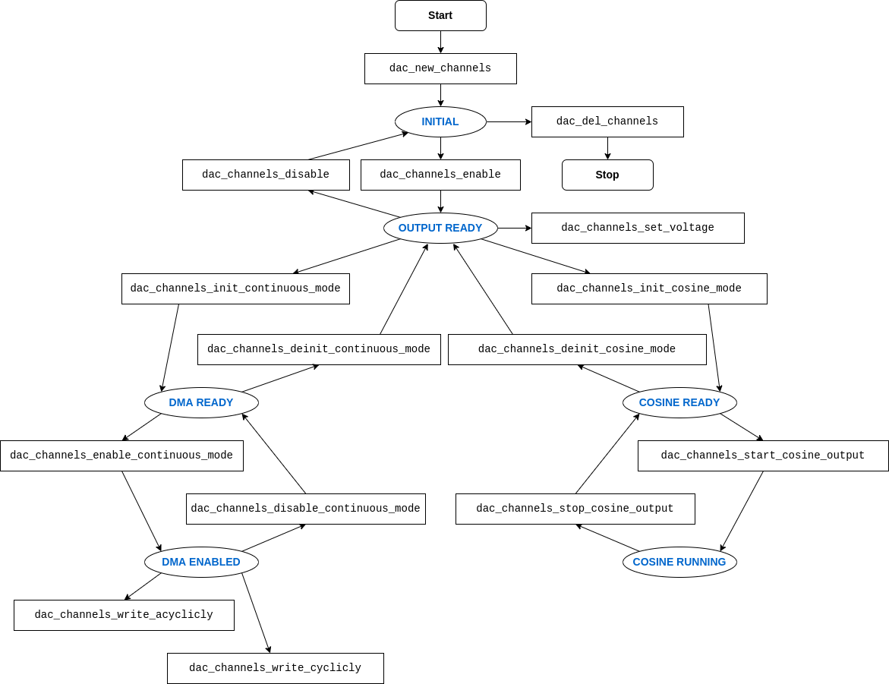

Digital To Analog Converter (DAC)
=================================

{IDF_TARGET_DAC_CH_1: default = "GPIO25", esp32 = "GPIO25", esp32s2 = "GPIO17"}
{IDF_TARGET_DAC_CH_2: default = "GPIO26", esp32 = "GPIO26", esp32s2 = "GPIO18"}

Overview
--------

{IDF_TARGET_NAME} has two 8-bit DAC (digital to analog converter) channels, connected to {IDF_TARGET_DAC_CH_1} (Channel 1) and {IDF_TARGET_DAC_CH_2} (Channel 2). Which means each channel of DAC can convert digital value 0~255 to the analog voltage 0~Vref, the output voltage can be calculate by::

    out_voltage = Vref * digi_val / 255

The DAC peripheral supports outputting analog signal in following ways:

1. Outputting a voltage directly. The DAC channel will keep outputting a specified voltage.
2. Outputting continuous analog signal by DMA. The DAC will convert the data in a buffer at the specified frequency.
3. Outputting a cosine wave by the cosine wave generateor. The DAC channel can output a cosing wave with specified frequency and amplitude.

For other analog output options, see the :doc:`Sigma-delta Modulation module <sigmadelta>` and the :doc:`LED Control module <ledc>`. Both these modules produce high-frequency PWM/PDM output, which can be hardware low-pass filtered in order to generate a lower frequency analog output.

DAC File Structure
------------------

.. figure:: ../../../_static/diagrams/dac/dac_file_structure.png
    :align: center
    :alt: DAC file structure

**Public headers that need to be included in the DAC application**

- ``dac.h``: The header file of legacy DAC driver (for apps using legacy driver)
- ``dac_driver.h``: The header file of new DAC driver (for apps using new DAC driver)

.. note::

    The legacy driver can't coexist with the new driver. Including ``dac.h`` to use the legacy driver or ``dac_driver.h`` to use the new driver. The legacy driver might be removed in future.

Functional Overview
-------------------

Resources Management
^^^^^^^^^^^^^^^^^^^^

The DAC on {IDF_TARGET_NAME} has two channels, which can be managed by the :cpp:type:`dac_channels_handle_t`. One or both two channels can be registered to a group by calling :cpp:func:`dac_new_channels`, it will return a channels handle so that the channels in a same group can be operated at the same time with this handle. While the channels in a group are not used any more, please call :cpp:func:`dac_del_channels` to free the resources and reset the hardware.

Direct Voltage Output (Direct Mode)
^^^^^^^^^^^^^^^^^^^^^^^^^^^^^^^^^^^^^^^

The DAC channels in the group can convert a 8-bit digital value into the analog every time calling :cpp:func:`dac_channels_set_voltage` (it can be called in ISR), and then the analog voltage will keep on corresponding pins until next convert start. But before starting to convert the voltage, the DAC channels and pins should be enabled by calling :cpp:func:`dac_channels_enable`.

Continuous Wave Output (DMA Mode)
^^^^^^^^^^^^^^^^^^^^^^^^^^^^^^^^^

DAC channels in the group can also convert digital data continuously via the DMA.

To convert data continuously, the channels need to be initialized into DMA mode by calling :cpp:func:`dac_channels_init_continuous_mode` and then enable DMA conversion by :cpp:func:`dac_channels_enable_continuous_mode`.

After start up the DMA, there are two methods to transmit the rerial digital data. One method is transmitting only one time by :cpp:func:`dac_channels_write_continuously`, it will be blocked until all data transmitted, and the voltage will be kept according to the last conversion value. Another method is transmitting repeatly by :cpp:func:`dac_channels_write_cyclically`, the data in the buffer will be converted cyclicly without block, but note that the buffer size is limited by the descriptor number, and it has to stay available during the whole conversion period, otherwise invalid data might be transmitted.

.. only:: esp32

    On ESP32, DAC digital controller can be connected internally to the I2S0 and use its DMA for continuous conversion. Although the DAC only needs 8-bit data for conversion, it has to be left shifted 8 bits (i.e. the high 8 bits in 16-bit slot) to satisfy the I2S communication format. So the data buffer need to be expanded before passing it into the write function. Besides, if the both two channels are enabled, the data will be transmitted with a fixed phase diferrence between these channels.

    The clock of DAC digital controller comes from I2S0 as well, so there are two kinds of clock source can be selected, they are :cpp:enumerator:`dac_conti_clk_src_t::DAC_DIGI_CLK_SRC_DEFAULT` which comes from ``CPU_D2_PLL`` and :cpp:enumerator:`dac_conti_clk_src_t::DAC_DIGI_CLK_SRC_APLL`. Theoretically, :cpp:enumerator:`dac_conti_clk_src_t::DAC_DIGI_CLK_SRC_DEFAULT` can support frequency between 19.6 KHz to several MHz and :cpp:enumerator:`dac_conti_clk_src_t::DAC_DIGI_CLK_SRC_DEFAULT` can support frequency between 648 Hz to several MHz, however, the latter clock source might be occupied by other peripherals, then it may not provide the required frequency. But it doesn't mean APLL is not available in this case, it can still work as long as it can be divided to the target DAC DMA frequency.

.. only:: esp32s2

    On ESP32-S2, DAC digital controller can be connected internally to the SPI3 and use its DMA for continuous conversion.

    The clock source of DAC difital controller can be choosen to :cpp:enumerator:`dac_conti_clk_src_t::DAC_DIGI_CLK_SRC_DEFAULT` (which comes from ``APB``) or :cpp:enumerator:`dac_conti_clk_src_t::DAC_DIGI_CLK_SRC_APLL`. Theoretically, :cpp:enumerator:`dac_conti_clk_src_t::DAC_DIGI_CLK_SRC_DEFAULT` can support frequency between 77 Hz to several MHz and :cpp:enumerator:`dac_conti_clk_src_t::DAC_DIGI_CLK_SRC_DEFAULT` can support frequency between 6 Hz to several MHz,however, the latter clock source might be occupied by other peripherals, then it may not provide the required frequency. But it doesn't mean APLL is not available in this case, it can still work as long as it can be divided to the target DAC DMA frequency.

Cosine Wave Output (Cosine Mode)
^^^^^^^^^^^^^^^^^^^^^^^^^^^^^^^^

The DAC peripheral has a cosine wave generateor on each channel, it can generate cosine wave on these channels, users can specify the frequency, amplitude and phase of the cosine wave. To output the cosine wave, please initialize the DAC to cosine mode by :cpp:func:`dac_channels_init_cosine_mode` first, and then start the cosine wave generator by :cpp:func:`dac_channels_start_cosine_output`.

Currently, the source clock of the consine wave generator only comes from ``RTC FAST`` which can be choosen by :cpp:enumerator:`dac_cosine_clk_src_t::DAC_COSINE_CLK_SRC_DEFAULT`.

Finite-State Machine
^^^^^^^^^^^^^^^^^^^^

The DAC driver adopts a finite-state machine, the following diagram shows the relationship of the public APIs and the driver internal states.

Power Management
^^^^^^^^^^^^^^^^

When the power management is enabled (i.e. :ref:`CONFIG_PM_ENABLE` is on), the system will adjust or stop the source clock of DAC before going into light sleep, thus potentially influence to the DAC signals may lead the data conversion goes wrong.

DAC driver can prevent the system from changing or stopping the source clock in DMA or cosine wave mode by acquiring a power management lock. When the source clock is generated from APB, the lock type will be set to :cpp:enumerator:`esp_pm_lock_type_t::ESP_PM_APB_FREQ_MAX` and when the source clock is APLL (only in DMA mode), it will be set to :cpp:enumerator:`esp_pm_lock_type_t::ESP_PM_NO_LIGHT_SLEEP`. Whenever the DAC is converting (i.e. DMA or cosing wave generator is working), the driver will guarantee that the power management lock is acquired. Likewise, the driver releases the lock after conversion stopped.

IRAM Safe
^^^^^^^^^

By default, the DAC DMA interrupt will be deferred when the Cache is disabled for reasons like writing/erasing Flash. Thus the DMA EOF interrupt will not get executed in time, which is not expected in a real-time application.

There's a Kconfig option :ref:`CONFIG_DAC_ISR_IRAM_SAFE` that will:

1. Enable the interrupt being serviced even when cache is disabled

2. Place driver object into DRAM (in case it's linked to PSRAM by accident)

This will allow the interrupt to run while the cache is disabled but will come at the cost of increased IRAM consumption. However, before enable :ref:`CONFIG_DAC_ISR_IRAM_SAFE` please make sure that the data buffer is allocated in the internal RAM by :cpp:func:`heap_caps_calloc` and set the last parameter to ``MALLOC_CAP_INTERNAL | MALLOC_CAP_8BIT``.

Thread Safety
^^^^^^^^^^^^^

All the public DAC APIs are guaranteed to be thread safe by the driver, which means, users can call them from different RTOS tasks without protection by extra locks. Notice that DAC driver uses mutex lock to ensure the thread safety, thus these APIs are not allowed to be used in ISR.

For other analog output options, see the :doc:`Sigma-delta Modulation module <sdm>` and the :doc:`LED Control module <ledc>`. Both these modules produce high frequency PDM/PWM output, which can be hardware low-pass filtered in order to generate a lower frequency analog output.

Kconfig Options
^^^^^^^^^^^^^^^

- :ref:`CONFIG_DAC_ISR_IRAM_SAFE` controls whether the default ISR handler can work when cache is disabled, see `IRAM Safe <#iram-safe>`__ for more information.
- :ref:`CONFIG_DAC_SUPPRESS_DEPRECATE_WARN` controls whether to suppress the compiling warning message while using the legacy DAC driver.
- :ref:`CONFIG_DAC_ENABLE_DEBUG_LOG` is used to enabled the debug log output. Enable this option will increase the firmware binary size.

Application Example
-------------------

The basic examples for the ``Direct Mode``, ``DMA Mode`` and ``Consine Mode`` can be found in :example:`peripherals/dac/dac_basic`, :example:`peripherals/dac/dac_continuous` and :example:`peripherals/dac/dac_cosine_wave`. Here is a general overview of how to use these modes:

Direct Output Example
^^^^^^^^^^^^^^^^^^^^^

.. code:: c

    #include <driver/dac_driver.h>

    ...

    dac_channels_handle_t handle;
    dac_channels_config_t cfg = {.chan_sel = DAC_CHANNEL_MASK_BOTH};

    /* Allocate a channels handle for the choosen channels */
    ESP_ERROR_CHECK(dac_new_channels(&cfg, &handle));
    /* Must enable the channels before any outputting */
    ESP_ERROR_CHECK(dac_channels_enable(handle));

    /* Output '100', the DAC pin will output about (100 / 255) * 3.3 = 1.29 V */
    ESP_ERROR_CHECK(dac_channels_set_voltage(handle, 100));

    /* Disable the channels to stop outputting */
    ESP_ERROR_CHECK(dac_channels_disable(handle));
    /* Delete and free the channels */
    ESP_ERROR_CHECK(dac_del_channels(handle));

Continuous Output Example
^^^^^^^^^^^^^^^^^^^^^^^^^

.. only:: esp32

    .. code:: c

        #include "driver/dac_driver.h"
        #if CONFIG_DAC_ISR_IRAM_SAFE
        /* If DAC IRAM safe enabled in Kconfig, include "esp_heap_caps.h" to allocate memory on internal RAM */
        #include "esp_heap_caps.h"
        #endif

        ...

        dac_channels_handle_t handle;
        dac_channels_config_t cfg = {.chan_sel = DAC_CHANNEL_MASK_BOTH};
        dac_conti_config_t dma_cfg = {
            .chan_mode = DAC_CHANNEL_MODE_SIMUL,
            .clk_src = DAC_DIGI_CLK_SRC_DEFAULT,
            .desc_num = 10,
            .freq_hz = 20000,
        };

        /* Allocate a channels handle for the choosen channels */
        ESP_ERROR_CHECK(dac_new_channels(&cfg, &handle));
        /* Must enable the channels before any outputting */
        ESP_ERROR_CHECK(dac_channels_enable(handle));
        /* Initialize the channels to DMA mode */
        ESP_ERROR_CHECK(dac_channels_init_continuous_mode(handle, &dma_cfg));
        /* Must enable DMA before writing data */
        ESP_ERROR_CHECK(dac_channels_enable_continuous_mode(handle));

        /* Allocate the memory for the buffer to write */
        uint32_t buf_size = 2000;
        uint32_t timeout_ms = 1000;
        #if CONFIG_DAC_ISR_IRAM_SAFE
        /* If DAC IRAM SAFE is enabled, allocate the buffer on the internal RAM */
        uint8_t *data = (uint8_t *)heap_caps_calloc(1, buf_size, MALLOC_CAP_INTERNAL | MALLOC_CAP_8BIT);
        #else
        uint8_t *data = (uint8_t *)calloc(1, buf_size);
        #endif
        assert(data);
        /* Load the 16-bit aligned data */
        for (int i = 0; i < buf_size; i += 2) {
            data[i] = 0;                // Fill 0 to the low 8 bits
            data[i+1] = (i / 2) % 255;  // Only the high 8 bits will be conveted
        }
        /* Write the data acyclicly, it will be blocked untill finishing sending all the data */
        ESP_ERROR_CHECK(dac_channels_write_continuously(handle, data, buf_size, NULL, timeout_ms));
        /* Write the data acyclicly, it will start output the buffer cyclicly without block, it can only be timeout when failed to aquire the lock */
        ESP_ERROR_CHECK(dac_channels_write_continuously(handle, data, buf_size, NULL, timeout_ms));

        /* Disable the DMA before deinitializing DMA mode */
        ESP_ERROR_CHECK(dac_channels_disable_continuous_mode(handle));
        /* Deinitialize DMA mode before disabling the channels */
        ESP_ERROR_CHECK(dac_channels_deinit_continuous_mode(handle));
        /* Disable the channels before deleting it */
        ESP_ERROR_CHECK(dac_channels_disable(handle));
        /* Delete the channels */
        ESP_ERROR_CHECK(dac_del_channels(handle));

.. only:: esp32s2

    .. code:: c

        #include "driver/dac_driver.h"
        #if CONFIG_DAC_ISR_IRAM_SAFE
        /* If DAC IRAM safe enabled in Kconfig, include "esp_heap_caps.h" to allocate memory on internal RAM */
        #include "esp_heap_caps.h"
        #endif

        ...

        dac_channels_handle_t handle;
        dac_channels_config_t cfg = {.chan_sel = DAC_CHANNEL_MASK_BOTH};
        dac_conti_config_t dma_cfg = {
            .chan_mode = DAC_CHANNEL_MODE_SIMUL,
            .clk_src = DAC_DIGI_CLK_SRC_DEFAULT,
            .desc_num = 10,
            .freq_hz = 20000,
        };

        /* Allocate a channels handle for the choosen channels */
        ESP_ERROR_CHECK(dac_new_channels(&cfg, &handle));
        /* Must enable the channels before any outputting */
        ESP_ERROR_CHECK(dac_channels_enable(handle));
        /* Initialize the channels to DMA mode */
        ESP_ERROR_CHECK(dac_channels_init_continuous_mode(handle, &dma_cfg));
        /* Must enable DMA before writing data */
        ESP_ERROR_CHECK(dac_channels_enable_continuous_mode(handle));

        /* Allocate the memory for the buffer to write */
        uint32_t buf_size = 2000;
        uint32_t timeout_ms = 1000;
        #if CONFIG_DAC_ISR_IRAM_SAFE
        /* If DAC IRAM SAFE is enabled, allocate the buffer on the internal RAM */
        uint8_t *data = (uint8_t *)heap_caps_calloc(1, buf_size, MALLOC_CAP_INTERNAL | MALLOC_CAP_8BIT);
        #else
        uint8_t *data = (uint8_t *)calloc(1, buf_size);
        #endif
        assert(data);
        for (int i = 0; i < buf_size; i++) {
            data[i] = i % 255;
        }
        /* Write the data acyclicly, it will be blocked untill finishing sending all the data */
        ESP_ERROR_CHECK(dac_channels_write_continuously(handle, data, buf_size, NULL, timeout_ms));
        /* Write the data acyclicly, it will start output the buffer cyclicly without block, it can only be timeout when failed to aquire the lock */
        ESP_ERROR_CHECK(dac_channels_write_continuously(handle, data, buf_size, NULL, timeout_ms));

        /* Disable the DMA before deinitializing DMA mode */
        ESP_ERROR_CHECK(dac_channels_disable_continuous_mode(handle));
        /* Deinitialize DMA mode before disabling the channels */
        ESP_ERROR_CHECK(dac_channels_deinit_continuous_mode(handle));
        /* Disable the channels before deleting it */
        ESP_ERROR_CHECK(dac_channels_disable(handle));
        /* Delete the channels */
        ESP_ERROR_CHECK(dac_del_channels(handle));

Cosine Wave Output Example
^^^^^^^^^^^^^^^^^^^^^^^^^^

.. code:: c

    #include "driver/dac_driver.h"

    ...

    dac_channels_handle_t handle;
    dac_channels_config_t cfg = {.chan_sel = DAC_CHANNEL_MASK_BOTH};
    dac_cosine_config_t cos_cfg = {
        .freq_hz = 1000,
        .clk_src = DAC_COSINE_CLK_SRC_DEFAULT,
        .offset = 0,
        .phase = DAC_COSINE_PHASE_0,
        .scale = DAC_COSINE_NO_ATTEN,
    };
    /* Allocate a channels handle for the choosen channels */
    ESP_ERROR_CHECK(dac_new_channels(&cfg, &handle));
    /* Must enable the channels before any outputting */
    ESP_ERROR_CHECK(dac_channels_enable(handle));
    /* Initialize the channels to cosine wave mode */
    ESP_ERROR_CHECK(dac_channels_init_cosine_mode(handle, &cos_cfg));
    /* Start outputting the cosine wave */
    ESP_ERROR_CHECK(dac_channels_start_cosine_output(handle));

    /* Stop the cosine wave generator before deinitializing cosine mode */
    ESP_ERROR_CHECK(dac_channels_stop_cosine_output(handle));
    /* Deinitialize consine mode before disabling the channels */
    ESP_ERROR_CHECK(dac_channels_deinit_cosine_mode(handle));
    /* Disable the channels before deleting it */
    ESP_ERROR_CHECK(dac_channels_disable(handle));
    /* Delete the channels */
    ESP_ERROR_CHECK(dac_del_channels(handle));

API Reference
-------------

.. include-build-file:: inc/dac_driver.inc
.. include-build-file:: inc/dac_channel.inc
.. include-build-file:: inc/dac_types.inc
