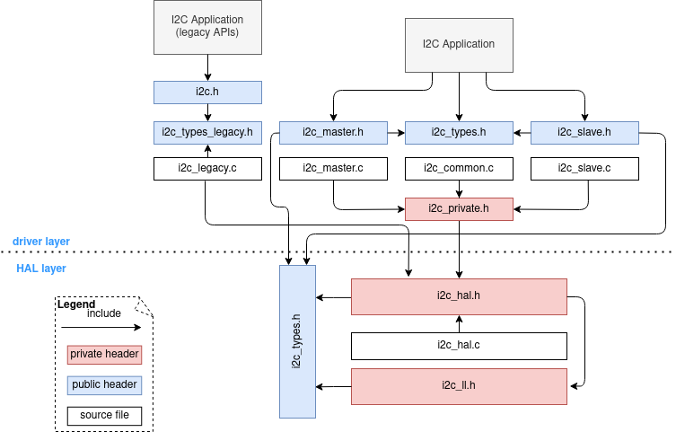
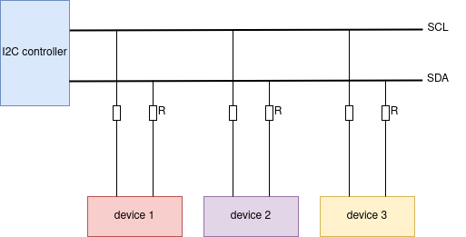

Inter-Integrated Circuit (I2C)
==============================

Introduction
------------

I2C is a serial, synchronous, multi-device, half-duplex communication protocol that allows co-existence of multiple masters and slaves on the same bus. I2C uses two bidirectional open-drain lines: serial data line (SDA) and serial clock line (SCL), pulled up by resistors.

{IDF_TARGET_NAME} has {IDF_TARGET_SOC_HP_I2C_NUM} I2C controller (also called port), responsible for handling communication on the I2C bus. A single I2C controller can be a master or a slave.

.. only:: SOC_LP_I2C_SUPPORTED

    Additionally, the {IDF_TARGET_NAME} chip has 1 low-power (LP) I2C controller. It is the cut-down version of regular I2C. Usually, the LP I2C controller only support basic I2C functionality with a much smaller RAM size, and does not support slave mode. For a full list of difference between HP I2C and LP I2C, please refer to the *{IDF_TARGET_NAME} Technical Reference Manual* > *I2C Controller (I2C)* > *Features* [`PDF <{IDF_TARGET_TRM_EN_URL}#i2c>`__].

    You can use LP I2C peripheral when HP I2C is not sufficient for users' usage. But please note again the LP I2C does not support all HP I2C functions. Please read docs before you use it.

Typically, an I2C slave device has a 7-bit address or 10-bit address. {IDF_TARGET_NAME} supports both I2C Standard-mode (Sm) and Fast-mode (Fm) which can go up to 100KHz and 400KHz respectively.

.. warning::

    The clock frequency of SCL in master mode should not be larger than 400 KHz

.. note::

    The frequency of SCL is influenced by both the pull-up resistor and the wire capacitance. Therefore, users are strongly recommended to choose appropriate pull-up resistors to make the frequency accurate. The recommended value for pull-up resistors usually ranges from 1K Ohms to 10K Ohms.

    Keep in mind that the higher the frequency, the smaller the pull-up resistor should be (but not less than 1 KOhms). Indeed, large resistors will decline the current, which will increase the clock switching time and reduce the frequency. We usually recommend a range of 2 KOhms to 5 KOhms, but users may also need to make some adjustments depending on their current draw requirements.

I2C Clock Configuration
-----------------------

.. list::

    - :cpp:enumerator:`i2c_clock_source_t::I2C_CLK_SRC_DEFAULT`: Default I2C source clock.
    :SOC_I2C_SUPPORT_XTAL: - :cpp:enumerator:`i2c_clock_source_t::I2C_CLK_SRC_XTAL`: External crystal for I2C clock source.
    :SOC_I2C_SUPPORT_RTC: - :cpp:enumerator:`i2c_clock_source_t::I2C_CLK_RC_FAST`: Internal 20MHz rc oscillator for I2C clock source.
    :SOC_I2C_SUPPORT_APB: - :cpp:enumerator:`i2c_clock_source_t::I2C_CLK_SRC_APB`: APB clock as I2C clock source.
    :SOC_I2C_SUPPORT_REF_TICK: - :cpp:enumerator:`i2c_clock_source_t::I2C_CLK_SRC_REF_TICK`: 1MHZ clock.

I2C File Structure
------------------

    I2C file structure

**Public headers that need to be included in the I2C application**

- ``i2c.h``: The header file of legacy I2C APIs (for apps using legacy driver).
- ``i2c_master.h``: The header file that provides standard communication mode specific APIs (for apps using new driver with master mode).
- ``i2c_slave.h``: The header file that provides standard communication mode specific APIs (for apps using new driver with slave mode).

.. note::

    The legacy driver can't coexist with the new driver. Include ``i2c.h`` to use the legacy driver or the other two headers to use the new driver. Please keep in mind that the legacy driver is now deprecated and will be removed in future.

**Public headers that have been included in the headers above**

- ``i2c_types_legacy.h``: The legacy public types that only used in the legacy driver.
- ``i2c_types.h``: The header file that provides public types.

Functional Overview
-------------------

The I2C driver offers following services:

-  `Resource Allocation <#resource-allocation>`__ - covers how to allocate I2C bus with properly set of configurations. It also covers how to recycle the resources when they finished working.
-  `I2C Master Controller <#i2c_master_controller>`__ - covers behavior of I2C master controller. Introduce data transmit, data receive, and data transmit and receive.
-  `I2C Slave Controller <#i2c_slave_controller>`__ - covers behavior of I2C slave controller. Involve data transmit and data receive.
-  `Power Management <#power-management>`__ - describes how different source clock will affect power consumption.
-  `IRAM Safe <#iram-safe>`__ - describes tips on how to make the I2C interrupt work better along with a disabled cache.
-  `Thread Safety <#thread-safety>`__ - lists which APIs are guaranteed to be thread safe by the driver.
-  `Kconfig Options <#kconfig-options>`__ - lists the supported Kconfig options that can bring different effects to the driver.

Resource Allocation
^^^^^^^^^^^^^^^^^^^

Both I2C master bus and I2C slave bus, when supported, are represented by :cpp:type:`i2c_bus_handle_t` in the driver. The available ports are managed in a resource pool that allocates a free port on request.

Install I2C master bus and device
~~~~~~~~~~~~~~~~~~~~~~~~~~~~~~~~~

The I2C master is designed based on bus-device model. So :cpp:type:`i2c_master_bus_config_t` and :cpp:type:`i2c_device_config_t` are required separately to allocate the I2C master bus instance and I2C device instance.

    I2C master bus-device module

I2C master bus requires the configuration that specified by :cpp:type:`i2c_master_bus_config_t`:

- :cpp:member:`i2c_master_bus_config_t::i2c_port` sets the I2C port used by the controller.
- :cpp:member:`i2c_master_bus_config_t::sda_io_num` sets the GPIO number for the serial data bus (SDA).
- :cpp:member:`i2c_master_bus_config_t::scl_io_num` sets the GPIO number for the serial clock bus (SCL).
- :cpp:member:`i2c_master_bus_config_t::clk_source` selects the source clock for I2C bus. The available clocks are listed in :cpp:type:`i2c_clock_source_t`. For the effect on power consumption of different clock source, please refer to `Power Management <#power-management>`__  section.
- :cpp:member:`i2c_master_bus_config_t::glitch_ignore_cnt` sets the glitch period of master bus, if the glitch period on the line is less than this value, it can be filtered out, typically value is 7.
- :cpp:member:`i2c_master_bus_config_t::intr_priority` Set the priority of the interrupt. If set to ``0`` , then the driver will use a interrupt with low or medium priority (priority level may be one of 1,2 or 3), otherwise use the priority indicated by :cpp:member:`i2c_master_bus_config_t::intr_priority` Please use the number form (1,2,3) , not the bitmask form ((1<<1),(1<<2),(1<<3)).
- :cpp:member:`i2c_master_bus_config_t::trans_queue_depth` Depth of internal transfer queue. Only valid in asynchronous transaction.
- :cpp:member:`i2c_master_bus_config_t::enable_internal_pullup` Enable internal pullups. Note: This is not strong enough to pullup buses under high-speed frequency. A suitable external pullup is recommended.

If the configurations in :cpp:type:`i2c_master_bus_config_t` is specified, users can call :cpp:func:`i2c_new_master_bus` to allocate and initialize an I2C master bus. This function will return an I2C bus handle if it runs correctly. Specifically, when there are no more I2C port available, this function will return :c:macro:`ESP_ERR_NOT_FOUND` error.

I2C master device requires the configuration that specified by :cpp:type:`i2c_device_config_t`:

- :cpp:member:`i2c_device_config_t::dev_addr_length` configure the address bit length of the slave device. User can choose from enumerator :cpp:enumerator:`I2C_ADDR_BIT_LEN_7` or :cpp:enumerator:`I2C_ADDR_BIT_LEN_10` (if supported).
- :cpp:member:`i2c_device_config_t::device_address` I2C device raw address. Please parse the device address to this member directly. For example, the device address is 0x28, then parse 0x28 to :cpp:member:`i2c_device_config_t::device_address`, don't carry a write/read bit.
- :cpp:member:`i2c_device_config_t::scl_speed_hz` set the scl line frequency of this device.
- :cpp:member:`i2c_device_config_t::scl_wait_us`. SCL await time (in us). Usually this value should not be very small because slave stretch will happen in pretty long time. (It's possible even stretch for 12ms). Set 0 means use default reg value.

Once the :cpp:type:`i2c_device_config_t` structure is populated with mandatory parameters, users can call :cpp:func:`i2c_master_bus_add_device` to allocate an I2C device instance and mounted to the master bus then. This function will return an I2C device handle if it runs correctly. Specifically, when the I2C bus is not initialized properly, calling this function will result in a :c:macro:`ESP_ERR_INVALID_ARG` error.

.. code:: c

    #include "driver/i2c_master.h"

    i2c_master_bus_config_t i2c_mst_config = {
        .clk_source = I2C_CLK_SRC_DEFAULT,
        .i2c_port = TEST_I2C_PORT,
        .scl_io_num = I2C_MASTER_SCL_IO,
        .sda_io_num = I2C_MASTER_SDA_IO,
        .glitch_ignore_cnt = 7,
        .flags.enable_internal_pullup = true,
    };

    i2c_master_bus_handle_t bus_handle;
    ESP_ERROR_CHECK(i2c_new_master_bus(&i2c_mst_config, &bus_handle));

    i2c_device_config_t dev_cfg = {
        .dev_addr_length = I2C_ADDR_BIT_LEN_7,
        .device_address = 0x58,
        .scl_speed_hz = 100000,
    };

    i2c_master_dev_handle_t dev_handle;
    ESP_ERROR_CHECK(i2c_master_bus_add_device(bus_handle, &dev_cfg, &dev_handle));

.. only:: SOC_LP_I2C_SUPPORTED

    Install I2C master bus with LP I2C Peripheral
    ~~~~~~~~~~~~~~~~~~~~~~~~~~~~~~~~~~~~~~~~~~~~~

    Install I2C master bus with LP I2C peripheral is almost as same as how HP I2C peripheral is installed. However, there are still some difference user should take focus on including IOs, clock sources, i2c port number, etc. Following code will show you how to install I2C master bus with LP_I2C.

    .. code:: c

        #include "driver/i2c_master.h"

        i2c_master_bus_config_t i2c_mst_config = {
            .clk_source = LP_I2C_SCLK_DEFAULT,    // clock source for LP i2c, might different from HP I2C
            .i2c_port = LP_I2C_NUM_0,             // Assign to LP I2C port
            .scl_io_num = 7,                      // SCL IO number. Please refer to technical reference manual
            .sda_io_num = 6,                      // SDA IO number. Please refer to technical reference manual
            .glitch_ignore_cnt = 7,
            .flags.enable_internal_pullup = true,
        };

        i2c_master_bus_handle_t bus_handle;
        ESP_ERROR_CHECK(i2c_new_master_bus(&i2c_mst_config, &bus_handle));

        i2c_device_config_t dev_cfg = {
            .dev_addr_length = I2C_ADDR_BIT_LEN_7,
            .device_address = 0x58,
            .scl_speed_hz = 100000,
        };

        i2c_master_dev_handle_t dev_handle;
        ESP_ERROR_CHECK(i2c_master_bus_add_device(bus_handle, &dev_cfg, &dev_handle));

Uninstall I2C master bus and device
~~~~~~~~~~~~~~~~~~~~~~~~~~~~~~~~~~~

If a previously installed I2C bus or device is no longer needed, it's recommended to recycle the resource by calling :cpp:func:`i2c_master_bus_rm_device` or :cpp:func:`i2c_del_master_bus`, so that to release the underlying hardware.

Install I2C slave device
~~~~~~~~~~~~~~~~~~~~~~~~

I2C slave requires the configuration that specified by :cpp:type:`i2c_slave_config_t`:

.. list::

    - :cpp:member:`i2c_slave_config_t::i2c_port` sets the I2C port used by the controller.
    - :cpp:member:`i2c_slave_config_t::sda_io_num` sets the GPIO number for serial data bus (SDA).
    - :cpp:member:`i2c_slave_config_t::scl_io_num` sets the GPIO number for serial clock bus (SCL).
    - :cpp:member:`i2c_slave_config_t::clk_source` selects the source clock for I2C bus. The available clocks are listed in :cpp:type:`i2c_clock_source_t`. For the effect on power consumption of different clock source, please refer to `Power Management <#power-management>`__  section.
    - :cpp:member:`i2c_slave_config_t::send_buf_depth` sets the sending buffer length.
    - :cpp:member:`i2c_slave_config_t::slave_addr` sets the slave address
    - :cpp:member:`i2c_master_bus_config_t::intr_priority` Set the priority of the interrupt. If set to ``0`` , then the driver will use a interrupt with low or medium priority (priority level may be one of 1,2 or 3), otherwise use the priority indicated by :cpp:member:`i2c_master_bus_config_t::intr_priority` Please use the number form (1,2,3) , not the bitmask form ((1<<1),(1<<2),(1<<3)). Please pay attention that once the interrupt priority is set, it cannot be changed until :cpp:func:`i2c_del_master_bus` is called.
    - :cpp:member:`i2c_slave_config_t::addr_bit_len` sets true if you need the slave to have a 10-bit address.
    :SOC_I2C_SLAVE_CAN_GET_STRETCH_CAUSE: - :cpp:member:`i2c_slave_config_t::stretch_en` Set true if you want the slave controller stretch works, please refer to [`TRM <{IDF_TARGET_TRM_EN_URL}#i2c>`__] to learn how I2C stretch works.
    :SOC_I2C_SLAVE_CAN_GET_STRETCH_CAUSE: - :cpp:member:`i2c_slave_config_t::broadcast_en` Set true to enable the slave broadcast. When the slave receives the general call address 0x00 from the master and the R/W bit followed is 0, it responds to the master regardless of its own address.
    :SOC_I2C_SLAVE_SUPPORT_I2CRAM_ACCESS: - :cpp:member:`i2c_slave_config_t::access_ram_en` Set true to enable the non-fifo mode. Thus the I2C data fifo can be used as RAM, and double addressing will be synchronised opened.
    :SOC_I2C_SLAVE_SUPPORT_SLAVE_UNMATCH: - :cpp:member:`i2c_slave_config_t::slave_unmatch_en` Set true to enable the slave unmatch interrupt. If master send command address cannot match the slave address, and unmatch interrupt will be triggered.

Once the :cpp:type:`i2c_slave_config_t` structure is populated with mandatory parameters, users can call :cpp:func:`i2c_new_slave_device` to allocate and initialize an I2C master bus. This function will return an I2C bus handle if it runs correctly. Specifically, when there are no more I2C port available, this function will return :c:macro:`ESP_ERR_NOT_FOUND` error.

.. code:: c

    i2c_slave_config_t i2c_slv_config = {
        .addr_bit_len = I2C_ADDR_BIT_LEN_7,
        .clk_source = I2C_CLK_SRC_DEFAULT,
        .i2c_port = TEST_I2C_PORT,
        .send_buf_depth = 256,
        .scl_io_num = I2C_SLAVE_SCL_IO,
        .sda_io_num = I2C_SLAVE_SDA_IO,
        .slave_addr = 0x58,
    };

    i2c_slave_dev_handle_t slave_handle;
    ESP_ERROR_CHECK(i2c_new_slave_device(&i2c_slv_config, &slave_handle));

Uninstall I2C slave device
~~~~~~~~~~~~~~~~~~~~~~~~~~

If a previously installed I2C bus is no longer needed, it's recommended to recycle the resource by calling :cpp:func:`i2c_del_slave_device`, so that to release the underlying hardware.

I2C Master Controller
^^^^^^^^^^^^^^^^^^^^^

After installing the i2c master driver by :cpp:func:`i2c_new_master_bus`, {IDF_TARGET_NAME} is ready to communicate with other I2C devices. I2C APIs allow the standard transactions. Like the wave as follows:

.. wavedrom:: /../_static/diagrams/i2c/i2c_trans_wave.json

I2C Master Write
~~~~~~~~~~~~~~~~

After installing I2C master bus successfully, you can simply call :cpp:func:`i2c_master_transmit` to write data to the slave device. The principle of this function can be explained by following chart.

In order to organize the process, the driver uses a command link, that should be populated with a sequence of commands and then passed to I2C controller for execution.

    I2C master write to slave

Simple example for writing data to slave:

.. code:: c

    #define DATA_LENGTH 100
    i2c_master_bus_config_t i2c_mst_config = {
        .clk_source = I2C_CLK_SRC_DEFAULT,
        .i2c_port = I2C_PORT_NUM_0,
        .scl_io_num = I2C_MASTER_SCL_IO,
        .sda_io_num = I2C_MASTER_SDA_IO,
        .glitch_ignore_cnt = 7,
    };
    i2c_master_bus_handle_t bus_handle;

    ESP_ERROR_CHECK(i2c_new_master_bus(&i2c_mst_config, &bus_handle));

    i2c_device_config_t dev_cfg = {
        .dev_addr_length = I2C_ADDR_BIT_LEN_7,
        .device_address = 0x58,
        .scl_speed_hz = 100000,
    };

    i2c_master_dev_handle_t dev_handle;
    ESP_ERROR_CHECK(i2c_master_bus_add_device(bus_handle, &dev_cfg, &dev_handle));

    ESP_ERROR_CHECK(i2c_master_transmit(dev_handle, data_wr, DATA_LENGTH, -1));

I2C Master Read
~~~~~~~~~~~~~~~

After installing I2C master bus successfully, you can simply call :cpp:func:`i2c_master_receive` to read data from the slave device. The principle of this function can be explained by following chart.

    I2C master read from slave

Simple example for reading data from slave:

.. code:: c

    #define DATA_LENGTH 100
    i2c_master_bus_config_t i2c_mst_config = {
        .clk_source = I2C_CLK_SRC_DEFAULT,
        .i2c_port = I2C_PORT_NUM_0,
        .scl_io_num = I2C_MASTER_SCL_IO,
        .sda_io_num = I2C_MASTER_SDA_IO,
        .glitch_ignore_cnt = 7,
    };
    i2c_master_bus_handle_t bus_handle;

    ESP_ERROR_CHECK(i2c_new_master_bus(&i2c_mst_config, &bus_handle));

    i2c_device_config_t dev_cfg = {
        .dev_addr_length = I2C_ADDR_BIT_LEN_7,
        .device_address = 0x58,
        .scl_speed_hz = 100000,
    };

    i2c_master_dev_handle_t dev_handle;
    ESP_ERROR_CHECK(i2c_master_bus_add_device(bus_handle, &dev_cfg, &dev_handle));

    i2c_master_receive(dev_handle, data_rd, DATA_LENGTH, -1);

I2C Master Write and Read
~~~~~~~~~~~~~~~~~~~~~~~~~

Some I2C device needs write configurations before reading data from it, therefore, an interface called :cpp:func:`i2c_master_transmit_receive` can help. The principle of this function can be explained by following chart.

    I2C master write to slave and read from slave

Simple example for writing and reading from slave:

.. code:: c

    i2c_device_config_t dev_cfg = {
        .dev_addr_length = I2C_ADDR_BIT_LEN_7,
        .device_address = 0x58,
        .scl_speed_hz = 100000,
    };

    i2c_master_dev_handle_t dev_handle;
    ESP_ERROR_CHECK(i2c_master_bus_add_device(I2C_PORT_NUM_0, &dev_cfg, &dev_handle));
    uint8_t buf[20] = {0x20};
    uint8_t buffer[2];
    ESP_ERROR_CHECK(i2c_master_transmit_receive(dev_handle, buf, sizeof(buf), buffer, 2, -1));

I2C Master Probe
~~~~~~~~~~~~~~~~

I2C driver can use :cpp:func:`i2c_master_probe` to detect whether the specific device has been connected on I2C bus. If this function return ``ESP_OK``, that means the device has been detected.

.. important::

    Pull-ups must be connected to the SCL and SDA pins when this function is called. If you get `ESP_ERR_TIMEOUT` while `xfer_timeout_ms` was parsed correctly, you should check the pull-up resistors. If you do not have proper resistors nearby, setting `flags.enable_internal_pullup` as true is also acceptable.

    I2C master probe

Simple example for probing an I2C device:

.. code:: c

    i2c_master_bus_config_t i2c_mst_config_1 = {
        .clk_source = I2C_CLK_SRC_DEFAULT,
        .i2c_port = TEST_I2C_PORT,
        .scl_io_num = I2C_MASTER_SCL_IO,
        .sda_io_num = I2C_MASTER_SDA_IO,
        .glitch_ignore_cnt = 7,
        .flags.enable_internal_pullup = true,
    };
    i2c_master_bus_handle_t bus_handle;

    ESP_ERROR_CHECK(i2c_new_master_bus(&i2c_mst_config_1, &bus_handle));
    ESP_ERROR_CHECK(i2c_master_probe(bus_handle, 0x22, -1));
    ESP_ERROR_CHECK(i2c_del_master_bus(bus_handle));

I2C Slave Controller
^^^^^^^^^^^^^^^^^^^^

After installing the i2c slave driver by :cpp:func:`i2c_new_slave_device`, {IDF_TARGET_NAME} is ready to communicate with other I2C master as a slave.

I2C Slave Write
~~~~~~~~~~~~~~~

The send buffer of the I2C slave is used as a FIFO to store the data to be sent. The data will queue up until the master requests them. You can call :cpp:func:`i2c_slave_transmit` to transfer data.

Simple example for writing data to FIFO:

.. code:: c

    uint8_t *data_wr = (uint8_t *) malloc(DATA_LENGTH);

    i2c_slave_config_t i2c_slv_config = {
        .addr_bit_len = I2C_ADDR_BIT_LEN_7,   // 7-bit address
        .clk_source = I2C_CLK_SRC_DEFAULT,    // set the clock source
        .i2c_port = 0,                        // set I2C port number
        .send_buf_depth = 256,                // set tx buffer length
        .scl_io_num = 2,                      // SCL gpio number
        .sda_io_num = 1,                      // SDA gpio number
        .slave_addr = 0x58,                   // slave address
    };

    i2c_bus_handle_t i2c_bus_handle;
    ESP_ERROR_CHECK(i2c_new_slave_device(&i2c_slv_config, &i2c_bus_handle));
    for (int i = 0; i < DATA_LENGTH; i++) {
        data_wr[i] = i;
    }

    ESP_ERROR_CHECK(i2c_slave_transmit(i2c_bus_handle, data_wr, DATA_LENGTH, 10000));

I2C Slave Read
~~~~~~~~~~~~~~

Whenever the master writes data to the slave, the slave will automatically store data in the receive buffer. This allows the slave application to call the function :cpp:func:`i2c_slave_receive` as its own discretion. As :cpp:func:`i2c_slave_receive` is designed as a non-blocking interface. So the user needs to register callback :cpp:func:`i2c_slave_register_event_callbacks` to know when the receive has finished.

.. code:: c

    static IRAM_ATTR bool i2c_slave_rx_done_callback(i2c_slave_dev_handle_t channel, const i2c_slave_rx_done_event_data_t *edata, void *user_data)
    {
        BaseType_t high_task_wakeup = pdFALSE;
        QueueHandle_t receive_queue = (QueueHandle_t)user_data;
        xQueueSendFromISR(receive_queue, edata, &high_task_wakeup);
        return high_task_wakeup == pdTRUE;
    }

    uint8_t *data_rd = (uint8_t *) malloc(DATA_LENGTH);
    uint32_t size_rd = 0;

    i2c_slave_config_t i2c_slv_config = {
        .addr_bit_len = I2C_ADDR_BIT_LEN_7,
        .clk_source = I2C_CLK_SRC_DEFAULT,
        .i2c_port = TEST_I2C_PORT,
        .send_buf_depth = 256,
        .scl_io_num = I2C_SLAVE_SCL_IO,
        .sda_io_num = I2C_SLAVE_SDA_IO,
        .slave_addr = 0x58,
    };

    i2c_slave_dev_handle_t slave_handle;
    ESP_ERROR_CHECK(i2c_new_slave_device(&i2c_slv_config, &slave_handle));

    s_receive_queue = xQueueCreate(1, sizeof(i2c_slave_rx_done_event_data_t));
    i2c_slave_event_callbacks_t cbs = {
        .on_recv_done = i2c_slave_rx_done_callback,
    };
    ESP_ERROR_CHECK(i2c_slave_register_event_callbacks(slave_handle, &cbs, s_receive_queue));

    i2c_slave_rx_done_event_data_t rx_data;
    ESP_ERROR_CHECK(i2c_slave_receive(slave_handle, data_rd, DATA_LENGTH));
    xQueueReceive(s_receive_queue, &rx_data, pdMS_TO_TICKS(10000));
    // Receive done.

.. only:: SOC_I2C_SLAVE_SUPPORT_I2CRAM_ACCESS

    Put Data In I2C Slave RAM
    ~~~~~~~~~~~~~~~~~~~~~~~~~

    I2C slave fifo mentioned above can be used as RAM, which means user can access the RAM directly via address fields. For example, writing data to the 3rd ram block with following graph. Before using this, please note that :cpp:member:`i2c_slave_config_t::access_ram_en` needs to be set to true.

    .. figure:: ../../../_static/diagrams/i2c/i2c_slave_write_slave_ram.png
        :align: center
        :alt: Put data in I2C slave RAM

        Put data in I2C slave RAM

    .. code:: c

        uint8_t data_rd[DATA_LENGTH_RAM] = {0};

        i2c_slave_config_t i2c_slv_config = {
            .addr_bit_len = I2C_ADDR_BIT_LEN_7,
            .clk_source = I2C_CLK_SRC_DEFAULT,
            .i2c_port = TEST_I2C_PORT,
            .send_buf_depth = 256,
            .scl_io_num = I2C_SLAVE_SCL_IO,
            .sda_io_num = I2C_SLAVE_SDA_IO,
            .slave_addr = 0x58,
            .flags.access_ram_en = true,
        };

        // Master write to slave.

        i2c_slave_dev_handle_t slave_handle;
        ESP_ERROR_CHECK(i2c_new_slave_device(&i2c_slv_config, &slave_handle));
        ESP_ERROR_CHECK(i2c_slave_read_ram(slave_handle, 0x5, data_rd, DATA_LENGTH_RAM));
        ESP_ERROR_CHECK(i2c_del_slave_device(slave_handle));

    Get Data From I2C Slave RAM
    ~~~~~~~~~~~~~~~~~~~~~~~~~~~

    Data can be stored in the RAM with a specific offset by the slave controller, and the master can read this data directly via the RAM address. For example, if the data is stored in 3rd ram block, master can read this data by following graph. Before using this, please note that :cpp:member:`i2c_slave_config_t::access_ram_en` needs to be set to true.

    .. figure:: ../../../_static/diagrams/i2c/i2c_slave_read_slave_ram.png
        :align: center
        :alt: Get data from I2C slave RAM

        Get data from I2C slave RAM

    .. code:: c

        uint8_t data_wr[DATA_LENGTH_RAM] = {0};

        i2c_slave_config_t i2c_slv_config = {
            .addr_bit_len = I2C_ADDR_BIT_LEN_7,
            .clk_source = I2C_CLK_SRC_DEFAULT,
            .i2c_port = TEST_I2C_PORT,
            .send_buf_depth = 256,
            .scl_io_num = I2C_SLAVE_SCL_IO,
            .sda_io_num = I2C_SLAVE_SDA_IO,
            .slave_addr = 0x58,
            .flags.access_ram_en = true,
        };

        i2c_slave_dev_handle_t slave_handle;
        ESP_ERROR_CHECK(i2c_new_slave_device(&i2c_slv_config, &slave_handle));
        ESP_ERROR_CHECK(i2c_slave_write_ram(slave_handle, 0x2, data_wr, DATA_LENGTH_RAM));
        ESP_ERROR_CHECK(i2c_del_slave_device(slave_handle));

Register Event Callbacks
^^^^^^^^^^^^^^^^^^^^^^^^

I2C master callbacks
~~~~~~~~~~~~~~~~~~~~

When an I2C master bus triggers an interrupt, a specific event will be generated and notify the CPU. If you have some functions that need to be called when those events occurred, you can hook your functions to the ISR (Interrupt Service Routine) by calling :cpp:func:`i2c_master_register_event_callbacks`. Since the registered callback functions are called in the interrupt context, user should ensure the callback function doesn't attempt to block (e.g. by making sure that only FreeRTOS APIs with ``ISR`` suffix are called from within the function). The callback functions are required to return a boolean value, to tell the ISR whether a high priority task is woke up by it.

I2C master event callbacks are listed in the :cpp:type:`i2c_master_event_callbacks_t`.

Although I2C is a synchronous communication protocol, we also support asynchronous behavior by registering above callback. In this way, I2C APIs will be non-blocking interface. But note that on the same bus, only one device can adopt asynchronous operation.

.. important::

    I2C master asynchronous transaction is still an experimental feature. (The issue is when asynchronous transaction is very large, it will cause memory problem.)

- :cpp:member:`i2c_master_event_callbacks_t::on_recv_done` sets a callback function for master "transaction-done" event. The function prototype is declared in :cpp:type:`i2c_master_callback_t`.

I2C slave callbacks
~~~~~~~~~~~~~~~~~~~

When an I2C slave bus triggers an interrupt, a specific event will be generated and notify the CPU. If you have some function that needs to be called when those events occurred, you can hook your function to the ISR (Interrupt Service Routine) by calling :cpp:func:`i2c_slave_register_event_callbacks`. Since the registered callback functions are called in the interrupt context, user should ensure the callback function doesn't attempt to block (e.g. by making sure that only FreeRTOS APIs with ``ISR`` suffix are called from within the function). The callback function has a boolean return value, to tell the caller whether a high priority task is woke up by it.

I2C slave event callbacks are listed in the :cpp:type:`i2c_slave_event_callbacks_t`.

.. list::

    - :cpp:member:`i2c_slave_event_callbacks_t::on_recv_done` sets a callback function for "receive-done" event. The function prototype is declared in :cpp:type:`i2c_slave_received_callback_t`.
    :SOC_I2C_SLAVE_CAN_GET_STRETCH_CAUSE: - :cpp:member:`i2c_slave_event_callbacks_t::on_stretch_occur` sets a callback function for "stretch" cause. The function prototype is declared in :cpp:type:`i2c_slave_stretch_callback_t`.

Power Management
^^^^^^^^^^^^^^^^

.. only:: SOC_I2C_SUPPORT_APB

    When the power management is enabled (i.e. :ref:`CONFIG_PM_ENABLE` is on), the system will adjust or stop the source clock of I2C fifo before going into light sleep, thus potentially changing the I2C signals and leading to transmitting or receiving invalid data.

    However, the driver can prevent the system from changing APB frequency by acquiring a power management lock of type :cpp:enumerator:`ESP_PM_APB_FREQ_MAX`. Whenever user creates an I2C bus that has selected :cpp:enumerator:`I2C_CLK_SRC_APB` as the clock source, the driver will guarantee that the power management lock is acquired when I2C operations begin and release the lock automatically when I2C operations finish.

.. only:: SOC_I2C_SUPPORT_REF_TICK

    If the controller clock source is selected to :cpp:enumerator:`I2C_CLK_SRC_REF_TICK`, then the driver won't install power management lock for it, which is more suitable for a low power application as long as the source clock can still provide sufficient resolution.

.. only:: SOC_I2C_SUPPORT_XTAL

    If the controller clock source is selected to :cpp:enumerator:`I2C_CLK_SRC_XTAL`, then the driver won't install power management lock for it, which is more suitable for a low power application as long as the source clock can still provide sufficient resolution.

IRAM Safe
^^^^^^^^^

By default, the I2C interrupt will be deferred when the Cache is disabled for reasons like writing/erasing Flash. Thus the event callback functions will not get executed in time, which is not expected in a real-time application.

There's a Kconfig option :ref:`CONFIG_I2C_ISR_IRAM_SAFE` that will:

1. Enable the interrupt being serviced even when cache is disabled
2. Place all functions that used by the ISR into IRAM
3. Place driver object into DRAM (in case it's mapped to PSRAM by accident)

This will allow the interrupt to run while the cache is disabled but will come at the cost of increased IRAM consumption.

Thread Safety
^^^^^^^^^^^^^

The factory function :cpp:func:`i2c_new_master_bus` and :cpp:func:`i2c_new_slave_device` are guaranteed to be thread safe by the driver, which means, user can call them from different RTOS tasks without protection by extra locks. Other public I2C APIs are not thread safe. which means the user should avoid calling them from multiple tasks, if user strongly needs to call them in multiple tasks, please add extra lock.

Kconfig Options
^^^^^^^^^^^^^^^

- :ref:`CONFIG_I2C_ISR_IRAM_SAFE` controls whether the default ISR handler can work when cache is disabled, see also `IRAM Safe <#iram-safe>`__ for more information.
- :ref:`CONFIG_I2C_ENABLE_DEBUG_LOG` is used to enable the debug log at the cost of increased firmware binary size.

API Reference
-------------

.. include-build-file:: inc/i2c_master.inc

.. only:: SOC_I2C_SUPPORT_SLAVE

    .. include-build-file:: inc/i2c_slave.inc

.. include-build-file:: inc/components/esp_driver_i2c/include/driver/i2c_types.inc
.. include-build-file:: inc/components/hal/include/hal/i2c_types.inc
