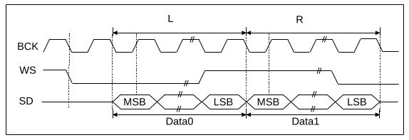
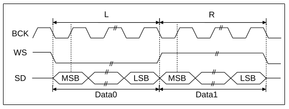
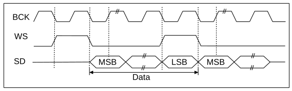

Inter-IC Sound (I2S)
====================

{IDF_TARGET_I2S_NUM:default="two", esp32s2="one", esp32c3="one"}

Introduction
------------

I2S (Inter-IC Sound) is a serial, synchronous communication protocol that is usually used for transmitting audio data between two digital audio devices.

{IDF_TARGET_NAME} contains {IDF_TARGET_I2S_NUM} I2S peripheral(s). These peripherals can be configured to input and output sample data via the I2S driver.

An I2S bus consists of the following lines:

- MCLK: Master clock line. It's an optional signal depends on slave side, mainly for offering a reference clock to the I2S slave device.
- BCLK: Bit clock line. The bit clock for data line in common I2S applications.
- WS: Word(Slot) select line. It is usually used to identify the vocal tract except PDM mode.
- DIN/DOUT: Serial data input/output line.

Each I2S controller has the following features that can be configured using the I2S driver:

- Operation as system master or slave
- Capable of acting as transmitter or receiver
- DMA controller that allows for streaming sample data without requiring the CPU to copy each data sample

.. only:: SOC_I2S_HW_VERSION_1

    Each controller can operate in simplex communication mode. Thus, the two controllers can be combined to establish full-duplex communication.

.. only:: SOC_I2S_HW_VERSION_2

    Each controller has separate rx and tx channel. That means they are able to work under different clock and slot configurations with separate GPIO pins. Note that although their internal MCLK are separate, but the output MCLK signal can only be attached to one channel, we can't output two different MCLK at the same time.

I2S Communication Mode
----------------------

Overview of All Modes
^^^^^^^^^^^^^^^^^^^^^

=========  ========  ========  ========  ========  ========  ==========
Platform   Standard   PDM TX    PDM RX     TDM     ADC/DAC   LCD/Camera
=========  ========  ========  ========  ========  ========  ==========
ESP32      port 0/1   port 0    port 0     none     port 0     port 0
ESP32S2     port 0    none      none       none     none       port 0
ESP32C3     port 0    port 0    none       port0    none       none
ESP32S3    port 0/1   port 0    port 0   port 0/1   none       none
=========  ========  ========  ========  ========  ========  ==========

Standard Mode
^^^^^^^^^^^^^

Standard mode always has left and right two sound channels which we called 'slots'. These slots can support 8/16/24/32 bits width sample data. And the communication format for the slots mainly includes the following formats:

- **Philip Format**: Data signal have one bit shift comparing to the WS(word select) signal. And the duty of WS signal is 50%.

- **MSB Format**: Almost same as philip format, but its data have no shift.

- **PCM Short Format**: Data have one bit shift and meanwhile WS signal becomes a pulse lasting one BCLK(Bit Clock) cycle.

.. only:: SOC_I2S_SUPPORTS_PDM_TX

    PDM Mode (TX)
    ^^^^^^^^^^^^^

    PDM mode for tx channel can transfer PCM data into PDM format which always has left and right slots. PDM TX can only support 16 bits width sample data. PDM TX only need WS pin for clock signal and DOUT pin for data signal. This mode allows user to configure the up-sampling parameters :cpp:member:`i2s_pdm_tx_clk_config_t::up_sample_fp` :cpp:member:`i2s_pdm_tx_clk_config_t::up_sample_fs`. The up-sampling rate can be calculated by``up_sample_rate = fp / fs``, there are up-sampling modes in PDM TX:

    - **Fixed Clock Frequency**: In this mode the up-sampling rate will change according to the sample rate. We need to set ``fp = 960`` and ``fs = sample_rate / 100``, then the clock frequency(Fpdm) on WS pin will be fixed to 128 * 48 KHz = 6.144 MHz, note that this frequency is not equal to the sample rate(Fpcm).
    - **Fixed Up-sampling Rate**: In this mode the up-sampling rate is fixed to 2. We need to set ``fp = 960`` and ``fs = 480``, then the clock frequency(Fpdm) on WS pin will be ``128 * sample_rate``

.. only:: SOC_I2S_SUPPORTS_PDM_RX

    PDM Mode (RX)
    ^^^^^^^^^^^^^

    PDM mode for rx channel can receive PDM format data and transfer the data into PCM format. PDM RX can only support 16 bits width sample data. PDM RX only need WS pin for clock signal and DIN pin for data signal. This mode allows user to configure the down-sampling parameter :cpp:member:`i2s_pdm_rx_slot_config_t::dn_sample_mode`, there are two down-sampling modes in PDM RX:

    - :cpp:member:`i2s_pdm_dsr_t::I2S_PDM_DSR_8S`: In this mode, the clock frequency(Fpdm) on WS pin will be sample_rate(Fpcm) * 64.
    - :cpp:member:`i2s_pdm_dsr_t::I2S_PDM_DSR_16S`: In this mode, the clock frequency(Fpdm) on WS pin will be sample_rate(Fpcm) * 128.

.. only:: SOC_I2S_SUPPORTS_PDM_TX or SOC_I2S_SUPPORTS_PDM_RX

    .. figure:: ../../../_static/diagrams/i2s/pdm.png
        :align: center
        :alt: PDM Format

.. only:: SOC_I2S_SUPPORTS_TDM

    TDM Mode
    ^^^^^^^^

    TDM mode supports upto 16 slots, these slots can be enabled by :cpp:member:`i2s_tdm_slot_config_t::slot_mask`. But due to the hardware limitation, only upto 4 slots are supported while the slot is set to 32 bit-width, and 8 slots for 16 bit-width, 16 slots for 8 bit-width. The slot communication format of TDM is almost same as standard mode, but there are some small differences between them.

    - **Philip Format**： Data signal have one bit shift comparing to the WS(word select) signal. And no matter how many slots are contained in one frame, the duty of WS signal will always keep 50%.

    .. figure:: ../../../_static/diagrams/i2s/tdm_philip.png
        :align: center
        :alt: TDM Philip Format

    - **MSB Format**: Almost same as philip format, but its data have no shift.

    .. figure:: ../../../_static/diagrams/i2s/tdm_msb.png
        :align: center
        :alt: TDM MSB Format

    - **PCM Short Format**: Data have one bit shift and meanwhile WS signal becomes a pulse lasting one BCLK(Bit Clock) cycle for every frame.

    .. figure:: ../../../_static/diagrams/i2s/tdm_pcm_short.png
        :align: center
        :alt: TDM PCM (Short Sync) Format

    - **PCM Long Format**: Data have one bit shift and meanwhile WS signal will lasting one slot bit width for every frame. For example, if there are 4 slots enabled, then the duty of WS will be 25%, and if there are 5 slots, it will be 20%.

    .. figure:: ../../../_static/diagrams/i2s/tdm_pcm_long.png
        :align: center
        :alt: TDM PCM (Long Sync) Format

.. only:: SOC_I2S_SUPPORTS_LDC_CAMERA

    LCD/Camera Mode
    ^^^^^^^^^^^^^^^

    LCD/Camera mode are only supported on I2S0 over a parallel bus. For LCD mode, I2S0 should working at master tx mode. For camera mode, I2S0 should working at slave rx mode. These two modes won't be implemented in I2S driver, please refer to :doc:`/api-reference/peripherals/lcd` for LCD implementation. For more information, see *{IDF_TARGET_NAME} Technical Reference Manual* > *I2S Controller (I2S)* > LCD Mode [`PDF <{IDF_TARGET_TRM_EN_URL}#camlcdctrl>`__].

.. only:: SOC_I2S_SUPPORTS_ADC_DAC

    ADC/DAC Mode
    ^^^^^^^^^^^^

    ADC/DAC mode only exist on ESP32 and are only supported on I2S0. Actually, they are two sub-modes of LCD/Camera mode. I2S0 can be routed directly to the internal analog-to-digital converter(ADC) or digital-to-analog converter(DAC). In other words, ADC/DAC peripherals can read/write continuously via I2S0 DMA. As they are not an actual communication mode, I2S driver will no longer implement them, for the full support of ADC/DAC, please refer to ADC(:doc:`/api-reference/peripherals/adc`) or DAC(:doc:`/api-reference/peripherals/dac`) driver for implementation.

I2S Clock
---------

Clock Source
^^^^^^^^^^^^

- :cpp:member:`i2s_clock_src_t::I2S_CLK_160M_PLL`: 160 MHz PLL clock.

.. only:: SOC_I2S_SUPPORTS_APLL

    - :cpp:member:`i2s_clock_src_t::I2S_CLK_APLL`: Audio PLL clock, more precise than ``I2S_CLK_160M_PLL`` in high sample rate applications. Its frequency is configurable according to the sample rate, but if APLL has been occupied by emac or other channels already, the APLL frequency is not allowed to change, the driver will try to work under this APLL frequency, if this APLL frequency can't meet the requirements of I2S, the clock configuration will fail.

Clock Concepts
^^^^^^^^^^^^^^

- **sample rate**: The number of sampled data in one second per slot.
- **sclk**: Source clock frequency. It is the frequency of the clock source.
- **mclk**: Master clock frequency. ``bclk`` is generate from this clock, in some cases, we need to output MCLK signal as a reference clock to synchronize BCLK and WS between I2S master role and slave role.
- **bclk**: Bit clock frequency. Every tick of this clock stands for one data bit on data pin. It means there will be 8/16/24/32 ``bclk`` ticks in one slot, because the number of ``bclk`` ticks in one slot is equal to the :cpp:member:`slot_bit_width` we set.
- **lrck** / **ws**: Left/Right clock or word select clock. For non-PDM mode, its frequency is equal to the sample rate.

.. note::

    Normally ``mclk`` should be the multiple of ``sample rate`` and ``bclk`` at the same time. This field :cpp:member:`i2s_std_clk_config_t::mclk_multiple` means the multiple of ``mclk`` to the ``sample rate``. If ``slot_bit_width`` is set to ``I2S_SLOT_BIT_WIDTH_24BIT``, to keep ``mclk`` a multiple to the ``bclk``, we need to set the :cpp:member:`i2s_std_clk_config_t::mclk_multiple` to ``I2S_MCLK_MULTIPLE_384``, otherwise the ``ws`` will be inaccurate. But in the most cases, ``I2S_MCLK_MULTIPLE_256`` should be enough.

Functional Overview
-------------------

The I2S driver offers following services:

Resources Management
^^^^^^^^^^^^^^^^^^^^

There are three levels' resources in I2S driver:

- ``platform level``: Resources of all I2S controllers in the current target.
- ``controller level``: Resources in one I2S controller.
- ``channel level``: Resources of tx or rx channel in one I2S controller.

The public APIs are all channel level APIs, the channel handle :cpp:type:`i2s_chan_handle_t` can help user to manage the resources under a specific channel without considering the other two levels. The other two upper levels' resources are private and will be managed by the driver automatically. Users can call :cpp:func:`i2s_new_channel` to apply a channel handle and call :cpp:func:`i2s_del_channel` to delete it.

Power Management
^^^^^^^^^^^^^^^^

When power management is enabled (i.e. :ref:`CONFIG_PM_ENABLE` is on), the system will adjust or stop the source clock of I2S before going into light sleep, thus potentially changing the I2S signals and leading to transmitting or receiving invalid data.

I2S driver can prevent the system from changing or stopping the source clock by acquiring a power management lock. When the source clock is generated from APB, the lock type will be set to :c:member:`ESP_PM_APB_FREQ_MAX` and when the source clock is APLL (if target support APLL), it will be set to :c:member:`ESP_PM_NO_LIGHT_SLEEP`. Whenever user is reading or writing via I2S, the driver will guarantee that the power management lock is acquired. Likewise, the driver releases the lock after reading or writing finished.

Finite-State Machine
^^^^^^^^^^^^^^^^^^^^

There are six states for a I2S channel, they are ``registered``, ``initializing``, ``ready``, ``idle``, ``writing`` and ``reading``. Their relationship is shown in the following diagram:

.. figure:: ../../../_static/diagrams/i2s/i2s_state_machine.png
    :align: center
    :alt: I2S Finite-State Machine

Data Transport
^^^^^^^^^^^^^^

The data transport of I2S peripheral, including sending and receiving, is realized by DMA. Before transporting data, we need to call :cpp:func:`i2s_start_channel` to start the specific channel. When we sent or received data reached the size of one DMA buffer, ``I2S_OUT_EOF`` or ``I2S_IN_SUC_EOF`` interrupt will be triggered. Note that the DMA buffer size is not equal to :cpp:member:`i2s_std_slot_config_t::dma_frame_num`, one frame here means all the sampled data in one WS circle. Therefore, ``dma_buffer_size = dma_frame_num * slot_num * slot_bit_width / 8``. For the transmit case, users input the data by :cpp:func:`i2s_write_channel`, ``i2s_write_channel`` will help user to copy the data from source buffer to the DMA tx buffer and waiting for transmit finished and then repeat until sent bytes reached the given size. For the receive case, the rx DMA buffer address will be sent from isr to :cpp:func:`i2s_read_channel`, ``i2s_read_channel`` will help user the copy the data from DMA rx buffer to the destination buffer.

Configuration Setting
^^^^^^^^^^^^^^^^^^^^^^

Users can initialize a channel by calling :cpp:func:`i2s_init_channel`, it will initialize a channel working at a specific mode by input corresponding clock and slot configurations. If we want to update the configuration after initialization, we need to call :cpp:func:`i2s_stop_channel` first to ensure the channel has stopped, then call :cpp:func:`i2s_set_slot` or :cpp:func:`i2s_set_clock` to update the configuration.

IRAM Safe
^^^^^^^^^

By default, the GPTimer interrupt will be deferred when the Cache is disabled for reasons like writing/erasing Flash. Thus the EOF interrupt will not get executed in time, which is not expected in a real-time application.

There's a Kconfig option :ref:`CONFIG_I2S_ISR_IRAM_SAFE` that will:

1. Enable the interrupt being serviced even when cache is disabled

2. Place driver object into DRAM (in case it's linked to PSRAM by accident)

This will allow the interrupt to run while the cache is disabled but will come at the cost of increased IRAM consumption.

Application Example
-------------------

The examples of the I2S driver can be found in the directory :example:`peripherals/i2s`.
Here are some simple usages of each mode:

Standard TX/RX usage
^^^^^^^^^^^^^^^^^^^^

We can choose different helper macros to generate different slot communication format for standard mode. As described above, there are three formats in standard mode, their helper macros are:

- ``I2S_STD_PHILIP_SLOT_CONFIG(bits_per_sample, mono_or_stereo)``
- ``I2S_STD_PCM_SLOT_CONFIG(bits_per_sample, mono_or_stereo)``
- ``I2S_STD_MSB_SLOT_CONFIG(bits_per_sample, mono_or_stereo)``

The clock config helper macro is:

- ``I2S_STD_CLK_CONFIG(rate)``

You can refer to :ref:`i2s-api-reference-i2s_std` for STD API information.
And for more details, please refer to :component_file:`hal/include/hal/i2s_std.h`.

.. code-block:: c

    #include "driver/i2s_controller.h"
    #include "driver/gpio.h"

    i2s_chan_handle_t tx_handle;
    i2s_gpio_config_t i2s_pin = {
        .mclk = I2S_GPIO_UNUSED,
        .bclk = GPIO_NUM_4,
        .ws = GPIO_NUM_5,
        .dout = GPIO_NUM_18,
        .din = I2S_GPIO_UNUSED
    };
    /* Get the default channel configuration by helper macro.
     * This helper macro is defined in 'i2s_controller.h' and shared by all the i2s communication mode.
     * It can help to specify the I2S role, mode and gpio pins */
    i2s_chan_config_t chan_cfg = I2S_CHANNEL_CONFIG(I2S_ROLE_MASTER, I2S_COMM_MODE_STD, &i2s_pin);
    /* Apply a new tx channel and get the handle of this channel */
    i2s_new_channel(&chan_cfg, &tx_handle, NULL);

    /* Get the default std philip format slot config and default std clock config
     * These two helper macros is defined in 'i2s_std.h' which can only be used in STD mode.
     * They can help to specify the slot and clock configurations for initialization or updating */
    i2s_std_slot_config_t slot_cfg = I2S_STD_PHILIP_SLOT_CONFIG(I2S_DATA_BIT_WIDTH_32BIT, I2S_SLOT_MODE_STEREO);
    i2s_std_clk_config_t clk_cfg = I2S_STD_CLK_CONFIG(48000);
    /* Initialize the channel */
    i2s_init_channel(tx_handle, &clk_cfg, &slot_cfg);

    /* If we meed to acquire the I2S events, we can apply an event handle for receiving the events */
    // QueueHandle_t evt_que = i2s_get_event_queue(tx_handle, 15);

    /* Before write data, we have to start the tx channel */
    i2s_start_channel(tx_handle);
    i2s_write_channel(tx_handle, src_buf, bytes_to_write, bytes_written, ticks_to_wait);

    /* If we need to update the configurations of slot or clock,
     * we need to stop the channel first and then update it */
    // i2s_stop_channel(tx_handle);
    // slot_cfg.slot_mode = I2S_SLOT_MODE_MONO; // Default is stereo
    // i2s_set_slot(tx_handle, &slot_cfg);
    // i2s_std_clk_config_t new_clk_cfg = I2S_STD_CLK_CONFIG(96000);
    // i2s_set_clock(tx_handle, &new_clk_cfg);

    /* If the handle is not needed any more, we can delete it to release the channel resources */
    i2s_del_channel(tx_handle);

.. code-block:: c

    #include "driver/i2s_controller.h"
    #include "driver/gpio.h"

    i2s_chan_handle_t rx_handle;
    i2s_gpio_config_t i2s_pin = {
        .mclk = I2S_GPIO_UNUSED,
        .bclk = GPIO_NUM_4,
        .ws = GPIO_NUM_5,
        .dout = I2S_GPIO_UNUSED,
        .din = GPIO_NUM_19
    };
    /* Get the default channel configuration by helper macro.
     * This helper macro is defined in 'i2s_controller.h' and shared by all the i2s communication mode.
     * It can help to specify the I2S role, mode and gpio pins */
    i2s_chan_config_t chan_cfg = I2S_CHANNEL_CONFIG(I2S_ROLE_MASTER, I2S_COMM_MODE_STD, &i2s_pin);
    /* Apply a new rx channel and get the handle of this channel */
    i2s_new_channel(&chan_cfg, NULL, &rx_handle);

    /* Get the default std philip format slot config and default std clock config
     * These two helper macros is defined in 'i2s_std.h' which can only be used in STD mode.
     * They can help to specify the slot and clock configurations for initialization or updating */
    i2s_std_slot_config_t slot_cfg = I2S_STD_MSB_SLOT_CONFIG(I2S_DATA_BIT_WIDTH_32BIT, I2S_SLOT_MODE_STEREO); // get the default MSB format slot config
    i2s_std_clk_config_t clk_cfg = I2S_STD_CLK_CONFIG(48000);
    /* Initialize the channel */
    i2s_init_channel(rx_handle, &clk_cfg, &slot_cfg);

    /* Before read data, we have to start the rx channel */
    i2s_start_channel(rx_handle);
    i2s_read_channel(rx_handle, desc_buf, bytes_to_read, bytes_read, ticks_to_wait);

    /* If the handle is not needed any more, we can delete it to release the channel resources */
    i2s_del_channel(rx_handle);

.. only:: SOC_I2S_SUPPORTS_PDM_TX

    PDM TX usage
    ^^^^^^^^^^^^

    For PDM mode in tx channel, the slot configuration helper macro is:

    - ``I2S_PDM_TX_SLOT_CONFIG(bits_per_sample, mono_or_stereo)``

    The clock configuration helper macro is:

    - ``I2S_PDM_TX_CLK_CONFIG(rate)``

    You can refer to :ref:`i2s-api-reference-i2s_pdm` for PDM TX API information.
    And for more details, please refer to :component_file:`hal/include/hal/i2s_pdm.h`.

    .. code-block:: c

        #include "driver/i2s_controller.h"
        #include "driver/gpio.h"

        i2s_chan_handle_t tx_handle;
        i2s_gpio_config_t i2s_pin = {
            .mclk = I2S_GPIO_UNUSED,
            .bclk = I2S_GPIO_UNUSED,
            .ws = GPIO_NUM_5,
            .dout = GPIO_NUM_18,
            .din = I2S_GPIO_UNUSED
        };

        /* Set the channel mode to PDM TX */
        i2s_chan_config_t chan_cfg = I2S_CHANNEL_CONFIG(I2S_ROLE_MASTER, I2S_COMM_MODE_PDM, &i2s_pin);
        i2s_new_channel(&chan_cfg, &tx_handle, NULL);

        /* Get the default pdm tx format slot config and default pdm tx config */
        i2s_pdm_tx_slot_config_t tx_slot_cfg = I2S_PDM_TX_SLOT_CONFIG(I2S_DATA_BIT_WIDTH_16BIT, I2S_SLOT_MODE_MONO);
        i2s_pdm_tx_clk_config_t tx_clk_cfg = I2S_PDM_TX_CLK_CONFIG(36000);
        i2s_init_channel(tx_handle, &tx_clk_cfg, &tx_slot_cfg);

        ...

.. only:: SOC_I2S_SUPPORTS_PDM_RX

    PDM RX usage
    ^^^^^^^^^^^^

    For PDM mode in RX channel, the slot configuration helper macro is:

    - ``I2S_PDM_RX_SLOT_CONFIG(bits_per_sample, mono_or_stereo)``

    The clock configuration helper macro is:

    - ``I2S_PDM_RX_CLK_CONFIG(rate)``

    You can refer to :ref:`i2s-api-reference-i2s_pdm` for PDM RX API information.
    And for more details, please refer to :component_file:`hal/include/hal/i2s_pdm.h`.

    .. code-block:: c

        #include "driver/i2s_controller.h"
        #include "driver/gpio.h"

        i2s_chan_handle_t rx_handle;
        i2s_gpio_config_t i2s_pin = {
            .mclk = I2S_GPIO_UNUSED,
            .bclk = I2S_GPIO_UNUSED,
            .ws = GPIO_NUM_5,
            .dout = I2S_GPIO_UNUSED,
            .din = GPIO_NUM_19
        };

        /* Set the channel mode to PDM RX */
        i2s_chan_config_t chan_cfg = I2S_CHANNEL_CONFIG(I2S_ROLE_MASTER, I2S_COMM_MODE_PDM, &i2s_pin);
        i2s_new_channel(&chan_cfg, &rx_handle, NULL);

        /* Get the default pdm rx format slot config and default pdm rx clock config */
        i2s_pdm_rx_slot_config_t rx_slot_cfg = I2S_PDM_RX_SLOT_CONFIG(I2S_DATA_BIT_WIDTH_16BIT, I2S_SLOT_MODE_MONO);
        // rx_slot_cfg.slot_mode = I2S_SLOT_MODE_STEREO; // Default is mono
        i2s_pdm_rx_clk_config_t rx_clk_cfg = I2S_PDM_RX_CLK_CONFIG(36000);
        i2s_init_channel(rx_handle, &clk_cfg, &slot_cfg);

        ...

.. only:: SOC_I2S_SUPPORTS_TDM

    TDM TX/RX usage
    ^^^^^^^^^^^^^^^

    We can choose different helper macros to generate different slot communication format for TDM mode. As described above, there are four formats in TDM mode, their helper macros are:

    - ``I2S_TDM_PHILIP_SLOT_CONFIG(bits_per_sample, mono_or_stereo, mask)``
    - ``I2S_TDM_MSB_SLOT_CONFIG(bits_per_sample, mono_or_stereo, mask)``
    - ``I2S_TDM_PCM_SHORT_SLOT_CONFIG(bits_per_sample, mono_or_stereo, mask)``
    - ``I2S_TDM_PCM_LONG_SLOT_CONFIG(bits_per_sample, mono_or_stereo, mask)``

    The clock config helper macro is:

    - ``I2S_TDM_CLK_CONFIG(rate)``

    You can refer to :ref:`i2s-api-reference-i2s_tdm` for TDM API information.
    And for more details, please refer to :component_file:`hal/include/hal/i2s_tdm.h`.

    .. code-block:: c

        #include "driver/i2s_controller.h"
        #include "driver/gpio.h"

        i2s_chan_handle_t tx_handle;
        i2s_gpio_config_t i2s_pin = {
            .mclk = I2S_GPIO_UNUSED,
            .bclk = GPIO_NUM_4,
            .ws = GPIO_NUM_5,
            .dout = GPIO_NUM_18,
            .din = I2S_GPIO_UNUSED
        };

        /* Set the channel mode to TDM */
        i2s_chan_config_t chan_cfg = I2S_CHANNEL_CONFIG(I2S_ROLE_MASTER, I2S_COMM_MODE_TDM, &i2s_pin);
        i2s_new_channel(&chan_cfg, &tx_handle, NULL);

        /* Get the default tdm format slot config and default tdm clock config */
        i2s_tdm_slot_config_t slot_cfg = I2S_TDM_MSB_SLOT_CONFIG(I2S_DATA_BIT_WIDTH_16BIT, I2S_SLOT_MODE_STEREO, I2S_TDM_SLOT0 | I2S_TDM_SLOT1 | I2S_TDM_SLOT2 | I2S_TDM_SLOT3);
        // slot_cfg.mono = true; // Default is false, set true will let all the active slots send same data
        i2s_tdm_clk_config_t clk_cfg = I2S_TDM_CLK_CONFIG(44100);
        i2s_init_channel(tx_handle, &clk_cfg, &slot_cfg);

        ...

    .. code-block:: c

        #include "driver/i2s_controller.h"
        #include "driver/gpio.h"

        i2s_chan_handle_t rx_handle;
        i2s_gpio_config_t i2s_pin = {
            .mclk = I2S_GPIO_UNUSED,
            .bclk = GPIO_NUM_4,
            .ws = GPIO_NUM_5,
            .dout = I2S_GPIO_UNUSED,
            .din = GPIO_NUM_19
        };

        /* Set the channel mode to TDM */
        i2s_chan_config_t chan_cfg = I2S_CHANNEL_CONFIG(I2S_ROLE_MASTER, I2S_COMM_MODE_TDM, &i2s_pin);
        i2s_new_channel(&chan_cfg, NULL, &rx_handle);

        /* Get the default tdm format slot config and default tdm clock config */
        i2s_tdm_slot_config_t slot_cfg = I2S_TDM_MSB_SLOT_CONFIG(I2S_DATA_BIT_WIDTH_16BIT, I2S_SLOT_MODE_STEREO, I2S_TDM_SLOT0 | I2S_TDM_SLOT1 | I2S_TDM_SLOT2 | I2S_TDM_SLOT3);
        i2s_tdm_clk_config_t clk_cfg = I2S_TDM_CLK_CONFIG(44100);
        i2s_init_channel(tx_handle, &clk_cfg, &slot_cfg);
        ...

Full-duplex
^^^^^^^^^^^

Full-duplex mode will register tx and rx channel in a I2S port at the same time, and they will share the BCLK and WS signal. Currently STD and TDM communication mode are able to apply full-duplex mode in following way, but PDM full-duplex is not supported in this way.

Note that since the handle is the channel handle, we have to apply same slot and clock configurations for both tx and rx channel one by one.

Here is an example of how to apply a pair of full-duplex channels:

.. code-block:: c

    #include "driver/i2s_controller.h"
    #include "driver/gpio.h"

    i2s_chan_handle_t tx_handle;
    i2s_chan_handle_t rx_handle;
    i2s_gpio_config_t i2s_pin = {
        .mclk = I2S_GPIO_UNUSED,
        .bclk = GPIO_NUM_4,
        .ws = GPIO_NUM_5,
        .dout = GPIO_NUM_18,
        .din = GPIO_NUM_19
    };

    /* Set the channel mode to STD */
    i2s_chan_config_t chan_cfg = I2S_CHANNEL_CONFIG(I2S_ROLE_MASTER, I2S_COMM_MODE_STD, &i2s_pin);
    /* Apply for tx and rx channel at the same time, then they will work in full-duplex mode */
    i2s_new_channel(&chan_cfg, &tx_handle, &rx_handle);

    /* Get the default configurations */
    i2s_std_slot_config_t slot_cfg = I2S_STD_PHILIP_SLOT_CONFIG(I2S_DATA_BIT_WIDTH_16BIT, I2S_SLOT_MODE_STEREO);
    i2s_std_clk_config_t clk_cfg = I2S_STD_CLK_CONFIG(32000);
    /* Set the configurations for BOTH TWO channels, since tx and rx channel have to be same in full-duplex mode */
    i2s_init_channle(tx_handle, &clk_cfg, &slot_cfg);
    i2s_init_channle(rx_handle, &clk_cfg, &slot_cfg);

    i2s_start_channel(tx_handle);
    i2s_start_channel(rx_handle);

    ...

.. only:: SOC_I2S_HW_VERSION_1

    Simplex Mode
    ^^^^^^^^^^^^

    To apply the simplex mode, :c:func:`i2s_new_channel` should be called for each channel. The clock and gpio pins of TX/RX channel on {IDF_TARGET_NAME} are not separate, therefore TX and RX channel can't coexist on a same I2S port in simplex mode.

    .. code-block:: c

        #include "driver/i2s_controller.h"
        #include "driver/gpio.h"

        i2s_chan_handle_t tx_handle;
        i2s_chan_handle_t rx_handle;
        i2s_gpio_config_t tx_pin = {
            .mclk = GPIO_NUM_0,
            .bclk = GPIO_NUM_4,
            .ws = GPIO_NUM_5,
            .dout = GPIO_NUM_18,
            .din = I2S_GPIO_UNUSED
        };
        i2s_chan_config_t tx_chan_cfg = I2S_CHANNEL_CONFIG(I2S_ROLE_MASTER, I2S_COMM_MODE_STD, tx_pin);
        i2s_new_channel(&tx_chan_cfg, &tx_handle, NULL);
        i2s_std_slot_config_t tx_slot_cfg = I2S_STD_PHILIP_SLOT_CONFIG(I2S_DATA_BIT_WIDTH_16BIT, I2S_SLOT_MODE_STEREO);
        tx_slot_cfg.auto_clear = false;
        i2s_std_clk_config_t tx_clk_cfg = I2S_STD_CLK_CONFIG(48000);
        i2s_init_channel(tx_handle, &tx_clk_cfg, &tx_slot_cfg);
        i2s_start_channel(tx_handle);

        i2s_gpio_config_t rx_pin = {
            .mclk = I2S_GPIO_UNUSED,
            .bclk = GPIO_NUM_6,
            .ws = GPIO_NUM_7,
            .dout = I2S_GPIO_UNUSED,
            .din = GPIO_NUM_19
        };
        i2s_chan_config_t rx_chan_cfg = I2S_CHANNEL_CONFIG(I2S_ROLE_MASTER, I2S_COMM_MODE_STD, rx_pin);
        /* rx channel will be registered on another I2S, if no other available I2S unit found
         * it will return ESP_ERR_NOT_FOUND */
        i2s_new_channel(&rx_chan_cfg, NULL, &rx_handle);
        i2s_std_slot_config_t rx_slot_cfg = I2S_STD_MSB_SLOT_CONFIG(I2S_DATA_BIT_WIDTH_32BIT, I2S_SLOT_MODE_STEREO);
        i2s_std_clk_config_t rx_clk_cfg = I2S_STD_CLK_CONFIG(16000);
        i2s_init_channel(rx_handle, &rx_clk_cfg, &rx_slot_cfg);
        i2s_start_channel(rx_handle);

.. only:: SOC_I2S_HW_VERSION_2

    Simplex Mode
    ^^^^^^^^^^^^

    To apply the simplex mode, :c:func:`i2s_new_channel` should be called for each channel. The clock and gpio pins of TX/RX channel on {IDF_TARGET_NAME} are separate, they can be configured in different modes and clocks, and they are able to coexist on a same I2S port in simplex mode. So PDM duplex can be realized by registering PDM TX simplex and PDM RX simplex on a same I2S port. But in this way, PDM TX/RX might work with different clocks, take care when configuring the gpio pins and clocks.

    The following codes offer an example for the simplex mode, but note that, although the internal MCLK signals for tx and rx channel are separate, the output MCLK can only be bound to one of them, if both channel initialized MCLK, it depends on which is initialized later.

1. Determine the interrupt interval. Generally, when data lost happened, the interval should be the bigger the better, it can help to reduce the interrupt times, i.e., ``dma_frame_num`` should be as big as possible while the DMA buffer size won't exceed its maximum value 4092. The relationships are::

        #include "driver/i2s_controller.h"
        #include "driver/gpio.h"

        i2s_chan_handle_t tx_handle;
        i2s_chan_handle_t rx_handle;
        i2s_gpio_config_t tx_pin = {
            .mclk = GPIO_NUM_0,
            .bclk = GPIO_NUM_4,
            .ws = GPIO_NUM_5,
            .dout = GPIO_NUM_18,
            .din = I2S_GPIO_UNUSED
        };
        i2s_chan_config_t tx_chan_cfg = I2S_CHANNEL_CONFIG(I2S_ROLE_MASTER, I2S_COMM_MODE_STD, tx_pin);
        tx_chan_cfg.id = I2S_NUM_0; // Specify the port id
        i2s_new_channel(&tx_chan_cfg, &tx_handle, NULL);
        i2s_std_slot_config_t tx_slot_cfg = I2S_STD_PHILIP_SLOT_CONFIG(I2S_DATA_BIT_WIDTH_16BIT, I2S_SLOT_MODE_STEREO);
        tx_slot_cfg.auto_clear = false;
        i2s_std_clk_config_t tx_clk_cfg = I2S_STD_CLK_CONFIG(48000);
        i2s_init_channel(tx_handle, &tx_clk_cfg, &tx_slot_cfg);
        i2s_start_channel(tx_handle);

        i2s_gpio_config_t rx_pin = {
            .mclk = I2S_GPIO_UNUSED,
            .bclk = GPIO_NUM_6,
            .ws = GPIO_NUM_7,
            .dout = I2S_GPIO_UNUSED,
            .din = GPIO_NUM_19
        };
        i2s_chan_config_t rx_chan_cfg = I2S_CHANNEL_CONFIG(I2S_ROLE_MASTER, I2S_COMM_MODE_STD, rx_pin);
        tx_chan_cfg.id = I2S_NUM_0; // Specify the port id
        i2s_new_channel(&rx_chan_cfg, NULL, &rx_handle);
        i2s_std_slot_config_t rx_slot_cfg = I2S_STD_MSB_SLOT_CONFIG(I2S_DATA_BIT_WIDTH_32BIT, I2S_SLOT_MODE_STEREO);
        i2s_std_clk_config_t rx_clk_cfg = I2S_STD_CLK_CONFIG(16000);
        i2s_init_channel(rx_handle, &rx_clk_cfg, &rx_slot_cfg);
        i2s_start_channel(rx_handle);

Application Notes
-----------------

How to Prevent Data Lost
^^^^^^^^^^^^^^^^^^^^^^^^

For the applications that need a high frequency sample rate, sometimes the massive throughput of receiving data may cause data lost. Users can receive data lost event by the event queue:

    dma_desc_num > polling_cycle / interrupt_interval

        QueueHandle_t evt_que = i2s_get_event_queue(rx_handle, 10);
        ...
        i2s_event_t evt;
        xQueueReceive(evt_que, &evt, portMAX_DELAY);
        if (evt.type == I2S_EVENT_RX_Q_OVF) {
            printf("RX data dropped\n");
        }

Please follow these steps to prevent data lost:

1. Determine the interrupt interval. Generally, when data lost happened, the interval should be the bigger the better, it can help to reduce the interrupt times, i.e., ``dma_frame_num`` should be as big as possible while the DMA buffer size won't exceed its maximum value 4092. The relationships are::

    interrupt_interval(unit: sec) = dma_frame_num / sample_rate
    dma_buffer_size = dma_frame_num * slot_num * data_bit_width / 8 <= 4092

2. Determine the ``dma_desc_num``. The ``dma_desc_num`` is decided by the max time of ``i2s_read_channel`` polling cycle, we need to guarantee all the data can be stored between two ``i2s_read_channel``. This cycle can be measured by a timer or an outputting gpio signal. The relationship is::

    dma_desc_num > polling_cycle / interrupt_interval

3. Determine the receiving buffer size. The receiving buffer that offered by user in ``i2s_read_channel`` should be able to take all the data in all dma buffers, that means it should be bigger than the total size of all the dma buffers::

    recv_buffer_size > dma_desc_num * dma_buffer_size

For example, if there is a I2S application, we have known these values::

    sample_rate = 144000 Hz
    data_bit_width = 32 bits
    slot_num = 2
    polling_cycle = 10ms

Then we need to calculate ``dma_frame_num``, ``dma_desc_num`` and ``recv_buf_size`` according to the given known values::

    dma_frame_num * slot_num * data_bit_width / 8 = dma_buffer_size <= 4092
    dma_frame_num <= 511
    interrupt_interval = dma_frame_num / sample_rate = 511 / 144000 = 0.003549 s = 3.549 ms
    dma_desc_num > polling_cycle / interrupt_interval = cell(10 / 3.549) = cell(2.818) = 3
    recv_buffer_size > dma_desc_num * dma_buffer_size = 3 * 4092 = 12276 bytes

API Reference
-------------

.. _i2s-api-reference-i2s_std:

Standard Mode
^^^^^^^^^^^^^

.. include-build-file:: inc/i2s_std.inc

.. only:: SOC_I2S_SUPPORTS_PDM

    .. _i2s-api-reference-i2s_pdm:

    PDM Mode
    ^^^^^^^^

    .. include-build-file:: inc/i2s_pdm.inc

.. only:: SOC_I2S_SUPPORTS_TDM

    .. _i2s-api-reference-i2s_tdm:

    TDM Mode
    ^^^^^^^^

    .. include-build-file:: inc/i2s_tdm.inc

.. _i2s-api-reference-i2s_driver:

I2S Driver
^^^^^^^^^^

.. include-build-file:: inc/i2s_controller.inc

.. _i2s-api-reference-i2s_types:

I2S Types
^^^^^^^^^

.. include-build-file:: inc/i2s_types.inc
