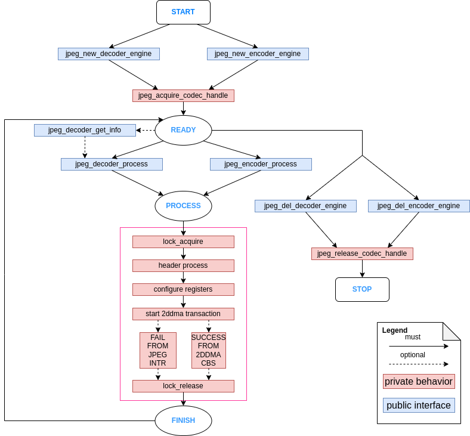
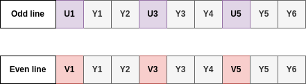
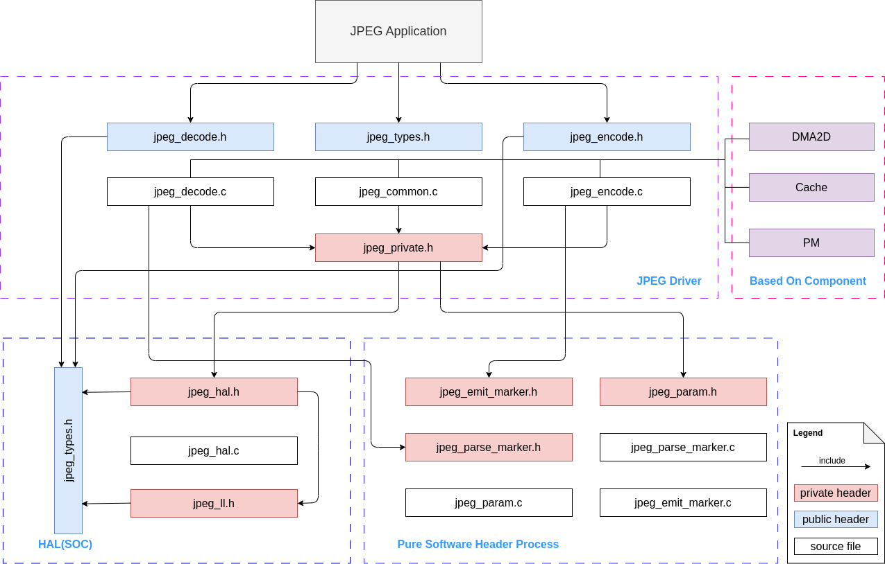

JPEG Encoder and Decoder
========================

Introduction
------------

JPEG is a commonly used method of lossy compression for digital images, particularly for those images produced by digital photography. The degree of compression can be adjusted, allowing a selectable tradeoff between storage size and image quality. JPEG typically achieves 10:1 compression with little perceptible loss in image quality.

JPEG codec on {IDF_TARGET_NAME} is an image codec, which is based on the JPEG baseline standard, for compressing and decompressing images to reduce the bandwidth required to transmit images or the space required to store images, making it possible to process large-resolution images. But please note, at one time, the codec engine can only work as either encoder or decoder.

Functional Overview
-------------------

This document covers the following sections:

-  `Resource Allocation <#resource-allocation>`__ - covers how to allocate JPEG resources with properly set of configurations. It also covers how to recycle the resources when they finished working.
-  `Finite State Machine <#finite-state-machine>`__ - covers JPEG workflow. Introduce how jpeg driver uses internal resources and its software process.
-  `JPEG Decoder Engine <#jpeg-decoder-engine>`__ - covers behavior of JPEG decoder engine. Introduce how to use decoder engine functions to decode an image (from jpg format to raw format).
-  `JPEG Encoder Engine <#jpeg-encoder-engine>`__ - covers behavior of JPEG encoder engine. Introduce how to use encoder engine functions to encode an image (from raw format to jpg format).
-  `Performance Overview <#performance-overview>`__ - covers encoder and decoder performance.
-  `Pixel Storage Layout for Different Color Formats <#pixel-storage-layout-for-different-color-formats>`__ - covers color space order overview required in this JPEG decoder and encoder.
-  `Thread Safety <#thread-safety>`__ - lists which APIs are guaranteed to be thread safe by the driver.
-  `Power Management <#power-management>`__ - describes how jpeg driver would be affected by power consumption.
-  `Kconfig Options <#kconfig-options>`__ - lists the supported Kconfig options that can bring different effects to the driver.

Resource Allocation
^^^^^^^^^^^^^^^^^^^

Install JPEG decoder engine
~~~~~~~~~~~~~~~~~~~~~~~~~~~

JPEG decoder engine requires the configuration that specified by :cpp:type:`jpeg_decode_engine_cfg_t`.

If the configurations in :cpp:type:`jpeg_decode_engine_cfg_t` is specified, users can call :cpp:func:`jpeg_new_decoder_engine` to allocate and initialize a JPEG decoder engine. This function will return an JPEG decoder handle if it runs correctly. You can take following code as reference.

.. code:: c

    jpeg_decoder_handle_t decoder_engine;

    jpeg_decode_engine_cfg_t decode_eng_cfg = {
        .intr_priority = 0,
        .timeout_ms = 40,
    };

    ESP_ERROR_CHECK(jpeg_new_decoder_engine(&decode_eng_cfg, &decoder_engine));

Uninstall JPEG decoder engine
~~~~~~~~~~~~~~~~~~~~~~~~~~~~~

If a previously installed JPEG engine is no longer needed, it's recommended to recycle the resource by calling :cpp:func:`jpeg_del_decoder_engine`, so that the underlying hardware is released.

.. code:: c

    ESP_ERROR_CHECK(jpeg_del_decoder_engine(decoder_engine));

Install JPEG encoder engine
~~~~~~~~~~~~~~~~~~~~~~~~~~~

The JPEG encoder engine requires the configuration specified by :cpp:type:`jpeg_encode_engine_cfg_t`.

If the configurations in :cpp:type:`jpeg_encode_engine_cfg_t` is specified, users can call :cpp:func:`jpeg_new_encoder_engine` to allocate and initialize a JPEG encoder engine. This function will return an JPEG encoder handle if it runs correctly. You can take following code as reference.

.. code:: c

    jpeg_encoder_handle_t encoder_engine;

    jpeg_encode_engine_cfg_t encode_eng_cfg = {
        .intr_priority = 0,
        .timeout_ms = 40,
    };

    ESP_ERROR_CHECK(jpeg_new_encoder_engine(&encode_eng_cfg, &encoder_engine));

Uninstall JPEG encoder engine
~~~~~~~~~~~~~~~~~~~~~~~~~~~~~

If a previously installed JPEG engine is no longer needed, it's recommended to recycle the resource by calling :cpp:func:`jpeg_del_encoder_engine`, so that the underlying hardware is released.

.. code:: c

    ESP_ERROR_CHECK(jpeg_del_encoder_engine(encoder_engine));

Finite State Machine
^^^^^^^^^^^^^^^^^^^^

The JPEG driver usage of hardware resources and its process workflow are shown in the following graph:

    JPEG finite state machine

JPEG Decoder Engine
^^^^^^^^^^^^^^^^^^^

After installing the JPEG decoder driver by :cpp:func:`jpeg_new_decoder_engine`, {IDF_TARGET_NAME} is ready to decode JPEG pictures by :cpp:func:`jpeg_decoder_process`. :cpp:func:`jpeg_decoder_process` is flexible for decoding different types of pictures by a configurable parameter called :cpp:type:`jpeg_decode_cfg_t`.

Moreover, our jpeg decoder api provides a helper function which helps you get the basic information of your given image. Calling :cpp:func:`jpeg_decoder_get_info` would return the picture information structure called :cpp:func:`jpeg_decoder_get_info`. If you already know the picture basic information, this functions is unnecessary to be called.

The format conversions supported by this driver are listed in the table below:

+----------------------------------------+-----------------------------------+
| Format of the already compressed image |   Format after decompressing      |
+========================================+===================================+
|                                        |               RGB565              |
|               YUV444                   +-----------------------------------+
|                                        |               RGB888              |
|                                        +-----------------------------------+
|                                        |               YUV444              |
+----------------------------------------+-----------------------------------+
|                                        |               RGB565              |
|                                        +-----------------------------------+
|                                        |               RGB888              |
|               YUV422                   +-----------------------------------+
|                                        |               YUV444              |
|                                        +-----------------------------------+
|                                        |               YUV422              |
+----------------------------------------+-----------------------------------+
|                                        |               RGB565              |
|                                        +-----------------------------------+
|                                        |               RGB888              |
|               YUV420                   +-----------------------------------+
|                                        |               YUV444              |
|                                        +-----------------------------------+
|                                        |               YUV420              |
+----------------------------------------+-----------------------------------+
|                GRAY                    |                GRAY               |
+----------------------------------------+-----------------------------------+

Overall, You can take following code as reference, the code is going to decode a 1080*1920 picture.

.. code:: c

    jpeg_decode_cfg_t decode_cfg_rgb = {
        .output_format = JPEG_DECODE_OUT_FORMAT_RGB888,
        .rgb_order = JPEG_DEC_RGB_ELEMENT_ORDER_BGR,
    };

    size_t tx_buffer_size;
    size_t rx_buffer_size;

    jpeg_decode_memory_alloc_cfg_t rx_mem_cfg = {
        .buffer_direction = JPEG_DEC_ALLOC_OUTPUT_BUFFER,
    };

    jpeg_decode_memory_alloc_cfg_t tx_mem_cfg = {
        .buffer_direction = JPEG_DEC_ALLOC_INPUT_BUFFER,
    };

    uint8_t *bit_stream = (uint8_t*)jpeg_alloc_decoder_mem(jpeg_size, &tx_mem_cfg, &tx_buffer_size);
    uint8_t *out_buf = (uint8_t*)jpeg_alloc_decoder_mem(1920 * 1088 * 3, &rx_mem_cfg, &rx_buffer_size);

    jpeg_decode_picture_info_t header_info;
    ESP_ERROR_CHECK(jpeg_decoder_get_info(bit_stream, bit_stream_size, &header_info));
    uint32_t out_size = 0;
    ESP_ERROR_CHECK(jpeg_decoder_process(decoder_engine, &decode_cfg_rgb, bit_stream, bit_stream_size, out_buf, &out_size));

There are some Tips that can help you use this driver more accurately:

1. In above code, you should make sure the `bit_stream` and `out_buf` should be aligned by certain rules. We provide a helper function :cpp:func:`jpeg_alloc_decoder_mem` to help you malloc a buffer which is aligned in both size and address.

2. The content of `bit_stream` buffer should not be changed until :cpp:func:`jpeg_decoder_process` returns.

3. The width and height of output picture would be 16 bytes aligned if original picture is formatted by YUV420 or YUV422. For example, if the input picture is 1080*1920, the output picture will be 1088*1920. That is the restriction of jpeg protocol. Please provide sufficient output buffer memory.

JPEG Encoder Engine
^^^^^^^^^^^^^^^^^^^

After installing the JPEG encoder driver by :cpp:func:`jpeg_new_encoder_engine`, {IDF_TARGET_NAME} is ready to decode JPEG pictures by :cpp:func:`jpeg_encoder_process`. :cpp:func:`jpeg_encoder_process` is flexible for decoding different types of pictures by a configurable parameter called :cpp:type:`jpeg_encode_cfg_t`.

The format conversions supported by this driver are listed in the table below:

+--------------------------+--------------------------------------+
| Format of Original Image | Down sampling method                 |
+==========================+======================================+
|                          |               YUV444                 |
|                          +--------------------------------------+
|      RGB565/RGB888       |               YUV422                 |
|                          +--------------------------------------+
|                          |               YUV420                 |
+--------------------------+--------------------------------------+
|          GRAY            |                GRAY                  |
+--------------------------+--------------------------------------+
|         YUV422           |               YUV422                 |
+--------------------------+--------------------------------------+

Below is the example of code that encodes a 1080*1920 picture:

.. code:: c

    int raw_size_1080p = 0;/* Your raw image size */
    jpeg_encode_cfg_t enc_config = {
        .src_type = JPEG_ENCODE_IN_FORMAT_RGB888,
        .sub_sample = JPEG_DOWN_SAMPLING_YUV422,
        .image_quality = 80,
        .width = 1920,
        .height = 1080,
    };

    uint8_t *raw_buf_1080p = (uint8_t*)jpeg_alloc_encoder_mem(raw_size_1080p);
    if (raw_buf_1080p == NULL) {
        ESP_LOGE(TAG, "alloc 1080p tx buffer error");
        return;
    }
    uint8_t *jpg_buf_1080p = (uint8_t*)jpeg_alloc_encoder_mem(raw_size_1080p / 10); // Assume that compression ratio of 10 to 1
    if (jpg_buf_1080p == NULL) {
        ESP_LOGE(TAG, "alloc jpg_buf_1080p error");
        return;
    }

    ESP_ERROR_CHECK(jpeg_encoder_process(jpeg_handle, &enc_config, raw_buf_1080p, raw_size_1080p, jpg_buf_1080p, &jpg_size_1080p););

There are some Tips that can help you use this driver more accurately:

1. In above code, you should make sure the `raw_buf_1080p` and `jpg_buf_1080p` should aligned by calling :cpp:func:`jpeg_alloc_encoder_mem`.

2. The content of `raw_buf_1080p` buffer should not be changed until :cpp:func:`jpeg_encoder_process` returns.

3. The compression ratio depends on the chosen `image_quality` and the content of the image itself. Generally, a higher `image_quality` value obviously results in better image quality but a smaller compression ratio. As for the image content, it is hard to give any specific guidelines, so this question is out of the scope of this document. Generally, the baseline JPEG compression ratio can vary from 40:1 to 10:1. Please take the actual situation into account.

Performance Overview
^^^^^^^^^^^^^^^^^^^^

This section provides some measurements of the decoder and encoder performance. The data presented in the tables below gives the average values of decoding or encoding a randomly chosen picture fragments for 50 times. All tests were performed at a CPU frequency of 360MHz and a SPIRAM clock frequency of 200MHz. Only JPEG related code is run in this test, no other modules are involved (e.g. USB Camera, etc.).

Both decoder and encoder are not cause too much CPU involvement. Only header parse causes CPU source. Calculations related to JPEG compression, such as DCT, quantization, huffman encoding/decoding, etc., are done entirely in hardware.

JPEG decoder performance
~~~~~~~~~~~~~~~~~~~~~~~~

+----------------+-------------------------------------------------------------------------------------+------------------+
|   JPEG Size    |                                 Pixel Format                                        |                  |
+--------+-------+--------------------------------------------+----------------------------------------+ Performance(fps) +
| Height | Width | in(Format of the already compressed image) | out(Format after decompressing)        |                  |
+--------+-------+--------------------------------------------+----------------------------------------+------------------+
|  1080  | 1920  |                YUV422                      |            RGB888/RGB565               |   48             |
+--------+-------+--------------------------------------------+----------------------------------------+------------------+
|  720   | 1280  |                YUV422                      |            RGB888/RGB565               |   109            |
+--------+-------+--------------------------------------------+----------------------------------------+------------------+
|  480   | 800   |                YUV422                      |            RGB888/RGB565               |   253            |
+--------+-------+--------------------------------------------+----------------------------------------+------------------+
|  480   | 640   |                YUV422                      |            RGB888/RGB565               |   307            |
+--------+-------+--------------------------------------------+----------------------------------------+------------------+
|  480   | 320   |                YUV422                      |            RGB888/RGB565               |   571            |
+--------+-------+--------------------------------------------+----------------------------------------+------------------+
|  720   | 1280  |                 GRAY                       |               GRAY                     |   161            |
+--------+-------+--------------------------------------------+----------------------------------------+------------------+
|  480   | 800   |                YUV444                      |              YUV444                    |   129            |
+--------+-------+--------------------------------------------+----------------------------------------+------------------+
|  480   | 800   |                YUV422                      |            YUV444/YUV422               |   190            |
+--------+-------+--------------------------------------------+----------------------------------------+------------------+
|  480   | 800   |                YUV420                      |            YUV444/YUV420               |   253            |
+--------+-------+--------------------------------------------+----------------------------------------+------------------+

JPEG encoder performance
~~~~~~~~~~~~~~~~~~~~~~~~

+----------------+-------------------------------------------------------------------------------------+------------------+
|   JPEG Size    |                                 Pixel Format                                        |                  |
+--------+-------+-----------------------------------------+-------------------------------------------+ Performance(fps) +
| Height | Width |      in(Format of Original Image)       | out(Down sampling method)                 |                  |
+--------+-------+-----------------------------------------+-------------------------------------------+------------------+
|  1080  | 1920  |                RGB888                   |            YUV422                         |   26             |
+--------+-------+-----------------------------------------+-------------------------------------------+------------------+
|  1080  | 1920  |                RGB565                   |            YUV422                         |   36             |
+--------+-------+-----------------------------------------+-------------------------------------------+------------------+
|  1080  | 1920  |                RGB565                   |            YUV420                         |   40             |
+--------+-------+-----------------------------------------+-------------------------------------------+------------------+
|  1080  | 1920  |                RGB565                   |            YUV444                         |   24             |
+--------+-------+-----------------------------------------+-------------------------------------------+------------------+
|  1080  | 1920  |                RGB888                   |            YUV422                         |   26             |
+--------+-------+-----------------------------------------+-------------------------------------------+------------------+
|  720   | 1280  |                RGB565                   |            YUV420                         |   88             |
+--------+-------+-----------------------------------------+-------------------------------------------+------------------+
|  720   | 1280  |                RGB565                   |            YUV444                         |   55             |
+--------+-------+-----------------------------------------+-------------------------------------------+------------------+
|  720   | 1280  |                RGB565                   |            YUV422                         |   81             |
+--------+-------+-----------------------------------------+-------------------------------------------+------------------+
|  480   | 800   |                RGB888                   |            YUV420                         |   142            |
+--------+-------+-----------------------------------------+-------------------------------------------+------------------+
|  480   | 640   |                RGB888                   |            YUV420                         |   174            |
+--------+-------+-----------------------------------------+-------------------------------------------+------------------+
|  480   | 320   |                RGB888                   |            YUV420                         |   315            |
+--------+-------+-----------------------------------------+-------------------------------------------+------------------+
|  720   | 1280  |                 GRAY                    |             GRAY                          |   163            |
+--------+-------+-----------------------------------------+-------------------------------------------+------------------+
|  480   | 800   |                YUV422                   |            YUV422                         |   146            |
+--------+-------+-----------------------------------------+-------------------------------------------+------------------+

Pixel Storage Layout for Different Color Formats
^^^^^^^^^^^^^^^^^^^^^^^^^^^^^^^^^^^^^^^^^^^^^^^^

The encoder and decoder described in this guide use the same uncompressed raw image formats (RGB, YUV). Therefore, the encoder and decoder are not discussed separately in this section. The pixel layout of the following formats applies to the input direction of the encoder and the output direction of the decoder (if supported). The specific pixel layout is shown in the following figure:

RGB888
~~~~~~

In the following picture, each small block means one bit.

    RGB888 pixel order

For RGB888, the order can be changed via :cpp:member:`jpeg_decode_cfg_t::rgb_order` sets the pixel to `RGB` order.

    RGB888 pixel big endian order

RGB565
~~~~~~

In the following picture, each small block means one bit.

    RGB565 pixel order

For RGB565, the order can be changed via :cpp:member:`jpeg_decode_cfg_t::rgb_order` sets the pixel to `RGB` order.

    RGB565 pixel big endian order

YUV444
~~~~~~

In the following picture, each small block means one byte.

    YUV444 pixel order

YUV422
~~~~~~

In the following picture, each small block means one byte.

    YUV422 pixel order

YUV420
~~~~~~

In the following picture, each small block means one byte.

    YUV420 pixel order

Thread Safety
^^^^^^^^^^^^^

The factory function :cpp:func:`jpeg_new_decoder_engine`, :cpp:func:`jpeg_decoder_get_info`, :cpp:func:`jpeg_decoder_process`, and :cpp:func:`jpeg_del_decoder_engine` are guaranteed to be thread safe by the driver, which means, user can call them from different RTOS tasks without protection by extra locks.

Power Management
^^^^^^^^^^^^^^^^

When power management is enabled (i.e., :ref:`CONFIG_PM_ENABLE` is set), the system needs to adjust or stop the source clock of JPEG to enter Light-sleep, thus potentially changing the JPEG decoder or encoder process. This might lead to unexpected behavior in hardware calculation. To prevent such issues, entering light sleep is disabled for the time when JPEG encoder or decoder is working.

Whenever the user is decoding or encoding via JPEG (i.e., calling :cpp:func:`jpeg_encoder_process` or :cpp:func:`jpeg_decoder_process`), the driver guarantees that the power management lock is acquired by setting it to :cpp:enumerator:`esp_pm_lock_type_t::ESP_PM_NO_LIGHT_SLEEP`. Once the encoding or decoding is finished, the driver releases the lock and the system can enter light sleep.

Kconfig Options
^^^^^^^^^^^^^^^

- :ref:`CONFIG_JPEG_ENABLE_DEBUG_LOG` is used to enable the debug log at the cost of increased firmware binary size.

Maintainers' Notes
------------------

The JPEG driver usage of hardware resources and its process workflow are shown in the following graph:

    JPEG driver file structure

Application Examples
--------------------

* JPEG decoder application example: :example:`peripherals/jpeg/jpeg_decode`.
* JPEG encoder application example: :example:`peripherals/jpeg/jpeg_encode`.

API Reference
-------------

.. only:: SOC_JPEG_DECODE_SUPPORTED

    .. include-build-file:: inc/jpeg_decode.inc

.. only:: SOC_JPEG_ENCODE_SUPPORTED

    .. include-build-file:: inc/jpeg_encode.inc

.. include-build-file:: inc/components/esp_driver_jpeg/include/driver/jpeg_types.inc
.. include-build-file:: inc/components/hal/include/hal/jpeg_types.inc
