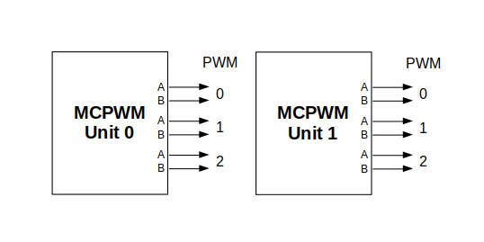
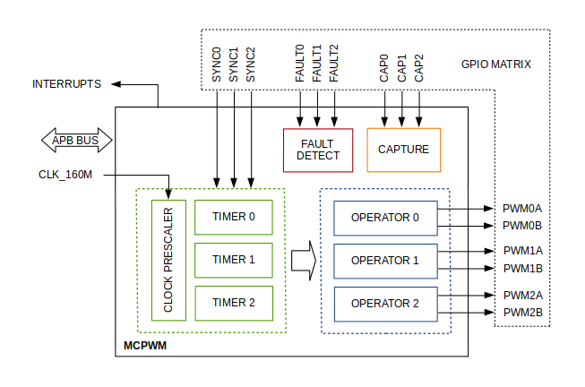
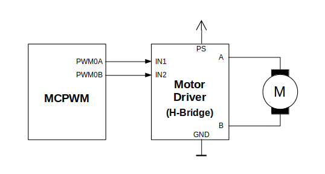

MCPWM
=====

ESP32 has two MCPWM units which can be used to control different types of motors. Each unit has three pairs of PWM outputs.

    MCPWM Overview

Further in documentation the outputs of a single unit are labeled ``PWMxA`` / ``PWMxB``.

More detailed block diagram of the MCPWM unit is shown below. Each A/B pair may be clocked by any one of the three timers Timer 0, 1 and 2. The same timer may be used to clock more than one pair of PWM outputs. Each unit is also able to collect inputs such as ``SYNC SIGNALS``, detect ``FAULT SIGNALS`` like motor overcurrent or overvoltage, as well as obtain feedback with ``CAPTURE SIGNALS`` on e.g. a rotor position.

.. _mcpwm_block_diagram:

    MCPWM Block Diagram

Description of this API starts with configuration of MCPWM's **Timer** and **Operator** submodules to provide the basic motor control functionality. Then it discusses more advanced submodules and functionalities of a **Fault Handler**, signal **Capture**, **Carrier** and **Interrupts**. 

Contents
--------

* `Configure`_ a basic functionality of the outputs
* `Operate`_ the outputs to drive a motor
* `Adjust`_ how the motor is driven
* `Capture`_ external signals to provide additional control over the outputs
* Use `Fault Handler`_ to detect and manage faults
* Add a higher frequency `Carrier`_, if output signals are passed through an isolation transformer
* Configuration and handling of `Interrupts`_.

Configure
---------

The scope of configuration depends on the motor type, in particular how many outputs and inputs are required, and what will be the sequence of signals to drive the motor.

In this case we will describe a simple configuration to control a brushed DC motor that is using only some of the available MCPWM's resources. An example circuit is shown below. It includes a `H-Bridge <https://en.wikipedia.org/wiki/H_bridge>`_ to switch polarization of a voltage applied to the motor (M) and to provide sufficient current to drive it.

    Example of Brushed DC Motor Control with MCPWM

Configuration covers the following steps: 

1. Selection of a MPWN unit that will be used to drive the motor. There are two units available on-board of ESP32 and enumerated in :cpp:type:`mcpwm_unit_t`.
2. Initialization of two GPIOs as output signals within selected unit by calling :cpp:func:`mcpwm_gpio_init`. The two output signals are typically used to command the motor to rotate right or left. All available signal options are listed in :cpp:type:`mcpwm_io_signals_t`. To set more than a single pin at a time, use function :cpp:func:`mcpwm_set_pin` together with :cpp:type:`mcpwm_pin_config_t`.
3. Selection of a timer. There are three timers available within the unit. The timers are listed in :cpp:type:`mcpwm_timer_t`.
4. Setting of the timer frequency and initial duty within :cpp:type:`mcpwm_config_t` structure.
5. Calling of :cpp:func:`mcpwm_init` with the above parameters to make the configuration effective.

Operate
-------

To operate a motor connected to the MCPWM unit, e.g. turn it left or right, or vary the speed, we should apply some control signals to the unit's outputs. The outputs are organized into three pairs. Within a pair they are labeled "A" and "B" and driven by a submodule called an "Operator". To provide a PWM signal, the Operator itself should be clocked by one of three available Timers. To make the API simpler, each Timer is automatically associated by the API to drive an Operator of the same index, e.g. Timer 0 is associated with Operator 0. 

There are the following basic ways to control the outputs: 

* We can drive particular signal steady high or steady low with function :cpp:func:`mcpwm_set_signal_high` or :cpp:func:`mcpwm_set_signal_low`. This will make the motor to turn with a maximum speed or stop. Depending on selected output A or B the motor will rotate either right or left.
* Another option is to drive the outputs with the PWM signal by calling :cpp:func:`mcpwm_start` or :cpp:func:`mcpwm_stop`. The motor speed will be proportional to the PWM duty. 
* To vary PWM's duty call :cpp:func:`mcpwm_set_duty` and provide the duty value in %. Optionally, you may call :cpp:func:`mcpwm_set_duty_in_us`, if you prefer to set the duty in microseconds. Checking of currently set value is possible by calling :cpp:func:`mcpwm_get_duty`. Phase of the PWM signal may be altered by calling :cpp:func:`mcpwm_set_duty_type`. The duty is set individually for each A and B output using :cpp:type:`mcpwm_operator_t` in specific function calls. The duty value refers either to high or low output signal duration. This is configured when calling :cpp:func:`mcpwm_init`, as discussed in section `Configure`_, and selecting one of options from :cpp:type:`mcpwm_duty_type_t`.

.. note::

    Call function :cpp:func:`mcpwm_set_duty_type` every time after :cpp:func:`mcpwm_set_signal_high` or :cpp:func:`mcpwm_set_signal_low` to resume with previously set duty cycle.

Adjust
------

There are couple of ways to adjust a signal on the outputs and changing how the motor operates.

* Set specific PWM frequency by calling :cpp:func:`mcpwm_set_frequency`. This may be required to adjust to electrical or mechanical characteristics of particular motor and driver. To check what frequency is set, use function :cpp:func:`mcpwm_get_frequency`.
* Introduce a dead time between outputs A and B when they are changing the state to reverse direction of the motor rotation. This is to make up for on/off switching delay of the motor driver FETs. The dead time options are defined in :cpp:type:`mcpwm_deadtime_type_t` and enabled by calling :cpp:func:`mcpwm_deadtime_enable`. To disable this functionality call :cpp:func:`mcpwm_deadtime_disable`.
* Synchronize outputs of operator submodules, e.g. to get raising edge of PWM0A/B and PWM1A/B to start exactly at the same time, or shift them between each other by a given phase. Synchronization is triggered by ``SYNC SIGNALS`` shown on the :ref:`block diagram <mcpwm_block_diagram>` of the MCPWM above, and defined in :cpp:type:`mcpwm_sync_signal_t`. To attach the signal to a GPIO call :cpp:func:`mcpwm_gpio_init`. You can then enable synchronization with function :cpp:func:`mcpwm_sync_enable`. As input parameters provide MCPWM unit, timer to synchronize, the synchronization signal and a phase to delay the timer.

.. note::

    Synchronization signals are referred to using two different enumerations. First one :cpp:type:`mcpwm_io_signals_t` is used together with function :cpp:func:`mcpwm_gpio_init` when selecting a GPIO as the signal input source. The second one :cpp:type:`mcpwm_sync_signal_t` is used when enabling or disabling synchronization with :cpp:func:`mcpwm_sync_enable` or :cpp:func:`mcpwm_sync_disable`.

* Vary the pattern of the A/B output signals by getting MCPWM counters to count up, down and up/down (automatically changing the count direction). Respective configuration is done when calling :cpp:func:`mcpwm_init`, as discussed in section `Configure`_, and selecting one of counter types from :cpp:type:`mcpwm_counter_type_t`. For explanation of how A/B PWM output signals are generated please refer to `ESP32 Technical Reference Manual`_.

Capture
-------

One of requirements of BLDC (Brushless DC, see figure below) motor control is sensing of the rotor position. To facilitate this task each MCPWM unit provides three sensing inputs together with dedicated hardware. The hardware is able to detect the input signal's edge and measure time between signals. As result the control software is simpler and the CPU power may be used for other tasks.

.. figure:: ../../../_static/mcpwm-bldc-control.png
    :align: center
    :alt: Example of Brushless DC Motor Control with MCPWM
    :figclass: align-center

    Example of Brushless DC Motor Control with MCPWM

The capture functionality may be used for other types of motors or tasks. The functionality is enabled in two steps:

1. Configuration of GPIOs to act as the capture signal inputs by calling functions :cpp:func:`mcpwm_gpio_init` or :cpp:func:`mcpwm_set_pin`, that were described in section `Configure`_.
2. Enabling of the functionality itself by invoking :cpp:func:`mcpwm_capture_enable`, selecting desired signal input from :cpp:type:`mcpwm_capture_signal_t`, setting the signal edge with :cpp:type:`mcpwm_capture_on_edge_t` and the signal count prescaler. 

Within the second step above a 32-bit capture timer is enabled. The timer runs continuously driven by the APB clock. The clock frequency is typically 80 MHz. On each capture event the capture timer’s value is stored in time-stamp register that may be then checked by calling :cpp:func:`mcpwm_capture_signal_get_value`. The edge of the last signal may be checked with :cpp:func:`mcpwm_capture_signal_get_edge`. 

If not required anymore, the capture functionality may be disabled with :cpp:func:`mcpwm_capture_disable`.

Fault Handler
-------------

Each unit of the MCPWM is able to sense external signals with information about failure of the motor, the motor driver or any other device connected to the MCPWM. There are three fault inputs per unit that may be routed to user selectable GPIOs. The MCPWM may be configured to perform one of four predefined actions on A/B outputs when a fault signal is received:

* lock current state of the output
* set the output low
* set the output high
* toggle the output

The user should determine possible failure modes of the motor and what action should be performed on detection of particular fault, e.g. drive all outputs low for a brushed motor, or lock current state for a stepper motor, etc. As result of this action the motor should be put into a safe state to reduce likelihood of a damage caused by the fault.

The fault handler functionality is enabled in two steps:

1. Configuration of GPIOs to act as fault signal inputs. This is done in analogous way as described for capture signals in section above. It includes setting the signal level to trigger the fault as defined in :cpp:type:`mcpwm_fault_input_level_t`.
2. Initialization of the fault handler by calling either :cpp:func:`mcpwm_fault_set_oneshot_mode` or :cpp:func:`mcpwm_fault_set_cyc_mode`. These functions set the mode that MCPWM should operate once fault signal becomes inactive. There are two modes possible:

  * State of MCPWM unit will be locked until reset - :cpp:func:`mcpwm_fault_set_oneshot_mode`. 
  * The MCPWM will resume operation once fault signal becoming inactive - :cpp:func:`mcpwm_fault_set_cyc_mode`. 

  The function call parameters include selection of one of three fault inputs defined in :cpp:type:`mcpwm_fault_signal_t` and specific action on outputs A and B defined in :cpp:type:`mcpwm_action_on_pwmxa_t` and :cpp:type:`mcpwm_action_on_pwmxb_t`.

Particular fault signal may be disabled at the runtime by calling :cpp:func:`mcpwm_fault_deinit`. 

Carrier
-------

The MCPWM has a carrier submodule used if galvanic isolation from the motor driver is required by passing the A/B output signals through transformers. Any of A and B output signals may be at 100% duty and not changing whenever motor is required to run steady at the full load. Coupling of non alternating signals with a transformer is problematic, so the signals are modulated by the carrier submodule to create an AC waveform, to make the coupling possible.

To use the carrier submodule, it should be first initialized by calling :cpp:func:`mcpwm_carrier_init`. The carrier parameters are defined in :cpp:type:`mcpwm_carrier_config_t` structure invoked within the function call. Then the carrier functionality may be enabled by calling :cpp:func:`mcpwm_carrier_enable`.

The carrier parameters may be then alerted at a runtime by calling dedicated functions to change individual fields of the :cpp:type:`mcpwm_carrier_config_t` structure, like :cpp:func:`mcpwm_carrier_set_period`, :cpp:func:`mcpwm_carrier_set_duty_cycle`, :cpp:func:`mcpwm_carrier_output_invert`, etc.

This includes enabling and setting duration of the first pulse of the career with :cpp:func:`mcpwm_carrier_oneshot_mode_enable`. For more details please refer to "PWM Carrier Submodule" section of the `ESP32 Technical Reference Manual`_.

To disable carrier functionality call :cpp:func:`mcpwm_carrier_disable`.

Interrupts
----------

Registering of the MCPWM interrupt handler is possible by calling :cpp:func:`mcpwm_isr_register`.

              
Application Example
-------------------

Examples of using MCPWM for motor control: :example:`peripherals/mcpwm`:

* Demonstration how to use each submodule of the MCPWM - :example:`peripherals/mcpwm/mcpwm_basic_config`
* Control of BLDC (brushless DC) motor with hall sensor feedback - :example:`peripherals/mcpwm/mcpwm_bldc_control`
* Brushed DC motor control - :example:`peripherals/mcpwm/mcpwm_brushed_dc_control`
* Servo motor control - :example:`peripherals/mcpwm/mcpwm_servo_control`

.. _ESP32 Technical Reference Manual: https://www.espressif.com/sites/default/files/documentation/esp32_technical_reference_manual_en.pdf

API Reference
-------------

.. include:: /_build/inc/mcpwm.inc

