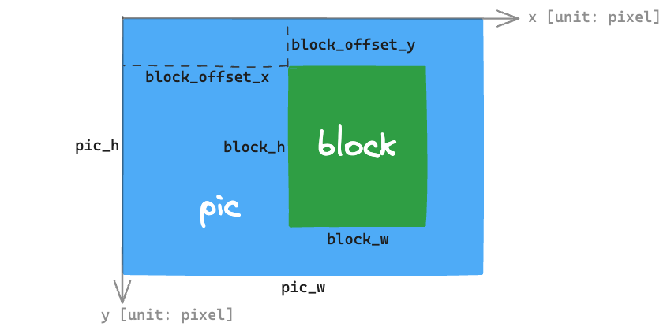

Pixel-Processing Accelerator (PPA)
==================================

Introduction
------------

{IDF_TARGET_NAME} includes a pixel-processing accelerator (PPA) module, to realize hardware-level acceleration of image algorithms, such as image rotation, scaling, mirroring, and blending.

Terminology
-----------

The terms used in relation to the PPA driver are given in the table and the diagram below.

.. list-table::
    :widths: 25 75
    :header-rows: 1

    * - Term
      - Definition
    * - Picture (pic)
      - A complete image stored in the system memory.
    * - Block
      - A portion cropped from a picture at a certain size, with the maximum size equivalent to the entire picture.
    * - Pixel
      - The unit to be used in the PPA context.
    * - PPA Operation
      - Types of image algorithm accelerations, includes scale-rotate-mirror (SRM), blend, and fill.
    * - PPA Client
      - Who wants to do the PPA operations. Typically, every PPA client is hold by a specific task.
    * - PPA Transaction
      - One request from a PPA client to do a PPA operation is one PPA transaction.

    PPA picture/block terminology

Functional Overview
-------------------

The following sections detail the design of the PPA driver:

- :ref:`ppa-client-registration` - Covers how to register a PPA client to perform any PPA operations.
- :ref:`ppa-register-callback` - Covers how to hook user specific code to PPA driver event callback function.
- :ref:`ppa-perform-operation` - Covers how to perform a PPA operation.
- :ref:`ppa-thread-safety` - Covers the usage of the PPA operation APIs in thread safety aspect.
- :ref:`ppa-performance-overview` - Covers the performance of PPA operations.

.. _ppa-client-registration:

Register PPA Client
^^^^^^^^^^^^^^^^^^^

Requests to perform PPA operations are made by PPA clients. Therefore, PPA clients need to be registered first before doing any PPA operations. Call :cpp:func:`ppa_register_client` function to register a new client. :cpp:type:`ppa_client_config_t` structure is used to specify the properties of the client.

- :cpp:member:`ppa_client_config_t::oper_type` - Each PPA operation type corresponds to one PPA client type, a registered PPA client can only request one specific type of PPA operations.
- :cpp:member:`ppa_client_config_t::max_pending_trans_num` - Decides the maximum number of pending PPA transactions the client can hold.

It is recommended that every task to register its own PPA clients. For example, an application contains two tasks: Task A requires both the PPA SRM and the PPA fill functionalities, so one PPA SRM client and one PPA fill client should be registered in Task A; While Task B also requires the PPA SRM functionality, then another PPA SRM client should be registered in Task B.

If the task no longer needs to do PPA operations, the corresponding PPA clients can be deregistered with :cpp:func:`ppa_unregister_client` function.

.. _ppa-register-callback:

Register PPA Event Callbacks
^^^^^^^^^^^^^^^^^^^^^^^^^^^^

When an event occurs (e.g., a PPA transaction is completed), the CPU is notified of this event via an interrupt. If some specific functions need to be called when a particular event occurs, a callback can be registered for that event by calling :cpp:func:`ppa_client_register_event_callbacks`. This can be specifically useful when ``PPA_TRANS_MODE_NON_BLOCKING`` mode is selected to perform the PPA operations. It is worth noticing that the event callbacks are bound to PPA clients, but the user context is provided per transaction in the call to the PPA operation APIs. This allows the maximum flexibility in utilizing the event callbacks.

The registered callback functions are called in the interrupt context, therefore, the callback functions should follow common ISR (Interrupt Service Routine) rules.

.. _ppa-perform-operation:

Perform PPA Operations
^^^^^^^^^^^^^^^^^^^^^^

Once the PPA client is registered, a PPA operation can be requested with the returned :cpp:type:`ppa_client_handle_t`.

PPA operations includes:

Scale, Rotate, Mirror (SRM)
~~~~~~~~~~~~~~~~~~~~~~~~~~~

Call :cpp:func:`ppa_do_scale_rotate_mirror` to apply one or more of the scaling, rotation, mirroring operations to the target block inside a picture.

Some notes to avoid confusion in configuring :cpp:type:`ppa_srm_oper_config_t`:

.. list::

    - :cpp:member:`ppa_in_pic_blk_config_t::buffer` and :cpp:member:`ppa_out_pic_blk_config_t::buffer` have to be the pointers to different picture buffers for a SRM operation.
    - The precision of :cpp:member:`ppa_srm_oper_config_t::scale_x` and :cpp:member:`ppa_srm_oper_config_t::scale_y` will be truncated to a step size of 1/16.
    - Output block's width/height is totally determined by the input block's width/height, scaling factor, and rotation angle, so output block's width/height does not need to be configured. However, please make sure the output block can fit at the offset location in the output picture.
    - If the color mode of the input or output picture is ``PPA_SRM_COLOR_MODE_YUV420``, then its ``pic_w``, ``pic_h``, ``block_w``, ``block_h``, ``block_offset_x``, ``block_offset_y`` fields must be even.

Blend
~~~~~

Call :cpp:func:`ppa_do_blend` to blend the two target blocks of two so-called foreground (FG) and background (BG) pictures.

Blend follows the normal Alpha Blending formula:

:math:`A_{out} = A_b + A_f - A_b \times A_f`

:math:`C_{out} = (C_b \times A_b \times (1 - A_f) + C_f \times A_f) / (A_b + A_f - A_b \times A_f)`

where :math:`A_b` is the Alpha channel of the background layer, :math:`A_f` is the Alpha channel of the foreground layer, :math:`C_b` corresponds to the R, G, B components of the background layer, and :math:`C_f` corresponds to the R, G, B components of the foreground layer.

Note that this formula is not symmetric to FG and BG. When :math:`A_f = 1`, it calculates :math:`C_{out} = C_f`, :math:`A_{out} = 1`, which means if the color mode of the FG picture is ``PPA_BLEND_COLOR_MODE_RGB565`` or ``PPA_BLEND_COLOR_MODE_RGB888``, since a Alpha value of 255 will be filled by the PPA hardware (i.e. :math:`A_f = 1`), the blended result will be identical to the FG block.

If :cpp:member:`ppa_blend_oper_config_t::bg_ck_en` or :cpp:member:`ppa_blend_oper_config_t::fg_ck_en` is set to ``true``, the pixels that fall into the color-key (also known as Chroma-key) range do not follow the Alpha Blending process. Please check **{IDF_TARGET_NAME} Technical Reference Manual** > **Pixel-Processing Accelerator (PPA)** > **Functional Description** > **Layer Blending (BLEND)** [`PDF <{IDF_TARGET_TRM_EN_URL}#ppa>`__] for the detailed rules.

Similarly, some notes to avoid confusion in configuring :cpp:type:`ppa_blend_oper_config_t`:

.. list::

    - :cpp:member:`ppa_out_pic_blk_config_t::buffer` can be the same pointer to one of the input's :cpp:member:`ppa_in_pic_blk_config_t::buffer` for a blend operation.
    - The blocks' width/height of FG and BG should be identical, and are the width/height values for the output block.
    - If the color mode of the input picture is ``PPA_BLEND_COLOR_MODE_A4``, then its ``block_w`` and ``block_offset_x`` fields must be even.

Fill
~~~~

Call :cpp:func:`ppa_do_fill` to fill a target block inside a picture.

:cpp:type:`ppa_trans_mode_t` is a field configurable to all the PPA operation APIs. It decides whether you want the call to the PPA operation API to block until the transaction finishes or to return immediately after the transaction is pushed to the internal queue.

.. _ppa-thread-safety:

Thread Safety
^^^^^^^^^^^^^

The PPA driver has guaranteed the thread safety of calling the PPA operation APIs in all following situations:

.. list::

    - Among clients of different types in one task
    - Among clients of same type in different tasks
    - Among clients of different types in different tasks

.. _ppa-performance-overview:

Performance Overview
^^^^^^^^^^^^^^^^^^^^

The PPA operations are acted on the target block of an input picture. Therefore, the time it takes to complete a PPA transaction is proportional to the amount of the data in the block. The size of the entire picture has no influence on the performance. More importantly, the PPA performance highly relies on the PSRAM bandwidth if the pictures are located in the PSRAM section. When there are quite a few peripherals reading and writing to the PSRAM at the same time, the performance of PPA operation will be greatly reduced.

Application Examples
^^^^^^^^^^^^^^^^^^^^

* :example:`peripherals/ppa/ppa_dsi` - PPA with DSI display example. The image used in this example will be first scaled up, rotated at counter-clockwise direction and rotated back, mirrored and mirror back, and scaled down. Then the image will be blended with a whole red image with less transparency. Next the `ESP32` word will be color-keyed out. Lastly a frame will be filled around the `ESP32`.

API Reference
-------------

.. include-build-file:: inc/ppa.inc
.. include-build-file:: inc/ppa_types.inc
