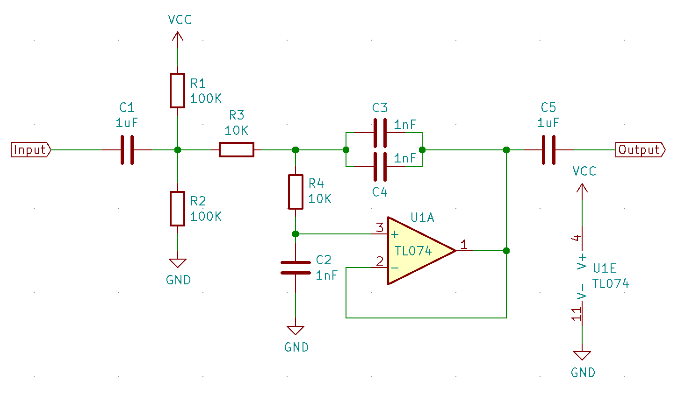

Sigma-Delta Modulation (SDM)
============================

:link_to_translation:`zh_CN:[中文]`

Introduction
------------

{IDF_TARGET_NAME} has a second-order sigma-delta modulator, which can generate independent PDM pulses to multiple channels. Please refer to the TRM to check how many hardware channels are available. [1]_

Delta-sigma modulation converts an analog voltage signal into a pulse frequency, or pulse density, which can be understood as pulse-density modulation (PDM) (refer to |wiki_ref|_).

The main differences comparing to I2S PDM mode and DAC peripheral are:

1. SDM has no clock signal, it is just like the DAC mode of PDM;
2. SDM has no DMA, and it can not change its output density continuously. If you have to, you can update the density in a timer's callback;
3. Based on the former two points, unlike the DAC peripheral, an external active or passive low-pass filter is required additionally to restore the analog wave (See :ref:`convert_to_analog_signal`).

Typically, a Sigma-Delta modulated channel can be used in scenarios like:

-  LED dimming
-  Simple DAC (8-bit), with the help of an active RC low-pass filter
-  Class D amplifier, with the help of a half-bridge or full-bridge circuit plus an LC low-pass filter

Functional Overview
-------------------

The following sections of this document cover the typical steps to install and operate an SDM channel:

- :ref:`sdm-resource-allocation` - covers how to initialize and configure an SDM channel and how to recycle the resources when it finishes working.
- :ref:`sdm-enable-and-disable-channel` - covers how to enable and disable the channel.
- :ref:`sdm-set-equivalent-duty-cycle` - describes how to set the equivalent duty cycle of the PDM pulses.
- :ref:`sdm-power-management` - describes how different source clock selections can affect power consumption.
- :ref:`sdm-iram-safe` - lists which functions are supposed to work even when the cache is disabled.
- :ref:`sdm-thread-safety` - lists which APIs are guaranteed to be thread-safe by the driver.
- :ref:`sdm-kconfig-options` - lists the supported Kconfig options that can be used to make a different effect on driver behavior.

.. _sdm-resource-allocation:

Resource Allocation
^^^^^^^^^^^^^^^^^^^

In ESP-IDF, the information and attributes of SDM channels are managed and accessed through specific data structures, where the data structure is called :cpp:type:`sdm_channel_handle_t`. Each channel is capable to output the binary, hardware-generated signal with the sigma-delta modulation. The driver manages all available channels in a pool so that there is no need to manually assign a fixed channel to a GPIO.

To install an SDM channel, you should call :cpp:func:`sdm_new_channel` to get a channel handle. Channel-specific configurations are passed in the :cpp:type:`sdm_config_t` structure:

- :cpp:member:`sdm_config_t::gpio_num` sets the GPIO that the PDM pulses output from.
- :cpp:member:`sdm_config_t::clk_src` selects the source clock for the SDM module. Note that, all channels should select the same clock source.
- :cpp:member:`sdm_config_t::sample_rate_hz` sets the sample rate of the SDM module.
- :cpp:member:`sdm_config_t::invert_out` sets whether to invert the output signal.
- :cpp:member:`sdm_config_t::io_loop_back` is for debugging purposes only. It enables both the GPIO's input and output ability through the GPIO matrix peripheral.

The function :cpp:func:`sdm_new_channel` can fail due to various errors such as insufficient memory, invalid arguments, etc. Specifically, when there are no more free channels (i.e., all hardware SDM channels have been used up), :c:macro:`ESP_ERR_NOT_FOUND` will be returned.

If a previously created SDM channel is no longer required, you should recycle it by calling :cpp:func:`sdm_del_channel`. It allows the underlying HW channel to be used for other purposes. Before deleting an SDM channel handle, you should disable it by :cpp:func:`sdm_channel_disable` in advance or make sure it has not been enabled yet by :cpp:func:`sdm_channel_enable`.

Creating an SDM Channel with a Sample Rate of 1 MHz
~~~~~~~~~~~~~~~~~~~~~~~~~~~~~~~~~~~~~~~~~~~~~~~~~~~~

.. code:: c

    sdm_channel_handle_t chan = NULL;
    sdm_config_t config = {
        .clk_src = SDM_CLK_SRC_DEFAULT,
        .sample_rate_hz = 1 * 1000 * 1000,
        .gpio_num = 0,
    };
   ESP_ERROR_CHECK(sdm_new_channel(&config, &chan));

.. _sdm-enable-and-disable-channel:

Enable and Disable Channel
^^^^^^^^^^^^^^^^^^^^^^^^^^

Before doing further IO control to the SDM channel, you should enable it first, by calling :cpp:func:`sdm_channel_enable`. Internally, this function:

* switches the channel state from **init** to **enable**
* acquires a proper power management lock if a specific clock source (e.g., APB clock) is selected. See also :ref:`sdm-power-management` for more information.

On the contrary, calling :cpp:func:`sdm_channel_disable` does the opposite, that is, put the channel back to the **init** state and releases the power management lock.

.. _sdm-set-equivalent-duty-cycle:

Set Pulse Density
^^^^^^^^^^^^^^^^^

For the output PDM signals, the pulse density decides the output analog voltage that is restored by a low-pass filter. The restored analog voltage from the channel is calculated by ``Vout = VDD_IO / 256 * duty + VDD_IO / 2``. The range of the quantized ``density`` input parameter of :cpp:func:`sdm_channel_set_pulse_density` is from -128 to 127 (8-bit signed integer). Depending on the value of the ``density`` parameter, the duty cycle of the output signal will be changed accordingly. For example, if a zero value is set, then the output signal's duty will be around 50%.

.. _sdm-power-management:

Power Management
^^^^^^^^^^^^^^^^

When power management is enabled (i.e., :ref:`CONFIG_PM_ENABLE` is on), the system will adjust the APB frequency before going into Light-sleep, thus potentially changing the sample rate of the sigma-delta modulator.

However, the driver can prevent the system from changing APB frequency by acquiring a power management lock of type :cpp:enumerator:`ESP_PM_APB_FREQ_MAX`. Whenever the driver creates an SDM channel instance that has selected :cpp:enumerator:`SDM_CLK_SRC_APB` as its clock source, the driver guarantees that the power management lock is acquired when enabling the channel by :cpp:func:`sdm_channel_enable`. Likewise, the driver releases the lock when :cpp:func:`sdm_channel_disable` is called for that channel.

.. _sdm-iram-safe:

IRAM Safe
^^^^^^^^^

There is a Kconfig option :ref:`CONFIG_SDM_CTRL_FUNC_IN_IRAM` that can put commonly-used IO control functions into IRAM as well. So that these functions can also be executable when the cache is disabled. These IO control functions are listed as follows:

- :cpp:func:`sdm_channel_set_pulse_density`

.. _sdm-thread-safety:

Thread Safety
^^^^^^^^^^^^^

The factory function :cpp:func:`sdm_new_channel` is guaranteed to be thread-safe by the driver, which means, the user can call it from different RTOS tasks without protection by extra locks.

The following functions are allowed to run under ISR context, the driver uses a critical section to prevent them being called concurrently in both task and ISR.

- :cpp:func:`sdm_channel_set_pulse_density`

Other functions that take the :cpp:type:`sdm_channel_handle_t` as the first positional parameter, are not treated as thread-safe. This means the user should avoid calling them from multiple tasks.

.. _sdm-kconfig-options:

Kconfig Options
^^^^^^^^^^^^^^^

- :ref:`CONFIG_SDM_CTRL_FUNC_IN_IRAM` controls where to place the SDM channel control functions (IRAM or Flash), see :ref:`sdm-iram-safe` for more information.
- :ref:`CONFIG_SDM_ENABLE_DEBUG_LOG` is used to enable the debug log output. Enabling this option increases the firmware binary size.

.. _convert_to_analog_signal:

Convert to an Analog Signal (Optional)
--------------------------------------

Typically, if a Sigma-Delta signal is connected to an LED to adjust the brightness, you do not have to add any filter between them, because our eyes have their own low-pass filters for changes in light intensity. However, if you want to check the real voltage or watch the analog waveform, you need to design an analog low-pass filter. Also, it is recommended to use an active filter instead of a passive filter to gain better isolation and not lose too much voltage.

For example, you can take the following `Sallen-Key topology Low Pass Filter`_ as a reference.

    Sallen-Key Low Pass Filter

Application Example
-------------------

* 100 Hz sine wave that is modulated with Sigma-Delta: :example:`peripherals/sigma_delta/sdm_dac`.
* LED driven by a GPIO that is modulated with Sigma-Delta: :example:`peripherals/sigma_delta/sdm_led`.

API Reference
-------------

.. include-build-file:: inc/sdm.inc
.. include-build-file:: inc/sdm_types.inc

.. [1]
   Different ESP chip series might have different numbers of SDM channels. Please refer to Chapter `GPIO and IOMUX <{IDF_TARGET_TRM_EN_URL}#iomuxgpio>`__ in {IDF_TARGET_NAME} Technical Reference Manual for more details. The driver does not forbid you from applying for more channels, but it will return an error when all available hardware resources are used up. Please always check the return value when doing resource allocation (e.g., :cpp:func:`sdm_new_channel`).

.. _Sallen-Key topology Low Pass Filter: https://en.wikipedia.org/wiki/Sallen%E2%80%93Key_topology

.. |wiki_ref| replace:: Delta-sigma modulation on Wikipedia
.. _wiki_ref: https://en.wikipedia.org/wiki/Delta-sigma_modulation
