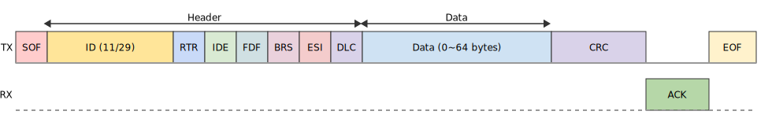

====================================
Two-Wire Automotive Interface (TWAI)
====================================

:link_to_translation:`zh_CN:[中文]`

This document introduces the features of the Two-Wire Automotive Interface (TWAI) controller driver in ESP-IDF. The chapter structure is as follows:

.. contents::
    :local:
    :depth: 2

Overview
========

TWAI is a highly reliable, multi-master, real-time, serial asynchronous communication protocol designed for automotive and industrial applications. It is compatible with the frame structure defined in the ISO 11898-1 standard and supports both standard frames with 11-bit identifiers and extended frames with 29-bit identifiers. The protocol supports message prioritization with lossless arbitration, automatic retransmission, and fault confinement mechanisms. The {IDF_TARGET_NAME} includes {IDF_TARGET_CONFIG_SOC_TWAI_CONTROLLER_NUM} TWAI controllers, allowing for the creation of {IDF_TARGET_CONFIG_SOC_TWAI_CONTROLLER_NUM} driver instances.

.. only:: SOC_TWAI_FD_SUPPORTED

    The TWAI controllers on the {IDF_TARGET_NAME} also compatible with FD format (a.k.a. CAN FD) frames defined in ISO 11898-1, and can transmit and receive both classic and FD format frames.

.. only:: not SOC_TWAI_FD_SUPPORTED

    The TWAI controllers on the {IDF_TARGET_NAME} are **not compatible with FD format frames and will interpret such frames as errors.**

Thanks to its hardware-based fault tolerance and multi-master architecture, the TWAI driver is ideal for scenarios such as:

- Serving as a robust communication bus in environments with significant electrical noise
- Enabling long-distance communication across multiple sensors/actuators with resilience to single-node failures
- Building decentralized distributed local networks that avoid the unpredictability of single-master designs
- Acting as a bridging node alongside other communication protocols

Getting Started
===============

This section provides a quick overview of how to use the TWAI driver. Through simple examples, it demonstrates how to create a TWAI node instance, transmit and receive messages on the bus, and safely stop and uninstall the driver. The general usage flow is as follows:

.. image:: ../../../_static/diagrams/twai/base_flow.drawio.svg
    :align: center

Hardware Connection
-------------------

The {IDF_TARGET_NAME} does not integrate an internal TWAI transceiver. Therefore, an external transceiver is required to connect to a TWAI bus. The model of the external transceiver depends on the physical layer standard used in your specific application. For example, a TJA105x transceiver can be used to comply with the ISO 11898-2 standard.

.. image:: ../../../_static/diagrams/twai/hw_connection.svg
    :alt: ESP32 to Transceiver Wiring
    :align: center

Specifically:

- For single-node testing, you can directly short the TX and RX pins to omit the transceiver.
- BUS_OFF (optional): Outputs a low logic level (0 V) when the TWAI controller enters the bus-off state. Otherwise, it remains at a high logic level (3.3 V).
- CLK_OUT (optional): Outputs the time quantum clock of the controller, which is a divided version of the source clock.

Creating and Starting a TWAI Node
---------------------------------

First, we need to create a TWAI instance. The following code demonstrates how to create a TWAI node with a baud rate of 200 kHz:

.. code:: c

    #include "esp_twai.h"
    #include "esp_twai_onchip.h"

    twai_node_handle_t node_hdl = NULL;
    twai_onchip_node_config_t node_config = {
        .io_cfg.tx = 4,             // TWAI TX GPIO pin
        .io_cfg.rx = 5,             // TWAI RX GPIO pin
        .bit_timing.bitrate = 200000,  // 200 kbps bitrate
        .tx_queue_depth = 5,        // Transmit queue depth set to 5
    };
    // Create a new TWAI controller driver instance
    ESP_ERROR_CHECK(twai_new_node_onchip(&node_config, &node_hdl));
    // Start the TWAI controller
    ESP_ERROR_CHECK(twai_node_enable(node_hdl));

When creating a TWAI instance, you must configure parameters such as GPIO pins and baud rate using the :cpp:type:`twai_onchip_node_config_t` structure. These parameters determine how the TWAI node operates. Then, you can call the :cpp:func:`twai_new_node_onchip` function to create a new TWAI instance. This function returns a handle to the newly created instance. A TWAI handle is essentially a pointer to an internal TWAI memory object of type :cpp:type:`twai_node_handle_t`.

Below are additional configuration fields of the :cpp:type:`twai_onchip_node_config_t` structure along with their descriptions:

- :cpp:member:`twai_onchip_node_config_t::clk_src`: Specifies the clock source used by the controller. Supported sources are listed in :cpp:type:`twai_clock_source_t`.
- :cpp:member:`twai_onchip_node_config_t::bit_timing::sp_permill`: Specifies the location of the sample point. ssp_permill sets the location of the secondary sample point and can be used to fine-tune timing in low SNR conditions.
- :cpp:member:`twai_onchip_node_config_t::data_timing`: Specifies the baud rate and sample point for the data phase in FD frames. This field is ignored if the controller does not support FD format.
- :cpp:member:`twai_onchip_node_config_t::fail_retry_cnt`: Sets the number of retry attempts on transmission failure. -1 indicates infinite retries until success or bus-off; 0 disables retries (single-shot mode); 1 retries once, and so on.
- :cpp:member:`twai_onchip_node_config_t::intr_priority`: Interrupt priority in the range [0:3], where higher values indicate higher priority.
- :cpp:member:`twai_onchip_node_config_t::flags`: A set of flags for fine-tuning driver behavior. Options include:

    - :cpp:member:`twai_onchip_node_config_t::flags::enable_self_test`: Enables self-test mode. In this mode, ACK is not checked during transmission, which is useful for single-node testing.
    - :cpp:member:`twai_onchip_node_config_t::flags::enable_loopback`: Enables loopback mode. The node will receive its own transmitted messages (subject to filter configuration), while also transmitting them to the bus.
    - :cpp:member:`twai_onchip_node_config_t::flags::enable_listen_only`: Configures the node in listen-only mode. In this mode, the node only receives and does not transmit any dominant bits, including ACK and error frames.
    - :cpp:member:`twai_onchip_node_config_t::flags::no_receive_rtr`: When using filters, determines whether remote frames matching the ID pattern should be filtered out.

The :cpp:func:`twai_node_enable` function starts the TWAI controller. Once enabled, the controller is connected to the bus and can transmit messages. It also generates events upon receiving messages from other nodes on the bus or when bus errors are detected.

The corresponding function, :cpp:func:`twai_node_disable`, immediately stops the node and disconnects it from the bus. Any ongoing transmissions will be aborted. When the node is re-enabled later, if there are pending transmissions in the queue, the driver will immediately initiate a new transmission attempt.

Transmitting Messages
---------------------

TWAI messages come in various types, which are specified by their headers. A typical data frame consists primarily of a header and data payload, with a structure similar to the following:

To reduce performance overhead caused by memory copying, the TWAI driver uses pointers to pass messages. The driver is designed to operate in asynchronous mode, so the :cpp:type:`twai_frame_t` structure and the memory pointed to by :cpp:member:`twai_frame_t::buffer` must remain valid until the transmission is actually complete. You can determine when transmission is complete in the following ways:

- Call the :cpp:func:`twai_node_transmit_wait_all_done` function to wait for all transmissions to complete.
- Register the :cpp:member:`twai_event_callbacks_t::on_tx_done` event callback function to receive a notification when transmission is complete.

The following code demonstrates how to transmit a typical data frame:

.. code:: c

    uint8_t send_buff[8] = {0};
    twai_frame_t tx_msg = {
        .header.id = 0x1,           // Message ID
        .header.ide = true,         // Use 29-bit extended ID format
        .buffer = send_buff,        // Pointer to data to transmit
        .buffer_len = sizeof(send_buff),  // Length of data to transmit
    };
    ESP_ERROR_CHECK(twai_node_transmit(node_hdl, &tx_msg, 0));  // Timeout = 0: returns immediately if queue is full
    ESP_ERROR_CHECK(twai_node_transmit_wait_all_done(node_hdl, -1));  // Wait for transmission to finish

In this example, :cpp:member:`twai_frame_t::header::id` specifies the ID of the message as 0x01. Message IDs are typically used to indicate the type of message in an application and also play a role in bus arbitration during transmission—lower values indicate higher priority on the bus. :cpp:member:`twai_frame_t::buffer` points to the memory address where the data to be transmitted is stored, and :cpp:member:`twai_frame_t::buffer_len` specifies the length of that data. The :cpp:func:`twai_node_transmit` function is thread-safe and can also be called from an ISR. When called from an ISR, the ``timeout`` parameter is ignored, and the function will not block.

Note that :cpp:member:`twai_frame_t::header::dlc` can also specify the length of the data in the frame. The DLC (Data Length Code) is mapped to the actual data length as defined in ISO 11898-1. You can use either :cpp:func:`twaifd_dlc2len` or :cpp:func:`twaifd_len2dlc` for conversion. If both dlc and buffer_len are non-zero, they must represent the same length.

The :cpp:type:`twai_frame_t` message structure also includes other configuration fields:

- :cpp:member:`twai_frame_t::dlc`: Data Length Code. For classic frames, values [0:8] represent lengths [0:8]; for FD format, values [0:15] represent lengths up to 64 bytes.
- :cpp:member:`twai_frame_t::header::ide`: Indicates use of a 29-bit extended ID format.
- :cpp:member:`twai_frame_t::header::rtr`: Indicates the frame is a remote frame, which contains no data payload.
- :cpp:member:`twai_frame_t::header::fdf`: Marks the frame as an FD format frame, supporting up to 64 bytes of data.
- :cpp:member:`twai_frame_t::header::brs`: Enables use of a separate data-phase baud rate when transmitting.
- :cpp:member:`twai_frame_t::header::esi`: For received frames, indicates the error state of the transmitting node.

Receiving Messages
------------------

Receiving messages must be done within a receive event callback. Therefore, to receive messages, you need to register a receive event callback via :cpp:member:`twai_event_callbacks_t::on_rx_done` before starting the controller. This enables the controller to deliver received messages via the callback when events occur. The following code snippets demonstrate how to register the receive event callback and how to handle message reception inside the callback:

Registering the receive event callback (before starting the controller):

.. code:: c

    twai_event_callbacks_t user_cbs = {
        .on_rx_done = twai_rx_cb,
    };
    ESP_ERROR_CHECK(twai_node_register_event_callbacks(node_hdl, &user_cbs, NULL));

Receiving messages inside the callback:

.. code:: c

    static bool twai_rx_cb(twai_node_handle_t handle, const twai_rx_done_event_data_t *edata, void *user_ctx)
    {
        uint8_t recv_buff[8];
        twai_frame_t rx_frame = {
            .buffer = recv_buff,
            .buffer_len = sizeof(recv_buff),
        };
        if (ESP_OK == twai_node_receive_from_isr(handle, &rx_frame)) {
            // receive ok, do something here
        }
        return false;
    }

Similarly, since the driver uses pointers for message passing, you must configure the pointer :cpp:member:`twai_frame_t::buffer` and its memory length :cpp:member:`twai_frame_t::buffer_len` before receiving.

Frame Timestamp
---------------

The TWAI driver supports creating a 64-bit timestamp for each successfully received frame, enabling this feature by configuring the :cpp:member:`twai_onchip_node_config_t::timestamp_resolution_hz` field when creating the node. The timestamp is stored in the :cpp:member:`twai_frame_t::header::timestamp` field of the received frame.

The node time inherits from the system time, i.e. the time starts from the power-on of the chip, and is not affected by the stop/restart/BUS_OFF state during the node's lifetime.

Stopping and Deleting the Node
------------------------------

When the TWAI node is no longer needed, you should call :cpp:func:`twai_node_delete` to release software and hardware resources. Make sure the TWAI controller is stopped before deleting the node.

Advanced Features
=================

After understanding the basic usage, you can further explore more advanced capabilities of the TWAI driver. The driver supports more detailed controller configuration and error feedback features. The complete driver feature diagram is shown below:

.. image:: ../../../_static/diagrams/twai/full_flow.drawio.svg
    :align: center

Transmit from ISR
-----------------

The TWAI driver supports transmitting messages from an Interrupt Service Routine (ISR). This is particularly useful for applications requiring low-latency responses or periodic transmissions triggered by hardware timers. For example, you can trigger a new transmission from within the ``on_tx_done`` callback, which is executed in an ISR context.

.. code:: c

    static bool twai_tx_done_cb(twai_node_handle_t handle, const twai_tx_done_event_data_t *edata, void *user_ctx)
    {
        // A frame has been successfully transmitted. Queue another one.
        // The frame and its data buffer must be valid until transmission is complete.
        static const uint8_t data_buffer[] = {1, 2, 3, 4};
        static const twai_frame_t tx_frame = {
            .header.id = 0x2,
            .buffer = (uint8_t *)data_buffer,
            .buffer_len = sizeof(data_buffer),
        };

        // The `twai_node_transmit` is safe to be called in an ISR context
        twai_node_transmit(handle, &tx_frame, 0);
        return false;
    }

.. note::
    When calling :cpp:func:`twai_node_transmit` from an ISR, the ``timeout`` parameter is ignored, and the function will not block. If the transmit queue is full, the function will return immediately with an error. It is the application's responsibility to handle cases where the queue is full. Similarly, the ``twai_frame_t`` structure and the memory pointed to by ``buffer`` must remain valid until the transmission is complete. You can get the completed frame by the :cpp:member:`twai_tx_done_event_data_t::done_tx_frame` pointer.

Bit Timing Customization
------------------------

Unlike other asynchronous communication protocols, the TWAI controller performs counting and sampling within one bit time in units of **Time Quanta (Tq)**. The number of time quanta per bit determines the final baud rate and the sample point position. When signal quality is poor, you can manually fine-tune these timing segments to meet specific requirements. The time quanta within a bit time are divided into different segments, as illustrated below:

.. image:: ../../../_static/diagrams/twai/bit_timing.svg
    :alt: Bit timing configuration
    :align: center

The synchronization segment (sync) is fixed at 1 Tq. The sample point lies between time segments tseg1 and tseg2. The Synchronization Jump Width (SJW) defines the maximum number of time quanta by which a bit time can be lengthened or shortened for synchronization purposes, ranging from [1 : tseg2]. The clock source divided by the baud rate prescaler (BRP) equals the time quantum. The total sum of all segments equals one bit time. Therefore, the following formula applies:

- Baud rate (bitrate):

.. math::

   \text{bitrate} = \frac{f_{\text{src}}}{\text{brp} \cdot (1 + \text{prop_seg} + \text{tseg}_1 + \text{tseg}_2)}

- Sample point:

.. math::

   \text{sample_point} = \frac{1 + \text{prop_seg} + \text{tseg}_1}{1 + \text{prop_seg} + \text{tseg}_1 + \text{tseg}_2}

The following code demonstrates how to configure a baud rate of 500 Kbit/s with a sample point at 75% when using an 80 MHz clock source:

.. code:: c

    twai_timing_advanced_config_t timing_cfg = {
        .brp = 8,       // Prescaler set to 8, time quantum = 80M / 8 = 10 MHz (10M Tq)
        .prop_seg = 10, // Propagation segment
        .tseg_1 = 4,    // Phase segment 1
        .tseg_2 = 5,    // Phase segment 2
        .sjw = 3,       // Synchronization Jump Width
    };
    ESP_ERROR_CHECK(twai_node_reconfig_timing(node_hdl, &timing_cfg, NULL)); // Configure arbitration phase timing; NULL means FD data phase timing is not configured

When manually configuring these timing segments, it is important to pay attention to the supported range of each segment according to the specific hardware. The timing configuration function :cpp:func:`twai_node_reconfig_timing` can configure the timing parameters for both the arbitration phase and the FD data phase either simultaneously or separately. When the controller does not support FD format, the data phase configuration is ignored. The timing parameter struct :cpp:type:`twai_timing_advanced_config_t` also includes the following additional configuration fields:

- :cpp:member:`twai_timing_advanced_config_t::clk_src` — The clock source.
- :cpp:member:`twai_timing_advanced_config_t::ssp_offset` — The number of time quanta by which the secondary sample point (SSP) is offset relative to the synchronization segment.

.. note::

    Different combinations of ``brp``, ``prop_seg``, ``tseg_1``, ``tseg_2``, and ``sjw`` can achieve the same baud rate. Users should consider factors such as **propagation delay, node processing time, and phase errors**, and adjust the timing parameters based on the physical characteristics of the bus.

Filter Configuration
---------------------

Mask Filters
^^^^^^^^^^^^

The TWAI controller hardware can filter messages based on their ID to reduce software and hardware overhead, thereby improving node efficiency. Nodes that filter out certain messages will **not receive those messages, but will still send acknowledgments (ACKs)**.

{IDF_TARGET_NAME} includes {IDF_TARGET_CONFIG_SOC_TWAI_MASK_FILTER_NUM} mask filters. A message passing through any one of these filters will be received by the node. A typical TWAI mask filter is configured with an ID and a MASK, where:

- ID: represents the expected message ID, either the standard 11-bit or extended 29-bit format.
- MASK: defines the filtering rules for each bit of the ID:

    - '0' means the corresponding bit is ignored (any value passes).
    - '1' means the corresponding bit must match exactly to pass.
    - When both ID and MASK are `0`, the filter ignores all bits and accepts all frames.
    - When both ID and MASK are set to the maximum `0xFFFFFFFF`, the filter accepts no frames.

The following code demonstrates how to calculate the MASK and configure a filter:

.. code:: c

    twai_mask_filter_config_t mfilter_cfg = {
        .id = 0x10,         // 0b 000 0001 0000
        .mask = 0x7f0,      // 0b 111 1111 0000 — the upper 7 bits must match strictly, the lower 4 bits are ignored, accepts IDs of the form
                            // 0b 000 0001 xxxx (hex 0x01x)
        .is_ext = false,    // Accept only standard IDs, not extended IDs
    };
    ESP_ERROR_CHECK(twai_node_config_mask_filter(node_hdl, 0, &mfilter_cfg));   // Configure on filter 0

.. only:: not SOC_TWAI_FD_SUPPORTED

    Dual Filter Mode
    ^^^^^^^^^^^^^^^^

    {IDF_TARGET_NAME} supports dual filter mode, which allows the hardware to be configured as two parallel independent 16-bit mask filters. By enabling this, more IDs can be received. Note that using dual filter mode to filter 29-bit extended IDs, each filter can only filter the upper 16 bits of the ID, while the remaining 13 bits are not filtered. The following code demonstrates how to configure dual filter mode using the function :cpp:func:`twai_make_dual_filter`:

    .. code:: c

        // filter 1 id/mask 0x020, 0x7f0, receive only std id 0x02x
        // filter 2 id/mask 0x013, 0x7f8, receive only std id 0x010~0x017
        twai_mask_filter_config_t dual_config = twai_make_dual_filter(0x020, 0x7f0, 0x013, 0x7f8, false); // id1, mask1, id2, mask2, no extend ID
        ESP_ERROR_CHECK(twai_node_config_mask_filter(node_hdl, 0, &dual_config));

.. only:: SOC_TWAI_FD_SUPPORTED

    Range Filter
    ^^^^^^^^^^^^

    {IDF_TARGET_NAME} also includes 1 range filter, which exists alongside the mask filters. You can configure the desired ID reception range directly using the function :cpp:func:`twai_node_config_range_filter`. The details are as follows:

    - Setting :cpp:member:twai_range_filter_config_t::range_low to the minimum value 0, and :cpp:member:twai_range_filter_config_t::range_high to the maximum value 0xFFFFFFFF means receiving all messages.
    - Configuring an invalid range means no messages will be received.

Bus Errors and Recovery
-----------------------

The TWAI controller can detect errors caused by bus interference or corrupted frames that do not conform to the frame format. It implements a fault isolation mechanism using transmit and receive error counters (TEC and REC). The values of these counters determine the node's error state: Error Active, Error Warning, Error Passive, and Bus Off. This mechanism ensures that nodes with persistent errors eventually disconnect themselves from the bus.

- **Error Active**: When both TEC and REC are less than 96, the node is in the active error state, meaning normal operation. The node participates in bus communication and sends **active error flags** when errors are detected to actively report them.
- **Error Warning**: When either TEC or REC is greater than or equal to 96 but both are less than 128, the node is in the warning error state. Errors may exist but the node behavior remains unchanged.
- **Error Passive**: When either TEC or REC is greater than or equal to 128, the node enters the passive error state. It can still communicate on the bus but sends only one **passive error flag** when detecting errors.
- **Bus Off**: When **TEC** is greater than or equal to 256, the node enters the bus off (offline) state. The node is effectively disconnected and does not affect the bus. It remains offline until recovery is triggered by software.

Software can retrieve the node status from tasks via the function :cpp:func:`twai_node_get_info`. When the controller detects errors, it triggers the :cpp:member:`twai_event_callbacks_t::on_error` callback, where the error data provides detailed information.

When the node’s error state changes, the :cpp:member:`twai_event_callbacks_t::on_state_change` callback is triggered, allowing the application to respond to the state transition. If the node is offline and needs recovery, call :cpp:func:`twai_node_recover` from a task context. **Note that recovery is not immediate; the controller will automatically reconnect to the bus only after detecting 129 consecutive recessive bits (11 bits each).**

When recovery completes, the :cpp:member:`twai_event_callbacks_t::on_state_change` callback will be triggered again, the node changes its state from :cpp:enumerator:`TWAI_ERROR_BUS_OFF` to :cpp:enumerator:`TWAI_ERROR_ACTIVE`. A recovered node can immediately resume transmissions; if there are pending tasks in the transmit queue, the driver will start transmitting them right away.

Power Management
----------------

When power management is enabled via :ref:`CONFIG_PM_ENABLE`, the system may adjust or disable clock sources before entering sleep mode, which could cause TWAI to malfunction. To prevent this, the driver manages a power management lock internally. This lock is acquired when calling :cpp:func:`twai_node_enable`, ensuring the system does not enter sleep mode and TWAI remains functional. To allow the system to enter a low-power state, call :cpp:func:`twai_node_disable` to release the lock. During sleep, the TWAI controller will also stop functioning.

Cache Safety
------------

During Flash write operations, the system temporarily disables cache to prevent instruction and data fetch errors from Flash. This can cause interrupt handlers stored in Flash to become unresponsive. If you want interrupt routines to remain operational during cache-disabled periods, enable the :ref:`CONFIG_TWAI_ISR_CACHE_SAFE` option.

.. note::

    When this option is enabled, **all interrupt callback functions and their context data must reside in internal memory**, because the system cannot fetch instructions or data from Flash while the cache is disabled.

Thread Safety
-------------

The driver guarantees thread safety for all public TWAI APIs. You can safely call these APIs from different RTOS tasks without requiring additional synchronization or locking mechanisms.

Performance
-----------

To improve the real-time performance of interrupt handling, the driver provides the :ref:`CONFIG_TWAI_ISR_IN_IRAM` option. When enabled, the TWAI ISR (Interrupt Service Routine) and receive operations are placed in internal RAM, reducing latency caused by instruction fetching from Flash.

For applications that require high-performance transmit operations, the driver provides the :ref:`CONFIG_TWAI_IO_FUNC_IN_IRAM` option to place transmit functions in IRAM. This is particularly beneficial for time-critical applications that frequently call :cpp:func:`twai_node_transmit` from user tasks.

.. note::

    However, user-defined callback functions and context data invoked by the ISR may still reside in Flash. To fully eliminate Flash latency, users must place these functions and data into internal RAM using macros such as :c:macro:`IRAM_ATTR` for functions and :c:macro:`DRAM_ATTR` for data.

Resource Usage
--------------

You can inspect the Flash and memory usage of the TWAI driver using the :doc:`/api-guides/tools/idf-size` tool. Below are the test conditions (based on the ESP32-C6 as an example):

- Compiler optimization level is set to ``-Os`` to minimize code size.
- Default log level is set to ``ESP_LOG_INFO`` to balance debugging information and performance.
- The following driver optimization options are disabled:

    - :ref:`CONFIG_TWAI_ISR_IN_IRAM` – ISR is not placed in IRAM.
    - :ref:`CONFIG_TWAI_ISR_CACHE_SAFE` – Cache safety option is disabled.

**The following resource usage data is for reference only. Actual values may vary across different target chips.**

+-----------------+------------+-------+------+-------+-------+-------+---------+-------+
| Component Layer | Total Size | DIRAM | .bss | .data | .text | Flash | .rodata | .text |
+=================+============+=======+======+=======+=======+=======+=========+=======+
| driver          | 7262       | 12    | 12   | 0     | 0     | 7250  | 506     | 6744  |
+-----------------+------------+-------+------+-------+-------+-------+---------+-------+
| hal             | 1952       | 0     | 0    | 0     | 0     | 0     | 0       | 1952  |
+-----------------+------------+-------+------+-------+-------+-------+---------+-------+
| soc             | 64         | 0     | 0    | 0     | 0     | 64    | 64      | 0     |
+-----------------+------------+-------+------+-------+-------+-------+---------+-------+

Resource Usage with :ref:`CONFIG_TWAI_ISR_IN_IRAM` Enabled:

+-----------------+------------+-------+------+-------+-------+-------+---------+-------+
| Component Layer | Total Size | DIRAM | .bss | .data | .text | Flash | .rodata | .text |
+=================+============+=======+======+=======+=======+=======+=========+=======+
| driver          | 7248       | 692   | 12   | 0     | 680   | 6556  | 506     | 6050  |
+-----------------+------------+-------+------+-------+-------+-------+---------+-------+
| hal             | 1952       | 1030  | 0    | 0     | 1030  | 922   | 0       | 922   |
+-----------------+------------+-------+------+-------+-------+-------+---------+-------+
| soc             | 64         | 0     | 0    | 0     | 0     | 0     | 64      | 0     |
+-----------------+------------+-------+------+-------+-------+-------+---------+-------+

Additionally, each TWAI handle dynamically allocates approximately ``168`` + 4 * :cpp:member:`twai_onchip_node_config_t::tx_queue_depth` bytes of memory from the heap.

Other Kconfig Options
---------------------

- :ref:`CONFIG_TWAI_ENABLE_DEBUG_LOG`: This option forces all debug logs of the TWAI driver to be enabled regardless of the global log level settings. Enabling this can help developers obtain more detailed log information during debugging, making it easier to locate and resolve issues.

Application Examples
====================

.. list::

    - :example:`peripherals/twai/twai_utils` demonstrates how to use the TWAI (Two-Wire Automotive Interface) APIs to create a command-line interface for TWAI bus communication, supporting frame transmission/reception, filtering, monitoring, and both classic and FD formats for testing and debugging TWAI networks.
    - :example:`peripherals/twai/twai_error_recovery` demonstrates how to recover nodes from the bus-off state and resume communication, as well as bus error reporting, node state changes, and other event information.
    - :example:`peripherals/twai/twai_network` using 2 nodes with different roles: transmitting and listening, demonstrates how to use the driver for single and bulk data transmission, as well as configure filters to receive these data.
    - :example:`peripherals/twai/cybergear` demonstrates how to control XiaoMi CyberGear motors via TWAI interface.

API Reference
=============

On-Chip TWAI APIs
-----------------

.. include-build-file:: inc/esp_twai_onchip.inc

TWAI Driver APIs
----------------

.. include-build-file:: inc/esp_twai.inc

TWAI Driver Types
-----------------

.. include-build-file:: inc/esp_twai_types.inc

TWAI HAL Types
--------------

.. include-build-file:: inc/twai_types.inc
