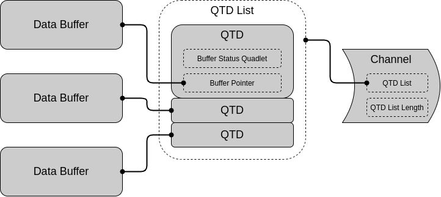

USB Host Maintainers Notes (DWC_OTG Controller)
===============================================

:link_to_translation:`zh_CN:[中文]`

The {IDF_TARGET_NAME} uses a DesignWare USB 2.0 On-the-Go Controller (henceforth referred to as DWC_OTG in this document) as its underlying hardware controller, where the DWC_OTG operates in Host Mode with Scatter/Gather DMA enabled.

.. note::

    This section only summarizes the operation of the DWC_OTG in Host Mode at a high level. For full details of the DWC_OTG, please refer to the DWC_OTG Databook and Programming Guide.

Host Mode Operating Model
-------------------------

A simplified version of the operating model of the DWC_OTG in Host Mode is illustrated in the diagram below. The diagram contains some of the key concepts and terms regarding DWC_OTG Host Mode.

.. figure:: ../../../../_static/usb_host/dwc-otg-operation.png
    :align: center
    :alt: DWC_OTG Host Mode Operating Model
    :figclass: align-center

.. note::

    Refer to the Databook section 2.1.4 (Host Architecture) for more details.

Host Port
^^^^^^^^^

The Host Port represents the single USB port provided by the DWC_OTG (in USB terms, this can be thought of as a single USB port of the root hub of the bus). The Host Port can only connect to a single device, though more devices can be connected via hub devices.

The Host Port is responsible for:

- detecting direct device connections/disconnections.
- detecting the speed of the directly connected device.
- issuing various bus signals (such as suspend, resume, reset).

Host Channels
^^^^^^^^^^^^^

In Host Mode, the DWC_OTG uses channels to communicate with device endpoints, where one channel maps to a particular endpoint (in USB terms, channels are the hardware representation of pipes). For example, a channel will map to EP 1 OUT. Each channel has its own set of CSRs (Control and Status Registers) so that they can be configured and controlled independently. A channel's CSRs are used to:

- specify the details of the channel's target endpoint (e.g., device address, EP number, transfer type, direction).
- start a transfer on the channel (e.g., by setting up DMA descriptors).

When using Scatter/Gather DMA, transfers on Host Channels are completely event driven. Users simply fill out the appropriate DMA descriptors, fill in the channel's CSRs, then enable the channel. The channel will then generate an interrupt when the transfer completes.

Data FIFOs
^^^^^^^^^^

In Host Mode, the DWC_OTG uses multiple FIFOs as a staging area for the data payloads of USB transfers. When using DMA, the DMA engine will copy data between the TX/RX FIFOs and {IDF_TARGET_NAME}'s internal memory:

- For an OUT transfer, the transfer's data payload is copied from main memory to one of the TX FIFOs by DMA. The MAC Layer will then transmit that data payload in accordance to USB packet formatting.
- For an IN transfer, the MAC Layer will parse the received USB packet and store the received data payload in the RX FIFO. The data is then copied to main memory by DMA.

The destination FIFO depends on the direction and transfer type of the channel:

- All IN channel data goes to the RX FIFO.
- All non-periodic (i.e., Control and Bulk) OUT channel data goes to the Non-periodic TX (NPTX) FIFO.
- All periodic (i.e., Interrupt and Isochronous) OUT channel data goes to the Periodic TX (PTX) FIFO.

.. note::

    The separation of non-periodic and periodic OUT channels to the NPTX and PTX FIFOs is due to the periodic nature of Interrupt and Isochronous endpoints (specified by the ``bInterval`` value of the endpoint). The DWC_OTG automatically schedules these periodic transfers, thus a separate PTX FIFO allows these periodic transfers to be staged separately.

DMA Engine
^^^^^^^^^^

The DMA engine is responsible for copying data between the FIFOs and main memory. In Host Mode Scatter/Gather DMA, a particular channel can carry out multiple transfers automatically without software intervention. The following diagram illustrates the DWC_OTG Host Mode Scatter/Gather DMA Memory Structures.

- Each USB transfer is described by a Queue Transfer Descriptor (QTD). Each QTD consists of:

  - A 32-bit Buffer Status Quadlet specifying details of the transfer, and also reports the status of the transfer on completion. The Buffer Status Quadlet has bits to specify whether the QTD should generate an interrupt and/or halt the channel on completion.
  - A 32-bit pointer to the data buffer containing the data payload for OUT transfers, or an empty buffer used to store the data payload for IN transfers.

- The data payload of each QTD can be larger than the MPS (Maximum Packet Size) of its target endpoint. The DWC_OTG hardware automatically handles the split of transfer into multiple transactions.
- Multiple QTDs can be placed into a single QTD List. A channel will then execute each QTD in the list automatically, and optionally loop back around via configuration.
- Before a channel starts data transfer, it is configured with a QTD list (and QTD list length). Once the channel is enabled, USB transfers are executed automatically by the hardware.
- A channel can generate interrupts (configurable) on completion of a particular QTD, or an entire QTD list.

.. note::

    Refer to Programming Guide section 6.2.1 (Descriptor Memory Structures) for more details.

Hardware Configuration
----------------------

The DWC_OTG IP is configurable. The notable host related configurations of the {IDF_TARGET_NAME}'s DWC_OTG are listed below:

.. only:: esp32p4

    .. list-table:: {IDF_TARGET_NAME}'s DWC_OTG Configuration
        :widths: 70 30
        :header-rows: 1

        * - Description
          - Configuration
        * - Host and Device Mode support with OTG
          - ``OTG_MODE = 0``
        * - High Speed (HS), Full Speed (FS) and Low Speed (LS) support
          - ``OTG_FSPHY_INTERFACE = 2``, ``OTG_HSPHY_INTERFACE = 3``
        * - Internal DMA controller with Scatter/Gather DMA
          - ``OTG_ARCHITECTURE = 2``, ``OTG_EN_DESC_DMA = 1``
        * - Split transfers not supported
          - ``OTG_SINGLE_POINT = 1``
        * - 16 Host Mode channels
          - ``OTG_NUM_HOST_CHAN = 16``
        * - All transfer types supported, including ISOC and INTR OUT transfers
          - ``OTG_EN_PERIO_HOST = 1``
        * - Dynamically sized Data FIFO of 4096 bytes (1024 lines)
          - ``OTG_DFIFO_DYNAMIC = 1``, ``OTG_DFIFO_DEPTH = 1024``
        * - Only 4 periodic and 4 non-periodic transactions per microframe
          - ``OTG_NPERIO_TX_QUEUE_DEPTH = 4``, ``OTG_PERIO_TX_QUEUE_DEPTH = 4``

.. only:: esp32s2 or esp32s3

    .. list-table:: {IDF_TARGET_NAME}'s DWC_OTG Configuration
        :widths: 70 30
        :header-rows: 1

        * - Description
          - Configuration
        * - Host and Device Mode support with OTG
          - ``OTG_MODE = 0``
        * - Full Speed (FS) and Low Speed (LS) support
          - ``OTG_FSPHY_INTERFACE = 1``, ``OTG_HSPHY_INTERFACE = 0``
        * - Internal DMA controller with Scatter/Gather DMA
          - ``OTG_ARCHITECTURE = 2``, ``OTG_EN_DESC_DMA = 1``
        * - 8 Host Mode channels
          - ``OTG_NUM_HOST_CHAN = 8``
        * - All transfer types supported, including ISOC and INTR OUT transfers
          - ``OTG_EN_PERIO_HOST = 1``
        * - Dynamically sized Data FIFO of 1024 bytes (256 lines)
          - ``OTG_DFIFO_DYNAMIC = 1``, ``OTG_DFIFO_DEPTH = 256``

Scatter/Gather DMA Transfer
---------------------------

The basic operating procedure for Host Channels' transfers consists of the following steps:

#. Prepare data buffers, QTDs, and a QTD list. In particular, ensure which QTDs should halt the channel and generate an interrupt on completion.
#. Set channel and endpoint characteristics via CSRs (such as EP address, transfer type, EP MPS etc).
#. Set channel's QTD list related CSRs (such as QTD list pointer and QTD list length) and channel interrupt CSRs
#. Enable the channel. Transfers are now handled automatically by hardware using DMA.
#. The Channel generates an interrupt on a channel event (e.g., QTD completion or channel error).
#. Parse the channel interrupt to determine what event occurred.
#. Parse the QTDs to determine the result of each individual transfer.

However, there are some minor differences in channel operation and QTD list usage depending on the transfer type.

Bulk
^^^^

Bulk transfers are the simplest transfers. Each QTD represents a bulk transfer of a particular direction, where the DWC_OTG automatically splits a particular QTD into multiple MPS sized transactions. Thus it is possible to fill a QTD list with multiple bulk transfers, and have the entire list executed automatically (i.e., only interrupt on completion of the last QTD).

Control
^^^^^^^

Control transfers are more complicated as they are bi-directional (i.e., each control transfer stage can have a different direction). Thus, a separate QTD is required for each stage, and each QTD must halt the channel on completion. Halting the channel after each QTD allows the channel's direction to be changed by reconfiguring the channel's CSRs. Thus a typical control transfer consists of 3 QTDs (one for each stage).

Interrupt
^^^^^^^^^

In accordance with the USB 2.0 specification, interrupt transfers executes transactions at the endpoints specified service period (i.e., ``bInterval``). A particular interrupt endpoint may not execute more than one interrupt transaction within a service period. The service period is specified in number of microframes or frames, thus a particular interrupt endpoint will generally execute one transaction every Nth microframe or frame until the transfer is complete. For interrupt channels, the service period of a particular channel (i.e., ``bInterval``) is specified via the Host Frame List (see section 6.5 of Programming Guide for more details).

.. note::

  HS USB allows an interrupt endpoint to have three interrupt transactions in a single microframe. See USB 2.0 specification section 5.7.3 (Interrupt Transfer Packet Size Constraints) for more details.

Thus, interrupt transfers in Host Mode Scatter/Gather DMA have the following peculiarities:

- If a QTD payload is larger than the endpoint's MPS, the channel will automatically split the transfer into multiple MPS sized transactions (similar to bulk transfers). However, each transaction **is executed at endpoint's specified service period** (i.e., one transaction per ``bInterval``) until the transfer completes.
- For Interrupt IN transfers, if a short packet is received (i.e., transaction's data payload is < MPS), this indicates that the endpoint has no more data to send. In this case:

  - the channel generates an extra channel interrupt even if the transfer's QTD did not set the IOC (interrupt on complete) bit.
  - however, the channel is not halted even if this extra channel interrupt is generated.
  - software must then use this extra interrupt to manually halt the interrupt channel, thus canceling any remaining QTDs in the QTD list.

.. note::

  Due to the interrupt transfer peculiarities, it may be easier for software to allocate a QTD for each transaction instead of an entire transfer.

Isochronous
^^^^^^^^^^^

In accordance with the USB 2.0 specification, isochronous transfers executes transactions at the endpoints specified service period (i.e., ``bInterval``) in order to achieve a constant rate of data transfer. A particular isochronous endpoint may not execute more than one isochronous transaction within a service period. The service period is specified in number of microframes or frames, thus a particular isochronous endpoint will generally execute one transaction every Nth microframe or frame until the transfer is complete. For isochronous channels, the service period of a particular channel (i.e., ``bInterval``) is specified via the Host Frame List (see section 6.5 of programming guide for more details).

However, unlike interrupt transactions, isochronous transactions are not retried on failure (or NAK), due to the need to maintain the constant data rate.

.. note::

  HS USB allows an isochronous endpoint to have three isochronous transactions in a single microframe. See USB 2.0 specification section 5.6.3 (Isochronous Transfer Packet Size Constraints) for more details.

Thus, isochronous transfers in Host Mode Scatter/Gather DMA have the following peculiarities:

- A QTD must be allocated for each microframe or frame. However, non-service period QTDs should be left blank (i.e., only every Nth QTD should be filled if the channel's service period is every Nth microframe or frame).
- **Each filled QTD must represent a single transaction instead of the entire transfer**.
- Because isochronous transactions are not retried on failure, the status of each completed QTD must be checked.

Supplemental Notes
------------------

Some of the DWC_OTG's behaviors are not mentioned in the Databook or Programming Guide. This section describes some of those behaviors that are relevant to the Host Stack's implementation.

Port Errors Do Not Trigger a Channel Interrupt
^^^^^^^^^^^^^^^^^^^^^^^^^^^^^^^^^^^^^^^^^^^^^^

If a port error occurs (such as a sudden disconnection or port over-current) while there are one or more active channels,

- the active channels remains active (i.e., ``HCCHAR.ChEna`` remains set) and no channel interrupts are generated.
- channels could in theory be disabled by setting ``HCCHAR.ChDis``, but this does not work for Isochronous channels as the channel disabled interrupt is never generated.

Therefore, on port errors, a controller soft reset should be used to ensure all channels are disabled.

Port Reset Interrupts
^^^^^^^^^^^^^^^^^^^^^

- When the DWC_OTG issues a reset signal on its port, and during the reset signal the device disconnects, the disconnection interrupt (i.e., ``HPRT.PrtConnDet``) is not generated until the reset is deasserted.
- When resetting an already enabled port (i.e., ``HPRT.PrtEna``) such as a second reset during enumeration or a run-time reset, a Port Enable/Disable Change interrupt (i.e., ``HPRT.PrtEnChng``) is generated both on the assertion and deassertion of the reset signal.
