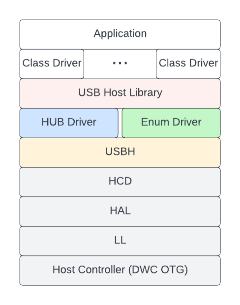

USB Host Maintainers Notes (Introduction)
=========================================

:link_to_translation:`zh_CN:[中文]`

This document contains information regarding the implementation details of the USB Host stack. This document is intended for the maintainers and third-party contributors of the USB Host stack. Users of the USB Host stack should refer to :doc:`../usb_host` instead.

.. warning::

    The implementations details of the USB Host stack is categorized as private API. Thus, all layers (other than the USB Host Library) do not adhere to :ref:`ESP-IDF's versioning scheme <versioning-scheme>` (i.e., breaking changes are permitted).

This document is split into the following sections:

.. toctree::
    :maxdepth: 1

    usb_host_notes_design
    usb_host_notes_arch
    usb_host_notes_dwc_otg
    usb_host_notes_usbh

Todo:

- USB Host Maintainers Notes (HAL & LL)
- USB Host Maintainers Notes (HCD)
- USB Host Maintainers Notes (Hub)
- USB Host Maintainers Notes (USB Host Library)

.. -------------------------------------------------- Introduction -----------------------------------------------------

Introduction
------------

The ESP-IDF USB Host Stack allows the {IDF_TARGET_NAME} to operate as a USB Host. Operating as a USB Host allows the {IDF_TARGET_NAME} to communicate with a wide range of USB devices. However, most USB Host Stack implementations do not run on embedded hardware (i.e., runs on PCs and smartphones), thus have comparatively more resources (i.e., memory and CPU speed).

The implementation of the ESP-IDF USB Host Stack (henceforth referred to as the Host Stack) takes into account the embedded nature of the {IDF_TARGET_NAME} which is reflected in various aspects of the Host Stack's design.

Features & Limitations
^^^^^^^^^^^^^^^^^^^^^^

**The Host Stack currently supports the following notable features:**

- Supports FS (Full Speed) and LS (Low Speed) devices
- Supports all transfer types (Control, Bulk, Isochronous, and Interrupt)
- Automatically enumerates connected devices
- Allows multiple class drivers (i.e., Clients of the USB Host Library) to run simultaneously and share the same device (i.e., composite devices)

**The Host Stack currently has the following notable limitations:**

- No HS (High Speed) support
- No Hub support (currently only supports a single device)
