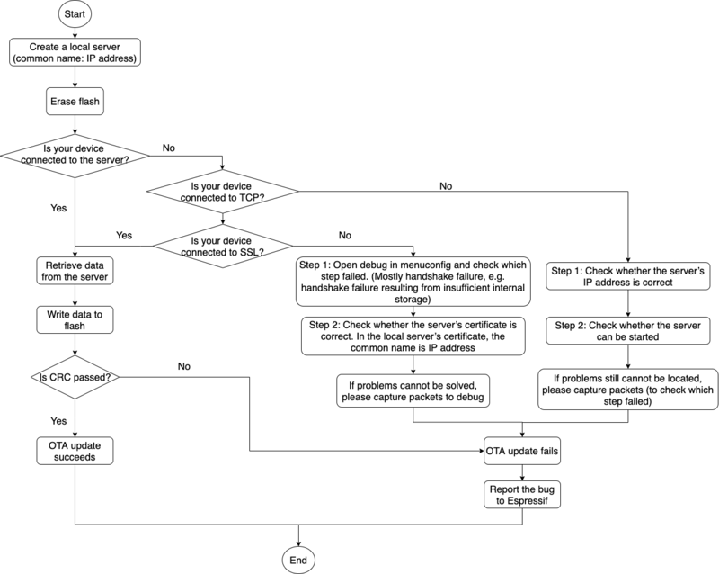

Over The Air Updates (OTA)
==========================

:link_to_translation:`zh_CN:[中文]`

OTA Process Overview
--------------------

The OTA update mechanism allows a device to update itself based on data received while the normal firmware is running (for example, over Wi-Fi, Bluetooth or Ethernet).

OTA requires configuring the :doc:`../../api-guides/partition-tables` of the device with at least two OTA app slot partitions (i.e., ``ota_0`` and ``ota_1``) and an OTA Data Partition.

The OTA operation functions write a new app firmware image to whichever OTA app slot that is currently not selected for booting. Once the image is verified, the OTA Data partition is updated to specify that this image should be used for the next boot.

.. _ota_data_partition:

OTA Data Partition
------------------

An OTA data partition (type ``data``, subtype ``ota``) must be included in the :doc:`../../api-guides/partition-tables` of any project which uses the OTA functions.

For factory boot settings, the OTA data partition should contain no data (all bytes erased to 0xFF). In this case, the ESP-IDF software bootloader will boot the factory app if it is present in the partition table. If no factory app is included in the partition table, the first available OTA slot (usually ``ota_0``) is booted.

After the first OTA update, the OTA data partition is updated to specify which OTA app slot partition should be booted next.

The OTA data partition is two flash sectors (0x2000 bytes) in size, to prevent problems if there is a power failure while it is being written. Sectors are independently erased and written with matching data, and if they disagree a counter field is used to determine which sector was written more recently.

.. _app_rollback:

App Rollback
------------

The main purpose of the application rollback is to keep the device working after the update. This feature allows you to roll back to the previous working application in case a new application has critical errors. When the rollback process is enabled and an OTA update provides a new version of the app, one of three things can happen:

* The application works fine, :cpp:func:`esp_ota_mark_app_valid_cancel_rollback` marks the running application with the state ``ESP_OTA_IMG_VALID``. There are no restrictions on booting this application.
* The application has critical errors and further work is not possible, a rollback to the previous application is required, :cpp:func:`esp_ota_mark_app_invalid_rollback_and_reboot` marks the running application with the state ``ESP_OTA_IMG_INVALID`` and reset. This application will not be selected by the bootloader for boot and will boot the previously working application.
* If the :ref:`CONFIG_BOOTLOADER_APP_ROLLBACK_ENABLE` option is set, and a reset occurs without calling either function then the application is rolled back.

The following code serves detect the initial boot for an application after the OTA update. Upon the first boot, the application checks its state and performs diagnostics. If the diagnostics are successful, the application should call :cpp:func:`esp_ota_mark_app_valid_cancel_rollback` to confirm the operability of the application. If the diagnostics fail, the application should call :cpp:func:`esp_ota_mark_app_invalid_rollback_and_reboot` to roll back to the previous working application.

If the application is not able to boot or execute this code due to an abort/reboot/power loss error, the bootloader marks this application as ``ESP_OTA_IMG_INVALID`` in the next booting attempt and rolls back to the previous working application.

.. code:: c

    const esp_partition_t *running = esp_ota_get_running_partition();
    esp_ota_img_states_t ota_state;
    if (esp_ota_get_state_partition(running, &ota_state) == ESP_OK) {
        if (ota_state == ESP_OTA_IMG_PENDING_VERIFY) {
            // run diagnostic function ...
            bool diagnostic_is_ok = diagnostic();
            if (diagnostic_is_ok) {
                ESP_LOGI(TAG, "Diagnostics completed successfully! Continuing execution ...");
                esp_ota_mark_app_valid_cancel_rollback();
            } else {
                ESP_LOGE(TAG, "Diagnostics failed! Start rollback to the previous version ...");
                esp_ota_mark_app_invalid_rollback_and_reboot();
            }
        }
    }

For the example incorporating the above code snippet, see the :example:`system/ota/native_ota_example` example.

.. note::

  The state is not written to the binary image of the application but rather to the ``otadata`` partition. The partition contains a ``ota_seq`` counter, which is a pointer to the slot (``ota_0``, ``ota_1``, ...) from which the application will be selected for boot.

App OTA State
^^^^^^^^^^^^^

States control the process of selecting a boot app:

============================= ======================================================================
            States            Restriction of selecting a boot app in bootloader
============================= ======================================================================
 ESP_OTA_IMG_VALID            None restriction. Will be selected.
 ESP_OTA_IMG_UNDEFINED        None restriction. Will be selected.
 ESP_OTA_IMG_INVALID          Will not be selected.
 ESP_OTA_IMG_ABORTED          Will not be selected.
 ESP_OTA_IMG_NEW              If :ref:`CONFIG_BOOTLOADER_APP_ROLLBACK_ENABLE` option is set it will
                              be selected only once. In bootloader the state immediately changes to
                              ``ESP_OTA_IMG_PENDING_VERIFY``.
 ESP_OTA_IMG_PENDING_VERIFY   If :ref:`CONFIG_BOOTLOADER_APP_ROLLBACK_ENABLE` option is set it will
                              not be selected, and the state will change to ``ESP_OTA_IMG_ABORTED``.
============================= ======================================================================

If :ref:`CONFIG_BOOTLOADER_APP_ROLLBACK_ENABLE` option is not enabled (by default), then the use of the following functions :cpp:func:`esp_ota_mark_app_valid_cancel_rollback` and :cpp:func:`esp_ota_mark_app_invalid_rollback_and_reboot` are optional, and ``ESP_OTA_IMG_NEW`` and ``ESP_OTA_IMG_PENDING_VERIFY`` states are not used.

An option in Kconfig :ref:`CONFIG_BOOTLOADER_APP_ROLLBACK_ENABLE` allows you to track the first boot of a new application. In this case, the application must confirm its operability by calling :cpp:func:`esp_ota_mark_app_valid_cancel_rollback` function, otherwise the application will be rolled back upon reboot. It allows you to control the operability of the application during the boot phase. Thus, a new application has only one attempt to boot successfully.

.. _ota_rollback:

Rollback Process
^^^^^^^^^^^^^^^^

The description of the rollback process when :ref:`CONFIG_BOOTLOADER_APP_ROLLBACK_ENABLE` option is enabled:

* The new application is successfully downloaded and :cpp:func:`esp_ota_set_boot_partition` function makes this partition bootable and sets the state ``ESP_OTA_IMG_NEW``. This state means that the application is new and should be monitored for its first boot.
* Reboot :cpp:func:`esp_restart`.
* The bootloader checks for the ``ESP_OTA_IMG_PENDING_VERIFY`` state if it is set, then it will be written to ``ESP_OTA_IMG_ABORTED``.
* The bootloader selects a new application to boot so that the state is not set as ``ESP_OTA_IMG_INVALID`` or ``ESP_OTA_IMG_ABORTED``.
* The bootloader checks the selected application for ``ESP_OTA_IMG_NEW`` state if it is set, then it will be written to ``ESP_OTA_IMG_PENDING_VERIFY``. This state means that the application requires confirmation of its operability, if this does not happen and a reboot occurs, this state will be overwritten to ``ESP_OTA_IMG_ABORTED`` (see above) and this application will no longer be able to start, i.e., there will be a rollback to the previous working application.
* A new application has started and should make a self-test.
* If the self-test has completed successfully, then you must call the function :cpp:func:`esp_ota_mark_app_valid_cancel_rollback` because the application is awaiting confirmation of operability (``ESP_OTA_IMG_PENDING_VERIFY`` state).
* If the self-test fails, then call :cpp:func:`esp_ota_mark_app_invalid_rollback_and_reboot` function to roll back to the previous working application, while the invalid application is set ``ESP_OTA_IMG_INVALID`` state.
* If the application has not been confirmed, the state remains ``ESP_OTA_IMG_PENDING_VERIFY``, and the next boot it will be changed to ``ESP_OTA_IMG_ABORTED``, which prevents re-boot of this application. There will be a rollback to the previous working application.

Unexpected Reset
^^^^^^^^^^^^^^^^

If a power loss or an unexpected crash occurs at the time of the first boot of a new application, it will roll back the application.

Recommendation: Perform the self-test procedure as quickly as possible, to prevent rollback due to power loss.

Only ``OTA`` partitions can be rolled back. Factory partition is not rolled back.

Booting Invalid/aborted Apps
^^^^^^^^^^^^^^^^^^^^^^^^^^^^

Booting an application which was previously set to ``ESP_OTA_IMG_INVALID`` or ``ESP_OTA_IMG_ABORTED`` is possible:

* Get the last invalid application partition :cpp:func:`esp_ota_get_last_invalid_partition`.
* Pass the received partition to :cpp:func:`esp_ota_set_boot_partition`, this will update the ``otadata``.
* Restart :cpp:func:`esp_restart`. The bootloader will boot the specified application.

To determine if self-tests should be run during startup of an application, call the :cpp:func:`esp_ota_get_state_partition` function. If result is ``ESP_OTA_IMG_PENDING_VERIFY`` then self-testing and subsequent confirmation of operability is required.

Where the States Are Set
^^^^^^^^^^^^^^^^^^^^^^^^

A brief description of where the states are set:

* ``ESP_OTA_IMG_VALID`` state is set by :cpp:func:`esp_ota_mark_app_valid_cancel_rollback` function.
* ``ESP_OTA_IMG_UNDEFINED`` state is set by :cpp:func:`esp_ota_set_boot_partition` function if :ref:`CONFIG_BOOTLOADER_APP_ROLLBACK_ENABLE` option is not enabled.
* ``ESP_OTA_IMG_NEW`` state is set by :cpp:func:`esp_ota_set_boot_partition` function if :ref:`CONFIG_BOOTLOADER_APP_ROLLBACK_ENABLE` option is enabled.
* ``ESP_OTA_IMG_INVALID`` state is set by  :cpp:func:`esp_ota_mark_app_invalid_rollback_and_reboot` function.
* ``ESP_OTA_IMG_ABORTED`` state is set if there was no confirmation of the application operability and occurs reboots (if :ref:`CONFIG_BOOTLOADER_APP_ROLLBACK_ENABLE` option is enabled).
* ``ESP_OTA_IMG_PENDING_VERIFY`` state is set in a bootloader if :ref:`CONFIG_BOOTLOADER_APP_ROLLBACK_ENABLE` option is enabled and selected app has ``ESP_OTA_IMG_NEW`` state.

.. _anti-rollback:

Anti-rollback
-------------

Anti-rollback prevents rollback to application with security version lower than one programmed in eFuse of chip.

This function works if set :ref:`CONFIG_BOOTLOADER_APP_ANTI_ROLLBACK` option. In the bootloader, when selecting a bootable application, an additional security version check is added which is on the chip and in the application image. The version in the bootable firmware must be greater than or equal to the version in the chip.

:ref:`CONFIG_BOOTLOADER_APP_ANTI_ROLLBACK` and :ref:`CONFIG_BOOTLOADER_APP_ROLLBACK_ENABLE` options are used together. In this case, rollback is possible only on the security version which is equal or higher than the version in the chip.

A Typical Anti-rollback Scheme Is
^^^^^^^^^^^^^^^^^^^^^^^^^^^^^^^^^

- New firmware released with the elimination of vulnerabilities with the previous version of security.
- After the developer makes sure that this firmware is working. He can increase the security version and release a new firmware.
- Download new application.
- To make it bootable, run the function :cpp:func:`esp_ota_set_boot_partition`. If the security version of the new application is smaller than the version in the chip, the new application will be erased. Update to new firmware is not possible.
- Reboot.
- In the bootloader, an application with a security version greater than or equal to the version in the chip will be selected. If otadata is in the initial state, and one firmware was loaded via a serial channel, whose secure version is higher than the chip, then the secure version of efuse will be immediately updated in the bootloader.
- New application booted. Then the application should perform diagnostics of the operation and if it is completed successfully, you should call :cpp:func:`esp_ota_mark_app_valid_cancel_rollback` function to mark the running application with the ``ESP_OTA_IMG_VALID`` state and update the secure version on chip. Note that if was called :cpp:func:`esp_ota_mark_app_invalid_rollback_and_reboot` function a rollback may not happen as the device may not have any bootable apps. It will then return ``ESP_ERR_OTA_ROLLBACK_FAILED`` error and stay in the ``ESP_OTA_IMG_PENDING_VERIFY`` state.
- The next update of app is possible if a running app is in the ``ESP_OTA_IMG_VALID`` state.

Recommendation:

If you want to avoid the download/erase overhead in case of the app from the server has security version lower than the running app, you have to get ``new_app_info.secure_version`` from the first package of an image and compare it with the secure version of efuse. Use ``esp_efuse_check_secure_version(new_app_info.secure_version)`` function if it is true then continue downloading otherwise abort.

.. code-block:: c

    ....
    bool image_header_was_checked = false;
    while (1) {
        int data_read = esp_http_client_read(client, ota_write_data, BUFFSIZE);
        ...
        if (data_read > 0) {
            if (image_header_was_checked == false) {
                esp_app_desc_t new_app_info;
                if (data_read > sizeof(esp_image_header_t) + sizeof(esp_image_segment_header_t) + sizeof(esp_app_desc_t)) {
                    // check current version with downloading
                    if (esp_efuse_check_secure_version(new_app_info.secure_version) == false) {
                      ESP_LOGE(TAG, "This a new app can not be downloaded due to a secure version is lower than stored in efuse.");
                      http_cleanup(client);
                      task_fatal_error();
                    }

                    image_header_was_checked = true;

                    esp_ota_begin(update_partition, OTA_SIZE_UNKNOWN, &update_handle);
                }
            }
            esp_ota_write( update_handle, (const void *)ota_write_data, data_read);
        }
    }
    ...

Restrictions:

.. list::

    :esp32: - The number of bits in the ``secure_version`` field is limited to 32 bits. This means that only 32 times you can do an anti-rollback. You can reduce the length of this efuse field using :ref:`CONFIG_BOOTLOADER_APP_SEC_VER_SIZE_EFUSE_FIELD` option.
    :not esp32: - The number of bits in the ``secure_version`` field is limited to 16 bits. This means that only 16 times you can do an anti-rollback. You can reduce the length of this efuse field using :ref:`CONFIG_BOOTLOADER_APP_SEC_VER_SIZE_EFUSE_FIELD` option.
    :esp32: - Anti-rollback works only if the encoding scheme for efuse is set to ``NONE``.
    - Factory and Test partitions are not supported in anti rollback scheme and hence partition table should not have partition with SubType set to ``factory`` or ``test``.

``security_version``:

- In application image it is stored in ``esp_app_desc`` structure. The number is set :ref:`CONFIG_BOOTLOADER_APP_SECURE_VERSION`.

.. only:: esp32

  - In ESP32 it is stored in efuse ``EFUSE_BLK3_RDATA4_REG``. (when a eFuse bit is programmed to 1, it can never be reverted to 0). The number of bits set in this register is the ``security_version`` from app.

.. _secure-ota-updates:

Secure OTA Updates Without Secure Boot
--------------------------------------

The verification of signed OTA updates can be performed even without enabling hardware secure boot. This can be achieved by setting :ref:`CONFIG_SECURE_SIGNED_APPS_NO_SECURE_BOOT` and :ref:`CONFIG_SECURE_SIGNED_ON_UPDATE_NO_SECURE_BOOT`

.. only:: esp32

  For more information refer to :ref:`signed-app-verify`

Tuning OTA Performance
----------------------

- Erasing the update partition at once instead of sequential erasing (default mechanism) while write operation might help in reducing the overall time taken for firmware upgrade. To enable this, set :cpp:member:`esp_https_ota_config_t::bulk_flash_erase` to true in :cpp:type:`esp_https_ota_config_t` structure. If the partition to be erased is too large, task watchdog could be triggered. It is advised to increase the watchdog timeout in such cases.

  .. code-block:: c

      esp_https_ota_config_t ota_config = {
          .bulk_flash_erase = true,
      }

- Tuning the :cpp:member:`esp_https_ota_config_t::http_config::buffer_size` can also help in improving the OTA performance.
- :cpp:type:`esp_https_ota_config_t` has a member :cpp:member:`esp_https_ota_config_t::buffer_caps` which can be used to specify the memory type to use when allocating memory to the OTA buffer. Configuring this value to MALLOC_CAP_INTERNAL might help in improving the OTA performance when SPIRAM is enabled.
- For optimizing network performance, please refer to **Improving Network Speed** section in the :doc:`/api-guides/performance/speed` for more details.

OTA Tool ``otatool.py``
-----------------------

The component ``app_update`` provides a tool :component_file:`app_update/otatool.py` for performing OTA partition-related operations on a target device. The following operations can be performed using the tool:

  - read contents of otadata partition (read_otadata)
  - erase otadata partition, effectively resetting device to factory app (erase_otadata)
  - switch OTA partitions (switch_ota_partition)
  - erasing OTA partition (erase_ota_partition)
  - write to OTA partition (write_ota_partition)
  - read contents of OTA partition (read_ota_partition)

The tool can either be imported and used from another Python script or invoked from shell script for users wanting to perform operation programmatically. This is facilitated by the tool's Python API and command-line interface, respectively.

Python API
^^^^^^^^^^

Before anything else, make sure that the ``otatool`` module is imported.

.. code-block:: python

  import sys
  import os

  idf_path = os.environ["IDF_PATH"]  # get value of IDF_PATH from environment
  otatool_dir = os.path.join(idf_path, "components", "app_update")  # otatool.py lives in $IDF_PATH/components/app_update

  sys.path.append(otatool_dir)  # this enables Python to find otatool module
  from otatool import *  # import all names inside otatool module

The starting point for using the tool's Python API to do is create a ``OtatoolTarget`` object:

.. code-block:: python

  # Create a parttool.py target device connected on serial port /dev/ttyUSB1
  target = OtatoolTarget("/dev/ttyUSB1")

The created object can now be used to perform operations on the target device:

.. code-block:: python

  # Erase otadata, resetting the device to factory app
  target.erase_otadata()

  # Erase contents of OTA app slot 0
  target.erase_ota_partition(0)

  # Switch boot partition to that of app slot 1
  target.switch_ota_partition(1)

  # Read OTA partition 'ota_3' and save contents to a file named 'ota_3.bin'
  target.read_ota_partition("ota_3", "ota_3.bin")

The OTA partition to operate on is specified using either the app slot number or the partition name.

More information on the Python API is available in the docstrings for the tool.

Command-line Interface
^^^^^^^^^^^^^^^^^^^^^^

The command-line interface of ``otatool.py`` has the following structure:

.. code-block:: bash

  otatool.py [command-args] [subcommand] [subcommand-args]

  - command-args - these are arguments that are needed for executing the main command (parttool.py), mostly pertaining to the target device
  - subcommand - this is the operation to be performed
  - subcommand-args - these are arguments that are specific to the chosen operation

.. code-block:: bash

  # Erase otadata, resetting the device to factory app
  otatool.py --port "/dev/ttyUSB1" erase_otadata

  # Erase contents of OTA app slot 0
  otatool.py --port "/dev/ttyUSB1" erase_ota_partition --slot 0

  # Switch boot partition to that of app slot 1
  otatool.py --port "/dev/ttyUSB1" switch_ota_partition --slot 1

  # Read OTA partition 'ota_3' and save contents to a file named 'ota_3.bin'
  otatool.py --port "/dev/ttyUSB1" read_ota_partition --name=ota_3 --output=ota_3.bin

More information can be obtained by specifying ``--help`` as argument:

.. code-block:: bash

  # Display possible subcommands and show main command argument descriptions
  otatool.py --help

  # Show descriptions for specific subcommand arguments
  otatool.py [subcommand] --help

See Also
--------

* :doc:`../../api-guides/partition-tables`
* :doc:`../storage/partition`
* :doc:`../peripherals/spi_flash/index`
* :doc:`esp_https_ota`

Application Examples
--------------------

- :example:`system/ota/native_ota_example` demonstrates how to use the `app_update` component's APIs for native Over-the-Air (OTA) updates on {IDF_TARGET_NAME}. For the applicable SoCs, please refer to :example_file:`system/ota/native_ota_example/README.md`.

- :example:`system/ota/otatool` demonstrates how to use the OTA tool to perform operations such as reading, writing, and erasing OTA partitions, switching boot partitions, and switching to factory partition. For more information, please refer to :example_file:`system/ota/otatool/README.md`.

API Reference
-------------

.. include-build-file:: inc/esp_ota_ops.inc

Debugging OTA Failure
---------------------

    How to Debug When OTA Fails (click to enlarge)
