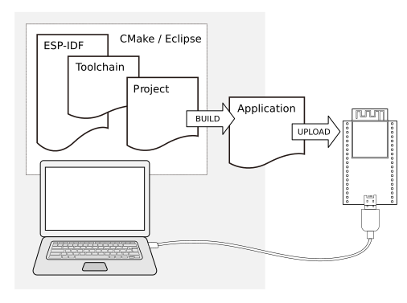

*******************
Get Started (CMake)
*******************

.. include:: ../cmake-warning.rst

.. include:: ../cmake-pending-features.rst

This document is intended to help users set up the software environment for development of applications using hardware based on the Espressif ESP32. Through a simple example we would like to illustrate how to use ESP-IDF (Espressif IoT Development Framework), including the menu based configuration, compiling the ESP-IDF and firmware download to ESP32 boards.

Introduction
============

ESP32 integrates Wi-Fi (2.4 GHz band) and Bluetooth 4.2 solutions on a single chip, along with dual high performance cores, Ultra Low Power co-processor and several peripherals. Powered by 40 nm technology, ESP32 provides a robust, highly integrated platform to meet the continuous demands for efficient power usage, compact design, security, high performance, and reliability.

Espressif provides the basic hardware and software resources that help application developers to build their ideas around the ESP32 series hardware. The software development framework by Espressif is intended for rapidly developing Internet-of-Things (IoT) applications, with Wi-Fi, Bluetooth, power management and several other system features.

What You Need
=============

To develop applications for ESP32 you need:

* **PC** loaded with either Windows, Linux or Mac operating system
* **Toolchain** to compile code for ESP32
* **Build tools** CMake and Ninja to build a full **Application** for ESP32
* **ESP-IDF** that essentially contains API for ESP32 and scripts to operate the **Toolchain**
* A text editor to write programs (**Projects**) in C, e.g. `Eclipse <https://www.eclipse.org/>`_
* The **ESP32** board itself and a **USB cable** to connect it to the **PC**

    Development of applications for ESP32

Steps to set up Development Environment:

1. Setup of **Toolchain**
2. Getting **ESP-IDF** from GitHub

Once the development environment is set up, we will follow these steps to create an ESP-IDF application:

1. Configuration of a **Project** and writing the code
2. Compilation of the **Project** and linking it to build an **Application**
3. Flashing (uploading) the compiled **Application** to **ESP32** over a USB/serial connection
4. Monitoring / debugging of the **Application** output via USB/serial

Development Board Guides
========================

If you have one of ESP32 development boards listed below, click on the link for hardware setup:

.. toctree::
    :maxdepth: 1

    ESP32 DevKitC <get-started-devkitc>
    ESP-WROVER-KIT <get-started-wrover-kit>
    ESP32-PICO-KIT <get-started-pico-kit>

If you have different board, move to sections below.

.. _get-started-setup-toolchain-cmake:

Setup Toolchain
===============

The quickest way to start development with ESP32 is by installing a prebuilt toolchain. Pick up your OS below and follow provided instructions. 

.. toctree::
    :hidden:

    Windows <windows-setup>
    Linux <linux-setup> 
    MacOS <macos-setup> 

+-------------------+-------------------+-------------------+
| |windows-logo|    | |linux-logo|      | |macos-logo|      |
+-------------------+-------------------+-------------------+
| `Windows`_        | `Linux`_          | `Mac OS`_         |
+-------------------+-------------------+-------------------+

.. |windows-logo| image:: ../../_static/windows-logo.png
    :target: ../get-started-cmake/windows-setup.html

.. |linux-logo| image:: ../../_static/linux-logo.png
    :target: ../get-started-cmake/linux-setup.html

.. |macos-logo| image:: ../../_static/macos-logo.png
    :target: ../get-started-cmake/macos-setup.html

.. _Windows: ../get-started-cmake/windows-setup.html
.. _Linux: ../get-started-cmake/linux-setup.html
.. _Mac OS: ../get-started-cmake/macos-setup.html

.. note::

    We are an using ``esp`` subdirectory in your user's home directory (``~/esp`` on Linux and MacOS, ``%userprofile%\esp`` on Windows) to install everything needed for ESP-IDF. You can use any different directory, but will need to adjust the respective commands.

Depending on your experience and preferences, instead of using a prebuilt toolchain, you may want to customize your environment. To set up the system your own way go to section :ref:`get-started-customized-setup-cmake`.

Once you are done with setting up the toolchain then go to section :ref:`get-started-get-esp-idf-cmake`.

.. _get-started-get-esp-idf-cmake:

Get ESP-IDF
===========

Besides the toolchain (that contains programs to compile and build the application), you also need ESP32 specific API / libraries. They are provided by Espressif in `ESP-IDF repository <https://github.com/espressif/esp-idf>`_. To get it, open terminal, navigate to the directory you want to put ESP-IDF, and clone it using ``git clone`` command.

Linux and MacOS
~~~~~~~~~~~~~~~

.. code-block:: bash

    mkdir -p ~/esp
    cd ~/esp
    git clone --recursive https://github.com/espressif/esp-idf.git

ESP-IDF will be downloaded into ``~/esp/esp-idf``.

Windows Command Prompt
~~~~~~~~~~~~~~~~~~~~~~

.. code-block:: batch

    mkdir %userprofile%\esp
    cd %userprofile%\esp
    git clone --recursive https://github.com/espressif/esp-idf.git

.. highlight:: bash
.. note::

    Do not miss the ``--recursive`` option. If you have already cloned ESP-IDF without this option, run another command to get all the submodules::

        cd esp-idf
        git submodule update --init

.. _get-started-setup-path-cmake:

Setup Environment Variables
===========================

ESP-IDF requires two environment variables to be set for normal operation:

- ``IDF_PATH`` should be set to the path to the ESP-IDF root directory.
- ``PATH`` should include the path to the ``tools`` directory inside the same ``IDF_PATH`` directory.

These two variables should be set up on your PC, otherwise projects will not build.

Setting may be done manually, each time PC is restarted. Another option is to set them permanently in user profile. To do this, follow instructions specific to :ref:`Windows <add-paths-to-profile-windows-cmake>` , :ref:`Linux and MacOS <add-idf_path-to-profile-linux-macos-cmake>` in section :doc:`add-idf_path-to-profile`.

.. _get-started-start-project-cmake:

Start a Project
===============

Now you are ready to prepare your application for ESP32. To start off quickly, we will use :example:`get-started/hello_world` project from :idf:`examples` directory in IDF.

Copy :example:`get-started/hello_world` to ``~/esp`` directory:

Linux and MacOS
~~~~~~~~~~~~~~~

.. code-block:: bash

    cd ~/esp
    cp -r $IDF_PATH/examples/get-started/hello_world .

Windows Command Prompt
~~~~~~~~~~~~~~~~~~~~~~

.. code-block:: batch

    cd %userprofile%\esp
    xcopy /e /i %IDF_PATH%\examples\get-started\hello_world hello_world

You can also find a range of example projects under the :idf:`examples` directory in ESP-IDF. These example project directories can be copied in the same way as presented above, to begin your own projects.

It is also possible to build examples in-place, without copying them first.

.. important::

    The esp-idf build system does not support spaces in the path to either esp-idf or to projects.

.. _get-started-connect-cmake:

Connect
=======

You are almost there. To be able to proceed further, connect ESP32 board to PC, check under what serial port the board is visible and verify if serial communication works. If you are not sure how to do it, check instructions in section :doc:`establish-serial-connection`. Note the port number, as it will be required in the next step.

.. _get-started-configure-cmake:

Configure
=========

Naviagate to the directory of the ``hello_world`` application copy, and run the ``menuconfig`` project configuration utility:

Linux and MacOS
~~~~~~~~~~~~~~~

.. code-block:: bash

    cd ~/esp/hello_world
    idf.py menuconfig

Windows Command Prompt
~~~~~~~~~~~~~~~~~~~~~~

.. code-block:: batch

    cd %userprofile%\esp\hello_world
    idf.py menuconfig

.. note:: If you get an error about ``idf.py`` not being found, check the ``tools`` directory is part of your Path as described above in :ref:`get-started-setup-path-cmake`. If there is no ``idf.py`` in the ``tools`` directory, check you have the correct branch for the CMake preview as shown under :ref:`get-started-get-esp-idf-cmake`.

.. note:: Windows users, the Python 2.7 installer will try to configure Windows to associate files with a ``.py`` extension with Python 2. If a separate installed program (such as Visual Studio Python Tools) has created an association with a different version of Python, then running ``idf.py`` may not work (it opens the file in Visual Studio instead). You can either run ``C:\Python27\python idf.py`` each time instead, or change the association that Windows uses for ``.py`` files.

.. note:: Linux users, if your default version of Python is 3.x then you may need to run ``python2 idf.py`` instead.

If previous steps have been done correctly, the following menu will be displayed:

.. figure:: ../../_static/project-configuration.png
    :align: center
    :alt: Project configuration - Home window
    :figclass: align-center

    Project configuration - Home window

Here are couple of tips on navigation and use of ``menuconfig``:

* Use up & down arrow keys to navigate the menu.
* Use Enter key to go into a submenu, Escape key to go up a level or exit.
* Type ``?`` to see a help screen. Enter key exits the help screen.
* Use Space key, or ``Y`` and ``N`` keys to enable (Yes) and disable (No) configuration items with checkboxes "``[*]``"
* Pressing ``?`` while highlighting a configuration item displays help about that item.
* Type ``/`` to search the configuration items.

.. attention::

    When using ESP32-DevKitC board with ESP32-SOLO-1 module, enable single core mode (:ref:`CONFIG_FREERTOS_UNICORE`) in menuconfig before flashing example applications.

.. _get-started-build-cmake:

Build The Project
=================

.. highlight:: bash

Now you can build the project. Run::

    idf.py build

This command will compile the application and all the ESP-IDF components, generate bootloader, partition table, and application binaries.

.. code-block:: none

   $ idf.py build
   Running cmake in directory /path/to/hello_world/build
   Executing "cmake -G Ninja --warn-uninitialized /path/to/hello_world"...
   Warn about uninitialized values.
   -- Found Git: /usr/bin/git (found version "2.17.0")
   -- Building empty aws_iot component due to configuration
   -- Component names: ...
   -- Component paths: ...
   
   ... (more lines of build system output)
   
   [527/527] Generating hello-world.bin
   esptool.py v2.3.1
   
   Project build complete. To flash, run this command:
   ../../../components/esptool_py/esptool/esptool.py -p (PORT) -b 921600 write_flash --flash_mode dio --flash_size detect --flash_freq 40m 0x10000 build/hello-world.bin  build 0x1000 build/bootloader/bootloader.bin 0x8000 build/partition_table/partition-table.bin
   or run 'idf.py -p PORT flash'

If there are no errors, the build will finish by generating the firmware binary .bin file.

.. _get-started-flash-cmake:

Flash To A Device
=================

Now you can flash the application to the ESP32 board. Run::

    idf.py -p PORT flash

Replace PORT with the name of your ESP32 board's serial port. On Windows, serial ports have names like ``COM1``. On MacOS, they start with ``/dev/cu.``. On Linux, they start with ``/dev/tty``. See :doc:`establish-serial-connection` for full details.

This step will flash the binaries that you just built to your ESP32 board.

.. note:: Running ``idf.py build`` before ``idf.py flash`` is not actually necessary, the flash step will automatically build the project if required before flashing.

.. code-block:: none

    Running esptool.py in directory [...]/esp/hello_world
    Executing "python [...]/esp-idf/components/esptool_py/esptool/esptool.py -b 460800 write_flash @flash_project_args"...
    esptool.py -b 460800 write_flash --flash_mode dio --flash_size detect --flash_freq 40m 0x1000 bootloader/bootloader.bin 0x8000 partition_table/partition-table.bin 0x10000 hello-world.bin
    esptool.py v2.3.1
    Connecting....
    Detecting chip type... ESP32
    Chip is ESP32D0WDQ6 (revision 1)
    Features: WiFi, BT, Dual Core
    Uploading stub...
    Running stub...
    Stub running...
    Changing baud rate to 460800
    Changed.
    Configuring flash size...
    Auto-detected Flash size: 4MB
    Flash params set to 0x0220
    Compressed 22992 bytes to 13019...
    Wrote 22992 bytes (13019 compressed) at 0x00001000 in 0.3 seconds (effective 558.9 kbit/s)...
    Hash of data verified.
    Compressed 3072 bytes to 82...
    Wrote 3072 bytes (82 compressed) at 0x00008000 in 0.0 seconds (effective 5789.3 kbit/s)...
    Hash of data verified.
    Compressed 136672 bytes to 67544...
    Wrote 136672 bytes (67544 compressed) at 0x00010000 in 1.9 seconds (effective 567.5 kbit/s)...
    Hash of data verified.
    
    Leaving...
    Hard resetting via RTS pin...

If there are no issues, at the end of flash process, the module will be reset and “hello_world” application will be running there.

.. (Not currently supported) If you'd like to use the Eclipse IDE instead of running ``idf.py``, check out the :doc:`Eclipse guide <eclipse-setup>`.

.. _get-started-build-monitor-cmake:

Monitor
=======

To see if "hello_world" application is indeed running, type ``idf.py -p PORT monitor``. This command is launching :doc:`IDF Monitor <idf-monitor>` application::

    $ idf.py -p /dev/ttyUSB0 monitor
    Running idf_monitor in directory [...]/esp/hello_world/build
    Executing "python [...]/esp-idf/tools/idf_monitor.py -b 115200 [...]/esp/hello_world/build/hello-world.elf"...
    --- idf_monitor on /dev/ttyUSB0 115200 ---
    --- Quit: Ctrl+] | Menu: Ctrl+T | Help: Ctrl+T followed by Ctrl+H ---
    ets Jun  8 2016 00:22:57

    rst:0x1 (POWERON_RESET),boot:0x13 (SPI_FAST_FLASH_BOOT)
    ets Jun  8 2016 00:22:57
    ...

Several lines below, after start up and diagnostic log, you should see "Hello world!" printed out by the application.

.. code-block:: none

    ...
    Hello world!
    Restarting in 10 seconds...
    I (211) cpu_start: Starting scheduler on APP CPU.
    Restarting in 9 seconds...
    Restarting in 8 seconds...
    Restarting in 7 seconds...

To exit the monitor use shortcut ``Ctrl+]``.

.. note::

    If instead of the messages above, you see a random garbage similar to::

        e���)(Xn@�y.!��(�PW+)��Hn9a؅/9�!�t5��P�~�k��e�ea�5�jA
        ~zY��Y(1�,1�� e���)(Xn@�y.!Dr�zY(�jpi�|�+z5Ymvp

    or monitor fails shortly after upload, your board is likely using 26MHz crystal. Most development board designs use 40MHz and the ESP-IDF uses this default value. Exit the monitor, go back to the :ref:`menuconfig <get-started-configure-cmake>`, change :ref:`CONFIG_ESP32_XTAL_FREQ_SEL` to 26MHz, then :ref:`build and flash <get-started-flash-cmake>` the application again. This is found under ``idf.py menuconfig`` under Component config --> ESP32-specific --> Main XTAL frequency.

.. note::

   You can combine building, flashing and monitoring into one step as follows::

       idf.py -p PORT flash monitor

Check the section :doc:`IDF Monitor <idf-monitor>` for handy shortcuts and more details on using the monitor.

Check the section :ref:`idf.py` for a full reference of ``idf.py`` commands and options.

That's all what you need to get started with ESP32!

Now you are ready to try some other :idf:`examples`, or go right to developing your own applications.

Updating ESP-IDF
================

After some time of using ESP-IDF, you may want to update it to take advantage of new features or bug fixes. The simplest way to do so is by deleting existing ``esp-idf`` folder and cloning it again, exactly as when doing initial installation described in sections :ref:`get-started-get-esp-idf-cmake`.

Another solution is to update only what has changed. This method is useful if you have a slow connection to GitHub. To do the update run the following commands:

Linux and MacOS
~~~~~~~~~~~~~~~

.. code-block:: bash

    cd ~/esp/esp-idf
    git pull
    git submodule update --init --recursive

Windows Command Prompt
~~~~~~~~~~~~~~~~~~~~~~

.. code-block:: batch

    cd %userprofile%\esp\esp-idf
    git pull
    git submodule update --init --recursive

The ``git pull`` command is fetching and merging changes from ESP-IDF repository on GitHub. Then ``git submodule update --init --recursive`` is updating existing submodules or getting a fresh copy of new ones. On GitHub the submodules are represented as links to other repositories and require this additional command to get them onto your PC.

.. highlight:: bash

It is also possible to check out a specific release of ESP-IDF, e.g. `v2.1`.

Linux and MacOS
~~~~~~~~~~~~~~~

.. code-block:: bash

    cd ~/esp
    git clone https://github.com/espressif/esp-idf.git esp-idf-v2.1
    cd esp-idf-v2.1/
    git checkout v2.1
    git submodule update --init --recursive

Windows Command Prompt
~~~~~~~~~~~~~~~~~~~~~~

.. code-block:: batch

    cd %userprofile%\esp
    git clone https://github.com/espressif/esp-idf.git esp-idf-v2.1
    cd esp-idf-v2.1/
    git checkout v2.1
    git submodule update --init --recursive

After that remember to :doc:`add-idf_path-to-profile`, so the toolchain scripts know where to find the ESP-IDF in it's release specific location.

.. note::

   Different versions of ESP-IDF may have different setup or prerequisite requirements, or require different toolchain versions. If you experience any problems, carefully check the Getting Started documentation for the version you are switching to.

Related Documents
=================

.. toctree::
    :maxdepth: 1

    add-idf_path-to-profile
    establish-serial-connection
    eclipse-setup
    idf-monitor
    toolchain-setup-scratch
