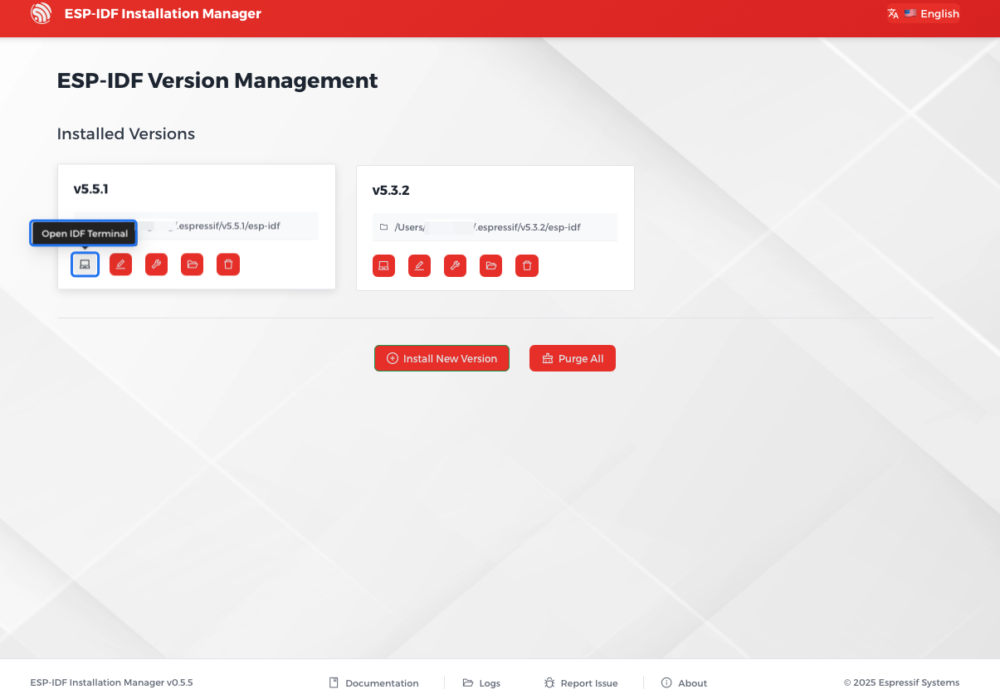

Open the ESP-IDF Installation Manager application ``eim``.

Under ``Manage Installations``, click ``Open Dashboard``.

.. figure:: ../../_static/get-started-eim-gui.png
    :align: center
    :alt: EIM Manage Installations

    EIM Manage Installations

In the dashboard, you will see all the installed ESP-IDF versions. Select the version you want to use, and click ``Open IDF Terminal`` to launch a terminal session with activated ESP-IDF environment.

    EIM Open IDF Terminal
