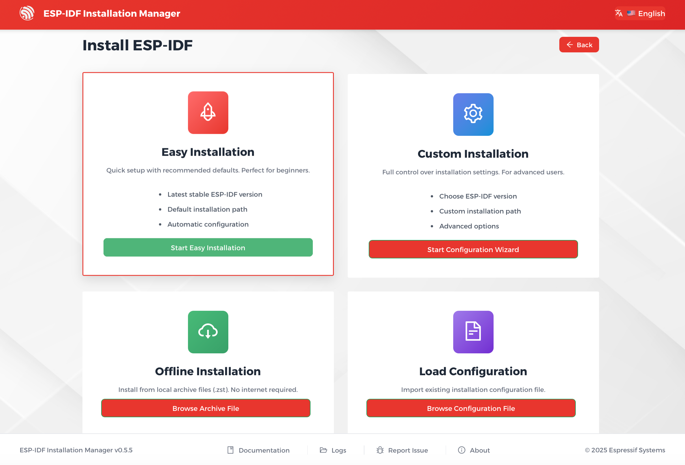
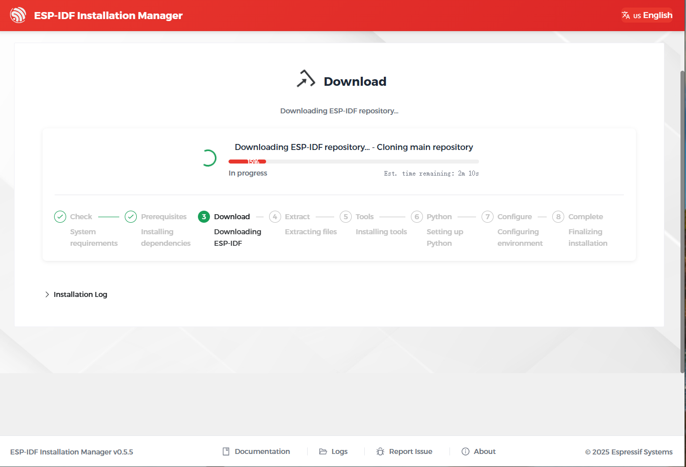
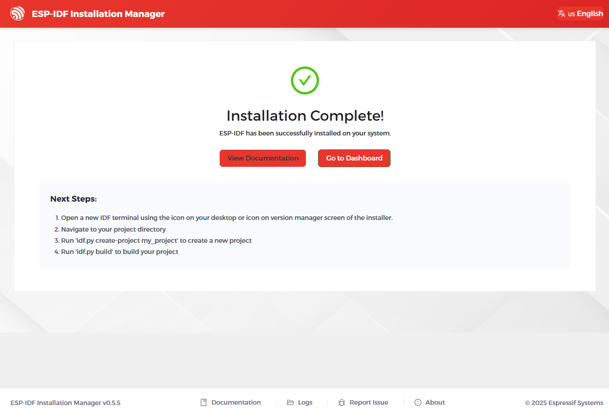

You can install ESP-IDF and the required tools using one of the following methods, depending on your preference:

- `Online Installation Using EIM GUI`_

  Recommended for most users. Installs ESP-IDF and tools via a graphical interface with internet access.
- `Online Installation Using EIM CLI`_

  Installs ESP-IDF and tools from the command line with internet access.
- `Online Installation Using a Loaded Configuration`_

  Installs ESP-IDF and tools using a pre-saved configuration file copied from another PC. This method works with both the GUI and CLI, but requires internet access.
- `Offline Installation`_

  Installs ESP-IDF and tools from a local package, without internet access.

Online Installation Using EIM GUI
~~~~~~~~~~~~~~~~~~~~~~~~~~~~~~~~~

Open the ESP-IDF Installation Manager application `eim`.

Under ``New Installation`` click ``Start Installation``.

.. figure:: ../../_static/get-started-eim-gui.png
    :align: center
    :alt: EIM Start Installation

    EIM Start Installation

.. note::

    If you have never installed ESP-IDF before, you will not see ``Manage Installations``. In this case, ``New Installation`` will be the only available option.

Under ``Easy Installation``, click ``Start Easy Installation`` to install the latest stable version of ESP-IDF with default settings.

    EIM Easy Installation

If all prerequisites and path checks pass, you will see the ``Ready to Install`` page. Click ``Start Installation`` to begin the installation.

.. figure:: ../../_static/get-started-eim-gui-ready-install.png
    :align: center
    :alt: EIM Ready to Install

    EIM Ready to Install

During the installation, you can monitor the progress directly in the interface.

    EIM Installing

Once finished, the ``Installation Complete`` page will appear.

    EIM Installation Complete

If the installation fails, you can:

- Click ``Logs`` at the bottom of the interface to view error details. Resolve the issues and click ``Try Again`` to restart the installation.
- Alternatively, use `Custom Installation <https://docs.espressif.com/projects/idf-im-ui/en/latest/expert_installation.html>`_.

.. note::

    - To select an ESP-IDF version or customize the installation path, use ``Custom Installation`` instead. See more instructions in `EIM documentation > Expert Installations <https://docs.espressif.com/projects/idf-im-ui/en/latest/expert_installation.html>`__.
    - To manage existing installations, refer to `EIM documentation > Version Management <https://docs.espressif.com/projects/idf-im-ui/en/latest/version_management.html>`__.

Online Installation Using EIM CLI
~~~~~~~~~~~~~~~~~~~~~~~~~~~~~~~~~

Run the following command to install the latest stable version of ESP-IDF with default settings in non-interactive mode:

.. code-block:: bash

    eim install

If you encounter issues running the above command, or if you want to customize the installation path, select ESP-IDF versions, or modify other options, launch the interactive installation wizard and follow the on-screen prompts:

.. code-block:: bash

    eim wizard

If the ESP-IDF version you want to install is not available in the interactive wizard, run the following command to install any available `versions <https://docs.espressif.com/projects/esp-idf/en/stable/esp32/versions.html#releases>`__. For example, to install ESP-IDF v5.4.2, run:

.. code-block:: bash

    eim install -i v5.4.2

Once the installation is complete, you will see the following message in the terminal:

.. code-block:: bash

    2025-11-03T15:54:12.537993300+08:00 - INFO - Wizard result: %{r}
    2025-11-03T15:54:12.544174+08:00 - INFO - Successfully installed IDF
    2025-11-03T15:54:12.545913900+08:00 - INFO - Now you can start using IDF tools

.. note::

    - To see all available options, run:
        .. code-block:: bash

            eim --help
    - For more information about CLI usage, refer to

      * `EIM documentation > CLI Configuration <https://docs.espressif.com/projects/idf-im-ui/en/latest/cli_configuration.html>`__
      * `EIM documentation > CLI Commands <https://docs.espressif.com/projects/idf-im-ui/en/latest/cli_commands.html>`__

Online Installation Using a Loaded Configuration
~~~~~~~~~~~~~~~~~~~~~~~~~~~~~~~~~~~~~~~~~~~~~~~~

When you install ESP-IDF, the installer automatically saves your setup to a configuration file named ``eim_config.toml`` in the installation directory. This configuration file can be reused on other computers to reproduce the same installation setup.

To install ESP-IDF using an existing ``eim_config.toml`` file, refer to the `EIM documentation > Configuration Files <https://docs.espressif.com/projects/idf-im-ui/en/latest/gui_configuration.html#configuration-files>`__.

Offline Installation
~~~~~~~~~~~~~~~~~~~~

Both the GUI and CLI installers support offline installation. For instructions, refer to `EIM documentation > Offline Installation <https://docs.espressif.com/projects/idf-im-ui/en/latest/offline_installation.html>`__.

Next Steps
==========

You are now ready to start developing with ESP-IDF. To begin building and running your first application, continue with the :ref:`get-started-build` section.
