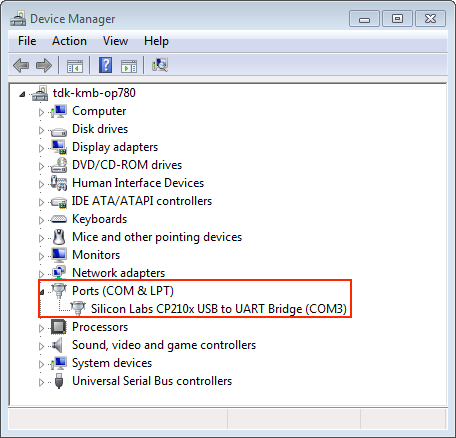

Establish Serial Connection with {IDF_TARGET_NAME}
==================================================

:link_to_translation:`zh_CN:[中文]`

.. only:: not SOC_USB_OTG_SUPPORTED and not SOC_USB_SERIAL_JTAG_SUPPORTED

    Establishing a serial connection with the {IDF_TARGET_NAME} target device could be done using a USB-to-UART bridge.

.. only:: SOC_USB_OTG_SUPPORTED or SOC_USB_SERIAL_JTAG_SUPPORTED

    Establishing a serial connection with the {IDF_TARGET_NAME} target device could be done using USB-to-UART bridge or USB peripheral supported in {IDF_TARGET_NAME}.

Some development boards have the USB-to-UART bridge installed. If a board does not have a bridge then an external bridge may be used.

.. only:: SOC_USB_OTG_SUPPORTED or SOC_USB_SERIAL_JTAG_SUPPORTED

    Supported USB Peripheral
    ------------------------

    The {IDF_TARGET_NAME} supports the USB peripheral. In this case, the USB-to-UART bridge is not needed and the device can be flashed directly.

    .. blockdiag::
        :scale: 70%
        :caption: SoC with Supported USB
        :align: center

        blockdiag usb_capable_esp {

            node_height = 80;
            span_width = 160;
            span_height = 140;
            default_fontsize = 16

            # labels of diagram nodes
            PC [label="Personal\n Computer"];
            CHIP [label="{IDF_TARGET_NAME}", width=120];
            DUMMY [shape=none, width=1]

                # node connections
                PC  <- DUMMY [label = "USB", fontsize=14];
                DUMMY -> CHIP [fontsize=14];

                group {
                    shape = line;
                    style = dotted;
                    color = "#FF0000";
                    label = "Development Board\n\n\n";
                    CHIP; DUMMY;
                }

        }

    Apart from the USB peripheral, some development boards also include the USB-to-UART bridge.

USB-to-UART Bridge on Development Board
---------------------------------------

For boards with an installed USB-to-UART bridge, the connection between the personal computer and the bridge is USB and between the bridge and {IDF_TARGET_NAME} is UART.

.. blockdiag::
    :caption: Development Board with USB-to-UART Bridge
    :align: center

    blockdiag esp_dev_board_with_usb_to_uart_bridge {

        node_height = 80;
        span_width = 160;
        span_height = 140;
        default_fontsize = 16

        # labels of diagram nodes
        PC [label="Personal\nComputer"];
        BRIDGE [label="USB-to-UART\n Bridge"];
        CHIP [label="{IDF_TARGET_NAME}", width=120];

            # node connections
            PC <-> BRIDGE [label = "USB", fontsize=14];
            BRIDGE <-> CHIP [label = "UART", fontsize=14];

            group {
                shape = line;
                style = dotted;
                color = "#FF0000";
                label = "Development Board\n\n\n";
                BRIDGE; CHIP;
            }
    }

External USB-to-UART Bridge
---------------------------

Sometimes the USB-to-UART bridge is external. This is often used in small development boards or finished products when space and costs are crucial.

.. blockdiag::
    :caption: External USB-to-UART Bridge
    :align: center

    blockdiag external_usb_to_uart_bridge_to_esp {

        node_height = 80;
        span_width = 160;
        span_height = 140;
        default_fontsize = 16

        # labels of diagram nodes
        PC [label="Personal\n Computer"];
        BRIDGE [label="USB-to-UART\n Bridge", width=180];
        CHIP [label="{IDF_TARGET_NAME}", width=120];
        DUMMY [shape=none, width=1]

            # node connections
            PC <-> BRIDGE [label = "USB", fontsize=14];
            BRIDGE <- DUMMY [label = "UART", fontsize=14];
            DUMMY -> CHIP [fontsize=14];

            group {
                shape = line;
                style = dotted;
                color = "#FF0000";
                label = "Programmer Board\n\n\n";
                BRIDGE
            }
            group {
                shape = line;
                style = dotted;
                color = "#FF0000";
                label = "Development Board\n\n\n";
                CHIP; DUMMY;
            }
    }

.. only:: SOC_USB_OTG_SUPPORTED or SOC_USB_SERIAL_JTAG_SUPPORTED

    Flash Using USB
    ---------------

    For the {IDF_TARGET_NAME}, the USB peripheral is available, allowing you to flash the binaries without the need for an external USB-to-UART bridge.

    {IDF_TARGET_USB_PIN_DM:default="Not Updated!", esp32c3="GPIO18", esp32s3="GPIO19", esp32s2="GPIO19", esp32c6="GPIO12", esp32h2="GPIO26", esp32p4="GPIO24/26", esp32c5="GPIO13", esp32c61="GPIO28"}
    {IDF_TARGET_USB_PIN_DP:default="Not Updated!", esp32c3="GPIO19", esp32s3="GPIO20", esp32s2="GPIO20", esp32c6="GPIO13", esp32h2="GPIO27", esp32p4="GPIO25/27", esp32c5="GPIO14", esp32c61="GPIO29"}

    The USB on the {IDF_TARGET_NAME} uses the **{IDF_TARGET_USB_PIN_DP}** for **D+** and **{IDF_TARGET_USB_PIN_DM}** for **D-**.

    .. only:: SOC_USB_SERIAL_JTAG_SUPPORTED

        .. only:: not SOC_USB_OTG_SUPPORTED

            .. note:: The {IDF_TARGET_NAME} supports only *USB CDC and JTAG*.

        If you are flashing for the first time, you need to get the {IDF_TARGET_NAME} into the download mode manually. To do so, press and hold the ``BOOT`` button and then press the ``RESET`` button once. After that release the ``BOOT`` button.

        For any usage for usb serial jtag, please refer to :doc:`USB_SERIAL_JTAG_CONSOLE <../api-guides/usb-serial-jtag-console>` for more information.

    .. only:: esp32s2

        After flashing the binaries, a manual reset is needed.

Flash Using UART
----------------

This section provides guidance on how to establish a serial connection between {IDF_TARGET_NAME} and PC using USB-to-UART Bridge, either installed on the development board or external.

Connect {IDF_TARGET_NAME} to PC
^^^^^^^^^^^^^^^^^^^^^^^^^^^^^^^

Connect the {IDF_TARGET_NAME} board to the PC using the USB cable. If device driver does not install automatically, identify USB-to-UART bridge on your {IDF_TARGET_NAME} board (or external converter dongle), search for drivers in internet and install them.

Below is the list of USB to serial converter chips installed on most of the {IDF_TARGET_NAME} boards produced by Espressif together with links to the drivers:

* CP210x: `CP210x USB to UART Bridge VCP Drivers <https://www.silabs.com/developers/usb-to-uart-bridge-vcp-drivers>`_
* FTDI: `FTDI Virtual COM Port Drivers <https://ftdichip.com/drivers/vcp-drivers/>`_

Please check the board user guide for specific USB-to-UART bridge chip used. The drivers above are primarily for reference. Under normal circumstances, the drivers should be bundled with an operating system and automatically installed upon connecting the board to the PC.

For devices downloaded using a USB-to-UART bridge, you can run the following command including the optional argument to define the baud rate.

.. code-block:: bash

    idf.py -p PORT [-b BAUD] flash

Replace ``PORT`` with the device name for the serial port of your {IDF_TARGET_NAME} board. Please note that ``-b`` is an optional argument. If you do not specify the baud rate, the default baud rate is ``460800``. If you need to specify the baud rate, replace ``BAUD`` with the baud rate you need.

To check the port name on Windows, please refer to `check-port-on-windows`_. For Linux and macOS users, please see `check-port-on-linux-and-macos`_.

For example, if the port name is ``COM3`` on Windows and your desired baud rate is ``115200``, you can run the following command to flash the device:

.. code-block:: bash

    idf.py -p COM3 -b 115200 flash

For Linux users, if the port name is ``/dev/ttyUSB0`` and the desired baud rate is ``115200``, you can run the following command to flash the device:

.. code-block:: bash

    idf.py -p /dev/ttyUSB0 -b 115200 flash

For macOS users, if the port name is ``/dev/cu.usbserial-1401`` and the desired baud rate is ``115200``, you can run the following command to flash the device:

.. code-block:: bash

    idf.py -p /dev/cu.usbserial-1401 -b 115200 flash

.. note::

    If the device does not support the auto download mode, you need to get into the download mode manually. To do so, press and hold the ``BOOT`` button and then press the ``RESET`` button once. After that release the ``BOOT`` button.

.. _check-port-on-windows:

Check Port on Windows
---------------------

Check the list of identified COM ports in the Windows Device Manager. Disconnect {IDF_TARGET_NAME} and connect it back, to verify which port disappears from the list and then shows back again.

Figures below show serial port for ESP32 DevKitC and ESP32 WROVER KIT

    USB to UART bridge of ESP32-DevKitC in Windows Device Manager

.. figure:: ../../_static/esp32-wrover-kit-in-device-manager.png
    :align: center
    :alt: Two USB Serial Ports of ESP-WROVER-KIT in Windows Device Manager
    :figclass: align-center

    Two USB Serial Ports of ESP-WROVER-KIT in Windows Device Manager

.. _check-port-on-linux-and-macos:

Check Port on Linux and macOS
-----------------------------

To check the device name for the serial port of your {IDF_TARGET_NAME} board (or external converter dongle), run this command two times, first with the board/dongle unplugged, then with plugged in. The port which appears the second time is the one you need:

Linux ::

    ls /dev/tty*

macOS ::

    ls /dev/cu.*

.. note::

    macOS users: if you do not see the serial port then check you have the USB/serial drivers installed. See Section `Connect {IDF_TARGET_NAME} to PC`_ for links to drivers. For macOS High Sierra (10.13), you may also have to explicitly allow the drivers to load. Open System Preferences -> Security & Privacy -> General and check if there is a message shown here about "System Software from developer ..." where the developer name is Silicon Labs or FTDI.

.. _linux-dialout-group:

Adding User to ``dialout`` or ``uucp`` on Linux
-----------------------------------------------

The currently logged user should have read and write access the serial port over USB. On most Linux distributions, this is done by adding the user to ``dialout`` group with the following command::

    sudo usermod -a -G dialout $USER

on Arch Linux this is done by adding the user to ``uucp`` group with the following command::

    sudo usermod -a -G uucp $USER

.. note::

    Make sure you re-login to enable read and write permissions for the serial port.

Verify Serial Connection
------------------------

Now verify that the serial connection is operational. You can do this using a serial terminal program by checking if you get any output on the terminal after resetting {IDF_TARGET_NAME}.

.. only:: esp32c2

    The default console baud rate on ESP32-C2 is 115200 when a 40 MHz XTAL is used, or 74880 when a 26 MHz XTAL is used.

.. only:: not esp32c2

    The default console baud rate on {IDF_TARGET_NAME} is 115200.

Windows and Linux
^^^^^^^^^^^^^^^^^

In this example, we use the `PuTTY SSH Client <https://putty.software/>`_, available for both Windows and Linux. You can use other serial programs and set communication parameters as shown below.

Run terminal and set identified serial port. Baud rate = 115200 (if needed, change this to the default baud rate of the chip in use), data bits = 8, stop bits = 1, and parity = N. Below are example screenshots of setting the port and such transmission parameters (in short described as 115200-8-1-N) on Windows and Linux. Remember to select exactly the same serial port you have identified in steps above.

.. figure:: ../../_static/putty-settings-windows.png
    :align: center
    :alt: Setting Serial Communication in PuTTY on Windows
    :figclass: align-center

    Setting Serial Communication in PuTTY on Windows

.. figure:: ../../_static/putty-settings-linux.png
    :align: center
    :alt: Setting Serial Communication in PuTTY on Linux
    :figclass: align-center

    Setting Serial Communication in PuTTY on Linux

Then open serial port in terminal and check, if you see any log printed out by {IDF_TARGET_NAME}. The log contents depend on application loaded to {IDF_TARGET_NAME}, see `Example Output`_. If no log has been printed out, see `Troubleshooting`_.

.. note::

   Close the serial terminal after verification that communication is working. If you keep the terminal session open, the serial port will be inaccessible for uploading firmware later.

macOS
^^^^^

To spare you the trouble of installing a serial terminal program, macOS offers the **screen** command.

- As discussed in `Check port on Linux and macOS`_, run::

    ls /dev/cu.*

- You should see similar output::

    /dev/cu.Bluetooth-Incoming-Port /dev/cu.SLAB_USBtoUART      /dev/cu.SLAB_USBtoUART7

- The output varies depending on the type and the number of boards connected to your PC. Then pick the device name of your board and run (if needed, change "115200" to the default baud rate of the chip in use)::

    screen /dev/cu.device_name 115200

  Replace ``device_name`` with the name found running ``ls /dev/cu.*``.

- What you are looking for is some log displayed by the **screen**. The log contents depend on application loaded to {IDF_TARGET_NAME}, see `Example Output`_. If no log has been printed out, see `Troubleshooting`_. To exit the current **screen** session, type ``Ctrl-A + K``.

.. note::

   Do not forget to **exit the current screen session** after verifying that the communication is working. If you fail to do it and just close the terminal window, the serial port will be inaccessible for uploading firmware later.

Troubleshooting
^^^^^^^^^^^^^^^

If there is no log output, check

- if the required power is supplied to {IDF_TARGET_NAME}
- if the board was reset after starting the terminal program
- if the selected serial port is the correct one by using the method stated in `Check Port on Windows`_ and `Check Port on Linux and macOS`_
- if the serial port is not being used by another program
- if settings of the serial port in serial terminal programs are applicable to corresponding applications
- if your application is expected to output some log. In details, if ``Component config`` > ``Log`` > ``Log Level`` > ``Default log verbosity (Info)`` is set to ``No output``, no log will be printed out. You can change this setting in ``menuconfig``.
- if the log output has not been disabled (use :example:`hello world application <get-started/hello_world>` to test)

Example Output
^^^^^^^^^^^^^^

{IDF_TARGET_STRAP_GPIO:default="[NEEDS TO BE UPDATED]", esp32="GPIO0", esp32s2="GPIO0", esp32s3="GPIO0", esp32c2="GPIO9", esp32c3="GPIO9", esp32c6="GPIO9", esp32h2="GPIO9", esp32p4="GPIO35", esp32c5="GPIO28", esp32c61="GPIO9"}

An example log is shown below. Reset the board if you do not see anything.

.. highlight:: none

::

    ets Jun  8 2016 00:22:57

    rst:0x5 (DEEPSLEEP_RESET),boot:0x13 (SPI_FAST_FLASH_BOOT)
    ets Jun  8 2016 00:22:57

    rst:0x7 (TG0WDT_SYS_RESET),boot:0x13 (SPI_FAST_FLASH_BOOT)
    configsip: 0, SPIWP:0x00
    clk_drv:0x00,q_drv:0x00,d_drv:0x00,cs0_drv:0x00,hd_drv:0x00,wp_drv:0x00
    mode:DIO, clock div:2
    load:0x3fff0008,len:8
    load:0x3fff0010,len:3464
    load:0x40078000,len:7828
    load:0x40080000,len:252
    entry 0x40080034
    I (44) boot: ESP-IDF v2.0-rc1-401-gf9fba35 2nd stage bootloader
    I (45) boot: compile time 18:48:10
    ...

If you can see readable log output, it means serial connection is working and you are ready to proceed with installation and finally upload an application to {IDF_TARGET_NAME}.

.. note::

   For some serial port wiring configurations, the serial RTS & DTR pins need to be disabled in the terminal program before the {IDF_TARGET_NAME} booting and producing serial output. This depends on the hardware itself, most development boards (including all Espressif boards) *do not* have this issue. The issue is present if RTS & DTR are wired directly to the EN & {IDF_TARGET_STRAP_GPIO} pins. See the `esptool documentation`_ for more details.

If you got here from :ref:`Connect Your Device for Windows <get-started-connect>`, :ref:`Linux, or macOS <get-started-connect-linux-macos>` when installing s/w for {IDF_TARGET_NAME} development, then you can continue with :ref:`Configure Your Project for Windows <get-started-configure>`, :ref:`Linux, or macOS <get-started-configure-linux-macos>`.

.. _esptool documentation: https://docs.espressif.com/projects/esptool/en/latest/advanced-topics/boot-mode-selection.html#automatic-bootloader
